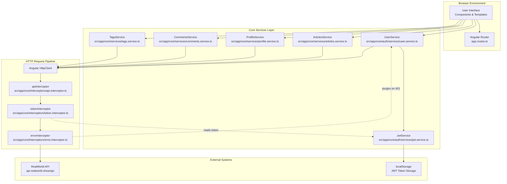
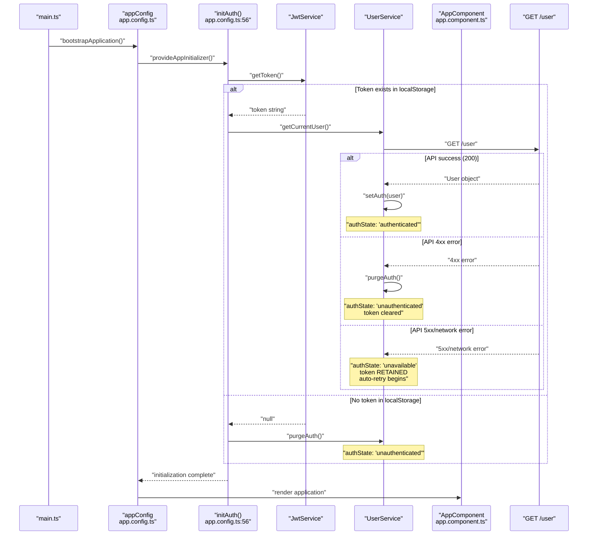
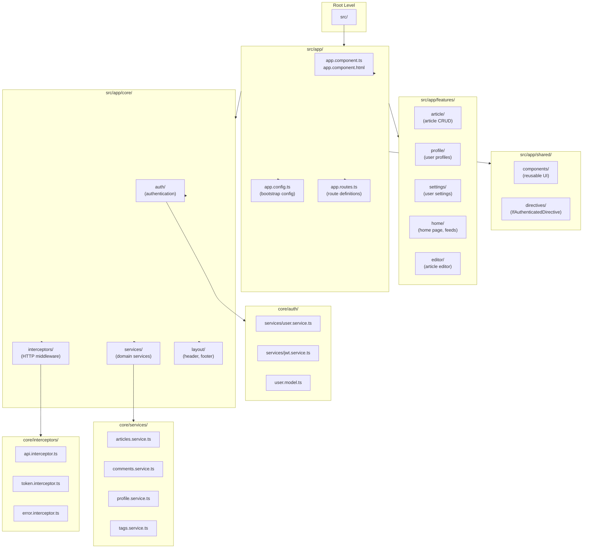
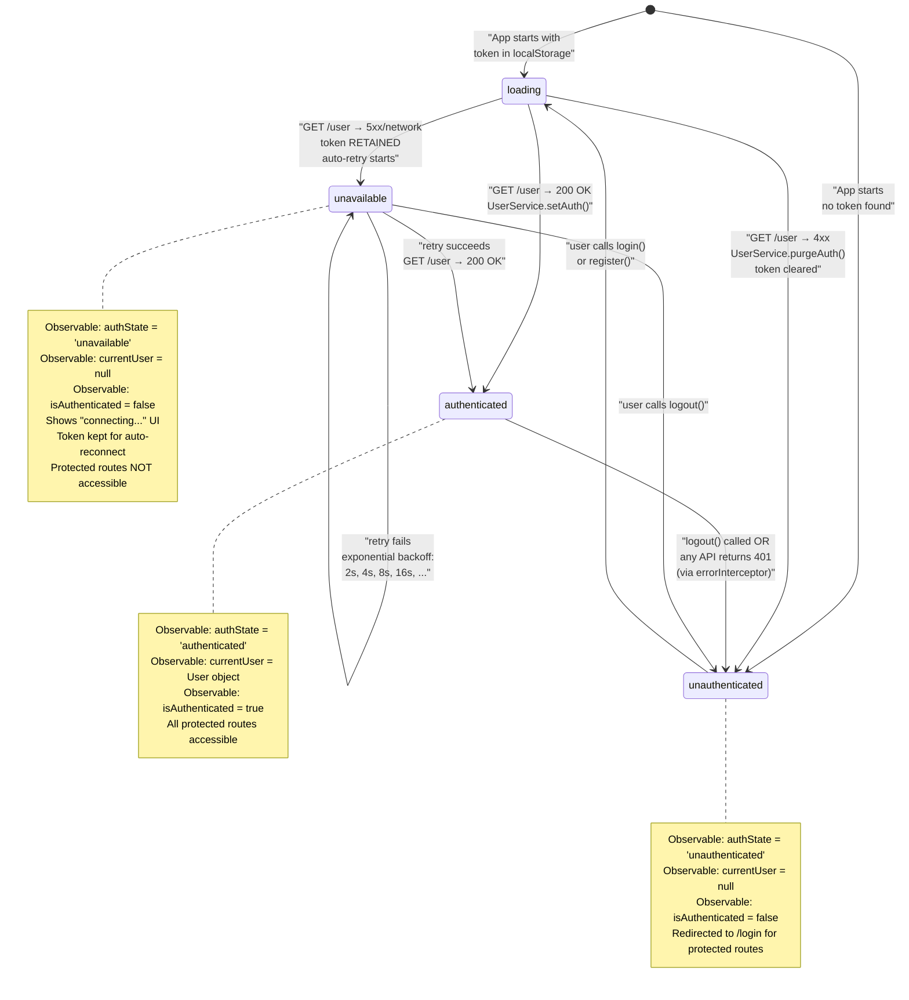

# Overview

<details>
<summary>Relevant source files</summary>

The following files were used as context for generating this wiki page:

- [LICENSE](../LICENSE)
- [README.md](../README.md)
- [angular.json](../angular.json)
- [package.json](../package.json)
- [src/\_redirects](../src/_redirects)
- [src/app/app.component.ts](../src/app/app.component.ts)
- [src/app/app.config.ts](../src/app/app.config.ts)
- [src/app/core/interceptors/api.interceptor.ts](../src/app/core/interceptors/api.interceptor.ts)
- [src/app/core/interceptors/token.interceptor.ts](../src/app/core/interceptors/token.interceptor.ts)
- [src/app/core/layout/footer.component.html](../src/app/core/layout/footer.component.html)
- [src/app/core/layout/footer.component.ts](../src/app/core/layout/footer.component.ts)

</details>

This document provides a high-level introduction to the Angular RealWorld example application. It covers the application's purpose, architecture, technology stack, and organization. For detailed information about specific subsystems, refer to the linked sections throughout this page.

## What is Conduit?

Conduit is a fully-featured social blogging platform that demonstrates real-world Angular development patterns. It is a Medium.com clone that implements the [RealWorld specification](https://realworld.show), providing a standardized API and feature set for comparing frontend frameworks.

The application showcases production-ready patterns including:

- JWT-based authentication with token persistence
- CRUD operations for articles and comments
- Social features (following users, favoriting articles)
- Pagination and filtering
- Markdown rendering
- Comprehensive error handling
- Full test coverage (unit and E2E)

**Key Functional Areas:**

- User authentication (login, register, logout)
- Article management (create, read, update, delete)
- Comment system (create, read, delete)
- User profiles with article feeds
- Tag-based filtering
- Global and personalized article feeds

For setup instructions, see [Getting Started](2-getting-started.md). For architectural details, see [Architecture](3-architecture.md).

**Sources:** `README.md:1-67`, `package.json:1-61`

---

## Technology Stack

The application is built using modern Angular practices and tools optimized for developer experience and production readiness.

| Category                 | Technology         | Version       | Purpose                                                                              |
| ------------------------ | ------------------ | ------------- | ------------------------------------------------------------------------------------ |
| **Framework**            | Angular            | 21.1.1        | Core application framework with zoneless change detection                            |
| **Reactive Programming** | RxJS               | 7.8.2         | Observable-based state management and async operations                               |
| **Reactive Templates**   | RxAngular          | 21.0.0        | Performance-optimized template rendering (`@rx-angular/template`, `@rx-angular/cdk`) |
| **Markdown**             | Marked             | 17.0.1        | Client-side markdown rendering for article content                                   |
| **Build Tool**           | Angular CLI + Vite | 21.1.1        | Development server and production builds                                             |
| **Package Manager**      | Bun                | -             | Fast package installation and dependency resolution                                  |
| **Unit Testing**         | Vitest             | 4.0.18        | Fast unit test execution with Angular TestBed support                                |
| **E2E Testing**          | Playwright         | 1.58.0        | Cross-browser end-to-end testing                                                     |
| **Code Quality**         | Prettier + Husky   | 3.8.1 / 9.1.7 | Automated code formatting and pre-commit hooks                                       |

The application uses Angular's standalone component architecture and functional programming patterns (functional interceptors, functional guards). It operates in zoneless mode for improved performance.

For dependency details and build configuration, see [Build Configuration](8.1-build-configuration.md). For testing infrastructure, see [Testing Strategy](7-testing-strategy.md).

**Sources:** `package.json:27-56`, `angular.json:1-84`

---

## Application Architecture

The application follows a layered architecture with clear separation of concerns:



**Architecture Principles:**

1. **Layered Design**: Components interact only with services, never directly with HTTP or localStorage
2. **Interceptor Chain**: All HTTP requests flow through three interceptors that handle API URLs, authentication tokens, and error normalization
3. **Centralized State**: `UserService` maintains authentication state as RxJS observables
4. **Separation of Concerns**: Domain services (`ArticlesService`, `ProfileService`, etc.) encapsulate business logic

For detailed architectural patterns, see [Architecture](3-architecture.md). For HTTP pipeline details, see [HTTP Request Pipeline](3.2-http-request-pipeline.md). For authentication specifics, see [Authentication System](3.3-authentication-system.md).

**Sources:** `src/app/app.config.ts:1-80`, `src/app/core/interceptors/api.interceptor.ts:1-7`, `src/app/core/interceptors/token.interceptor.ts:1-15`

---

## Application Bootstrap & Initialization

The application initializes through a structured bootstrap process that establishes authentication state before rendering:



**Key Bootstrap Components:**

- **`main.ts`**: Entry point that calls `bootstrapApplication()` with `AppComponent` and `appConfig`
- **`appConfig`** (`src/app/app.config.ts:69-79`): Provides application configuration including:
  - Zoneless change detection (`provideZonelessChangeDetection()`)
  - Router configuration (`provideRouter(routes)`)
  - HTTP client with interceptor chain (`provideHttpClient(withInterceptors([...]))`)
  - App initializer (`provideAppInitializer()`)
- **`initAuth()`** (`src/app/app.config.ts:56-67`): Application initializer that:
  - Sets up debug interface at `window.__conduit_debug__`
  - Checks for existing JWT token
  - Validates token by fetching current user if present
  - Sets initial authentication state before app renders

The initializer ensures the application never renders in an indeterminate authentication state. Users either see authenticated UI, login prompts, or a server unavailable message.

For detailed authentication flows, see [Authentication System](3.3-authentication-system.md). For the `UserService` implementation, see [UserService & Authentication State](4.1-userservice-and-authentication-state.md).

**Sources:** `src/app/app.config.ts:1-80`, `src/app/app.component.ts:1-13`

---

## Code Organization

The codebase follows Angular's recommended structure with clear separation between core, feature, and shared modules:



**Directory Structure:**

| Directory                | Purpose                            | Key Files                                                                      |
| ------------------------ | ---------------------------------- | ------------------------------------------------------------------------------ |
| **`src/app/`**           | Application root                   | `app.component.ts`, `app.config.ts`, `app.routes.ts`                           |
| **`core/auth/`**         | Authentication infrastructure      | `UserService`, `JwtService`, `User` model                                      |
| **`core/interceptors/`** | HTTP request/response middleware   | `apiInterceptor`, `tokenInterceptor`, `errorInterceptor`                       |
| **`core/services/`**     | Domain-specific services           | `ArticlesService`, `CommentsService`, `ProfileService`, `TagsService`          |
| **`core/layout/`**       | Application shell components       | `HeaderComponent`, `FooterComponent`                                           |
| **`features/`**          | Feature modules (pages)            | Home, Article, Profile, Settings, Editor                                       |
| **`shared/`**            | Reusable components and directives | `FavoriteButtonComponent`, `FollowButtonComponent`, `IfAuthenticatedDirective` |

**Component Organization Pattern:**

Each feature typically contains:

- Main component (e.g., `article.component.ts`)
- Template file (e.g., `article.component.html`)
- Child components for specific UI concerns
- Route configuration if applicable

For routing details, see [Routing System](3.4-routing-system.md). For feature module details, see [Feature Modules](5-feature-modules.md).

**Sources:** `src/app/app.component.ts:1-13`, `src/app/app.config.ts:1-80`, `src/app/core/layout/footer.component.ts:1-14`

---

## Authentication State Management

The application implements a three-state authentication system that handles both user errors (invalid credentials) and system errors (server unavailable) distinctly:



**State Observables:**

The `UserService` exposes three observable streams that components can subscribe to:

1. **`authState: Observable<'loading' | 'authenticated' | 'unauthenticated' | 'unavailable'>`**  
   Tracks the current authentication state machine state

2. **`currentUser: Observable<User | null>`**  
   Provides the currently logged-in user object or null

3. **`isAuthenticated: Observable<boolean>`**  
   Derived stream: `true` only when `authState === 'authenticated'`

**Error Handling Strategy:**

- **4xx errors**: Treated as client errors (bad credentials, expired token). Token is cleared, user logged out.
- **5xx/network errors**: Treated as temporary server issues. Token is retained, automatic reconnection attempted with exponential backoff.
- **401 errors**: Special handling in `errorInterceptor` triggers automatic logout except for GET `/user` endpoint.

For detailed authentication implementation, see [Authentication System](3.3-authentication-system.md) and [UserService & Authentication State](4.1-userservice-and-authentication-state.md).

**Sources:** `src/app/app.config.ts:47-67`, `src/app/core/interceptors/token.interceptor.ts:1-15`

---

## Feature Overview

The application is organized into distinct feature areas, each with dedicated components and routing:

| Feature      | Route(s)                                             | Components                                                                  | Description                                                                         |
| ------------ | ---------------------------------------------------- | --------------------------------------------------------------------------- | ----------------------------------------------------------------------------------- |
| **Home**     | `/`                                                  | `HomeComponent`, `ArticleListComponent`, `ArticlePreviewComponent`          | Global feed, personal feed (when authenticated), tag filtering, pagination          |
| **Articles** | `/article/:slug`                                     | `ArticleComponent`, `ArticleMetaComponent`, `ArticleCommentComponent`       | Full article view with markdown rendering, comment section, favorite/follow actions |
| **Editor**   | `/editor`, `/editor/:slug`                           | `EditorComponent`                                                           | Create new articles or edit existing ones, tag management, form validation          |
| **Profiles** | `/profile/:username`, `/profile/:username/favorites` | `ProfileComponent`, `ProfileArticlesComponent`, `ProfileFavoritesComponent` | User profile page, author's articles, favorited articles, follow/unfollow           |
| **Settings** | `/settings`                                          | `SettingsComponent`                                                         | Update user profile (image, bio, email, password), logout functionality             |
| **Auth**     | `/login`, `/register`                                | `AuthComponent`                                                             | Login and registration forms with error display                                     |

**Shared UI Components:**

- **`FavoriteButtonComponent`**: Heart icon button for favoriting/unfavoriting articles
- **`FollowButtonComponent`**: Button for following/unfollowing users
- **`ListErrorsComponent`**: Displays API validation errors
- **`IfAuthenticatedDirective`**: Conditionally shows/hides elements based on authentication state

For detailed feature documentation, see [Feature Modules](5-feature-modules.md). For shared component details, see [Shared Components & Directives](6-shared-components-and-directives.md).

**Sources:** `README.md:37-56`, `src/app/core/layout/footer.component.ts:1-14`

---

## Testing Infrastructure

The application has comprehensive test coverage across two complementary layers:

```mermaid
graph TB
    subgraph UnitTests["Unit Tests (Vitest)"]
        VitestConfig["vitest.config.ts"]
        TestSetup["test-setup.ts<br/>(Angular TestBed)"]
        ServiceTests["Service Tests<br/>*.service.spec.ts"]

        UserServiceTest["user.service.spec.ts"]
        ArticlesServiceTest["articles.service.spec.ts"]
        CommentsServiceTest["comments.service.spec.ts"]
        ProfileServiceTest["profile.service.spec.ts"]
        TagsServiceTest["tags.service.spec.ts"]
        JwtServiceTest["jwt.service.spec.ts"]
    end

    subgraph E2ETests["E2E Tests (Playwright)"]
        PlaywrightConfig["playwright.config.ts"]
        Helpers["Test Helpers"]

        AuthHelper["helpers/auth.ts<br/>(login, register)"]
        DebugHelper["helpers/debug.ts<br/>(__conduit_debug__)"]
        CommentsHelper["helpers/comments.ts<br/>(add, delete)"]

        TestSuites["Test Suites"]

        AuthE2E["auth.spec.ts<br/>(login, register, logout)"]
        ErrorE2E["error-handling.spec.ts<br/>(API errors: 4xx, 5xx)"]
        UserFetchE2E["user-fetch-errors.spec.ts<br/>(auth state on errors)"]
        ArticlesE2E["articles.spec.ts<br/>(CRUD operations)"]
        SocialE2E["social.spec.ts<br/>(follow, favorite)"]
        NavE2E["navigation.spec.ts<br/>(routing, filtering)"]
        CommentsE2E["comments.spec.ts<br/>(add, delete)"]
        SettingsE2E["settings.spec.ts<br/>(profile updates)"]
    end

    subgraph CI["CI/CD (GitHub Actions)"]
        LintWorkflow[".github/workflows/lint.yml<br/>(Prettier check)"]
        PlaywrightWorkflow[".github/workflows/playwright.yml<br/>(E2E test runs)"]
    end

    VitestConfig --> TestSetup
    TestSetup --> ServiceTests
    ServiceTests --> UserServiceTest
    ServiceTests --> ArticlesServiceTest
    ServiceTests --> CommentsServiceTest
    ServiceTests --> ProfileServiceTest
    ServiceTests --> TagsServiceTest
    ServiceTests --> JwtServiceTest

    PlaywrightConfig --> Helpers
    PlaywrightConfig --> TestSuites
    Helpers --> AuthHelper
    Helpers --> DebugHelper
    Helpers --> CommentsHelper

    TestSuites --> AuthE2E
    TestSuites --> ErrorE2E
    TestSuites --> UserFetchE2E
    TestSuites --> ArticlesE2E
    TestSuites --> SocialE2E
    TestSuites --> NavE2E
    TestSuites --> CommentsE2E
    TestSuites --> SettingsE2E

    LintWorkflow --> VitestConfig
    PlaywrightWorkflow --> PlaywrightConfig
```



**Test Coverage:**

- **Unit Tests**: Validate individual services in isolation using `HttpTestingController` to mock API responses
- **E2E Tests**: Validate complete user workflows in real browser environments
- **Error Handling**: Comprehensive coverage of 4xx errors, 5xx errors, network failures, and the distinction in handling GET `/user` errors
- **Debug Interface**: `window.__conduit_debug__` exposes authentication state for E2E test assertions

**Test Execution:**

```bash
npm run test              # Run unit tests
npm run test:e2e          # Run E2E tests
npm run test:e2e:ui       # Interactive E2E test runner
npm run test:coverage     # Generate coverage report
```

For testing details, see [Testing Strategy](7-testing-strategy.md). For unit test patterns, see [Unit Testing with Vitest](7.1-unit-testing-with-vitest.md). For E2E infrastructure, see [E2E Testing Infrastructure](7.2-e2e-testing-infrastructure.md).

**Sources:** `package.json:9-18`, `src/app/app.config.ts:14-45`

---

## Development Workflow

**Prerequisites:**

- Node.js ≥ 20.11.1
- Bun package manager (or npm/yarn)
- Angular CLI

**Common Commands:**

| Command                | Purpose                                                |
| ---------------------- | ------------------------------------------------------ |
| `bun install`          | Install dependencies                                   |
| `ng serve`             | Start development server at `http://localhost:4200`    |
| `ng build`             | Build for production (output: `dist/angular-conduit/`) |
| `npm run format`       | Format code with Prettier                              |
| `npm run format:check` | Check code formatting                                  |
| `npm run test`         | Run unit tests                                         |
| `npm run test:e2e`     | Run E2E tests                                          |

**Code Quality:**

- **Prettier**: Enforces consistent formatting for TypeScript, HTML, CSS, JSON, and Markdown
- **Husky**: Pre-commit hooks ensure code is formatted before commits
- **Lint-staged**: Runs Prettier only on staged files for fast commits

For detailed setup instructions, see [Getting Started](2-getting-started.md). For build configuration, see [Build Configuration](8.1-build-configuration.md). For CI/CD pipeline, see [CI/CD Pipeline](8.2-ci-cd-pipeline.md).

**Sources:** `package.json:5-21`, `README.md:13-21`, `angular.json:1-84`

---

## How to Use This Wiki

This wiki is organized hierarchically to guide you from high-level concepts to implementation details:

**For New Developers:**

1. Start with [Getting Started](2-getting-started.md) for environment setup
2. Review [Architecture](3-architecture.md) to understand system design
3. Study [Core Services](4-core-services.md) to learn about cross-cutting concerns
4. Explore [Feature Modules](5-feature-modules.md) for specific functionality

**For Understanding Specific Systems:**

- **Authentication**: See [Authentication System](3.3-authentication-system.md) and [UserService & Authentication State](4.1-userservice-and-authentication-state.md)
- **HTTP Requests**: See [HTTP Request Pipeline](3.2-http-request-pipeline.md) and [HTTP Interceptors](4.2-http-interceptors.md)
- **Testing**: See [Testing Strategy](7-testing-strategy.md) and its subsections
- **Routing**: See [Routing System](3.4-routing-system.md)

**For Contributing:**

- Review [Testing Strategy](7-testing-strategy.md) for test requirements
- Check [Build & Deployment](8-build-and-deployment.md) for CI/CD processes
- Consult [Shared Components & Directives](6-shared-components-and-directives.md) for reusable UI patterns

**For Troubleshooting:**

- [Error Handling Tests](7.3-error-handling-tests.md) documents comprehensive error scenarios
- [UserService & Authentication State](4.1-userservice-and-authentication-state.md) explains authentication edge cases
- [E2E Testing Infrastructure](7.2-e2e-testing-infrastructure.md) shows the `__conduit_debug__` interface for inspecting state

**Sources:** `README.md:1-67`

---

---

[← Back to documentation index](README.md)
