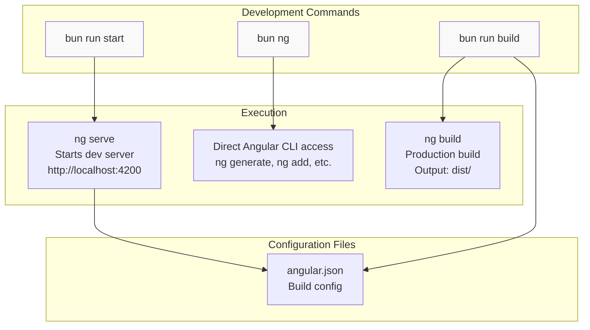
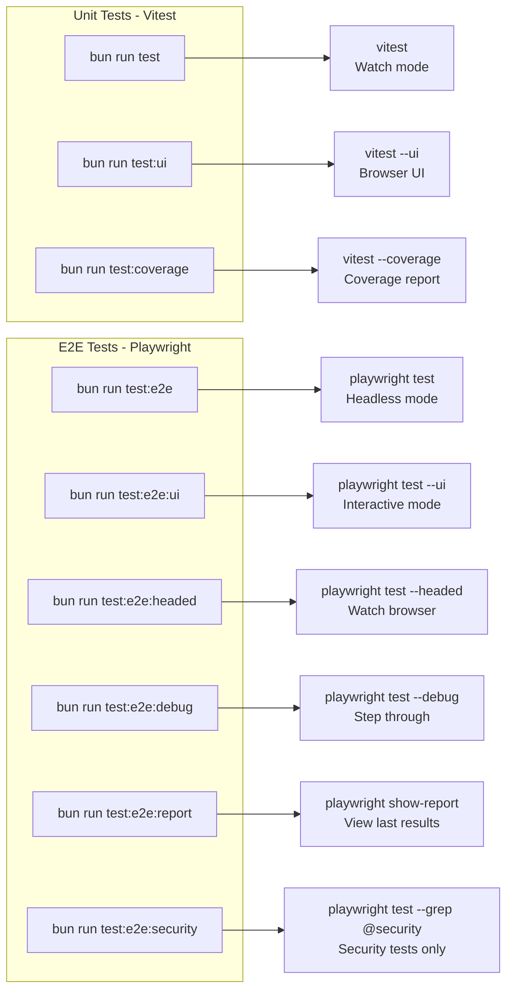
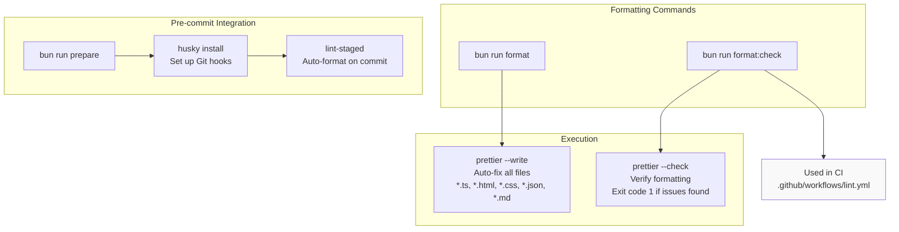
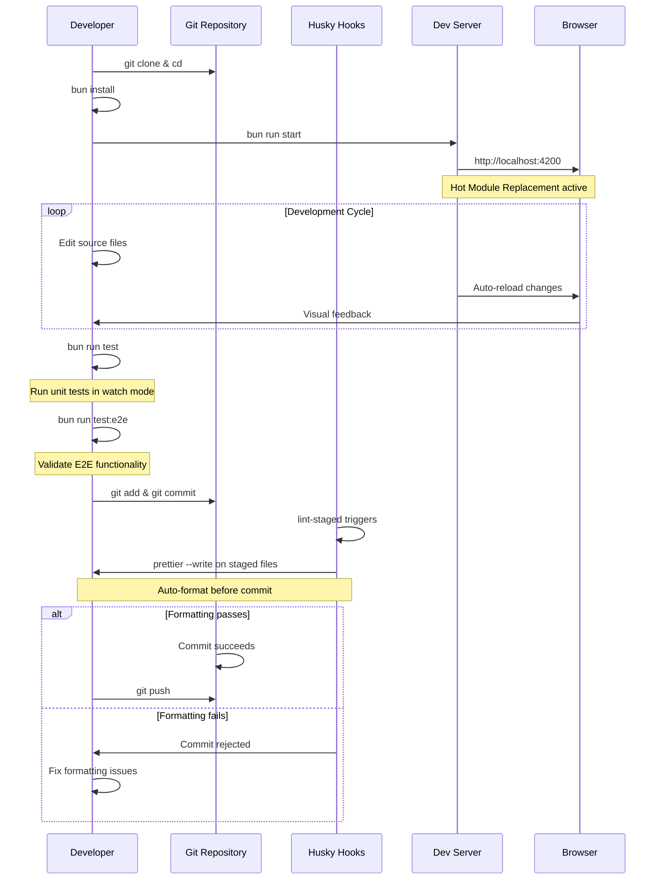
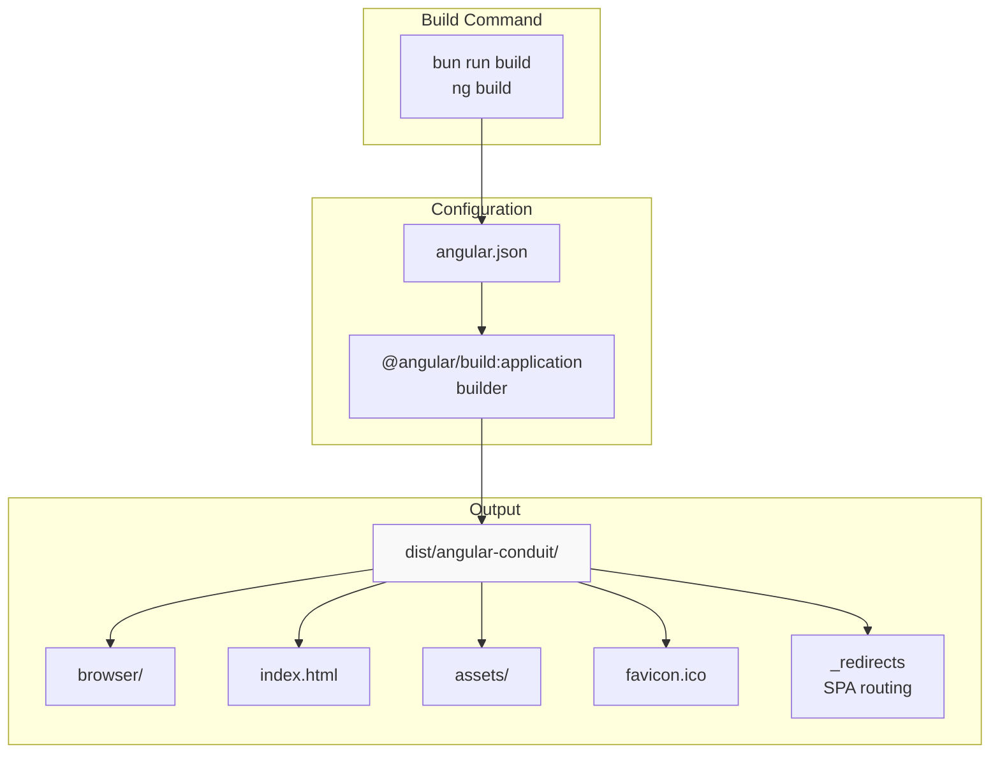
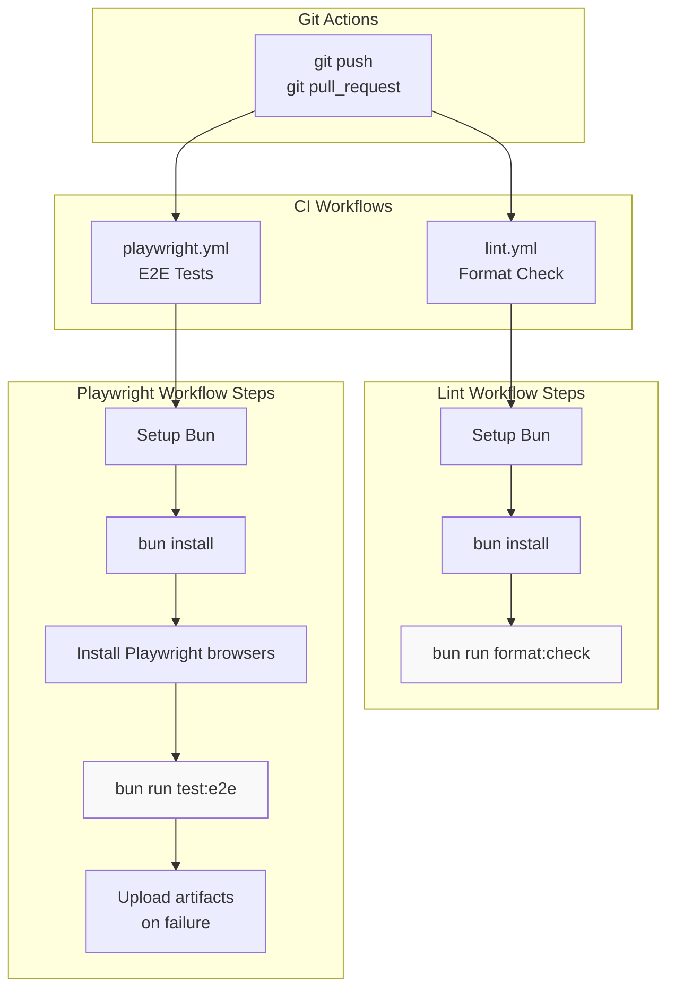

# Getting Started

<details>
<summary>Relevant source files</summary>

The following files were used as context for generating this wiki page:

- [.editorconfig](../.editorconfig)
- [.github/workflows/lint.yml](../.github/workflows/lint.yml)
- [.github/workflows/playwright.yml](../.github/workflows/playwright.yml)
- [.gitignore](../.gitignore)
- [angular.json](../angular.json)
- [bun.lock](../bun.lock)
- [package.json](../package.json)
- [src/\_redirects](../src/_redirects)

</details>

This document provides step-by-step instructions for setting up the Angular RealWorld application development environment, installing dependencies, and understanding the available development commands. It covers the initial setup process, daily development workflow, and essential scripts for building, testing, and maintaining code quality.

For detailed architecture information, see [Architecture](3-architecture.md). For comprehensive testing documentation, see [Testing Strategy](7-testing-strategy.md). For build and deployment processes, see [Build & Deployment](8-build-and-deployment.md).

---

## Prerequisites

Before setting up the project, ensure you have the following installed:

| Requirement | Version    | Purpose                         |
| ----------- | ---------- | ------------------------------- |
| Node.js     | >= 20.11.1 | JavaScript runtime              |
| Bun         | Latest     | Package manager and task runner |

The project uses Bun as its primary package manager, as evidenced by the presence of `bun.lock:1-61` and GitHub Actions workflows that utilize Bun for dependency installation and script execution.

**Sources:** `package.json:23-25`, `.github/workflows/lint.yml:16-17`, `.github/workflows/playwright.yml:17-18`

---

## Installation

### Step 1: Clone the Repository

```bash
git clone https://github.com/realworld-apps/angular-realworld-example-app
cd angular-realworld-example-app
```

### Step 2: Install Dependencies

```bash
bun install
```

This command reads `package.json:27-57` and installs all production and development dependencies, including:

- Angular framework packages (v21.1.1)
- RxJS for reactive programming
- Testing frameworks (Vitest, Playwright)
- Build tools (Angular CLI, Vite)

### Step 3: Verify Installation

After installation completes, verify the setup by checking the installed Angular CLI:

```bash
bun ng version
```

**Sources:** `package.json:27-57`, `bun.lock:1-40`

---

## Available Scripts

The project provides numerous npm scripts for development, testing, and maintenance. Below is a comprehensive overview organized by category.

### Development Scripts



**Script Details:**

| Script          | Command    | Purpose                                  |
| --------------- | ---------- | ---------------------------------------- |
| `bun run start` | `ng serve` | Start development server with hot reload |
| `bun run build` | `ng build` | Create production-optimized build        |
| `bun ng`        | `ng`       | Direct access to Angular CLI commands    |

**Sources:** `package.json:5-8`, `angular.json:60-71`

### Testing Scripts



**Script Details:**

| Script                      | Command                                   | Purpose                                 |
| --------------------------- | ----------------------------------------- | --------------------------------------- |
| `bun run test`              | `vitest`                                  | Run unit tests in watch mode            |
| `bun run test:ui`           | `vitest --ui`                             | Interactive test UI in browser          |
| `bun run test:coverage`     | `vitest --coverage`                       | Generate coverage report                |
| `bun run test:e2e`          | `playwright test --grep-invert @security` | Run all E2E tests except security tests |
| `bun run test:e2e:security` | `playwright test --grep @security`        | Run security-tagged tests only          |
| `bun run test:e2e:ui`       | `playwright test --ui`                    | Interactive Playwright UI               |
| `bun run test:e2e:headed`   | `playwright test --headed`                | Run tests with visible browser          |
| `bun run test:e2e:debug`    | `playwright test --debug`                 | Step-by-step debugging mode             |
| `bun run test:e2e:report`   | `playwright show-report`                  | View HTML test report                   |

**Sources:** `package.json:9-18`

### Code Quality Scripts



**Script Details:**

| Script                 | Command                                         | Purpose                                 |
| ---------------------- | ----------------------------------------------- | --------------------------------------- |
| `bun run format`       | `prettier --write "**/*.{ts,html,css,json,md}"` | Auto-format all source files            |
| `bun run format:check` | `prettier --check "**/*.{ts,html,css,json,md}"` | Verify formatting (CI mode)             |
| `bun run prepare`      | `husky install`                                 | Install Git hooks for pre-commit checks |

**Sources:** `package.json:19-21`, `package.json:58-60`, `.github/workflows/lint.yml:22-23`

---

## Development Workflow

The typical development workflow follows this sequence:



### Daily Development Steps

1. **Start Development Server**

   ```bash
   bun run start
   ```

   The application will be available at `http://localhost:4200` with hot module replacement enabled.

2. **Make Code Changes**
   - Edit TypeScript files in `src/app/`
   - Modify templates in component HTML files
   - Update styles in CSS files
   - Changes automatically reload in the browser

3. **Run Unit Tests (Optional)**

   ```bash
   bun run test
   ```

   Tests run in watch mode and re-execute when files change.

4. **Format Code**

   ```bash
   bun run format
   ```

   Or rely on automatic formatting via Git hooks.

5. **Commit Changes**
   ```bash
   git add .
   git commit -m "Description of changes"
   ```
   Pre-commit hooks automatically format staged files via [lint-staged](#package.json:58-60)().

**Sources:** `package.json:5-21`, `angular.json:60-71`

---

## Build Configuration

The project uses Angular's application builder with Vite integration for fast builds and optimized output.

### Build Output Structure



### Build Configurations

| Configuration | Purpose                       | Key Settings                                      |
| ------------- | ----------------------------- | ------------------------------------------------- |
| `production`  | Optimized for deployment      | Output hashing, budgets enforced, AOT compilation |
| `development` | Fast rebuilds for development | Source maps, no optimization, named chunks        |

### Build Budgets

The production build enforces size constraints to maintain performance:

| Budget Type      | Warning | Error |
| ---------------- | ------- | ----- |
| Initial bundle   | 500 KB  | 1 MB  |
| Component styles | 2 KB    | 4 KB  |

**Sources:** `angular.json:12-58`, `package.json:8`

---

## Environment Setup Details

### Project Structure Recognition

The build system recognizes the following key paths:

| Path              | Purpose                   | Configuration        |
| ----------------- | ------------------------- | -------------------- |
| `src/index.html`  | Application entry point   | `angular.json:19`    |
| `src/main.ts`     | Bootstrap file            | `angular.json:33`    |
| `src/styles.css`  | Global styles             | `angular.json:31`    |
| `src/assets/`     | Static assets             | `angular.json:22-24` |
| `src/favicon.ico` | Browser favicon           | `angular.json:23`    |
| `src/_redirects`  | SPA routing configuration | `angular.json:25-29` |

### TypeScript Configuration

The project uses TypeScript 5.9.3 with strict type checking enabled. Configuration files:

- `tsconfig.app.json` - Application-specific settings
- Angular CLI reads these via `angular.json:21`

**Sources:** `angular.json:19-33`, `package.json:55`

---

## CI/CD Integration

The project includes automated workflows that run on every push and pull request.



### Workflow Details

**Format Check Workflow** (`.github/workflows/lint.yml:1-24`):

- Triggers on push/PR to main/master branches
- Runs `format:check` to verify code formatting
- Fails build if formatting issues detected

**Playwright Tests Workflow** (`.github/workflows/playwright.yml:1-46`):

- Triggers on push/PR to main/master branches
- Installs Chromium browser via Playwright
- Runs all E2E tests (excludes @security tagged tests in main run)
- Uploads test reports and results on failure
- 60-minute timeout per run

**Sources:** `.github/workflows/lint.yml:1-24`, `.github/workflows/playwright.yml:1-46`

---

## Quick Reference

### Common Commands

```bash
# Development
bun run start              # Start dev server
bun run build              # Production build

# Testing
bun run test               # Unit tests (watch)
bun run test:e2e          # E2E tests (headless)
bun run test:e2e:ui       # E2E tests (interactive)

# Code Quality
bun run format            # Auto-format all files
bun run format:check      # Verify formatting

# Angular CLI
bun ng generate component my-component  # Generate component
bun ng generate service my-service      # Generate service
```

### Next Steps

After completing setup:

1. Review [Architecture](3-architecture.md) to understand the application structure
2. Explore [Core Services](4-core-services.md) to learn about authentication and HTTP handling
3. Study [Feature Modules](5-feature-modules.md) to see how different parts of the app work
4. Read [Testing Strategy](7-testing-strategy.md) before writing tests

**Sources:** `package.json:5-21`

---

---

[← Back to documentation index](README.md)
