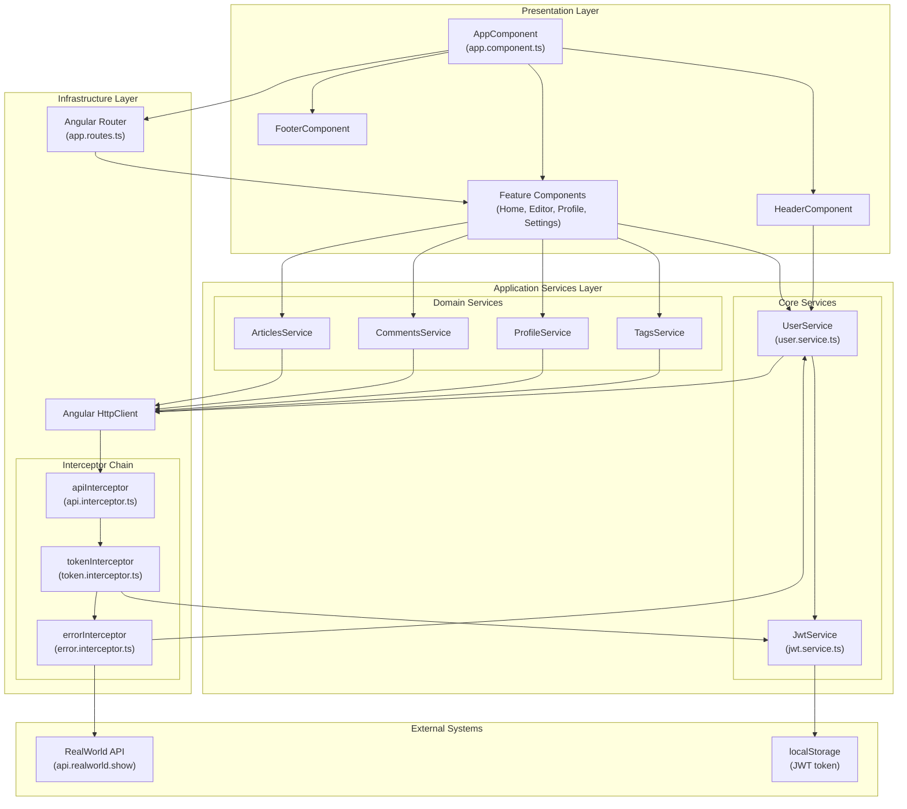
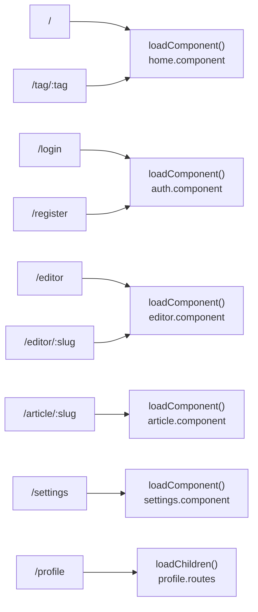
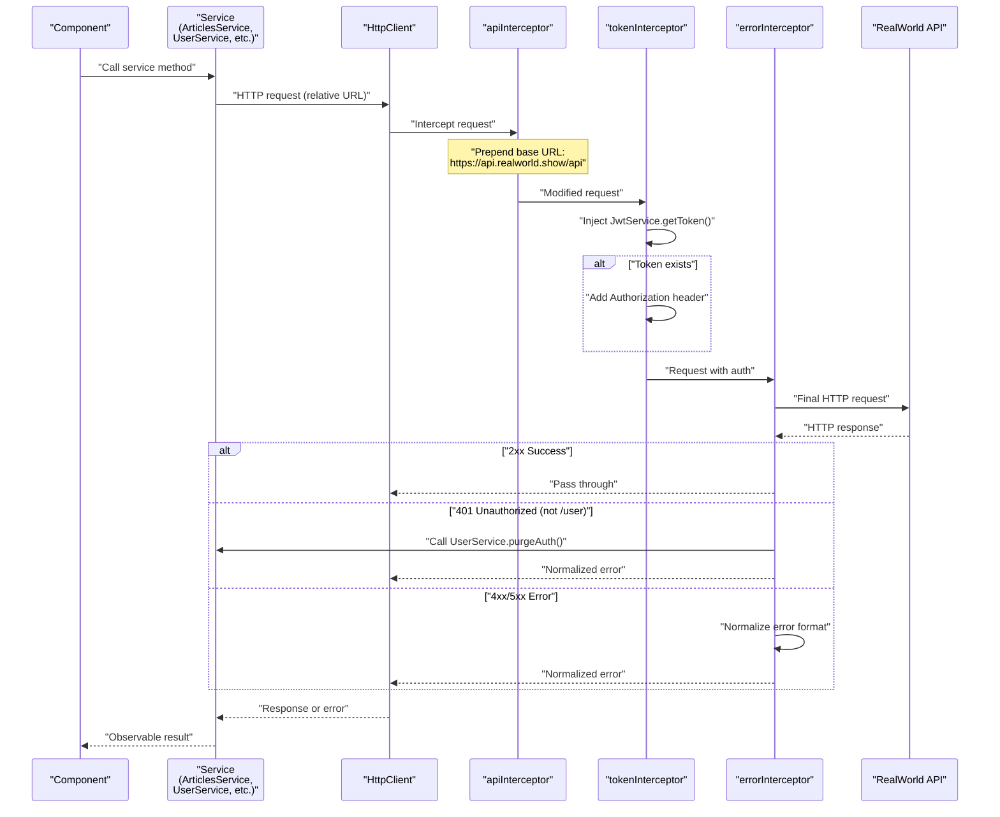
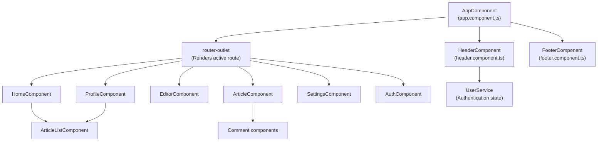
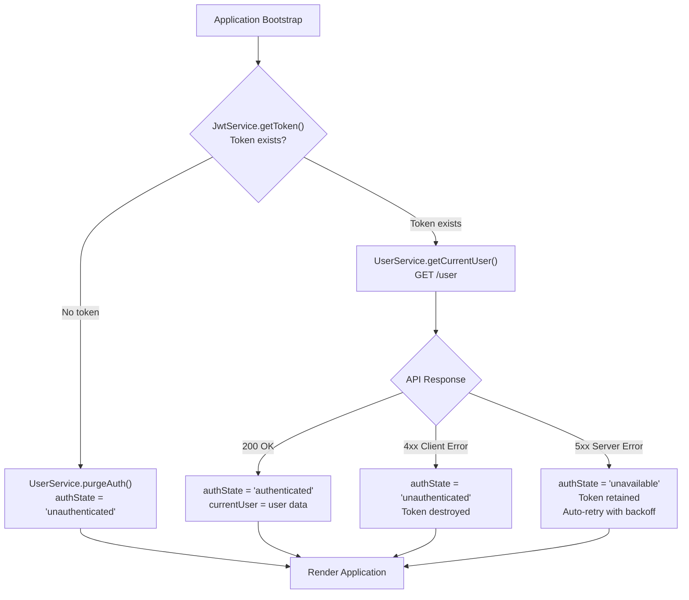

# Architecture

<details>
<summary>Relevant source files</summary>

The following files were used as context for generating this wiki page:

- [LICENSE](../LICENSE)
- [README.md](../README.md)
- [src/app/app.component.ts](../src/app/app.component.ts)
- [src/app/app.config.ts](../src/app/app.config.ts)
- [src/app/app.routes.ts](../src/app/app.routes.ts)
- [src/app/core/interceptors/api.interceptor.ts](../src/app/core/interceptors/api.interceptor.ts)
- [src/app/core/interceptors/error.interceptor.ts](../src/app/core/interceptors/error.interceptor.ts)
- [src/app/core/interceptors/token.interceptor.ts](../src/app/core/interceptors/token.interceptor.ts)
- [src/app/core/layout/footer.component.html](../src/app/core/layout/footer.component.html)
- [src/app/core/layout/footer.component.ts](../src/app/core/layout/footer.component.ts)

</details>

## Purpose and Scope

This document provides a high-level overview of the Angular RealWorld application's architectural patterns, design decisions, and structural organization. It explains the layered architecture, dependency injection strategy, and how major system components collaborate.

For detailed information about specific subsystems, see:

- Application initialization and configuration: [Application Bootstrap & Configuration](3.1-application-bootstrap-and-configuration.md)
- HTTP request handling and interceptors: [HTTP Request Pipeline](3.2-http-request-pipeline.md)
- Authentication state management: [Authentication System](3.3-authentication-system.md)
- Route configuration and guards: [Routing System](3.4-routing-system.md)

---

## Architectural Overview

The Angular RealWorld application follows a **layered service-oriented architecture** with clear separation of concerns. The system is organized into three primary layers:

### Presentation Layer

Components handle UI rendering and user interaction. They delegate business logic and data access to services through Angular's dependency injection system. Components are organized into feature modules (articles, profile, settings) and shared UI elements (header, footer, buttons).

### Application Services Layer

Services provide domain logic and state management. This layer is split into:

- **Core Services**: Cross-cutting functionality (`UserService`, `JwtService`)
- **Domain Services**: Feature-specific logic (`ArticlesService`, `CommentsService`, `ProfileService`, `TagsService`)

### Infrastructure Layer

The HTTP interceptor chain (`apiInterceptor`, `tokenInterceptor`, `errorInterceptor`) provides middleware-style request/response processing. This layer handles API base URL configuration, authentication token injection, and global error normalization.

**Sources:** `README.md:1-67`, `src/app/app.config.ts:1-80`

---

## System Architecture Diagram



**Sources:** `src/app/app.config.ts:1-80`, `src/app/app.component.ts:1-13`, `src/app/app.routes.ts:1-62`, `src/app/core/interceptors/api.interceptor.ts:1-7`, `src/app/core/interceptors/token.interceptor.ts:1-15`, `src/app/core/interceptors/error.interceptor.ts:1-55`

---

## Key Architectural Patterns

### Dependency Injection and Service Providers

The application uses Angular's dependency injection system configured in `src/app/app.config.ts:69-79`. The `appConfig` object defines all providers:

| Provider Type                              | Purpose                                                  | Configuration                 |
| ------------------------------------------ | -------------------------------------------------------- | ----------------------------- |
| `provideZonelessChangeDetection()`         | Enables zoneless change detection for better performance | `src/app/app.config.ts:71`    |
| `provideRouter(routes)`                    | Configures routing with lazy-loaded components           | `src/app/app.config.ts:72`    |
| `provideHttpClient(withInterceptors(...))` | Registers HTTP client with interceptor chain             | `src/app/app.config.ts:73`    |
| `provideAppInitializer(...)`               | Runs authentication check at startup                     | `src/app/app.config.ts:74-77` |

The interceptor chain is registered in order: `[apiInterceptor, tokenInterceptor, errorInterceptor]`. This sequence ensures proper request transformation (URL → auth token → error handling).

**Sources:** `src/app/app.config.ts:1-80`

---

### Lazy Loading and Route-Based Code Splitting

All feature components are lazy-loaded using Angular's `loadComponent` and `loadChildren` functions. The routing configuration in `src/app/app.routes.ts:14-61` demonstrates this pattern:



Each route is loaded on-demand, reducing the initial bundle size. The `loadChildren` function for profile routes enables further modularization.

**Sources:** `src/app/app.routes.ts:1-62`

---

### Authentication Guard Pattern

Routes are protected using functional guards that leverage the `UserService.isAuthenticated` observable. Two guard patterns are implemented:

**Protected Routes (requireAuth)**

The `requireAuth` guard at `src/app/app.routes.ts:9-12` redirects unauthenticated users to `/login`:

```
requireAuth = () => {
  const router = inject(Router);
  return inject(UserService).isAuthenticated.pipe(
    map(isAuth => isAuth || router.createUrlTree(['/login']))
  );
};
```

Applied to: `/settings`, `/editor`, `/editor/:slug`

**Public-Only Routes**

Login and register routes use an inverted guard at `src/app/app.routes.ts:26` and `src/app/app.routes.ts:31` that prevents authenticated users from accessing them:

```
canActivate: [() => inject(UserService).isAuthenticated.pipe(map(isAuth => !isAuth))]
```

This prevents authenticated users from seeing login/register pages.

**Sources:** `src/app/app.routes.ts:1-62`

---

## Request Flow Architecture

The following diagram shows how HTTP requests flow through the application, from component initiation to backend response:



**Request Transformation Steps:**

1. **API Base URL**: `apiInterceptor` prepends `https://api.realworld.show/api` to all requests
2. **Authentication**: `tokenInterceptor` adds `Authorization: Token <jwt>` header if token exists
3. **Error Handling**: `errorInterceptor` normalizes error responses and triggers logout on 401 (except for `/user` endpoint)

**Sources:** `src/app/core/interceptors/api.interceptor.ts:1-7`, `src/app/core/interceptors/token.interceptor.ts:1-15`, `src/app/core/interceptors/error.interceptor.ts:1-55`

---

## Component Hierarchy

The application uses a shell-based layout with `AppComponent` as the root:



The `HeaderComponent` subscribes to `UserService.currentUser` to show/hide navigation links based on authentication state. The `RouterOutlet` renders the active route's component. `FooterComponent` is stateless and displays copyright information.

**Sources:** `src/app/app.component.ts:1-13`, `src/app/core/layout/footer.component.ts:1-14`

---

## State Management Strategy

The application uses **RxJS-based reactive state management** without a dedicated state management library. Core state is managed in services as observables:

| Service       | State Managed            | Observable(s)                                                                                                             |
| ------------- | ------------------------ | ------------------------------------------------------------------------------------------------------------------------- |
| `UserService` | Current user, auth state | `currentUser: Observable<User \| null>`<br/>`isAuthenticated: Observable<boolean>`<br/>`authState: Observable<AuthState>` |
| `JwtService`  | JWT token                | Synchronous `getToken()`, `saveToken()`, `destroyToken()`                                                                 |

Components subscribe to these observables using Angular's `AsyncPipe` or signal-based state management. Services emit new values when state changes (login, logout, token expiry).

The `AuthState` type can be: `'loading'` (initial check), `'authenticated'`, `'unauthenticated'`, or `'unavailable'` (server down, with auto-retry).

**Sources:** `src/app/app.config.ts:1-80`

---

## Application Initialization Flow

The application initializes authentication state before rendering using the `initAuth` function registered with `provideAppInitializer`:



The initializer function at `src/app/app.config.ts:56-67` blocks application rendering until the token is validated or determined to be invalid. This prevents flickering of authentication-dependent UI elements.

The `setupDebugInterface` function at `src/app/app.config.ts:33-45` exposes `window.__conduit_debug__` for E2E tests to inspect authentication state.

**Sources:** `src/app/app.config.ts:1-80`

---

## Cross-Cutting Concerns

### Error Handling Strategy

The `errorInterceptor` at `src/app/core/interceptors/error.interceptor.ts:32-54` implements a global error handling strategy with special logic for different error types:

| Error Type                   | HTTP Status | Handling Strategy                              |
| ---------------------------- | ----------- | ---------------------------------------------- |
| 401 on non-`/user` endpoints | 401         | Immediate logout via `UserService.purgeAuth()` |
| 401 on `/user` endpoint      | 401         | Handled by `UserService` (interceptor skips)   |
| Client errors (validation)   | 4xx         | Normalize error format, pass to component      |
| Server errors                | 5xx         | Normalize error format, pass to component      |
| Network errors               | 0           | Inject fallback message about connectivity     |

All errors are normalized to the format: `{ errors: {...}, status: number }`. This allows components to consistently access validation errors via `error.errors` and check error types via `error.status`.

**Sources:** `src/app/core/interceptors/error.interceptor.ts:1-55`

---

### Change Detection Strategy

The application uses **zoneless change detection** configured at `src/app/app.config.ts:71`. This requires components to use `ChangeDetectionStrategy.OnPush` and rely on observables or signals for state updates. Benefits include:

- Reduced overhead from zone.js monkey-patching
- More predictable change detection cycles
- Better performance for large applications
- Forces reactive programming patterns

The `AppComponent` at `src/app/app.component.ts:10` demonstrates this with `changeDetection: ChangeDetectionStrategy.OnPush`.

**Sources:** `src/app/app.config.ts:1-80`, `src/app/app.component.ts:1-13`

---

## Design Decisions

### Why Service-Based Architecture?

The application avoids a centralized state management library (NgRx, Akita) in favor of service-based state management because:

- The application state is relatively simple (authenticated user, current article, etc.)
- Services with RxJS observables provide sufficient reactivity
- Reduces boilerplate and learning curve
- Easier to test services in isolation

### Why Functional Interceptors?

The interceptor chain uses functional interceptors (`HttpInterceptorFn`) rather than class-based interceptors. This aligns with Angular's modern direction:

- More concise syntax
- Better tree-shaking (unused code elimination)
- Easier composition and testing
- Direct access to dependency injection via `inject()`

### Why Lazy Loading All Routes?

Every route uses `loadComponent()` or `loadChildren()` for maximum code splitting. This strategy:

- Minimizes initial bundle size (faster first load)
- Loads features on-demand (better cache utilization)
- Scales well as the application grows
- No performance penalty for small routes (Angular's build optimizer handles this)

**Sources:** `src/app/app.routes.ts:1-62`, `src/app/core/interceptors/error.interceptor.ts:1-55`, `README.md:1-67`

---

---

[← Back to documentation index](README.md)
