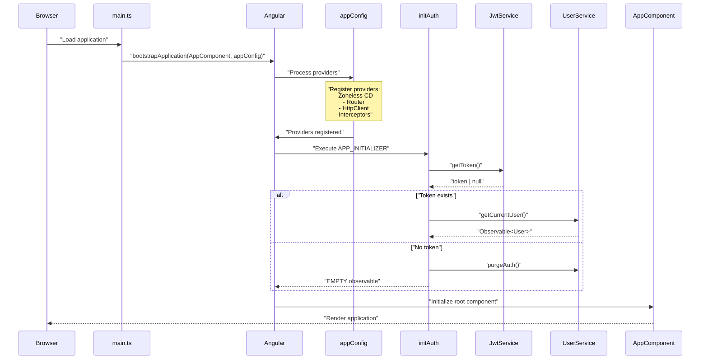
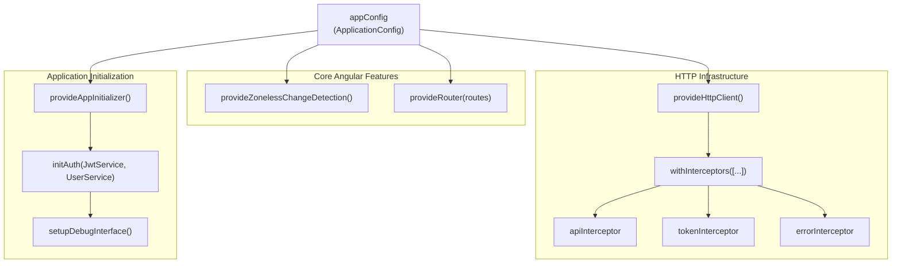
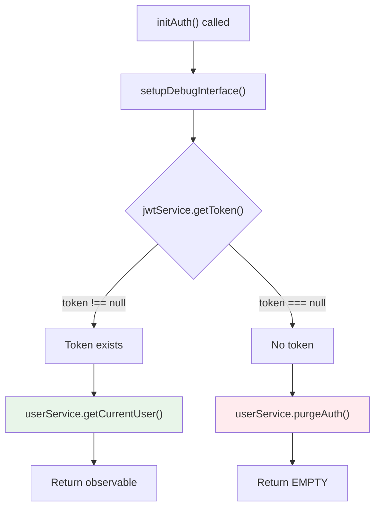

# Application Bootstrap & Configuration

<details>
<summary>Relevant source files</summary>

The following files were used as context for generating this wiki page:

- [src/app/app.component.ts](../src/app/app.component.ts)
- [src/app/app.config.ts](../src/app/app.config.ts)
- [src/main.ts](../src/main.ts)
- [tsconfig.json](../tsconfig.json)

</details>

## Purpose and Scope

This document explains how the Angular RealWorld application initializes and configures itself at startup. It covers the bootstrap process, application configuration providers, and the authentication initialization logic. This page focuses on the initial setup that occurs before any components render or routing begins.

For details on the HTTP interceptor chain that is configured during bootstrap, see [HTTP Request Pipeline](3.2-http-request-pipeline.md). For authentication state management after initialization, see [Authentication System](3.3-authentication-system.md). For routing configuration, see [Routing System](3.4-routing-system.md).

---

## Bootstrap Process Overview

The application follows Angular's standalone component bootstrap pattern, which eliminates the need for NgModules. The bootstrap process consists of three main phases:

1. **Entry Point Execution**: `src/main.ts` invokes `bootstrapApplication` with the root component and configuration
2. **Provider Initialization**: Angular's dependency injection system instantiates all configured providers
3. **Application Initialization**: The `initAuth` function runs before the application starts, validating authentication state

**Bootstrap Flow Diagram**



Sources: `src/main.ts:1-6`, `src/app/app.config.ts:69-79`, `src/app/app.config.ts:56-67`

---

## Application Entry Point

The application entry point is minimal and delegates all configuration to `appConfig`:

| File                       | Function       | Description                                                          |
| -------------------------- | -------------- | -------------------------------------------------------------------- |
| `src/main.ts`              | Entry point    | Calls `bootstrapApplication` with `AppComponent` and `appConfig`     |
| `src/app/app.config.ts`    | Configuration  | Defines all application providers and initialization logic           |
| `src/app/app.component.ts` | Root component | Defines the application shell with header, router outlet, and footer |

The `bootstrapApplication` function at `src/main.ts:5` accepts two arguments:

1. `AppComponent` - The root component class
2. `appConfig` - An `ApplicationConfig` object containing all providers

Any bootstrap errors are caught and logged to the console at `src/main.ts:5`.

Sources: `src/main.ts:1-6`

---

## Application Configuration Structure

The `appConfig` object at `src/app/app.config.ts:69-79` defines an `ApplicationConfig` with a single `providers` array. This array contains all dependency injection providers needed by the application.

**Provider Configuration Diagram**



Sources: `src/app/app.config.ts:69-79`

---

## Provider Configuration Details

### Zoneless Change Detection

`src/app/app.config.ts:71` configures `provideZonelessChangeDetection()`, which enables Angular's experimental zoneless change detection mode. This eliminates the dependency on Zone.js and relies on signals and explicit change detection triggers.

### Router Configuration

`src/app/app.config.ts:72` configures `provideRouter(routes)`, registering the application's route configuration. The `routes` constant is imported from `src/app/app.routes.ts`.

### HTTP Client with Interceptors

`src/app/app.config.ts:73` configures the HTTP client with three interceptors in a specific order:

| Interceptor        | Position | Purpose            | Details                                      |
| ------------------ | -------- | ------------------ | -------------------------------------------- |
| `apiInterceptor`   | 1st      | URL transformation | Prepends base API URL to all requests        |
| `tokenInterceptor` | 2nd      | Authentication     | Injects JWT token into request headers       |
| `errorInterceptor` | 3rd      | Error handling     | Normalizes errors and triggers logout on 401 |

The interceptors are configured using `withInterceptors([...])` which accepts functional interceptors. Each interceptor is imported from `src/app/core/interceptors/`.

Sources: `src/app/app.config.ts:5-10`, `src/app/app.config.ts:73`

### Application Initializer

`src/app/app.config.ts:74-77` configures `provideAppInitializer()` with a factory function that:

1. Injects `JwtService` and `UserService` using Angular's `inject()` function
2. Calls `initAuth(jwtService, userService)` to get the initializer function
3. Executes the initializer function and returns its observable

The initializer runs **before** the application starts, ensuring authentication state is determined before any components render.

Sources: `src/app/app.config.ts:74-77`

---

## Authentication Initialization Logic

The `initAuth` function at `src/app/app.config.ts:56-67` implements the authentication initialization logic. This function returns an initializer function that Angular executes during bootstrap.

**Authentication Initialization Flow**



### Token Validation Strategy

The initialization logic implements two distinct paths based on token presence:

| Scenario     | Action                  | Result                          | Auth State Transition                                                                                           |
| ------------ | ----------------------- | ------------------------------- | --------------------------------------------------------------------------------------------------------------- |
| Token exists | Call `getCurrentUser()` | Validates token with backend    | `loading` → `authenticated` (success) or `loading` → `unavailable` (5xx) or `loading` → `unauthenticated` (4xx) |
| No token     | Call `purgeAuth()`      | Immediately set unauthenticated | `loading` → `unauthenticated`                                                                                   |

#### When Token Exists

At `src/app/app.config.ts:60-61`, if a token is found in localStorage:

1. The function calls `userService.getCurrentUser()` which issues a `GET /api/user` request
2. This returns an `Observable<User>` that Angular subscribes to
3. The observable completion determines when the app initialization finishes
4. The `UserService` handles the response:
   - **200 OK**: Sets `authState` to `authenticated` and stores the user
   - **4xx error**: Sets `authState` to `unauthenticated` and clears the invalid token
   - **5xx error**: Sets `authState` to `unavailable` and retains the token for retry

#### When No Token Exists

At `src/app/app.config.ts:63-64`, if no token is found:

1. The function calls `userService.purgeAuth()` to clear any stale state
2. This immediately transitions from `loading` to `unauthenticated`
3. The function returns `EMPTY`, an observable that completes immediately
4. Application initialization finishes instantly without making any HTTP requests

Sources: `src/app/app.config.ts:56-67`

---

## Debug Interface Configuration

The `setupDebugInterface` function at `src/app/app.config.ts:33-45` exposes application state for testing purposes. This function is called at the start of `initAuth` at `src/app/app.config.ts:58`.

### Debug Interface Structure

The debug interface is defined by the `ConduitDebug` interface at `src/app/app.config.ts:18-22`:

```typescript
interface ConduitDebug {
  getToken: () => string | null;
  getAuthState: () => AuthState;
  getCurrentUser: () => User | null;
}
```

This interface is attached to the global `window` object at `src/app/app.config.ts:24-28` as `window.__conduit_debug__`.

### Implementation Details

The debug interface maintains local state by subscribing to observables:

| Observable Source         | Local Variable     | Purpose                                                                                    |
| ------------------------- | ------------------ | ------------------------------------------------------------------------------------------ |
| `userService.authState`   | `currentAuthState` | Tracks authentication state (`loading`, `authenticated`, `unauthenticated`, `unavailable`) |
| `userService.currentUser` | `currentUser`      | Tracks the current user object or `null`                                                   |
| `jwtService.getToken()`   | N/A                | Returns current token from localStorage on demand                                          |

At `src/app/app.config.ts:37-38`, the function subscribes to both observables to keep the local state synchronized.

### Testing Usage

E2E tests use this interface to:

- Verify authentication state transitions
- Check token presence without accessing localStorage directly
- Assert on current user data without querying internal Angular state

This provides a stable testing interface that is independent of Angular's internal implementation details.

Sources: `src/app/app.config.ts:18-45`

---

## TypeScript Configuration

The TypeScript configuration at `tsconfig.json` defines compiler options that affect the application's behavior:

### Key Compiler Settings

| Option                    | Value     | Impact on Bootstrap                          |
| ------------------------- | --------- | -------------------------------------------- |
| `target`                  | `ES2022`  | Enables modern JavaScript features in output |
| `module`                  | `ES2022`  | Uses ES modules for tree-shaking             |
| `moduleResolution`        | `bundler` | Modern resolution for Vite bundler           |
| `experimentalDecorators`  | `true`    | Enables Angular decorators                   |
| `strict`                  | `true`    | Enforces strict type checking                |
| `useDefineForClassFields` | `false`   | Required for Angular decorator behavior      |

### Angular-Specific Options

At `tsconfig.json:24-29`, Angular compiler options are configured:

| Option                       | Value  | Purpose                                        |
| ---------------------------- | ------ | ---------------------------------------------- |
| `strictInjectionParameters`  | `true` | Validates dependency injection at compile time |
| `strictInputAccessModifiers` | `true` | Enforces proper component input access         |
| `strictTemplates`            | `true` | Enables strict template type checking          |

These settings ensure type safety during dependency injection in the bootstrap process.

Sources: `tsconfig.json:1-31`

---

## Root Component Configuration

The `AppComponent` at `src/app/app.component.ts:6-12` serves as the application shell. It uses:

- `ChangeDetectionStrategy.OnPush` at `src/app/app.component.ts:10` for optimal performance with zoneless change detection
- Standalone component imports at `src/app/app.component.ts:9` for `HeaderComponent`, `RouterOutlet`, and `FooterComponent`

The component itself contains no logic and serves purely as a layout container. Its template at `src/app/app.component.html` (not shown) structures the application with header, main content area (router outlet), and footer.

Sources: `src/app/app.component.ts:1-13`

---

## Configuration Summary

The bootstrap and configuration system provides:

1. **Standalone Bootstrap**: No NgModules required, using `bootstrapApplication`
2. **Centralized Configuration**: All providers defined in `appConfig`
3. **Authentication Initialization**: Token validation before app renders
4. **HTTP Infrastructure**: Interceptor chain configured at bootstrap time
5. **Testing Support**: Debug interface for E2E test assertions
6. **Modern Angular Features**: Zoneless change detection and standalone components

The initialization process ensures that by the time the first component renders, the application knows whether the user is authenticated, unauthenticated, or if the server is unavailable. This eliminates race conditions and provides a consistent initial state.

Sources: `src/main.ts:1-6`, `src/app/app.config.ts:1-80`, `src/app/app.component.ts:1-13`

---

---

[← Back to documentation index](README.md)
