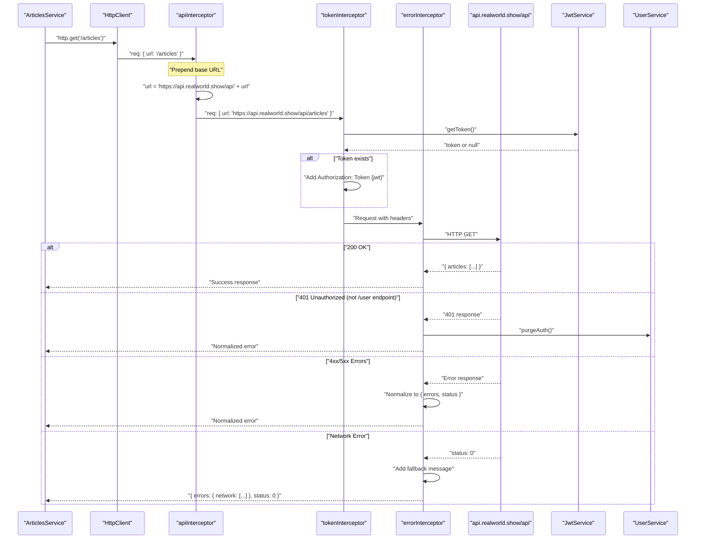
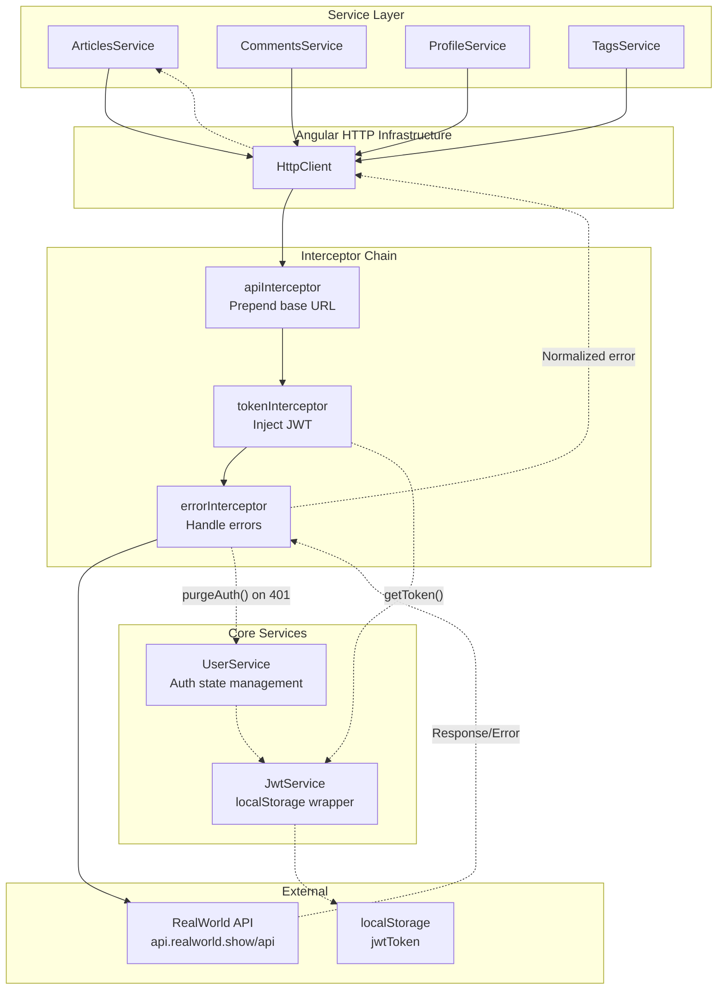

# HTTP Request Pipeline

<details>
<summary>Relevant source files</summary>

The following files were used as context for generating this wiki page:

- [LICENSE](../LICENSE)
- [README.md](../README.md)
- [src/app/app.component.ts](../src/app/app.component.ts)
- [src/app/app.config.ts](../src/app/app.config.ts)
- [src/app/app.routes.ts](../src/app/app.routes.ts)
- [src/app/core/interceptors/api.interceptor.ts](../src/app/core/interceptors/api.interceptor.ts)
- [src/app/core/interceptors/error.interceptor.ts](../src/app/core/interceptors/error.interceptor.ts)
- [src/app/core/interceptors/token.interceptor.ts](../src/app/core/interceptors/token.interceptor.ts)
- [src/app/core/layout/footer.component.html](../src/app/core/layout/footer.component.html)
- [src/app/core/layout/footer.component.ts](../src/app/core/layout/footer.component.ts)

</details>

## Purpose and Scope

This document explains how HTTP requests flow through the application's interceptor chain. It covers the three interceptors that handle cross-cutting concerns: base URL configuration, authentication token injection, and global error handling.

For information about the authentication system and state management, see [Authentication System](3.3-authentication-system.md). For details about the services that consume the HTTP layer, see [Domain Services](4.4-domain-services-articles-comments-profile-tags.md).

---

## Overview

All HTTP requests in the application pass through a pipeline of three functional interceptors that process requests and responses sequentially. This architecture centralizes common HTTP concerns and eliminates code duplication across service methods.

The interceptors execute in the order they are registered:

1. **`apiInterceptor`** - Prepends the API base URL
2. **`tokenInterceptor`** - Injects JWT authentication token
3. **`errorInterceptor`** - Normalizes errors and handles 401 responses

**Sources:** `src/app/app.config.ts:73`, `src/app/core/interceptors/api.interceptor.ts`, `src/app/core/interceptors/token.interceptor.ts`, `src/app/core/interceptors/error.interceptor.ts`

---

## Interceptor Registration

Interceptors are registered in the application configuration using Angular's functional interceptor API with `withInterceptors()`.

```typescript
provideHttpClient(withInterceptors([apiInterceptor, tokenInterceptor, errorInterceptor]));
```

This functional approach replaces the older class-based interceptor pattern and provides better tree-shaking and type safety.

**Sources:** `src/app/app.config.ts:73`

---

## Request Flow Sequence

The following diagram shows how a typical HTTP request flows through all three interceptors before reaching the backend API.



**Sources:** `src/app/core/interceptors/api.interceptor.ts:3-6`, `src/app/core/interceptors/token.interceptor.ts:5-14`, `src/app/core/interceptors/error.interceptor.ts:32-54`

---

## API Interceptor

### Responsibility

The `apiInterceptor` ensures all HTTP requests target the correct backend by prepending the API base URL to relative request URLs.

### Implementation

| Aspect        | Details                                                 |
| ------------- | ------------------------------------------------------- |
| **File**      | `src/app/core/interceptors/api.interceptor.ts`          |
| **Type**      | `HttpInterceptorFn`                                     |
| **Base URL**  | `https://api.realworld.show/api`                        |
| **Transform** | `/articles` → `https://api.realworld.show/api/articles` |

The interceptor is minimal and performs a single operation:

```typescript
const apiReq = req.clone({ url: `https://api.realworld.show/api${req.url}` });
return next(apiReq);
```

This allows all service methods to use relative URLs (e.g., `/articles`, `/user`) without hardcoding the base URL.

**Sources:** `src/app/core/interceptors/api.interceptor.ts:1-6`

---

## Token Interceptor

### Responsibility

The `tokenInterceptor` injects JWT authentication tokens into request headers when a valid token is available.

### Implementation

| Aspect            | Details                                          |
| ----------------- | ------------------------------------------------ |
| **File**          | `src/app/core/interceptors/token.interceptor.ts` |
| **Type**          | `HttpInterceptorFn`                              |
| **Dependency**    | `JwtService` (injected via `inject()`)           |
| **Header Format** | `Authorization: Token {jwt}`                     |
| **Behavior**      | Conditionally adds header only if token exists   |

The interceptor retrieves the token from `JwtService` and adds it to the request headers if present:

```typescript
const token = inject(JwtService).getToken();
const request = req.clone({
  setHeaders: {
    ...(token ? { Authorization: `Token ${token}` } : {}),
  },
});
```

This pattern allows:

- Authenticated requests to include credentials automatically
- Unauthenticated requests to proceed without the header
- Single source of truth for token storage (via `JwtService`)

**Sources:** `src/app/core/interceptors/token.interceptor.ts:1-14`

---

## Error Interceptor

### Responsibility

The `errorInterceptor` provides centralized error handling with three key functions:

1. Global 401 handling for non-`/user` endpoints
2. Error format normalization
3. Network error fallback messages

### Error Handling Strategy

The interceptor implements a sophisticated 401 handling strategy that distinguishes between different endpoints:

#### 401 on `/user` Endpoint

- **Handled by:** `UserService.getCurrentUser()`
- **Strategy:** Distinguishes between 4XX (bad token) and 5XX (server down)
- **Reason:** The `/user` endpoint requires special retry logic for server outages

#### 401 on All Other Endpoints

- **Handled by:** `errorInterceptor`
- **Strategy:** Immediately calls `UserService.purgeAuth()` to logout
- **Reason:** Mid-session 401 indicates expired token; no retry needed

The code explicitly checks the endpoint:

```typescript
if (err.status === 401 && !req.url.endsWith('/user')) {
  userService.purgeAuth();
}
```

**Sources:** `src/app/core/interceptors/error.interceptor.ts:7-31`, `src/app/core/interceptors/error.interceptor.ts:37-42`

### Error Format Normalization

All errors are normalized to a consistent format: `{ errors: {...}, status: number }`. This provides:

| Error Scenario       | Original Format                               | Normalized Format                                              |
| -------------------- | --------------------------------------------- | -------------------------------------------------------------- |
| **Validation Error** | `{ errors: { email: ["is invalid"] } }`       | `{ errors: { email: [...] }, status: 422 }`                    |
| **Network Error**    | `status: 0, error: null`                      | `{ errors: { network: ["Unable to connect..."] }, status: 0 }` |
| **Server Error**     | `status: 500, error: "Internal Server Error"` | `{ errors: { network: [...] }, status: 500 }`                  |

The normalization logic:

```typescript
const body =
  err.error && typeof err.error === 'object' && 'errors' in err.error
    ? err.error
    : { errors: { network: ['Unable to connect. Please check your internet connection.'] } };

return throwError(() => ({ ...body, status: err.status }));
```

This ensures components can always access `err.errors` for display and `err.status` for conditional logic.

**Sources:** `src/app/core/interceptors/error.interceptor.ts:44-52`

---

## Interceptor Interaction Diagram

The following diagram shows how interceptors integrate with core services and the broader system.



**Sources:** `src/app/app.config.ts:73`, `src/app/core/interceptors/api.interceptor.ts:3-6`, `src/app/core/interceptors/token.interceptor.ts:5-14`, `src/app/core/interceptors/error.interceptor.ts:32-54`

---

## Key Design Decisions

### Functional Interceptors

The application uses Angular's modern functional interceptor API (`HttpInterceptorFn`) rather than class-based interceptors. This approach provides:

- Better tree-shaking (unused interceptors can be eliminated)
- Simpler dependency injection via `inject()` function
- More concise code without boilerplate classes
- Improved type safety

**Sources:** `src/app/app.config.ts:73`, `src/app/core/interceptors/token.interceptor.ts:1-2`

### Interceptor Order

The order matters:

1. **`apiInterceptor` first** - Ensures subsequent interceptors work with complete URLs
2. **`tokenInterceptor` second** - Adds authentication after URL is finalized
3. **`errorInterceptor` last** - Catches all errors after request is fully prepared

Reversing the order would cause issues (e.g., `tokenInterceptor` couldn't check URLs if `apiInterceptor` runs after).

**Sources:** `src/app/app.config.ts:73`

### Selective 401 Handling

The error interceptor deliberately skips `/user` endpoint for 401 handling. This design choice exists because:

- The `/user` endpoint is checked during app initialization
- Server outages (5XX) should trigger retry, not logout
- `UserService.getCurrentUser()` already implements this logic
- Handling it in both places would cause conflicts

**Sources:** `src/app/core/interceptors/error.interceptor.ts:7-23`

---

## Error Response Examples

### Validation Error (422)

**Request:** `POST /users` with invalid email

**Response:**

```json
{
  "errors": {
    "email": ["is invalid"],
    "username": ["is already taken"]
  },
  "status": 422
}
```

**Usage:** Components display field-specific errors via `ListErrorsComponent`

### Network Error (0)

**Request:** Any request when offline

**Response:**

```json
{
  "errors": {
    "network": ["Unable to connect. Please check your internet connection."]
  },
  "status": 0
}
```

**Usage:** Generic error message shown to user

### Unauthorized Error (401)

**Request:** `POST /articles` with expired token

**Response:**

```json
{
  "errors": {
    "message": ["Unauthorized"]
  },
  "status": 401
}
```

**Effect:** `errorInterceptor` calls `UserService.purgeAuth()`, triggering logout

**Sources:** `src/app/core/interceptors/error.interceptor.ts:44-52`

---

## Testing Considerations

The interceptor chain is thoroughly tested through both unit and E2E tests:

### Unit Testing

Services are tested with `HttpClientTestingModule`, which bypasses interceptors. This allows isolated testing of service logic.

**Related:** See [Unit Testing with Vitest](7.1-unit-testing-with-vitest.md) for testing patterns.

### E2E Testing

End-to-end tests exercise the full interceptor chain by making real HTTP requests. Error handling tests specifically verify:

- 4xx errors are handled correctly
- 5xx errors trigger appropriate behavior
- Network errors show fallback messages
- 401 errors trigger logout

**Related:** See [Error Handling Tests](7.3-error-handling-tests.md) for comprehensive error scenarios.

**Sources:** `src/app/app.config.ts:73`

---

## Summary

The HTTP request pipeline implements a clean separation of concerns through three focused interceptors:

| Interceptor            | Primary Function                   | Dependencies  |
| ---------------------- | ---------------------------------- | ------------- |
| **`apiInterceptor`**   | URL transformation                 | None          |
| **`tokenInterceptor`** | Authentication injection           | `JwtService`  |
| **`errorInterceptor`** | Error normalization & 401 handling | `UserService` |

This architecture ensures that:

- Services use simple, relative URLs
- Authentication is handled transparently
- Errors are consistently formatted
- Cross-cutting concerns are centralized

**Sources:** `src/app/app.config.ts:73`, `src/app/core/interceptors/api.interceptor.ts`, `src/app/core/interceptors/token.interceptor.ts`, `src/app/core/interceptors/error.interceptor.ts`

---

---

[← Back to documentation index](README.md)
