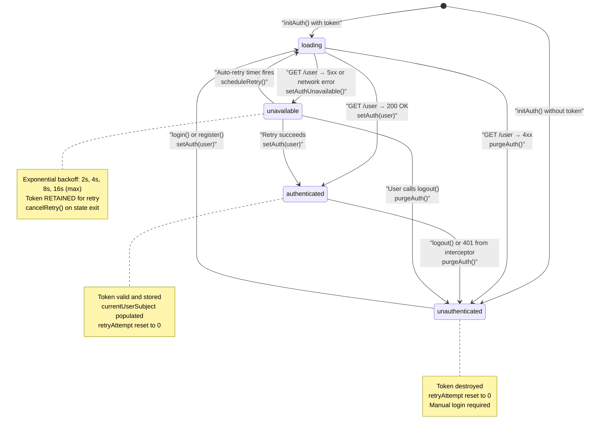
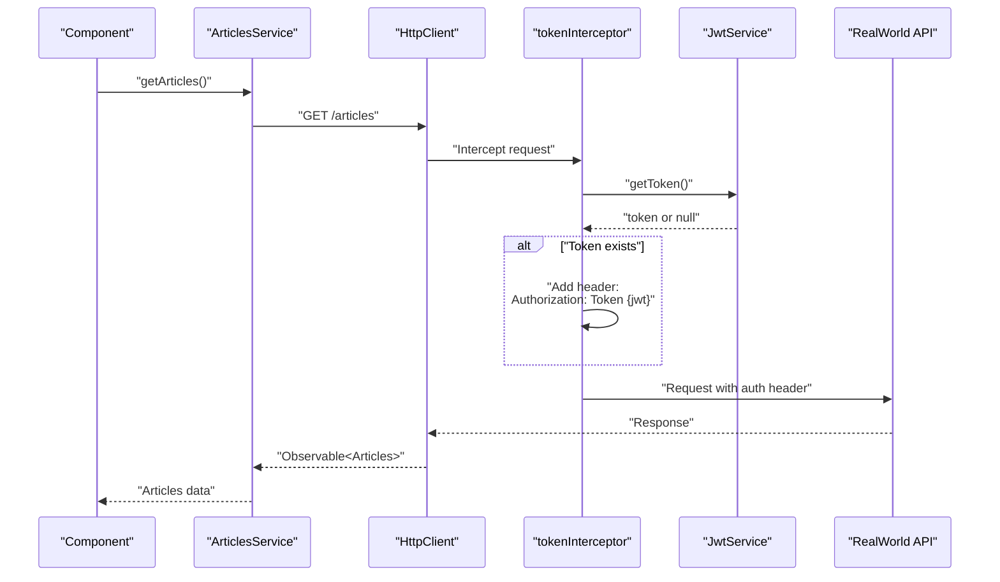
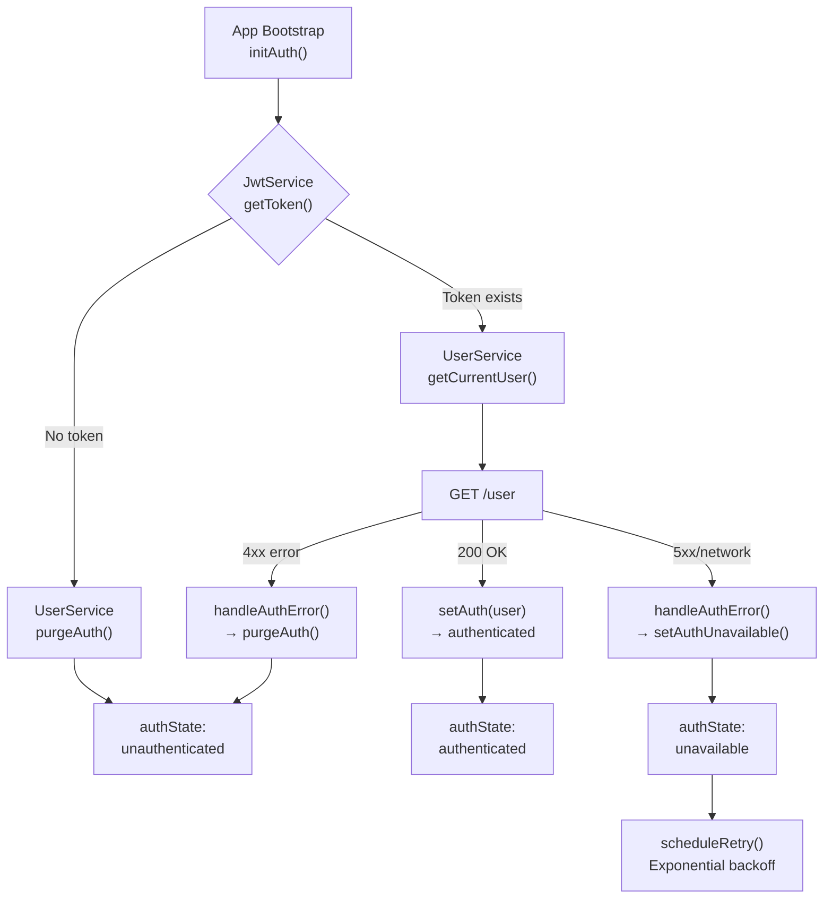
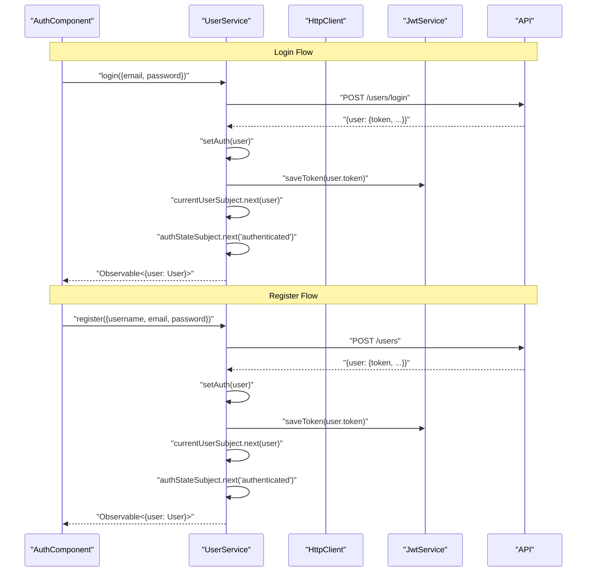
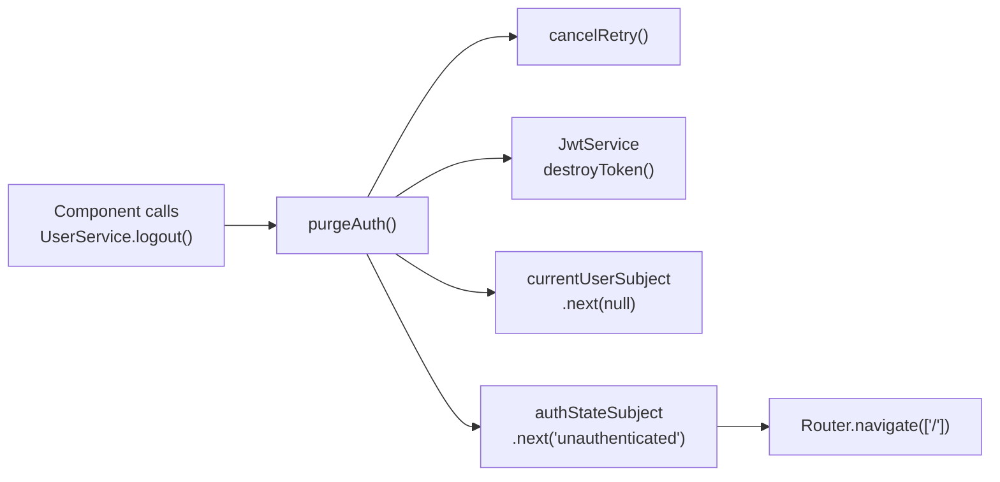
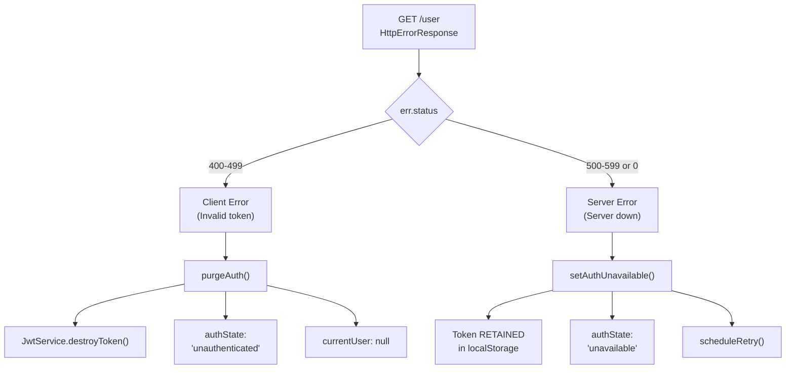
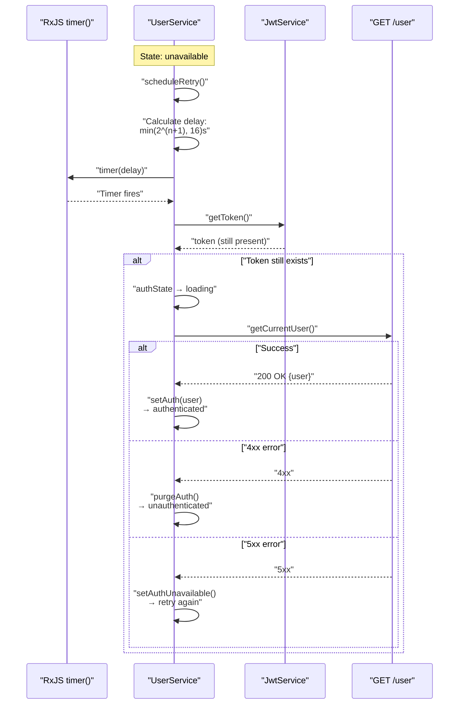
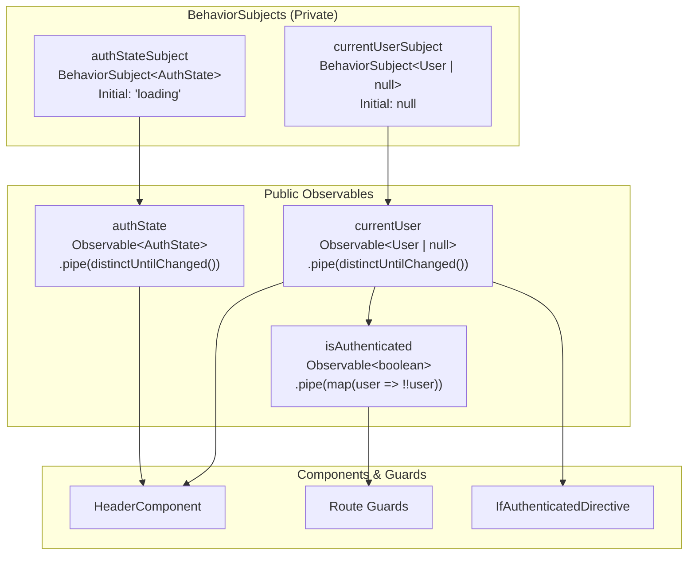
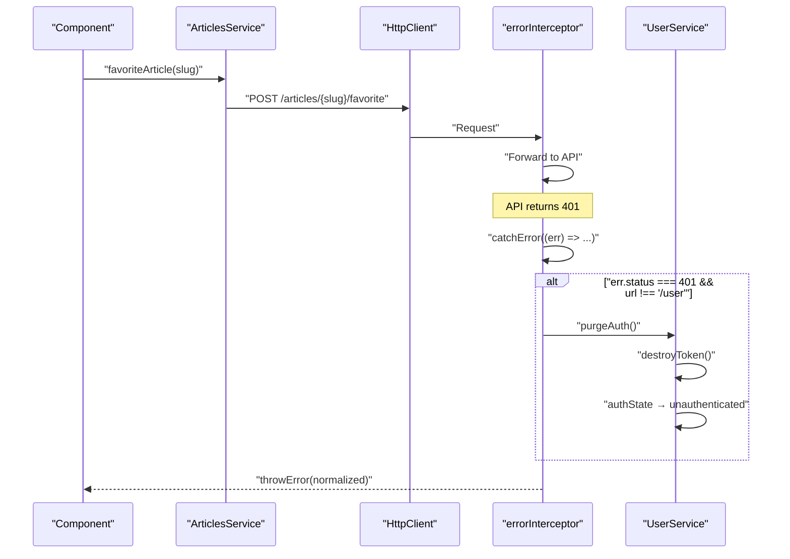

# Authentication System

<details>
<summary>Relevant source files</summary>

The following files were used as context for generating this wiki page:

- [LICENSE](../LICENSE)
- [README.md](../README.md)
- [e2e/settings.spec.ts](../e2e/settings.spec.ts)
- [src/app/app.component.ts](../src/app/app.component.ts)
- [src/app/app.config.ts](../src/app/app.config.ts)
- [src/app/core/auth/services/jwt.service.ts](../src/app/core/auth/services/jwt.service.ts)
- [src/app/core/auth/services/user.service.ts](../src/app/core/auth/services/user.service.ts)
- [src/app/core/interceptors/api.interceptor.ts](../src/app/core/interceptors/api.interceptor.ts)
- [src/app/core/interceptors/token.interceptor.ts](../src/app/core/interceptors/token.interceptor.ts)
- [src/app/core/layout/footer.component.html](../src/app/core/layout/footer.component.html)
- [src/app/core/layout/footer.component.ts](../src/app/core/layout/footer.component.ts)

</details>

## Purpose and Scope

This document describes the authentication system architecture, including authentication state management, JWT token storage, error handling strategies, and auto-retry logic. The authentication system is the foundation for user identity throughout the application.

For details on HTTP interceptors that integrate with authentication (token injection, error handling), see [HTTP Request Pipeline](3.2-http-request-pipeline.md). For application initialization logic that validates stored tokens on startup, see [Application Bootstrap & Configuration](3.1-application-bootstrap-and-configuration.md). For implementation details of the `UserService` and `JwtService` classes, see [UserService & Authentication State](4.1-userservice-and-authentication-state.md) and [JwtService & Token Storage](4.3-jwtservice-and-token-storage.md).

---

## Authentication State Machine

The authentication system implements a four-state machine that distinguishes between different failure scenarios.

### State Definitions

| State             | Description                              | Token Status | User Data | Retry Behavior          |
| ----------------- | ---------------------------------------- | ------------ | --------- | ----------------------- |
| `loading`         | Initial or retry state, validating token | Present      | `null`    | In progress             |
| `authenticated`   | Valid session, user logged in            | Present      | Available | N/A                     |
| `unauthenticated` | No valid session                         | Absent       | `null`    | Manual login required   |
| `unavailable`     | Server error, session uncertain          | Retained     | `null`    | Auto-retry with backoff |

**Sources:** `src/app/core/auth/services/user.service.ts:10`, `src/app/core/auth/services/user.service.ts:23-26`

### State Transition Diagram



**Sources:** `src/app/core/auth/services/user.service.ts:47-181`, `src/app/app.config.ts:46-67`

---

## Token Management

### JwtService

The `JwtService` provides a simple abstraction over `localStorage` for JWT token persistence.

| Method             | Description           | localStorage Key |
| ------------------ | --------------------- | ---------------- |
| `getToken()`       | Retrieve stored token | `jwtToken`       |
| `saveToken(token)` | Persist token         | `jwtToken`       |
| `destroyToken()`   | Remove token          | `jwtToken`       |

**Sources:** `src/app/core/auth/services/jwt.service.ts:1-16`

### Token Format

The API returns JWT tokens as part of the `User` object. The token is stored when:

- User successfully logs in via `POST /users/login`
- User successfully registers via `POST /users`
- User updates profile via `PUT /user`

The token is automatically injected into subsequent requests by the `tokenInterceptor`.

**Sources:** `src/app/core/auth/services/user.service.ts:74-82`, `src/app/core/interceptors/token.interceptor.ts:1-14`

### Token Injection Flow



**Sources:** `src/app/core/interceptors/token.interceptor.ts:5-14`, `src/app/core/auth/services/jwt.service.ts:5-7`

---

## Authentication Flows

### Initial Bootstrap (App Initialization)

The `initAuth()` function runs before the application renders, checking if a stored token is valid.



**Sources:** `src/app/app.config.ts:56-67`, `src/app/core/auth/services/user.service.ts:89-98`, `src/app/core/auth/services/user.service.ts:105-115`

### Login and Register Flows



**Sources:** `src/app/core/auth/services/user.service.ts:74-82`, `src/app/core/auth/services/user.service.ts:166-172`

### Logout Flow



**Sources:** `src/app/core/auth/services/user.service.ts:84-87`, `src/app/core/auth/services/user.service.ts:174-180`

---

## Error Handling Strategy

The authentication system implements sophisticated error handling that distinguishes between client errors (4xx) and server errors (5xx).

### Critical Distinction: 4xx vs 5xx

| Error Type                   | Meaning                                                  | Action                                     | Rationale                                      |
| ---------------------------- | -------------------------------------------------------- | ------------------------------------------ | ---------------------------------------------- |
| **4xx** (400-499)            | Client error: Invalid token, forbidden access, not found | `purgeAuth()` - Clear token, logout        | Token is invalid and will never work           |
| **5xx** (500-599)            | Server error: Internal server error, service unavailable | `setAuthUnavailable()` - Keep token, retry | Server is temporarily down, token may be valid |
| **Network error** (status 0) | Connection failed, CORS error, timeout                   | `setAuthUnavailable()` - Keep token, retry | Network issue, not an authentication problem   |

**Sources:** `src/app/core/auth/services/user.service.ts:28-45`, `src/app/core/auth/services/user.service.ts:105-115`

### Error Handling Implementation



**Sources:** `src/app/core/auth/services/user.service.ts:105-124`

---

## Auto-Retry Mechanism

When authentication enters the `unavailable` state, the system automatically attempts to reconnect with exponential backoff.

### Retry Logic

| Attempt | Delay        | Formula            |
| ------- | ------------ | ------------------ |
| 1       | 2s           | `2 * 2^0`          |
| 2       | 4s           | `2 * 2^1`          |
| 3       | 8s           | `2 * 2^2`          |
| 4+      | 16s (capped) | `min(2 * 2^n, 16)` |

**Sources:** `src/app/core/auth/services/user.service.ts:129-146`

### Retry State Management



**Sources:** `src/app/core/auth/services/user.service.ts:129-146`

### Retry Cancellation

Retries are cancelled when:

- Authentication succeeds: `setAuth()` calls `cancelRetry()`
- User logs out: `purgeAuth()` calls `cancelRetry()`
- New retry is scheduled: `scheduleRetry()` calls `cancelRetry()` first

**Sources:** `src/app/core/auth/services/user.service.ts:151-156`, `src/app/core/auth/services/user.service.ts:167`, `src/app/core/auth/services/user.service.ts:175`

---

## Observable Streams

The `UserService` exposes three primary observables for reactive state management.

### Observable Architecture



**Sources:** `src/app/core/auth/services/user.service.ts:49-55`

### Observable Properties

| Observable        | Type                       | Purpose                              | Distinct Values                        |
| ----------------- | -------------------------- | ------------------------------------ | -------------------------------------- |
| `currentUser`     | `Observable<User \| null>` | Reactive access to current user data | Emits on login, logout, profile update |
| `authState`       | `Observable<AuthState>`    | Reactive access to auth state        | Emits on state transitions only        |
| `isAuthenticated` | `Observable<boolean>`      | Simplified boolean check             | Derived from `currentUser`             |

**Synchronous access:** `getCurrentUserSync()` returns the current cached user value without subscribing to an observable.

**Sources:** `src/app/core/auth/services/user.service.ts:49-63`

---

## Integration with HTTP Pipeline

### Global 401 Handling

The `errorInterceptor` integrates with authentication by calling `purgeAuth()` on 401 responses from non-`/user` endpoints. This handles "token expired mid-session" scenarios.



**Note:** 401 errors on `GET /user` are handled directly in `UserService.handleAuthError()`, not by the interceptor, to avoid double-handling.

**Sources:** `src/app/core/auth/services/user.service.ts:44-45`, `src/app/core/interceptors/error.interceptor.ts` (referenced but not provided)

---

## Debug Interface

The application exposes a `__conduit_debug__` interface on the global `window` object for testing purposes.

### ConduitDebug Interface

```typescript
interface ConduitDebug {
  getToken: () => string | null;
  getAuthState: () => AuthState;
  getCurrentUser: () => User | null;
}
```

### Usage in Tests

E2E tests use this interface to inspect authentication state without relying on implementation details:

```typescript
// Get current auth state
const authState = await page.evaluate(() => window.__conduit_debug__?.getAuthState());

// Verify token is present
const token = await page.evaluate(() => window.__conduit_debug__?.getToken());
expect(token).not.toBeNull();
```

**Sources:** `src/app/app.config.ts:14-28`, `src/app/app.config.ts:33-45`, `e2e/settings.spec.ts:3`, `e2e/settings.spec.ts:48-55`

---

## Key Implementation Files

| File                                             | Purpose                                                                  |
| ------------------------------------------------ | ------------------------------------------------------------------------ |
| `src/app/core/auth/services/user.service.ts`     | Core authentication logic, state machine, error handling, auto-retry     |
| `src/app/core/auth/services/jwt.service.ts`      | Token persistence abstraction over `localStorage`                        |
| `src/app/core/interceptors/token.interceptor.ts` | Automatic JWT injection into HTTP requests                               |
| `src/app/app.config.ts`                          | Application initialization, `initAuth()` function, debug interface setup |

**Sources:** `src/app/core/auth/services/user.service.ts:1-181`, `src/app/core/auth/services/jwt.service.ts:1-16`, `src/app/core/interceptors/token.interceptor.ts:1-14`, `src/app/app.config.ts:1-80`

---

---

[← Back to documentation index](README.md)
