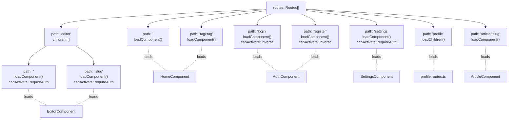
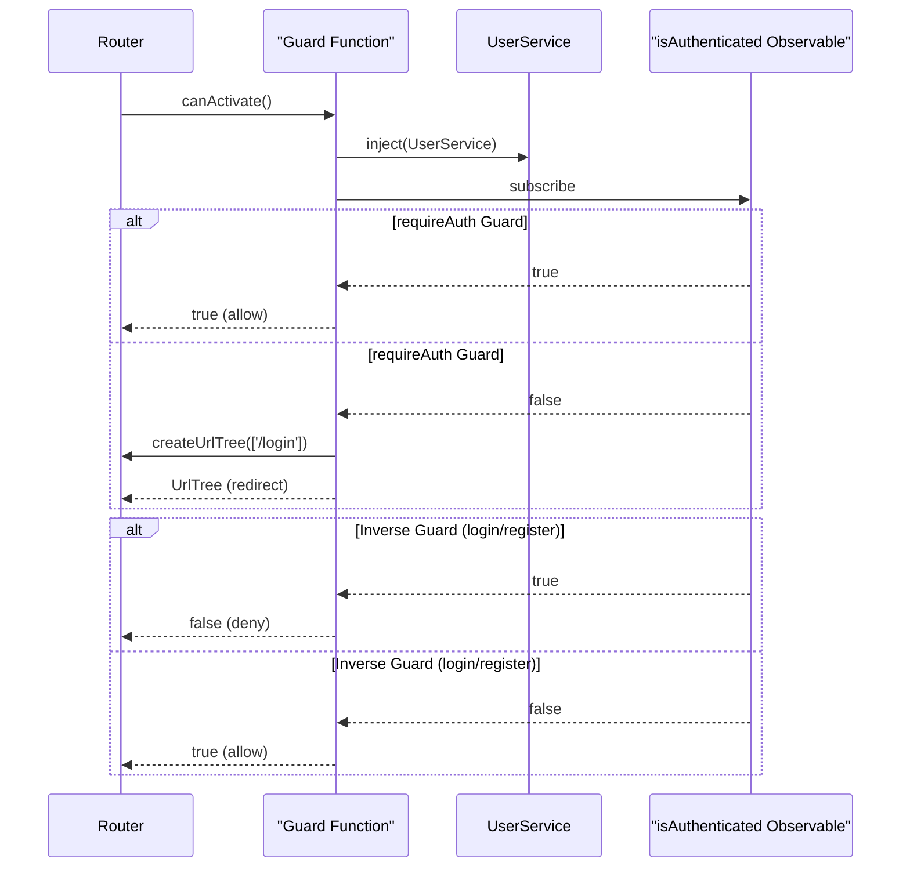
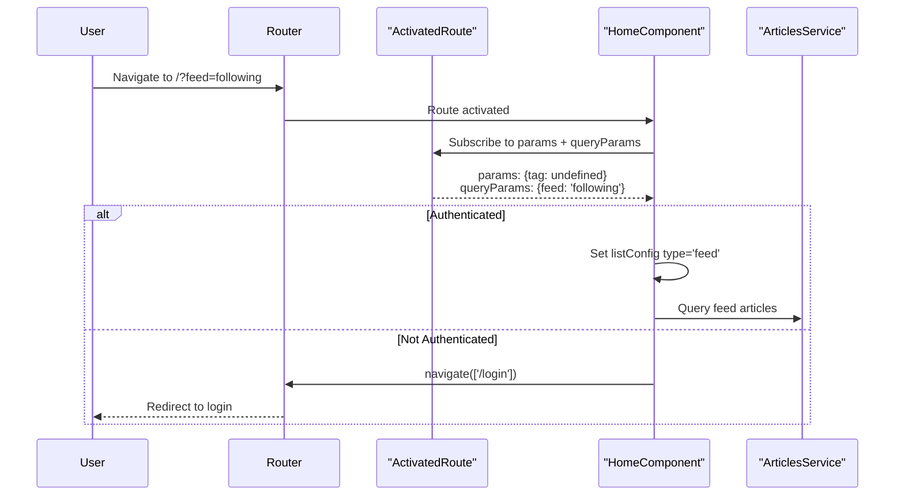
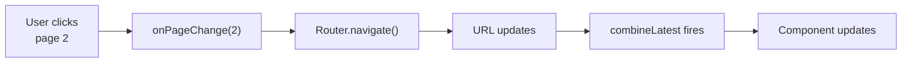
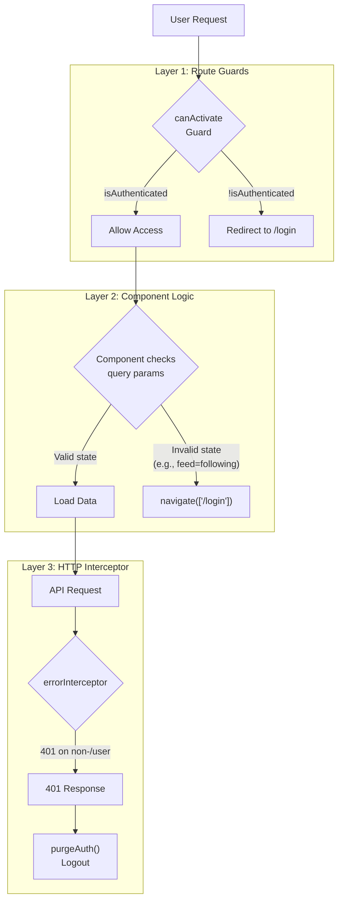

# Routing System

<details>
<summary>Relevant source files</summary>

The following files were used as context for generating this wiki page:

- [e2e/url-navigation.spec.ts](../e2e/url-navigation.spec.ts)
- [src/app/app.routes.ts](../src/app/app.routes.ts)
- [src/app/core/interceptors/error.interceptor.ts](../src/app/core/interceptors/error.interceptor.ts)
- [src/app/features/article/pages/editor/editor.component.html](../src/app/features/article/pages/editor/editor.component.html)
- [src/app/features/article/pages/home/home.component.html](../src/app/features/article/pages/home/home.component.html)
- [src/app/features/article/pages/home/home.component.ts](../src/app/features/article/pages/home/home.component.ts)

</details>

## Purpose and Scope

This document explains the routing configuration, lazy loading strategy, authentication guards, and URL-based navigation patterns used in the Angular RealWorld application. The routing system defines how users navigate between pages, how components load on-demand, and how authentication state controls access to protected routes.

For information about authentication state management beyond route guards, see [Authentication System](3.3-authentication-system.md). For details on HTTP interceptors that handle authentication errors and redirects, see [HTTP Request Pipeline](3.2-http-request-pipeline.md).

**Sources:** `src/app/app.routes.ts:1-62`

---

## Route Configuration Overview

The application uses Angular's standalone component routing with functional guards. All routes are defined in `src/app/app.routes.ts:14-61`, which exports a `Routes` array consumed by the application configuration.

### Complete Route Table

| Path             | Component           | Guard         | Purpose                                    |
| ---------------- | ------------------- | ------------- | ------------------------------------------ |
| `/`              | `HomeComponent`     | None          | Global feed (public)                       |
| `/tag/:tag`      | `HomeComponent`     | None          | Tag-filtered feed (public)                 |
| `/login`         | `AuthComponent`     | Inverse auth  | Login form (unauthenticated only)          |
| `/register`      | `AuthComponent`     | Inverse auth  | Registration form (unauthenticated only)   |
| `/settings`      | `SettingsComponent` | `requireAuth` | User settings (authenticated only)         |
| `/profile/*`     | Profile routes      | Varies        | User profile pages (lazy-loaded children)  |
| `/editor`        | `EditorComponent`   | `requireAuth` | Create new article (authenticated only)    |
| `/editor/:slug`  | `EditorComponent`   | `requireAuth` | Edit existing article (authenticated only) |
| `/article/:slug` | `ArticleComponent`  | None          | Article detail view (public)               |

**Sources:** `src/app/app.routes.ts:14-61`

---

## Route Structure and Lazy Loading

The routing system uses modern Angular features for optimal performance:



### Lazy Loading Implementation

All components use `loadComponent` for on-demand loading:

```typescript
loadComponent: () => import('./features/article/pages/home/home.component');
```

The profile feature uses child route lazy loading with `loadChildren`:

```typescript
loadChildren: () => import('./features/profile/profile.routes');
```

This pattern ensures code splitting and optimal bundle sizes by only loading component code when the route is accessed.

**Sources:** `src/app/app.routes.ts:16-61`

---

## Authentication Guards

The routing system uses two types of functional guards to control access based on authentication state.

### Guard Functions Diagram



### `requireAuth` Guard

Protects routes that require authentication. Redirects unauthenticated users to `/login`:

```typescript
const requireAuth = () => {
  const router = inject(Router);
  return inject(UserService).isAuthenticated.pipe(map(isAuth => isAuth || router.createUrlTree(['/login'])));
};
```

**Applied to:**

- `/settings` - User settings page
- `/editor` - Article creation
- `/editor/:slug` - Article editing

`src/app/app.routes.ts:9-12`

### Inverse Authentication Guard

Prevents authenticated users from accessing login/register pages:

```typescript
canActivate: [() => inject(UserService).isAuthenticated.pipe(map(isAuth => !isAuth))];
```

This guard returns `false` if the user is authenticated, preventing authenticated users from seeing login forms.

**Applied to:**

- `/login` - Login page
- `/register` - Registration page

`src/app/app.routes.ts:26`, `src/app/app.routes.ts:31`

**Sources:** `src/app/app.routes.ts:9-12`, `src/app/app.routes.ts:24-32`, `src/app/app.routes.ts:36`, `src/app/app.routes.ts:48`, `src/app/app.routes.ts:52`

---

## Route Parameters and Query Parameters

The routing system uses both route parameters (path segments) and query parameters (URL search params) for navigation state.

### Route Parameters

| Parameter   | Routes                                | Purpose                   | Example                             |
| ----------- | ------------------------------------- | ------------------------- | ----------------------------------- |
| `:tag`      | `/tag/:tag`                           | Filter articles by tag    | `/tag/angular`                      |
| `:slug`     | `/article/:slug`, `/editor/:slug`     | Identify specific article | `/article/how-to-train-your-dragon` |
| `:username` | `/profile/:username/*` (child routes) | Identify user profile     | `/profile/jake`                     |

### Query Parameters

| Parameter | Routes          | Purpose                                  | Example            |
| --------- | --------------- | ---------------------------------------- | ------------------ |
| `feed`    | `/`             | Switch between Global Feed and Your Feed | `/?feed=following` |
| `page`    | All feed routes | Pagination                               | `/?page=2`         |

### Query Parameter Combinations

The routing system preserves query parameters across navigation:

| URL                       | Feed Type   | Page | Notes                      |
| ------------------------- | ----------- | ---- | -------------------------- |
| `/`                       | Global Feed | 1    | Default                    |
| `/?feed=following`        | Your Feed   | 1    | Requires authentication    |
| `/?page=2`                | Global Feed | 2    | Global Feed, page 2        |
| `/?feed=following&page=2` | Your Feed   | 2    | Your Feed, page 2          |
| `/tag/angular?page=2`     | Tag Filter  | 2    | Tag filter with pagination |

**Sources:** `src/app/app.routes.ts:20-22`, `src/app/app.routes.ts:51-53`, `src/app/app.routes.ts:58-60`, `e2e/url-navigation.spec.ts:21-35`, `e2e/url-navigation.spec.ts:109-147`

---

## URL-Based Navigation Pattern

The application implements URL-based navigation where all navigation state is encoded in the URL, making URLs shareable and bookmarkable.

### Navigation Flow



### HomeComponent URL Handling

The `HomeComponent` demonstrates the URL-based navigation pattern by subscribing to both route parameters and query parameters:

```typescript
combineLatest([this.userService.isAuthenticated, this.route.params, this.route.queryParams]).subscribe(
  ([isAuthenticated, params, queryParams]) => {
    const tag = params['tag'];
    const feed = queryParams['feed'];
    const page = queryParams['page'] ? parseInt(queryParams['page'], 10) : 1;

    // Determine feed type from URL
    if (tag) {
      type = 'all';
      filters = { tag };
    } else if (feed === 'following') {
      type = 'feed';
    } else {
      type = 'all';
    }
  },
);
```

`src/app/features/article/pages/home/home.component.ts:42-72`

### Protected Query Parameter Handling

The component enforces authentication requirements for the `feed=following` query parameter:

```typescript
if (feed === 'following' && !isAuthenticated) {
  void this.router.navigate(['/login']);
  return;
}
```

`src/app/features/article/pages/home/home.component.ts:51-55`

This ensures that accessing `/?feed=following` while unauthenticated triggers a redirect to `/login`, as verified by the E2E test:

```typescript
test('/?feed=following should redirect to /login when not authenticated', async ({ page }) => {
  await page.goto('/?feed=following');
  await expect(page).toHaveURL('/login');
});
```

`e2e/url-navigation.spec.ts:31-35`

### Tab Link Configuration

Navigation tabs use `routerLink` and `queryParams` to construct proper URLs:

```html
<!-- Your Feed tab -->
<a class="nav-link" routerLink="/" [queryParams]="{ feed: 'following' }"> Your Feed </a>

<!-- Global Feed tab -->
<a class="nav-link" routerLink="/"> Global Feed </a>
```

`src/app/features/article/pages/home/home.component.html:15-33`

This generates proper `href` attributes that enable browser history navigation:

- Your Feed: `href="/?feed=following"`
- Global Feed: `href="/"`

`e2e/url-navigation.spec.ts:50-61`

**Sources:** `src/app/features/article/pages/home/home.component.ts:41-73`, `src/app/features/article/pages/home/home.component.html:15-33`, `e2e/url-navigation.spec.ts:11-100`

---

## Pagination and URL State

Pagination state is maintained through the `page` query parameter, which is preserved across feed switches and tag filters.

### Pagination URL Updates



### Page Change Handler

The `onPageChange` method constructs query parameters that preserve existing state:

```typescript
onPageChange(page: number): void {
  const queryParams: { page?: number; feed?: string } = {};

  // Preserve feed param if present
  const currentFeed = this.route.snapshot.queryParams['feed'];
  if (currentFeed) {
    queryParams.feed = currentFeed;
  }

  // Only add page param if not page 1
  if (page > 1) {
    queryParams.page = page;
  }

  void this.router.navigate([], {
    relativeTo: this.route,
    queryParams,
  });
}
```

`src/app/features/article/pages/home/home.component.ts:75-93`

### Pagination URL Examples

| Current URL           | User Action         | Resulting URL                    |
| --------------------- | ------------------- | -------------------------------- |
| `/`                   | Click page 2        | `/?page=2`                       |
| `/?feed=following`    | Click page 2        | `/?feed=following&page=2`        |
| `/tag/angular`        | Click page 2        | `/tag/angular?page=2`            |
| `/?page=2`            | Click "Your Feed"   | `/?feed=following` (page resets) |
| `/tag/angular?page=2` | Click "Global Feed" | `/` (page resets)                |

Page numbers are reset when switching feeds or tags, as verified by E2E tests:

```typescript
test('page should reset when switching feeds', async ({ page }) => {
  // On tag page 2
  await page.goto(`/tag/${uniqueTag}?page=2`);

  // Click Global Feed
  await page.click('.nav-link:has-text("Global Feed")');

  // URL resets to root (no page param)
  await expect(page).toHaveURL('/');
});
```

`e2e/url-navigation.spec.ts:191-212`

**Sources:** `src/app/features/article/pages/home/home.component.ts:75-93`, `e2e/url-navigation.spec.ts:103-245`

---

## Route Protection Strategy

The routing system implements a defense-in-depth approach to route protection:

### Multi-Layer Protection



### Protection Layers

**Layer 1: Route Guards** (`src/app/app.routes.ts:9-12`, `src/app/app.routes.ts:36`, `src/app/app.routes.ts:48`, `src/app/app.routes.ts:52`)

- Block access at routing level
- Redirect to `/login` before component loads
- Applied to `/settings`, `/editor`, `/editor/:slug`

**Layer 2: Component Logic** (`src/app/features/article/pages/home/home.component.ts:51-55`)

- Validates query parameter combinations
- Handles `/?feed=following` without authentication
- Provides fine-grained control beyond route-level guards

**Layer 3: HTTP Interceptor** (`src/app/core/interceptors/error.interceptor.ts:40-42`)

- Catches 401 responses during API calls
- Triggers `purgeAuth()` to clear authentication state
- Handles token expiration mid-session

### Public vs Protected Routes

| Route Category          | Authentication Required | Guard Type      | Examples                           |
| ----------------------- | ----------------------- | --------------- | ---------------------------------- |
| Public                  | No                      | None            | `/`, `/tag/:tag`, `/article/:slug` |
| Protected               | Yes                     | `requireAuth`   | `/settings`, `/editor`             |
| Inverse Protected       | No (must be logged out) | Inverse auth    | `/login`, `/register`              |
| Conditionally Protected | Depends on query params | Component logic | `/?feed=following`                 |

**Sources:** `src/app/app.routes.ts:9-12`, `src/app/app.routes.ts:24-32`, `src/app/app.routes.ts:34-56`, `src/app/features/article/pages/home/home.component.ts:51-55`, `src/app/core/interceptors/error.interceptor.ts:40-42`, `e2e/url-navigation.spec.ts:31-35`

---

---

[← Back to documentation index](README.md)
