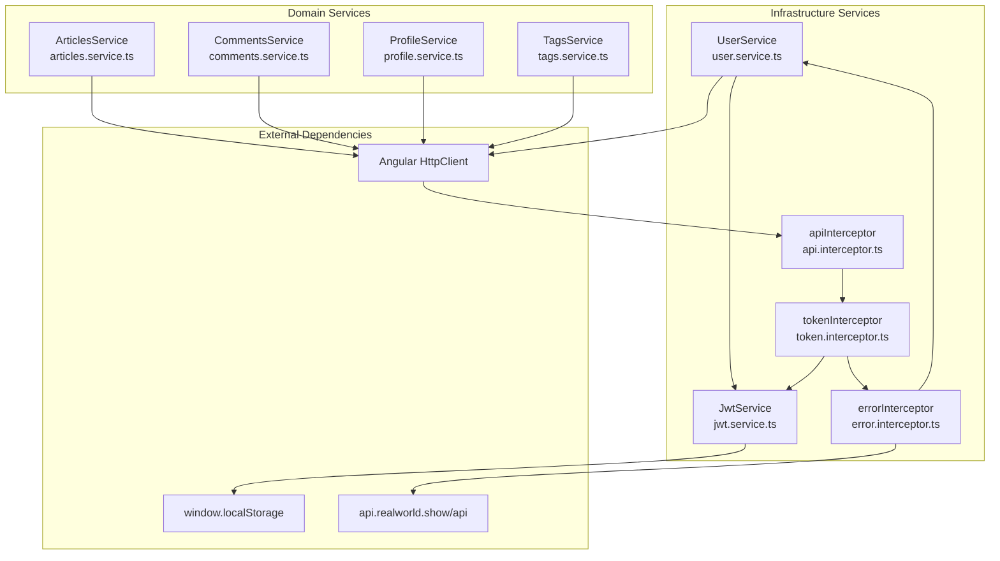
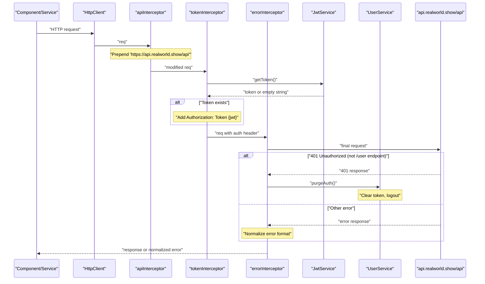
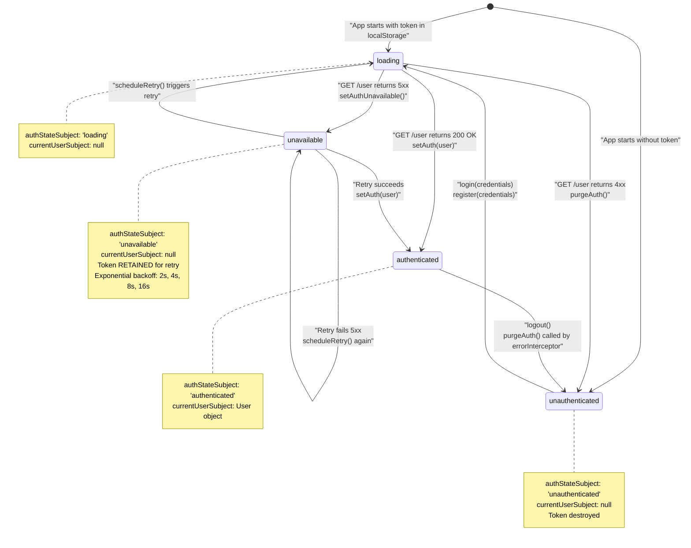
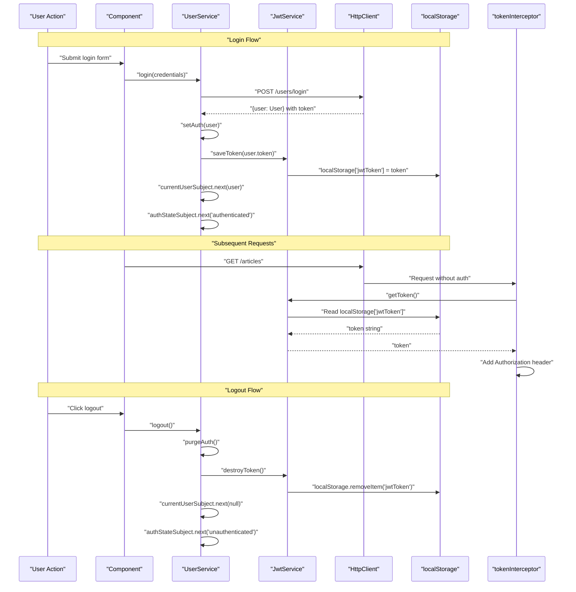
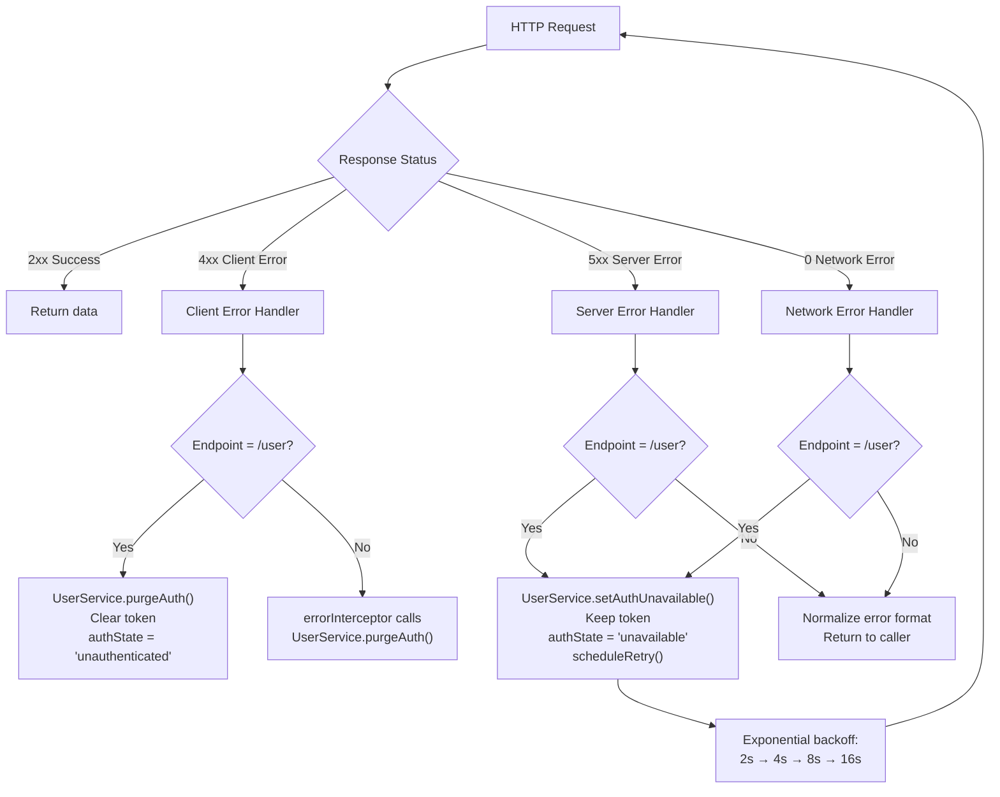

# Core Services

<details>
<summary>Relevant source files</summary>

The following files were used as context for generating this wiki page:

- [LICENSE](../LICENSE)
- [README.md](../README.md)
- [e2e/settings.spec.ts](../e2e/settings.spec.ts)
- [src/app/core/auth/services/jwt.service.ts](../src/app/core/auth/services/jwt.service.ts)
- [src/app/core/auth/services/user.service.ts](../src/app/core/auth/services/user.service.ts)
- [src/app/core/interceptors/api.interceptor.ts](../src/app/core/interceptors/api.interceptor.ts)
- [src/app/core/interceptors/token.interceptor.ts](../src/app/core/interceptors/token.interceptor.ts)
- [src/app/core/layout/footer.component.html](../src/app/core/layout/footer.component.html)
- [src/app/core/layout/footer.component.ts](../src/app/core/layout/footer.component.ts)

</details>

## Purpose and Scope

Core Services provide cross-cutting infrastructure functionality that is used throughout the application. These services handle authentication state management, HTTP communication, token storage, and API interactions. They form the foundation layer that all feature modules depend on.

This page provides an overview of the core services architecture and how they interact. For detailed documentation:

- Authentication state management and error handling: see [UserService & Authentication State](4.1-userservice-and-authentication-state.md)
- HTTP interceptor chain implementation: see [HTTP Interceptors](4.2-http-interceptors.md)
- Token persistence and lifecycle: see [JwtService & Token Storage](4.3-jwtservice-and-token-storage.md)
- API services for articles, comments, profiles, and tags: see [Domain Services](4.4-domain-services-articles-comments-profile-tags.md)

---

## Service Categories

Core services are organized into two categories:

### Infrastructure Services

| Service            | Location                                         | Responsibility                                           |
| ------------------ | ------------------------------------------------ | -------------------------------------------------------- |
| `UserService`      | `src/app/core/auth/services/user.service.ts`     | Authentication state management, user profile operations |
| `JwtService`       | `src/app/core/auth/services/jwt.service.ts`      | JWT token persistence in `localStorage`                  |
| `apiInterceptor`   | `src/app/core/interceptors/api.interceptor.ts`   | Prepend base URL to all HTTP requests                    |
| `tokenInterceptor` | `src/app/core/interceptors/token.interceptor.ts` | Inject JWT token into request headers                    |
| `errorInterceptor` | Referenced in diagrams                           | Normalize errors and handle 401 responses                |

### Domain Services

| Service           | Purpose                                                  |
| ----------------- | -------------------------------------------------------- |
| `ArticlesService` | Article CRUD operations, favorites, queries with filters |
| `CommentsService` | Comment creation, deletion, and retrieval                |
| `ProfileService`  | User profile retrieval, follow/unfollow operations       |
| `TagsService`     | Retrieve available article tags                          |

Domain services are documented in detail in [Domain Services](4.4-domain-services-articles-comments-profile-tags.md).

**Sources:** `src/app/core/auth/services/user.service.ts:1-181`, `src/app/core/auth/services/jwt.service.ts:1-16`, `src/app/core/interceptors/api.interceptor.ts:1-6`, `src/app/core/interceptors/token.interceptor.ts:1-14`

---

## Core Services Architecture

The following diagram maps core services to their file locations and responsibilities:



**Sources:** `src/app/core/auth/services/user.service.ts:1-10`, `src/app/core/auth/services/jwt.service.ts:1-4`, `src/app/core/interceptors/api.interceptor.ts:1-6`, `src/app/core/interceptors/token.interceptor.ts:1-14`

---

## HTTP Request Pipeline

Every HTTP request flows through the interceptor chain in this order:



### Interceptor Responsibilities

**`apiInterceptor`** `src/app/core/interceptors/api.interceptor.ts:3-5`

- Prepends `https://api.realworld.show/api` to all request URLs
- Enables relative URLs throughout the application (e.g., `/user`, `/articles`)

**`tokenInterceptor`** `src/app/core/interceptors/token.interceptor.ts:5-13`

- Retrieves JWT token from `JwtService`
- Adds `Authorization: Token {jwt}` header if token exists
- Uses functional interceptor pattern with `inject(JwtService)`

**`errorInterceptor`** (referenced in system diagrams)

- Normalizes error response formats
- Handles 401 responses by calling `UserService.purgeAuth()` (except for `/user` endpoint)
- Distinguishes between client errors (4xx) and server errors (5xx)

**Sources:** `src/app/core/interceptors/api.interceptor.ts:1-6`, `src/app/core/interceptors/token.interceptor.ts:1-14`

---

## Authentication State Management

The `UserService` manages authentication state through RxJS observables:



### Observable Streams

The `UserService` exposes three main observables:

| Observable        | Type                       | Purpose                                                                                          |
| ----------------- | -------------------------- | ------------------------------------------------------------------------------------------------ |
| `currentUser`     | `Observable<User \| null>` | Current user object or null                                                                      |
| `authState`       | `Observable<AuthState>`    | Authentication state: `'loading'` \| `'authenticated'` \| `'unauthenticated'` \| `'unavailable'` |
| `isAuthenticated` | `Observable<boolean>`      | Derived from `currentUser`                                                                       |

**Implementation details:**

```typescript
// From user.service.ts:49-55
private currentUserSubject = new BehaviorSubject<User | null>(null);
public currentUser = this.currentUserSubject.asObservable().pipe(distinctUntilChanged());

private authStateSubject = new BehaviorSubject<AuthState>('loading');
public authState = this.authStateSubject.asObservable().pipe(distinctUntilChanged());

public isAuthenticated = this.currentUser.pipe(map(user => !!user));
```

**Sources:** `src/app/core/auth/services/user.service.ts:10-10`, `src/app/core/auth/services/user.service.ts:49-55`, `src/app/core/auth/services/user.service.ts:100-180`

---

## Token Management Flow

The collaboration between `UserService` and `JwtService`:



### JwtService Methods

The `JwtService` provides a simple abstraction over `localStorage`:

| Method             | Implementation                                    | Purpose                                        |
| ------------------ | ------------------------------------------------- | ---------------------------------------------- |
| `getToken()`       | `src/app/core/auth/services/jwt.service.ts:5-7`   | Returns `window.localStorage['jwtToken']`      |
| `saveToken(token)` | `src/app/core/auth/services/jwt.service.ts:9-11`  | Sets `window.localStorage['jwtToken'] = token` |
| `destroyToken()`   | `src/app/core/auth/services/jwt.service.ts:13-15` | Removes `jwtToken` from `localStorage`         |

**Sources:** `src/app/core/auth/services/jwt.service.ts:1-16`, `src/app/core/auth/services/user.service.ts:166-180`, `src/app/core/interceptors/token.interceptor.ts:5-13`

---

## Error Handling Strategy

Core services distinguish between different error types:



### Error Handling Rules

**For `/user` endpoint** (handled by `UserService.handleAuthError()`):

- **4xx errors:** Token is invalid → `purgeAuth()` → logout user
- **5xx/network errors:** Server unavailable → `setAuthUnavailable()` → keep token and retry

**For other endpoints** (handled by `errorInterceptor`):

- **401 Unauthorized:** Call `UserService.purgeAuth()` → logout user
- **Other errors:** Normalize error format and return to caller

**Retry Logic** `src/app/core/auth/services/user.service.ts:129-146`:

- Exponential backoff: 2s, 4s, 8s, 16s (capped at 16 seconds)
- Continues retrying indefinitely while token exists
- Canceled when `setAuth()` succeeds or `purgeAuth()` is called

**Sources:** `src/app/core/auth/services/user.service.ts:100-156`

---

## Service Dependency Injection

All core services use Angular's `providedIn: 'root'` for tree-shakeable singleton instances:

```typescript
// user.service.ts:47
@Injectable({ providedIn: 'root' })
export class UserService { ... }

// jwt.service.ts:3
@Injectable({ providedIn: 'root' })
export class JwtService { ... }
```

This ensures:

- Single instance across the entire application
- Automatic registration in the root injector
- Tree-shaking if service is never imported
- No need for module-level providers

**Functional Interceptors** use the `inject()` function:

```typescript
// token.interceptor.ts:5-6
export const tokenInterceptor: HttpInterceptorFn = (req, next) => {
  const token = inject(JwtService).getToken();
  // ...
};
```

This is the modern Angular standalone API pattern, replacing class-based interceptors.

**Sources:** `src/app/core/auth/services/user.service.ts:47-47`, `src/app/core/auth/services/jwt.service.ts:3-3`, `src/app/core/interceptors/token.interceptor.ts:5-6`

---

## Key Design Patterns

### Separation of Concerns

| Layer          | Responsibility                | Example                             |
| -------------- | ----------------------------- | ----------------------------------- |
| Infrastructure | Token storage, HTTP pipeline  | `JwtService`, interceptors          |
| Authentication | State management, retry logic | `UserService`                       |
| Domain         | Business operations           | `ArticlesService`, `ProfileService` |
| Presentation   | UI and user interaction       | Components                          |

### Observable-Based State Management

Core services use RxJS `BehaviorSubject` to manage state:

- **Benefits:** Synchronous access via `.getValue()`, reactive streams, distinctUntilChanged filtering
- **Pattern:** Private subject, public observable
- **Used in:** `UserService.currentUserSubject`, `UserService.authStateSubject`

### Interceptor Chain Pattern

HTTP interceptors form a middleware pipeline:

1. Each interceptor can modify the request
2. Each interceptor can observe/modify the response
3. Order matters: `apiInterceptor` → `tokenInterceptor` → `errorInterceptor`
4. Registered in `app.config.ts` via `provideHttpClient(withInterceptors([...]))`

**Sources:** `src/app/core/auth/services/user.service.ts:49-55`

---

## Testing Considerations

Core services are unit tested with:

- **`HttpClientTestingModule`**: Mock HTTP requests/responses
- **`TestBed`**: Angular dependency injection in tests
- **Service mocks**: Replace dependencies in component tests

Example test structure for services:

```typescript
beforeEach(() => {
  TestBed.configureTestingModule({
    providers: [UserService, JwtService],
  });
  httpMock = TestBed.inject(HttpTestingController);
  service = TestBed.inject(UserService);
});
```

See [Unit Testing with Vitest](7.1-unit-testing-with-vitest.md) for complete testing patterns.

**Sources:** General testing patterns from system diagrams

---

---

[← Back to documentation index](README.md)
