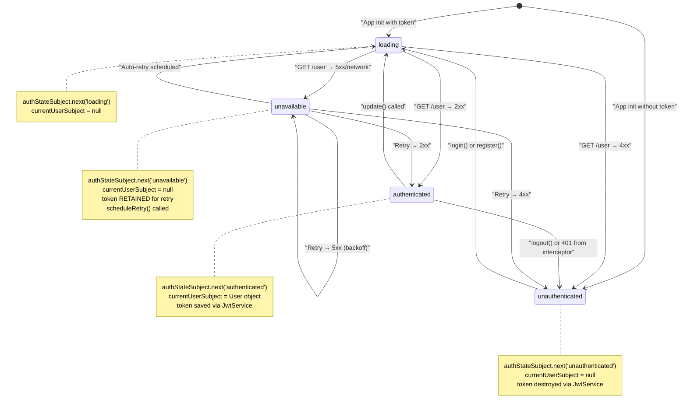
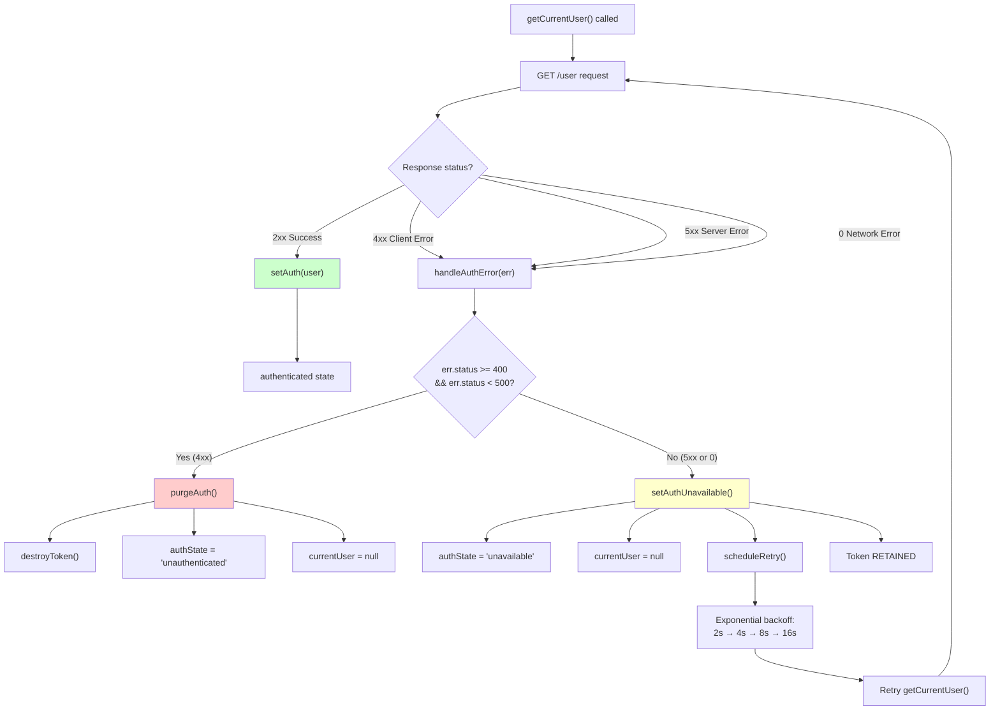
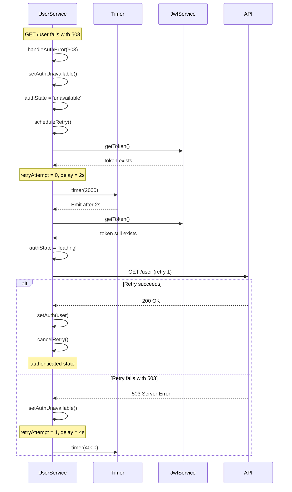
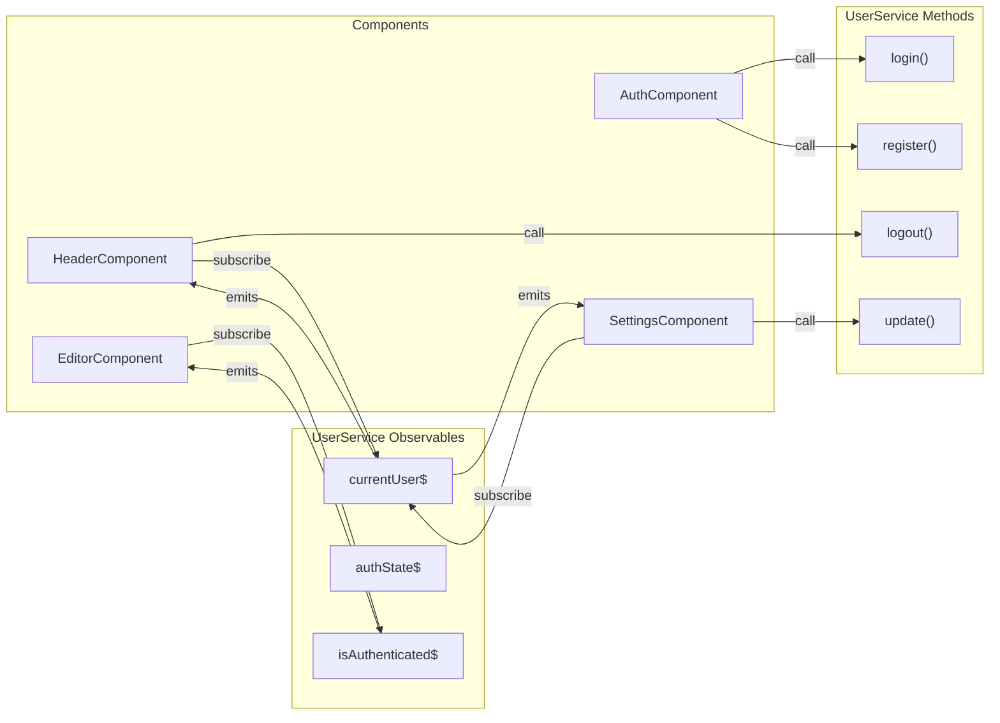
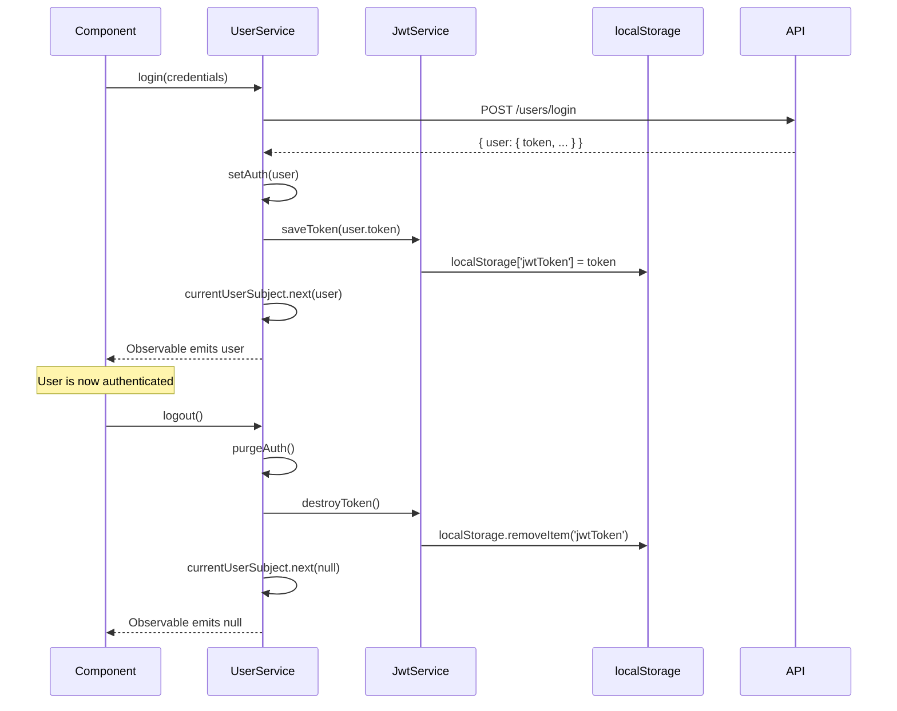
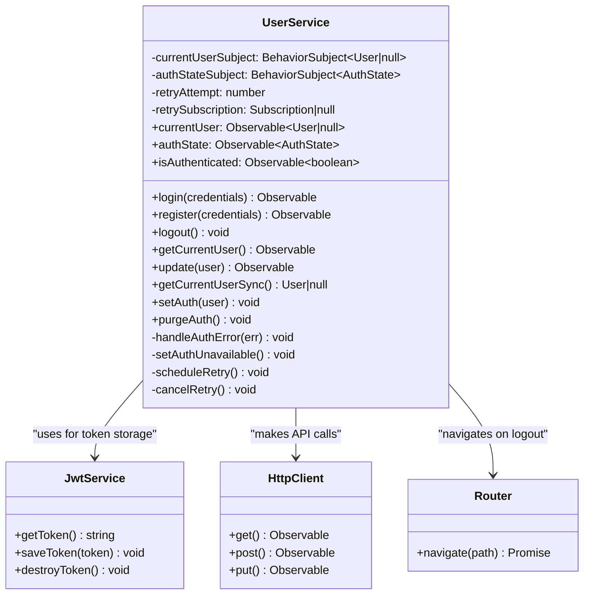

# UserService & Authentication State

<details>
<summary>Relevant source files</summary>

The following files were used as context for generating this wiki page:

- [e2e/settings.spec.ts](../e2e/settings.spec.ts)
- [src/app/core/auth/services/jwt.service.spec.ts](../src/app/core/auth/services/jwt.service.spec.ts)
- [src/app/core/auth/services/jwt.service.ts](../src/app/core/auth/services/jwt.service.ts)
- [src/app/core/auth/services/user.service.spec.ts](../src/app/core/auth/services/user.service.spec.ts)
- [src/app/core/auth/services/user.service.ts](../src/app/core/auth/services/user.service.ts)
- [src/app/features/article/services/articles.service.spec.ts](../src/app/features/article/services/articles.service.spec.ts)
- [src/app/features/article/services/comments.service.spec.ts](../src/app/features/article/services/comments.service.spec.ts)
- [src/app/features/article/services/tags.service.spec.ts](../src/app/features/article/services/tags.service.spec.ts)
- [src/app/features/profile/services/profile.service.spec.ts](../src/app/features/profile/services/profile.service.spec.ts)
- [src/test-setup.ts](../src/test-setup.ts)
- [vitest.config.ts](../vitest.config.ts)

</details>

## Purpose and Scope

This page documents the `UserService` class, which manages authentication state and user data throughout the application. `UserService` is the central authority for tracking whether a user is logged in, handling authentication workflows (login, register, logout), and managing user profile data. It exposes reactive streams that components subscribe to for authentication-aware rendering and implements sophisticated error handling with automatic retry logic for transient server failures.

**Related Pages:**

- For JWT token storage implementation, see [JwtService & Token Storage](4.3-jwtservice-and-token-storage.md)
- For HTTP interceptor integration with authentication, see [HTTP Interceptors](4.2-http-interceptors.md)
- For high-level authentication architecture and initialization, see [Authentication System](3.3-authentication-system.md)

---

## Overview

`UserService` is provided at the root level and serves as a singleton that maintains the global authentication state. It uses RxJS `BehaviorSubject`s to emit state changes, allowing any component to reactively respond to authentication events. The service distinguishes between four authentication states and handles API errors intelligently, preserving tokens during temporary server outages while clearing them for genuine authentication failures.

**Sources:** `src/app/core/auth/services/user.service.ts:1-181`

---

## Authentication States

`UserService` tracks authentication using the `AuthState` type, which has four possible values:

| State               | Description                        | Token Status       | User Data |
| ------------------- | ---------------------------------- | ------------------ | --------- |
| `'loading'`         | Initial check or retry in progress | Present            | `null`    |
| `'authenticated'`   | Successfully authenticated         | Present            | Available |
| `'unauthenticated'` | No token or invalid token          | Absent             | `null`    |
| `'unavailable'`     | Server temporarily unavailable     | Present (retained) | `null`    |

The distinction between `'unauthenticated'` and `'unavailable'` is critical: `'unauthenticated'` means the authentication credentials are invalid and the token is cleared, while `'unavailable'` means the server is temporarily down but the token is preserved for automatic retry.

**Sources:** `src/app/core/auth/services/user.service.ts:10-46`

---

## State Machine Diagram



**Sources:** `src/app/core/auth/services/user.service.ts:10-46`, `src/app/core/auth/services/user.service.spec.ts:1-365`

---

## Observable Streams

`UserService` exposes three primary observable streams that components subscribe to:

### currentUser

```typescript
public currentUser = this.currentUserSubject.asObservable().pipe(distinctUntilChanged());
```

Emits the current `User` object when authenticated, or `null` when not authenticated. Uses `distinctUntilChanged()` to prevent redundant emissions when the same user object is set multiple times.

**Usage Pattern:**

```typescript
constructor(private userService: UserService) {
  this.userService.currentUser.subscribe(user => {
    if (user) {
      // User is authenticated, show user-specific content
    } else {
      // User is not authenticated
    }
  });
}
```

### authState

```typescript
public authState = this.authStateSubject.asObservable().pipe(distinctUntilChanged());
```

Emits one of the four `AuthState` values (`'loading'`, `'authenticated'`, `'unauthenticated'`, `'unavailable'`). This is useful for showing loading spinners or "connecting..." messages in the UI.

### isAuthenticated

```typescript
public isAuthenticated = this.currentUser.pipe(map(user => !!user));
```

Derived stream that emits `true` when a user is authenticated, `false` otherwise. This is a convenience observable for simple boolean checks.

**Sources:** `src/app/core/auth/services/user.service.ts:49-55`, `src/app/core/auth/services/user.service.spec.ts:59-96`

---

## Error Handling on GET /user

The most sophisticated aspect of `UserService` is its error handling for the `GET /user` endpoint, which is used to validate tokens and retrieve user data. The service distinguishes between client errors (4XX) and server errors (5XX/network errors):

### Error Classification Diagram



### Why This Matters

- **4XX errors** (401, 403, 404): These indicate the token is invalid, expired, or the user doesn't exist. The token is immediately cleared via `purgeAuth()`, preventing repeated failed requests.

- **5XX errors** (500, 503) or **network errors** (status 0): These indicate temporary server unavailability. The token is **retained** and the service enters the `'unavailable'` state, scheduling automatic retries with exponential backoff.

**Sources:** `src/app/core/auth/services/user.service.ts:28-46`, `src/app/core/auth/services/user.service.ts:105-115`

---

## Auto-Retry Mechanism

When the service enters the `'unavailable'` state (due to 5XX or network errors), it implements an automatic retry mechanism with exponential backoff:

### Retry Logic

| Attempt | Delay | Calculation        |
| ------- | ----- | ------------------ |
| 1       | 2s    | `min(2 * 2^0, 16)` |
| 2       | 4s    | `min(2 * 2^1, 16)` |
| 3       | 8s    | `min(2 * 2^2, 16)` |
| 4       | 16s   | `min(2 * 2^3, 16)` |
| 5+      | 16s   | Capped at 16s      |

### Retry Flow Diagram



### Implementation Details

The retry logic is implemented across three methods:

1. **`scheduleRetry()`**: Calculates the next delay and schedules a timer
2. **`cancelRetry()`**: Cancels any pending retry timer
3. **`setAuthUnavailable()`**: Sets the state and triggers `scheduleRetry()`

**Sources:** `src/app/core/auth/services/user.service.ts:37-40`, `src/app/core/auth/services/user.service.ts:65-66`, `src/app/core/auth/services/user.service.ts:129-156`

---

## Public API Methods

### Authentication Methods

#### login(credentials)

Sends a POST request to `/users/login` with email and password. On success, calls `setAuth()` to save the token and update state.

```typescript
login(credentials: { email: string; password: string }): Observable<{ user: User }>
```

**Request Body:**

```json
{
  "user": {
    "email": "user@example.com",
    "password": "password123"
  }
}
```

**Sources:** `src/app/core/auth/services/user.service.ts:74-78`, `src/app/core/auth/services/user.service.spec.ts:98-140`

---

#### register(credentials)

Sends a POST request to `/users` to create a new account. On success, calls `setAuth()` to log the user in immediately.

```typescript
register(credentials: { username: string; email: string; password: string }): Observable<{ user: User }>
```

**Request Body:**

```json
{
  "user": {
    "username": "newuser",
    "email": "user@example.com",
    "password": "password123"
  }
}
```

**Sources:** `src/app/core/auth/services/user.service.ts:80-82`, `src/app/core/auth/services/user.service.spec.ts:142-181`

---

#### logout()

Calls `purgeAuth()` to clear the token and user state, then navigates to the home page.

```typescript
logout(): void
```

**Sources:** `src/app/core/auth/services/user.service.ts:84-87`, `src/app/core/auth/services/user.service.spec.ts:183-207`

---

#### getCurrentUser()

Sends a GET request to `/user` to retrieve the current user's data. Uses `shareReplay(1)` to cache the result for multiple subscribers. On error, calls `handleAuthError()` and returns `EMPTY` to gracefully complete the stream.

```typescript
getCurrentUser(): Observable<{ user: User }>
```

**Note:** This method is called during application initialization (see [Application Bootstrap & Configuration](3.1-application-bootstrap-and-configuration.md)) and can be called manually to refresh user data.

**Sources:** `src/app/core/auth/services/user.service.ts:89-98`, `src/app/core/auth/services/user.service.spec.ts:209-247`

---

#### update(user)

Sends a PUT request to `/user` with partial user updates. Updates `currentUserSubject` with the new user data but does NOT save the token (since the token doesn't change on profile updates).

```typescript
update(user: Partial<User>): Observable<{ user: User }>
```

**Request Body:**

```json
{
  "user": {
    "bio": "Updated bio",
    "image": "https://example.com/avatar.jpg"
  }
}
```

**Sources:** `src/app/core/auth/services/user.service.ts:158-164`, `src/app/core/auth/services/user.service.spec.ts:249-286`

---

### getCurrentUserSync()

Synchronously returns the current cached user value from `currentUserSubject`. Returns `null` if not authenticated or still loading. This is useful for components that need immediate access to user data without subscribing to the observable.

```typescript
getCurrentUserSync(): User | null
```

**Use Case:** Route guards that need to check authentication status synchronously.

**Sources:** `src/app/core/auth/services/user.service.ts:61-63`

---

## Internal State Management Methods

### setAuth(user)

Called when authentication succeeds (login, register, or successful `getCurrentUser()`). This method:

1. Cancels any pending retry timers
2. Resets retry attempt counter to 0
3. Saves the token via `JwtService`
4. Updates `currentUserSubject` with the user object
5. Sets `authStateSubject` to `'authenticated'`

**Sources:** `src/app/core/auth/services/user.service.ts:166-172`, `src/app/core/auth/services/user.service.spec.ts:288-305`

---

### purgeAuth()

Called when the user logs out or when a 4XX error indicates invalid credentials. This method:

1. Cancels any pending retry timers
2. Resets retry attempt counter to 0
3. Destroys the token via `JwtService`
4. Sets `currentUserSubject` to `null`
5. Sets `authStateSubject` to `'unauthenticated'`

**Note:** This method is also called by `errorInterceptor` when any API endpoint returns 401 (except `/user` itself, which is handled by `handleAuthError()`).

**Sources:** `src/app/core/auth/services/user.service.ts:174-180`, `src/app/core/auth/services/user.service.spec.ts:307-326`

---

## Component Integration Pattern

Components interact with `UserService` primarily through the observable streams. Here's the typical integration pattern:



**Sources:** `src/app/core/auth/services/user.service.ts:49-55`

---

## Relationship with JwtService

`UserService` depends on `JwtService` for token persistence but does not directly access `localStorage`. This separation of concerns provides:

1. **Testability**: `JwtService` can be mocked in unit tests
2. **Flexibility**: Token storage mechanism can be changed without modifying `UserService`
3. **Security**: Token access is centralized in one service

### Interaction Diagram



**Sources:** `src/app/core/auth/services/user.service.ts:4`, `src/app/core/auth/services/user.service.ts:68-72`, `src/app/core/auth/services/jwt.service.ts:1-16`

---

## Global 401 Handling

While `UserService` handles errors for the `GET /user` endpoint internally, the `errorInterceptor` (see [HTTP Interceptors](4.2-http-interceptors.md)) calls `UserService.purgeAuth()` when any **other** API endpoint returns 401. This handles the scenario where a token expires mid-session while the user is actively using the application.

### Error Handling Responsibility Matrix

| Endpoint            | 401 Handler                                    | 5XX Handler                                   |
| ------------------- | ---------------------------------------------- | --------------------------------------------- |
| `GET /user`         | `UserService.handleAuthError()`                | `UserService.setAuthUnavailable()` + retry    |
| All other endpoints | `errorInterceptor` → `UserService.purgeAuth()` | `errorInterceptor` normalizes error, no retry |

**Rationale:** The `/user` endpoint is special because it's used to validate tokens during initialization. If it fails with 5XX, we want to retry since the token might still be valid. For other endpoints, 5XX errors are passed through to the caller to handle as they see fit.

**Sources:** `src/app/core/auth/services/user.service.ts:42-45`

---

## Testing Considerations

The `UserService` is designed to be easily testable:

1. **HttpClientTestingModule**: Used to mock HTTP requests in unit tests
2. **JwtService Mock**: Tests inject a mock `JwtService` to avoid localStorage interactions
3. **Router Mock**: Tests inject a mock `Router` to avoid actual navigation
4. **Observable Testing**: Tests use `firstValueFrom()` from RxJS to convert observables to promises for easier assertions

### Test Coverage

The unit tests (`src/app/core/auth/services/user.service.spec.ts:1-365`) cover:

- Observable stream behavior (`currentUser`, `isAuthenticated`, `authState`)
- All authentication methods (login, register, logout, getCurrentUser, update)
- Error handling for different HTTP status codes
- State management methods (setAuth, purgeAuth)
- Complete authentication flows (login → update → logout)

**Sources:** `src/app/core/auth/services/user.service.spec.ts:1-365`

---

## Class Structure Summary



**Sources:** `src/app/core/auth/services/user.service.ts:47-181`

---

---

[← Back to documentation index](README.md)
