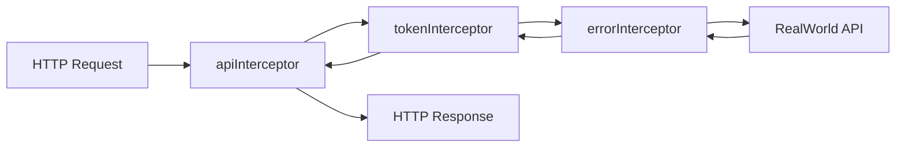
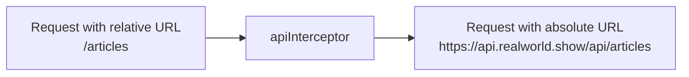
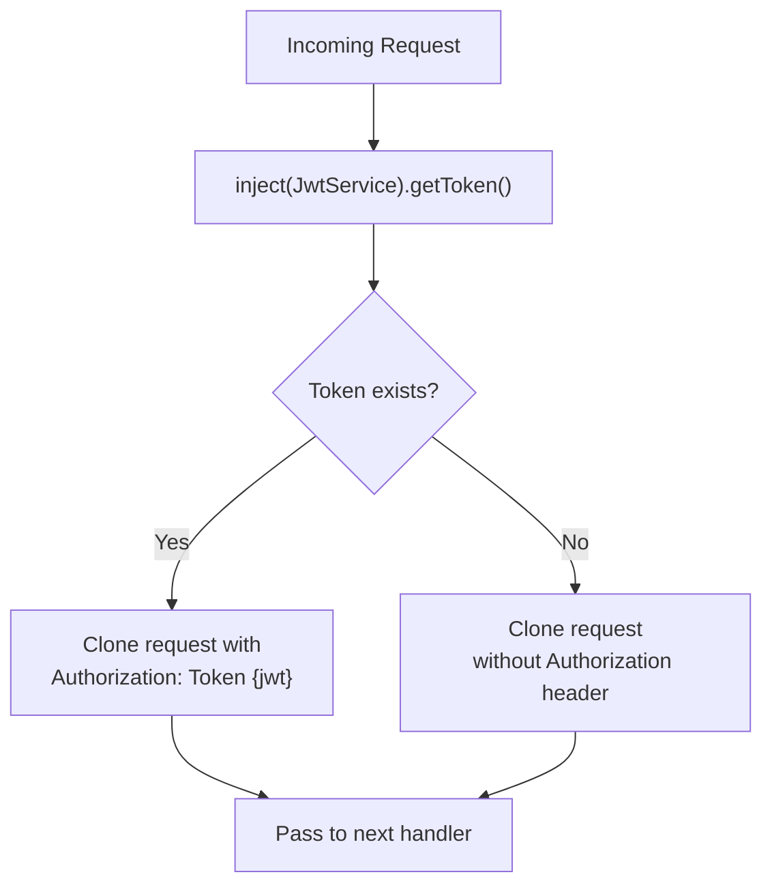
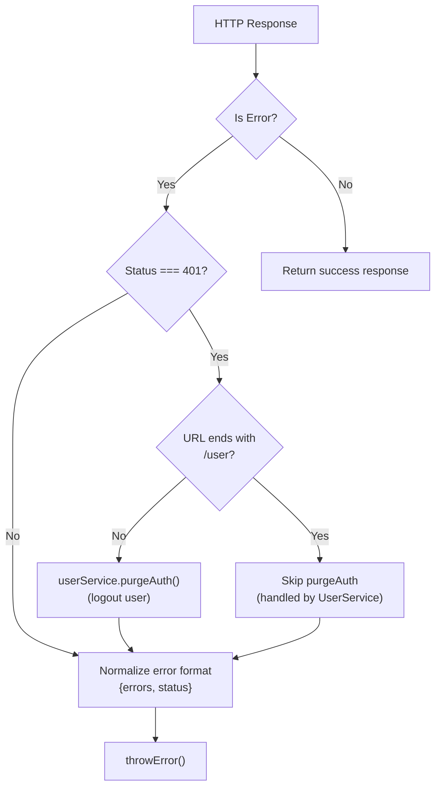
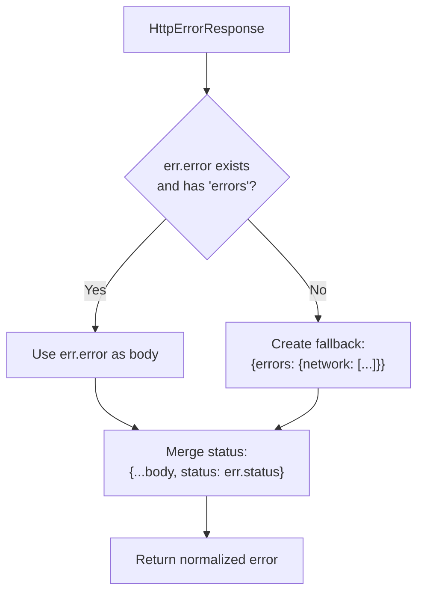
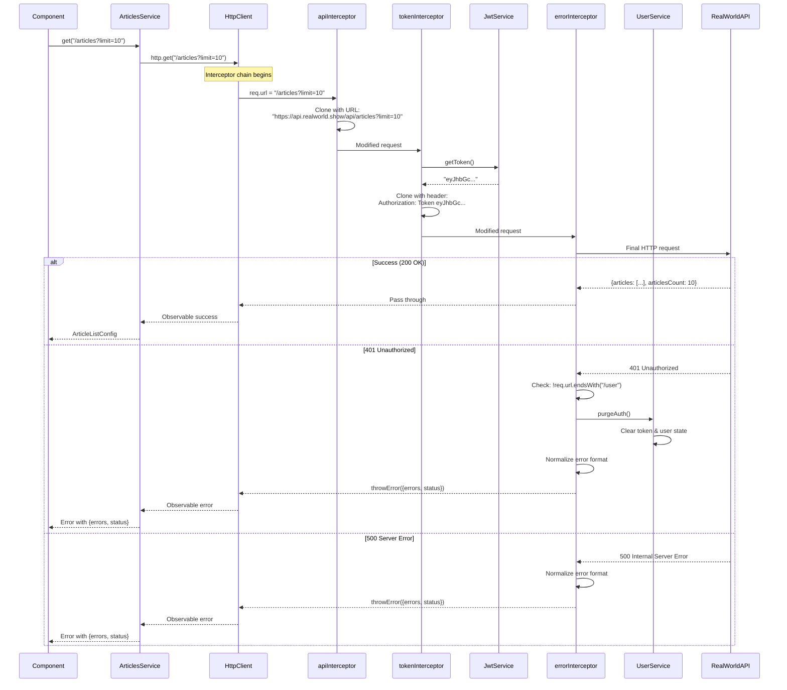
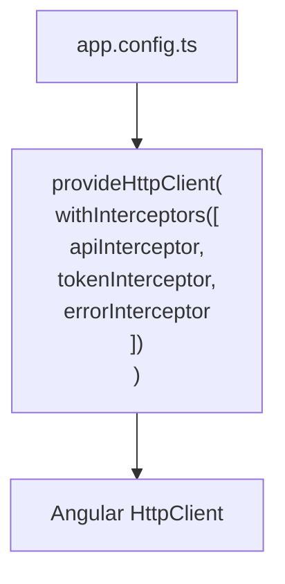
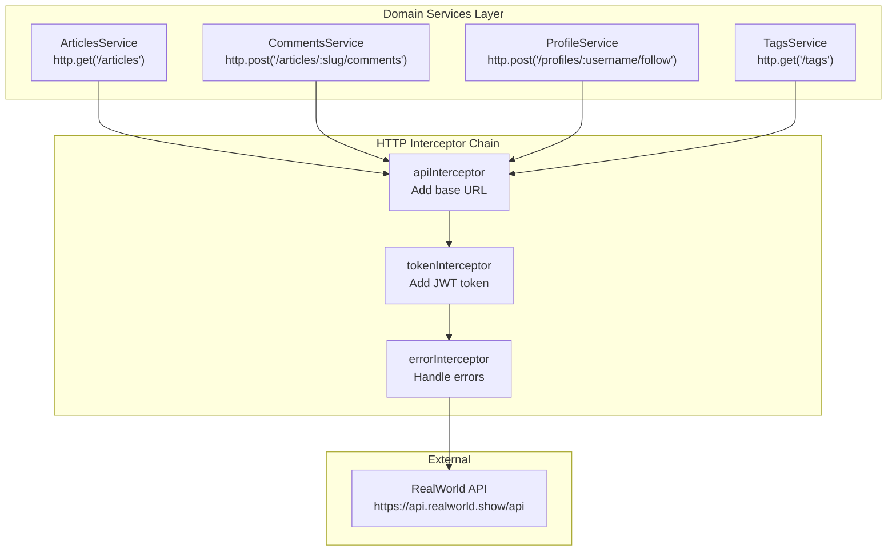

# HTTP Interceptors

<details>
<summary>Relevant source files</summary>

The following files were used as context for generating this wiki page:

- [LICENSE](../LICENSE)
- [README.md](../README.md)
- [src/app/app.routes.ts](../src/app/app.routes.ts)
- [src/app/core/interceptors/api.interceptor.ts](../src/app/core/interceptors/api.interceptor.ts)
- [src/app/core/interceptors/error.interceptor.ts](../src/app/core/interceptors/error.interceptor.ts)
- [src/app/core/interceptors/token.interceptor.ts](../src/app/core/interceptors/token.interceptor.ts)
- [src/app/core/layout/footer.component.html](../src/app/core/layout/footer.component.html)
- [src/app/core/layout/footer.component.ts](../src/app/core/layout/footer.component.ts)

</details>

## Purpose and Scope

This document details the HTTP interceptor chain that processes all outgoing HTTP requests and incoming responses in the Angular RealWorld application. The application uses three interceptors that work in sequence to handle cross-cutting concerns: API base URL configuration, JWT authentication, and global error handling.

For information about the overall HTTP request pipeline architecture, see [HTTP Request Pipeline](3.2-http-request-pipeline.md). For details about authentication state management, see [UserService & Authentication State](4.1-userservice-and-authentication-state.md). For JWT token storage mechanisms, see [JwtService & Token Storage](4.3-jwtservice-and-token-storage.md).

---

## Interceptor Chain Overview

The application implements three HTTP interceptors that process requests in a defined sequence. Each interceptor transforms the request or response and passes it to the next handler in the chain.



**Interceptor Execution Order:**

| Order | Interceptor        | File                                             | Primary Responsibility             |
| ----- | ------------------ | ------------------------------------------------ | ---------------------------------- |
| 1     | `apiInterceptor`   | `src/app/core/interceptors/api.interceptor.ts`   | Prepend API base URL               |
| 2     | `tokenInterceptor` | `src/app/core/interceptors/token.interceptor.ts` | Inject JWT authentication token    |
| 3     | `errorInterceptor` | `src/app/core/interceptors/error.interceptor.ts` | Handle errors and normalize format |

Sources: `src/app/core/interceptors/api.interceptor.ts:1-6`, `src/app/core/interceptors/token.interceptor.ts:1-14`, `src/app/core/interceptors/error.interceptor.ts:1-54`

---

## API Interceptor: Base URL Configuration

The `apiInterceptor` transforms all relative URLs into absolute URLs by prepending the RealWorld API base URL. This centralizes API endpoint configuration and allows domain services to use clean, relative paths.

### Implementation



The interceptor clones the incoming request and modifies its URL:

- **Input:** Request with relative URL (e.g., `/articles`, `/user`, `/profiles/john`)
- **Transformation:** Prepends `https://api.realworld.show/api` to the URL
- **Output:** Request with absolute URL (e.g., `https://api.realworld.show/api/articles`)

### Key Implementation Details

The implementation is straightforward and performs a single URL transformation:

`src/app/core/interceptors/api.interceptor.ts:3-6`

```typescript
export const apiInterceptor: HttpInterceptorFn = (req, next) => {
  const apiReq = req.clone({ url: `https://api.realworld.show/api${req.url}` });
  return next(apiReq);
};
```

**Design Characteristics:**

- Stateless functional interceptor using Angular's `HttpInterceptorFn` type
- No dependencies on other services
- Operates on all HTTP requests without filtering
- URL transformation is idempotent (can be safely applied multiple times)

Sources: `src/app/core/interceptors/api.interceptor.ts:1-6`

---

## Token Interceptor: JWT Authentication

The `tokenInterceptor` injects the JWT authentication token into request headers when a valid token is available. This eliminates the need for domain services to manually handle authentication headers.

### Implementation



### Token Retrieval and Header Injection

The interceptor retrieves the JWT token from `JwtService` and conditionally adds it to the request headers:

`src/app/core/interceptors/token.interceptor.ts:5-13`

```typescript
export const tokenInterceptor: HttpInterceptorFn = (req, next) => {
  const token = inject(JwtService).getToken();

  const request = req.clone({
    setHeaders: {
      ...(token ? { Authorization: `Token ${token}` } : {}),
    },
  });
  return next(request);
};
```

**Key Behaviors:**

| Scenario              | Token Value        | Header Added                     | Use Case                                          |
| --------------------- | ------------------ | -------------------------------- | ------------------------------------------------- |
| Authenticated user    | Valid JWT string   | `Authorization: Token {jwt}`     | Protected API calls (create article, follow user) |
| Unauthenticated user  | `null`             | None                             | Public API calls (list articles, view profile)    |
| Token expired/invalid | Invalid JWT string | `Authorization: Token {invalid}` | Server returns 401, triggering logout             |

**Dependencies:**

- `JwtService`: Provides token storage and retrieval (see [JwtService & Token Storage](4.3-jwtservice-and-token-storage.md))
- Uses Angular's dependency injection via `inject()` function

Sources: `src/app/core/interceptors/token.interceptor.ts:1-14`

---

## Error Interceptor: Global Error Handling

The `errorInterceptor` provides centralized error handling for all HTTP responses. It performs two critical functions: handling 401 Unauthorized responses (with special logic for the `/user` endpoint) and normalizing error response formats.

### Error Handling Strategy



### 401 Unauthorized Handling

The interceptor implements a two-layer 401 handling strategy:

**Layer 1: GET /user endpoint (initialization)**

- Handled by `UserService.getCurrentUser()` with 4xx vs 5xx error distinction
- This interceptor **skips** `/user` endpoint to avoid double-handling
- Allows `UserService` to implement retry logic for 5xx errors

**Layer 2: All other endpoints**

- Any 401 response indicates token expired mid-session
- Interceptor calls `userService.purgeAuth()` to immediately logout
- Prevents further API calls with invalid token

`src/app/core/interceptors/error.interceptor.ts:37-42`

```typescript
// Global 401 handling for all endpoints EXCEPT /user
// (token expired mid-session → logout)
// /user is handled by UserService.getCurrentUser() with 4XX vs 5XX logic
if (err.status === 401 && !req.url.endsWith('/user')) {
  userService.purgeAuth();
}
```

### Error Normalization

The interceptor transforms all error responses into a consistent format:



`src/app/core/interceptors/error.interceptor.ts:44-51`

**Normalized Error Format:**

```typescript
{
  errors: {
    [field: string]: string[]
  },
  status: number
}
```

**Error Scenarios:**

| Scenario         | Status | Server Response                     | Normalized Output                                          |
| ---------------- | ------ | ----------------------------------- | ---------------------------------------------------------- |
| Validation error | 422    | `{errors: {email: ["is invalid"]}}` | `{errors: {email: [...]}, status: 422}`                    |
| Unauthorized     | 401    | `{errors: {auth: ["invalid"]}}`     | `{errors: {auth: [...]}, status: 401}`                     |
| Network failure  | 0      | No response                         | `{errors: {network: ["Unable to connect..."]}, status: 0}` |
| Server error     | 500    | `{errors: {server: [...]}}`         | `{errors: {server: [...]}, status: 500}`                   |

### Implementation Details

`src/app/core/interceptors/error.interceptor.ts:32-54`

**Dependencies:**

- `UserService`: Injected to call `purgeAuth()` on 401 errors (see [UserService & Authentication State](4.1-userservice-and-authentication-state.md))
- Uses RxJS `catchError` operator for error stream handling
- Returns errors via `throwError()` for downstream handling by components

**Design Rationale:**

The special handling for `/user` endpoint is critical for the authentication initialization flow. During app startup, `UserService.initAuth()` calls GET `/user` to check token validity. If the server returns 5xx errors, the service retries with exponential backoff. If the interceptor also handled this 401, it would interfere with the retry logic. By excluding `/user`, the interceptor allows `UserService` to maintain full control over authentication initialization error handling.

Sources: `src/app/core/interceptors/error.interceptor.ts:1-54`

---

## Complete Request Flow

The following diagram illustrates a complete HTTP request flowing through all three interceptors:



**Flow Summary:**

1. **Component** calls domain service method (e.g., `ArticlesService.get()`)
2. **Domain Service** calls `HttpClient` with relative URL
3. **apiInterceptor** transforms URL to absolute
4. **tokenInterceptor** adds JWT token if available
5. **errorInterceptor** catches errors and normalizes format
6. **Response** flows back through the chain to component

Sources: `src/app/core/interceptors/api.interceptor.ts:3-6`, `src/app/core/interceptors/token.interceptor.ts:5-13`, `src/app/core/interceptors/error.interceptor.ts:32-54`

---

## Interceptor Registration

The interceptors are registered in the application configuration as HTTP interceptor providers. Angular processes interceptors in the order they are provided:



**Registration Order is Critical:**

| Step | Interceptor        | Why This Order                                          |
| ---- | ------------------ | ------------------------------------------------------- |
| 1    | `apiInterceptor`   | Must run first to establish absolute URLs               |
| 2    | `tokenInterceptor` | Adds authentication after URL is finalized              |
| 3    | `errorInterceptor` | Handles errors last, after request is fully constructed |

The interceptors are provided using Angular's functional interceptor API (`HttpInterceptorFn`), which is the modern approach for Angular 14+ applications. This replaces the older class-based `HttpInterceptor` interface.

Sources: `src/app/core/interceptors/api.interceptor.ts:3`, `src/app/core/interceptors/token.interceptor.ts:5`, `src/app/core/interceptors/error.interceptor.ts:32`

---

## Usage by Domain Services

Domain services (ArticlesService, CommentsService, ProfileService, TagsService) use `HttpClient` without awareness of the interceptor chain. The interceptors transparently enhance all requests:



**Benefits of Interceptor Architecture:**

- **Separation of Concerns:** Domain services focus on business logic, not infrastructure
- **DRY Principle:** Authentication and URL configuration defined once
- **Consistent Error Handling:** All services receive normalized error format
- **Easy Testing:** Services can be tested without real HTTP by mocking `HttpClient`
- **Centralized Configuration:** API base URL can be changed in one place

Sources: `src/app/core/interceptors/api.interceptor.ts:1-6`, `src/app/core/interceptors/token.interceptor.ts:1-14`, `src/app/core/interceptors/error.interceptor.ts:1-54`

---

---

[← Back to documentation index](README.md)
