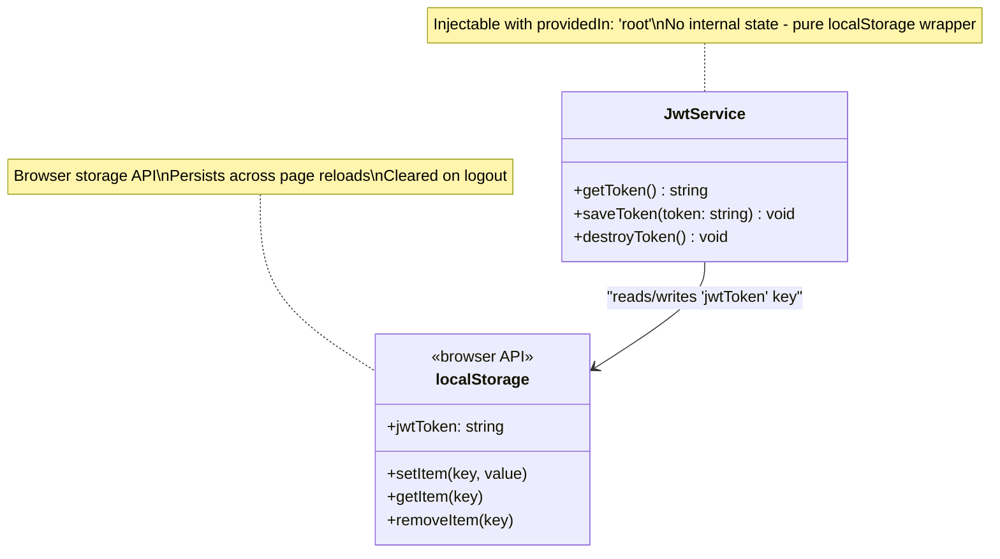
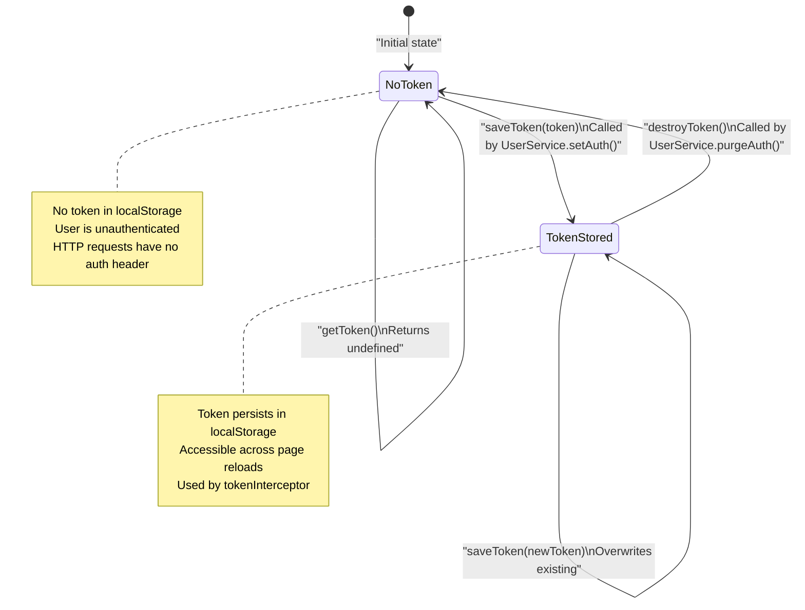
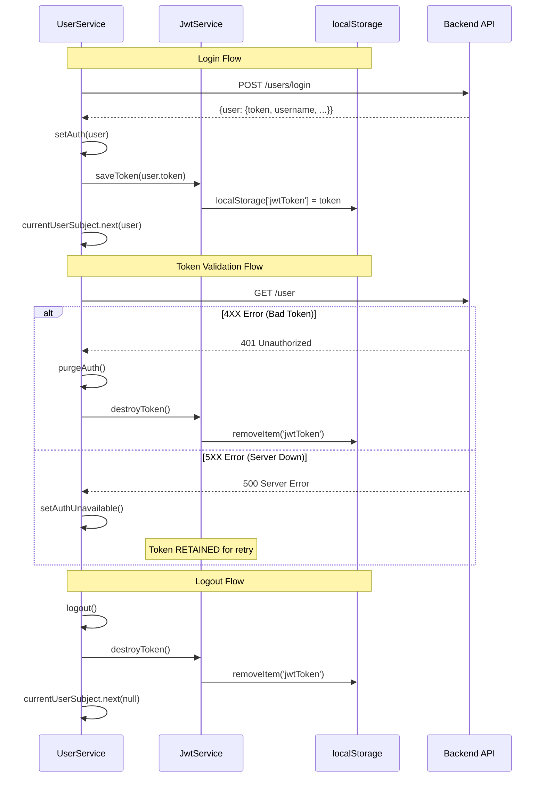
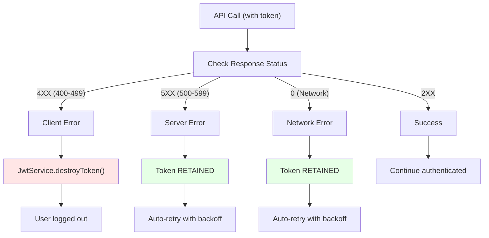
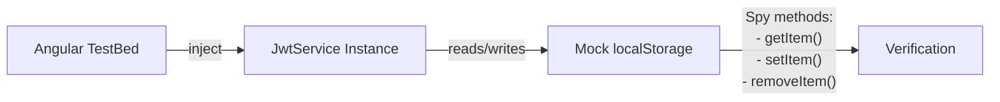

# JwtService & Token Storage

<details>
<summary>Relevant source files</summary>

The following files were used as context for generating this wiki page:

- [e2e/settings.spec.ts](../e2e/settings.spec.ts)
- [src/app/core/auth/services/jwt.service.spec.ts](../src/app/core/auth/services/jwt.service.spec.ts)
- [src/app/core/auth/services/jwt.service.ts](../src/app/core/auth/services/jwt.service.ts)
- [src/app/core/auth/services/user.service.spec.ts](../src/app/core/auth/services/user.service.spec.ts)
- [src/app/core/auth/services/user.service.ts](../src/app/core/auth/services/user.service.ts)
- [src/app/features/article/services/articles.service.spec.ts](../src/app/features/article/services/articles.service.spec.ts)
- [src/app/features/article/services/comments.service.spec.ts](../src/app/features/article/services/comments.service.spec.ts)
- [src/app/features/article/services/tags.service.spec.ts](../src/app/features/article/services/tags.service.spec.ts)
- [src/app/features/profile/services/profile.service.spec.ts](../src/app/features/profile/services/profile.service.spec.ts)
- [src/test-setup.ts](../src/test-setup.ts)
- [vitest.config.ts](../vitest.config.ts)

</details>

This document explains the JWT token persistence layer, including the `JwtService` class responsible for storing authentication tokens in browser `localStorage`, the token lifecycle operations, and how this service integrates with the authentication system.

**Scope**: This page focuses specifically on token storage mechanics. For authentication state management and user session handling, see [UserService & Authentication State](4.1-userservice-and-authentication-state.md). For how tokens are automatically attached to HTTP requests, see [HTTP Interceptors](4.2-http-interceptors.md).

---

## Purpose

The `JwtService` provides a clean abstraction layer over browser `localStorage` for JWT token persistence. It encapsulates all token storage operations (read, write, delete) in a single service, ensuring consistent storage key usage and providing a mockable interface for testing.

**Sources**: `src/app/core/auth/services/jwt.service.ts:1-16`

---

## JwtService API

The `JwtService` is a singleton Angular service (`providedIn: 'root'`) that exposes three methods for token management.

### Method Overview

| Method             | Parameters      | Return Type | Purpose                                          |
| ------------------ | --------------- | ----------- | ------------------------------------------------ |
| `getToken()`       | none            | `string`    | Retrieves the stored JWT token from localStorage |
| `saveToken(token)` | `token: string` | `void`      | Stores a JWT token in localStorage               |
| `destroyToken()`   | none            | `void`      | Removes the stored token from localStorage       |

### Implementation



The service implementation is deliberately simple, containing no business logic or state management. It acts as a pure accessor to the `window.localStorage` API using the fixed key `'jwtToken'`.

**Sources**: `src/app/core/auth/services/jwt.service.ts:1-16`, `src/app/core/auth/services/jwt.service.spec.ts:8-335`

---

## Token Storage Mechanism

### localStorage Access Pattern

The service uses direct property access on `window.localStorage` rather than the standard `getItem()`/`setItem()` methods:

- **Read**: `window.localStorage['jwtToken']` `src/app/core/auth/services/jwt.service.ts:6`
- **Write**: `window.localStorage['jwtToken'] = token` `src/app/core/auth/services/jwt.service.ts:10`
- **Delete**: `window.localStorage.removeItem('jwtToken')` `src/app/core/auth/services/jwt.service.ts:14`

This pattern provides identical functionality to the standard API methods while being more concise.

### Storage Key

| Key Name   | Value Type | Lifecycle                                              |
| ---------- | ---------- | ------------------------------------------------------ |
| `jwtToken` | `string`   | Persists until explicitly removed via `destroyToken()` |

The token is stored under the fixed key `'jwtToken'`. This key persists across:

- Page reloads
- Browser restarts
- Multiple tabs (shared within same origin)

**Sources**: `src/app/core/auth/services/jwt.service.ts:6-14`, `src/app/core/auth/services/jwt.service.spec.ts:49-96`

---

## Token Lifecycle

The token lifecycle follows three primary operations, coordinated between `JwtService` and `UserService`.



### Operation Details

**1. Token Save (`saveToken`)**

Called when:

- User logs in successfully `src/app/core/auth/services/user.service.ts:169`
- User registers successfully `src/app/core/auth/services/user.service.ts:169`
- User's current token is validated `src/app/core/auth/services/user.service.ts:169`

```
UserService.setAuth(user) → JwtService.saveToken(user.token)
```

**2. Token Retrieval (`getToken`)**

Called when:

- HTTP interceptor needs to attach auth header (every API request)
- Application checks for stored token on initialization
- UserService verifies token existence before retry `src/app/core/auth/services/user.service.ts:132`

```
tokenInterceptor → JwtService.getToken() → Attach to Authorization header
```

**3. Token Destruction (`destroyToken`)**

Called when:

- User logs out explicitly `src/app/core/auth/services/user.service.ts:177`
- API returns 401 (invalid token) `src/app/core/auth/services/user.service.ts:177`
- API returns 4xx client error during token validation `src/app/core/auth/services/user.service.ts:110`

```
UserService.purgeAuth() → JwtService.destroyToken()
```

**Sources**: `src/app/core/auth/services/jwt.service.ts:5-15`, `src/app/core/auth/services/user.service.ts:166-180`, `src/app/core/auth/services/jwt.service.spec.ts:193-237`

---

## Integration with UserService

The `JwtService` serves as a lower-level persistence layer for `UserService`, which manages authentication state and business logic.



### Dependency Relationship

| UserService Method | Calls JwtService        | Purpose                                |
| ------------------ | ----------------------- | -------------------------------------- |
| `setAuth(user)`    | `saveToken(user.token)` | Persist token after login/register     |
| `purgeAuth()`      | `destroyToken()`        | Clear token on logout or invalid token |
| `scheduleRetry()`  | `getToken()`            | Check if token exists before retry     |
| Constructor        | N/A                     | Injects JwtService as dependency       |

**Key Design Principle**: `UserService` never directly accesses `localStorage`. All storage operations are delegated to `JwtService`, ensuring:

- Single responsibility (UserService manages state, JwtService manages storage)
- Testability (JwtService can be mocked in UserService tests)
- Consistency (storage key name defined in one place)

**Sources**: `src/app/core/auth/services/user.service.ts:68-72`, `src/app/core/auth/services/user.service.ts:166-180`, `src/app/core/auth/services/user.service.spec.ts:31-48`

---

## Error Handling Strategy

The `JwtService` distinguishes between client errors (invalid token) and server errors (temporary unavailability) based on HTTP status codes:



### Status Code Handling

| Status Code Range | Token Action                     | Rationale                                                          |
| ----------------- | -------------------------------- | ------------------------------------------------------------------ |
| 400-499           | **Destroy** via `destroyToken()` | Token is invalid, expired, or user lacks permissions               |
| 500-599           | **Retain**                       | Server error is temporary; token may be valid when server recovers |
| 0 (network error) | **Retain**                       | Network issue is temporary; token remains valid                    |

This strategy is implemented in `UserService.handleAuthError()` `src/app/core/auth/services/user.service.ts:105-115` which only calls `purgeAuth()` (and thus `destroyToken()`) for 4XX errors.

**Sources**: `src/app/core/auth/services/user.service.ts:100-124`, `src/app/core/auth/services/user.service.ts:132-146`

---

## Security Considerations

### Storage Location

**localStorage vs sessionStorage vs Memory**

The application uses `localStorage` (persistent) rather than `sessionStorage` (tab-scoped) or memory (volatile):

| Storage Type      | Persistence                           | Security   | Choice                                  |
| ----------------- | ------------------------------------- | ---------- | --------------------------------------- |
| `localStorage`    | Survives page reload, browser restart | **Used** ✓ | Better UX (user stays logged in)        |
| `sessionStorage`  | Cleared on tab close                  | Not used   | Would require re-login on every new tab |
| Memory (variable) | Cleared on page reload                | Not used   | Would require re-login on refresh       |

### XSS Protection

The token is stored as a plain string without sanitization. The service handles potentially malicious strings safely:

```
Input: '<script>alert("xss")</script>'
Storage: Stored as-is in localStorage['jwtToken']
Retrieval: Retrieved as string, not executed
```

The test suite verifies this behavior: `src/app/core/auth/services/jwt.service.spec.ts:288-292`

### Token Exposure

The service does **not** expose the token as a class property:

- No public `token` field on the service instance
- Token only accessible via `getToken()` method
- Test verification: `src/app/core/auth/services/jwt.service.spec.ts:272-286`

This prevents accidental token leakage through service inspection.

**Sources**: `src/app/core/auth/services/jwt.service.ts:1-16`, `src/app/core/auth/services/jwt.service.spec.ts:271-293`

---

## Testing Strategy

The `JwtService` has comprehensive unit tests that mock `localStorage` to verify token operations without side effects.

### Test Setup



The test suite replaces `window.localStorage` with a spy object `src/app/core/auth/services/jwt.service.spec.ts:16-30`, enabling:

- Verification of method calls
- Isolation from real browser storage
- Deterministic test behavior

### Test Coverage

| Test Category     | Test Count | Coverage Area                                      |
| ----------------- | ---------- | -------------------------------------------------- |
| Token Retrieval   | 7          | Empty, null, undefined, long tokens, special chars |
| Token Storage     | 8          | Save, overwrite, persistence, rapid updates        |
| Token Destruction | 5          | Remove, idempotency, save-after-destroy            |
| Lifecycle         | 4          | Complete flows, multiple operations                |
| Edge Cases        | 8          | Whitespace, newlines, unicode, XSS strings         |
| Security          | 3          | No property exposure, XSS safety                   |
| Integration       | 3          | Authentication flow, session management            |

### Key Test Scenarios

**1. Token Persistence Across Operations**

```
saveToken('test') → getToken() → expect('test')
```

`src/app/core/auth/services/jwt.service.spec.ts:138-143`

**2. Idempotent Destruction**

```
destroyToken() → destroyToken() → destroyToken()
All three calls succeed without errors
```

`src/app/core/auth/services/jwt.service.spec.ts:174-180`

**3. Token Overwrite**

```
saveToken('old') → saveToken('new') → getToken() → expect('new')
```

`src/app/core/auth/services/jwt.service.spec.ts:106-112`

**Sources**: `src/app/core/auth/services/jwt.service.spec.ts:1-335`

---

## localStorage API Usage Patterns

### Direct Property Access

The service uses bracket notation for localStorage access:

```
// Read
window.localStorage['jwtToken']

// Write
window.localStorage['jwtToken'] = token

// Delete
window.localStorage.removeItem('jwtToken')
```

This is functionally equivalent to:

```
// Standard API (not used)
window.localStorage.getItem('jwtToken')
window.localStorage.setItem('jwtToken', token)
window.localStorage.removeItem('jwtToken')
```

### Multi-Tab Behavior

Since `localStorage` is shared across tabs within the same origin:

- Token saved in one tab is immediately visible in other tabs
- Logout in one tab removes token for all tabs
- Test verification: `src/app/core/auth/services/jwt.service.spec.ts:324-332`

**Sources**: `src/app/core/auth/services/jwt.service.ts:5-15`, `src/app/core/auth/services/jwt.service.spec.ts:324-332`

---

## Usage Examples from E2E Tests

The E2E test suite demonstrates real-world token lifecycle scenarios:

### Token Persistence After Settings Update

When a user updates their profile, the token must remain valid:

```
1. Register user → token saved
2. Navigate to /settings
3. Update profile (PUT /user) → returns new user data with same token
4. Verify getToken() returns token (not null)
5. Verify currentUser updated with new profile data
```

This test ensures that profile updates don't inadvertently clear authentication state.

**Test**: `e2e/settings.spec.ts:18-56`

### Token Retention During Navigation

```
1. Register → token saved
2. Update bio → navigation to /profile/{username}
3. Navigate back to /settings
4. Token still present, form pre-filled with previous bio
5. Make second update → still works
```

This verifies the token persists correctly through multiple navigation cycles.

**Test**: `e2e/settings.spec.ts:197-232`

**Sources**: `e2e/settings.spec.ts:1-234`

---

## Summary

The `JwtService` is a minimal, focused service that:

1. **Abstracts `localStorage` access** through three methods: `getToken()`, `saveToken()`, `destroyToken()`
2. **Uses fixed key** `'jwtToken'` for consistent storage access
3. **Contains no business logic** - pure storage wrapper
4. **Integrates with `UserService`** which manages authentication state and decides when to save/destroy tokens
5. **Distinguishes error types** - tokens destroyed on 4XX (client errors), retained on 5XX/network errors (server issues)
6. **Persists across reloads** via `localStorage` (not sessionStorage)
7. **Fully testable** via mocked localStorage in unit tests

This design follows single responsibility principle, keeping storage mechanics separate from authentication state management.

---

---

[← Back to documentation index](README.md)
