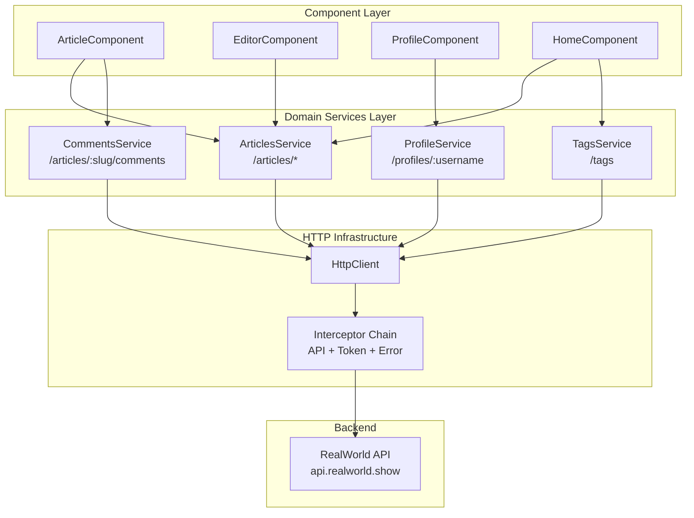
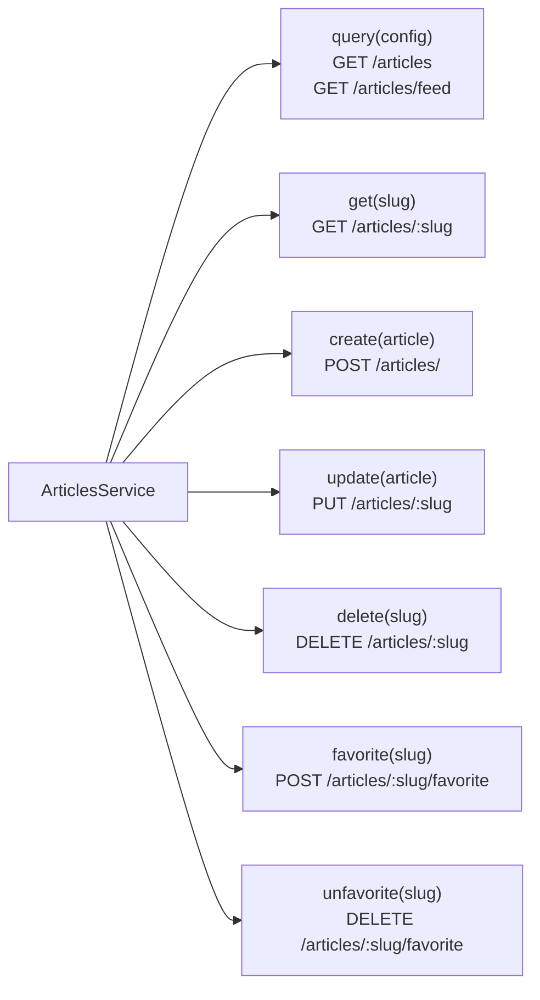
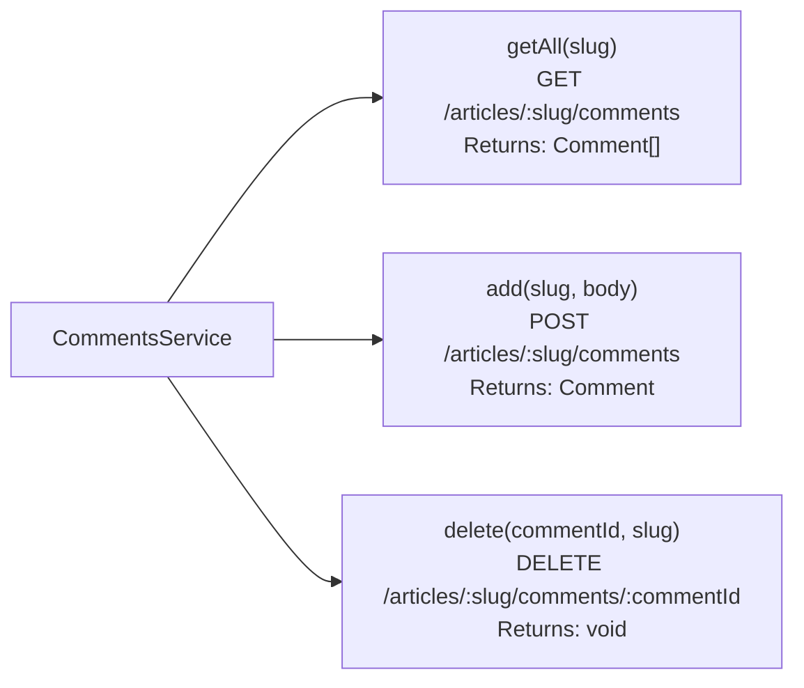
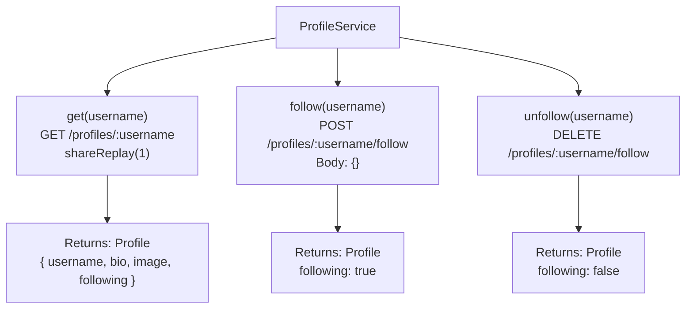
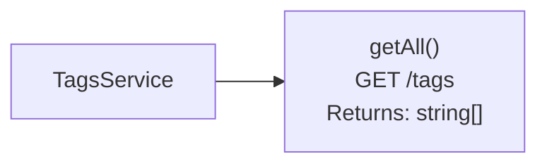
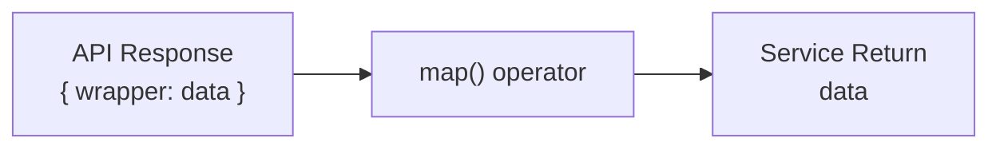
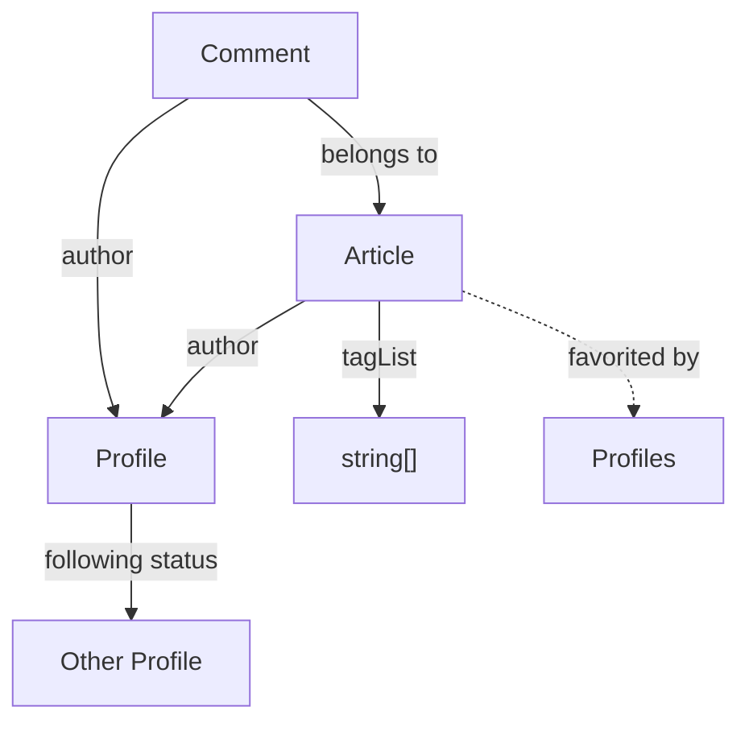

# Domain Services (Articles, Comments, Profile, Tags)

<details>
<summary>Relevant source files</summary>

The following files were used as context for generating this wiki page:

- [src/app/core/auth/services/jwt.service.spec.ts](../src/app/core/auth/services/jwt.service.spec.ts)
- [src/app/core/auth/services/user.service.spec.ts](../src/app/core/auth/services/user.service.spec.ts)
- [src/app/features/article/pages/article/article.component.html](../src/app/features/article/pages/article/article.component.html)
- [src/app/features/article/services/articles.service.spec.ts](../src/app/features/article/services/articles.service.spec.ts)
- [src/app/features/article/services/comments.service.spec.ts](../src/app/features/article/services/comments.service.spec.ts)
- [src/app/features/article/services/tags.service.spec.ts](../src/app/features/article/services/tags.service.spec.ts)
- [src/app/features/profile/pages/profile/profile.component.html](../src/app/features/profile/pages/profile/profile.component.html)
- [src/app/features/profile/services/profile.service.spec.ts](../src/app/features/profile/services/profile.service.spec.ts)
- [src/app/features/profile/services/profile.service.ts](../src/app/features/profile/services/profile.service.ts)
- [src/test-setup.ts](../src/test-setup.ts)
- [vitest.config.ts](../vitest.config.ts)

</details>

## Purpose and Scope

This document describes the domain services that handle business logic and API communication for the core features of the application: articles, comments, user profiles, and tags. These services sit in the application services layer and provide a clean abstraction over the RealWorld API endpoints.

Domain services are distinct from core infrastructure services (see [UserService & Authentication State](4.1-userservice-and-authentication-state.md) and [JwtService & Token Storage](4.3-jwtservice-and-token-storage.md)). While core services handle cross-cutting concerns like authentication, domain services focus on feature-specific operations. All domain services use Angular's `HttpClient` which flows through the HTTP interceptor chain (see [HTTP Interceptors](4.2-http-interceptors.md)).

**Services covered:**

- `ArticlesService` - Article CRUD, queries, and favoriting
- `CommentsService` - Comment management on articles
- `ProfileService` - User profile retrieval and following
- `TagsService` - Tag retrieval for filtering

---

## Service Architecture Overview



**Sources:** `src/app/features/article/services/articles.service.spec.ts`, `src/app/features/article/services/comments.service.spec.ts`, `src/app/features/profile/services/profile.service.ts`, `src/app/features/article/services/tags.service.spec.ts`

---

## ArticlesService

The `ArticlesService` handles all article-related operations including CRUD operations, querying with filters, and social features like favoriting.

### API Endpoints and Methods



### Query Method

The `query()` method supports two types of article lists based on `ArticleListConfig`:

| Config Type    | Endpoint             | Use Case                           |
| -------------- | -------------------- | ---------------------------------- |
| `type: 'all'`  | `GET /articles`      | Public article feed                |
| `type: 'feed'` | `GET /articles/feed` | Authenticated user's personal feed |

**Query Parameters:**

| Parameter   | Type   | Description                 |
| ----------- | ------ | --------------------------- |
| `tag`       | string | Filter by tag               |
| `author`    | string | Filter by author username   |
| `favorited` | string | Filter by who favorited     |
| `limit`     | number | Number of articles per page |
| `offset`    | number | Pagination offset           |

`src/app/features/article/services/articles.service.spec.ts:91-116` demonstrates query parameter handling.

### Response Format

All ArticlesService methods unwrap the API response wrapper:

```
API Response: { articles: [...], articlesCount: 10 }
Service Returns: { articles: Article[], articlesCount: number }

API Response: { article: {...} }
Service Returns: Article
```

`src/app/features/article/services/articles.service.spec.ts:152-161` shows the response unwrapping pattern.

### Data Model

The `Article` model includes:

```typescript
Article {
  slug: string              // URL-friendly identifier
  title: string
  description: string
  body: string             // Markdown content
  tagList: string[]
  createdAt: string
  updatedAt: string
  favorited: boolean       // Current user's favorite status
  favoritesCount: number
  author: Profile          // Article author's profile
}
```

**Sources:** `src/app/features/article/services/articles.service.spec.ts:20-36`

---

## CommentsService

The `CommentsService` manages comments on individual articles. Comments are scoped to articles via the article slug.

### API Endpoints



### Method Signatures

**getAll(slug: string): Observable\<Comment[]\>**

- Fetches all comments for an article
- Returns empty array if no comments exist
- `src/app/features/article/services/comments.service.spec.ts:60-70`

**add(slug: string, commentBody: string): Observable\<Comment\>**

- Creates new comment on article
- Request format: `{ comment: { body: string } }`
- Returns the created comment with id and metadata
- `src/app/features/article/services/comments.service.spec.ts:167-179`

**delete(commentId: string, slug: string): Observable\<void\>**

- Deletes a comment (requires ownership)
- Returns void on success
- `src/app/features/article/services/comments.service.spec.ts:265-275`

### Comment Model

```typescript
Comment {
  id: string                // Comment identifier
  body: string              // Comment text
  createdAt: string
  updatedAt: string
  author: Profile           // Comment author's profile
}
```

**Notes:**

- Comments use the same `Profile` model as articles for author information
- The `author.bio` field can be null `src/app/features/article/services/comments.service.spec.ts:108-119`
- Comment body can contain markdown, emojis, and special characters `src/app/features/article/services/comments.service.spec.ts:244-262`

**Sources:** `src/app/features/article/services/comments.service.spec.ts:19-30`, `src/app/features/article/services/comments.service.spec.ts:167-263`

---

## ProfileService

The `ProfileService` handles user profile operations. It provides public profile data for any user and manages follow/unfollow relationships.

### Implementation

`src/app/features/profile/services/profile.service.ts` provides the complete service implementation.

### API Endpoints



### Key Distinction

**Important:** `ProfileService` is distinct from `UserService`:

| Service            | Endpoint                  | Purpose                           |
| ------------------ | ------------------------- | --------------------------------- |
| **ProfileService** | `GET /profiles/:username` | Public profile for any user       |
| **UserService**    | `GET /user`               | Current authenticated user's data |

This distinction is documented in `src/app/features/profile/services/profile.service.ts:7-13`.

### ShareReplay Optimization

The `get()` method uses `shareReplay(1)` to cache profile data:

```typescript
get(username: string): Observable<Profile> {
  return this.http.get<{ profile: Profile }>('/profiles/' + username).pipe(
    map((data: { profile: Profile }) => data.profile),
    shareReplay(1),  // Cache result for multiple subscribers
  );
}
```

This means multiple subscriptions to the same profile fetch will only make one HTTP request. `src/app/features/profile/services/profile.service.spec.ts:82-90` verifies this behavior.

### Profile Model

```typescript
Profile {
  username: string
  bio: string | null       // Can be null
  image: string
  following: boolean       // Current user's follow status
}
```

**Sources:** `src/app/features/profile/services/profile.service.ts:1-37`, `src/app/features/profile/services/profile.service.spec.ts:19-24`

---

## TagsService

The `TagsService` retrieves the list of all available tags for filtering articles.

### API Endpoint



### Method Details

**getAll(): Observable\<string[]\>**

- Fetches all available tags
- Response unwrapping: `{ tags: string[] }` → `string[]`
- No caching (each subscription makes new request)
- `src/app/features/article/services/tags.service.spec.ts:40-47`

### Tag Format Support

The service handles diverse tag formats:

| Tag Type      | Examples                     | Test Reference                 |
| ------------- | ---------------------------- | ------------------------------ |
| Basic         | `'angular'`, `'typescript'`  | `tags.service.spec.ts:40-47`   |
| Special chars | `'c++'`, `'c#'`, `'node.js'` | `tags.service.spec.ts:89-96`   |
| Hyphens       | `'web-development'`          | `tags.service.spec.ts:98-105`  |
| Underscores   | `'web_dev'`                  | `tags.service.spec.ts:107-114` |
| Numbers       | `'angular17'`, `'vue3'`      | `tags.service.spec.ts:116-123` |
| Spaces        | `'web development'`          | `tags.service.spec.ts:134-141` |
| Unicode       | `'日本語'`, `'español'`      | `tags.service.spec.ts:164-171` |
| Emoji         | `'🚀 rocket'`                | `tags.service.spec.ts:173-180` |

### Multiple Subscriptions

Unlike `ProfileService`, `TagsService.getAll()` does **not** use `shareReplay()`. Each subscription creates a new HTTP request `src/app/features/article/services/tags.service.spec.ts:237-246`.

**Sources:** `src/app/features/article/services/tags.service.spec.ts:40-290`

---

## Common Patterns Across Services

### 1. Response Unwrapping

All services unwrap the RealWorld API's response envelope:



**Examples:**

- Articles: `{ article: Article }` → `Article` `src/app/features/article/services/articles.service.spec.ts:158`
- Comments: `{ comments: Comment[] }` → `Comment[]` `src/app/features/article/services/comments.service.spec.ts:72-80`
- Profile: `{ profile: Profile }` → `Profile` `src/app/features/profile/services/profile.service.ts:20`
- Tags: `{ tags: string[] }` → `string[]` `src/app/features/article/services/tags.service.spec.ts:50-56`

### 2. Request Body Wrapping

POST requests wrap data in a type-specific key:

| Service        | Request Format                                                                      |
| -------------- | ----------------------------------------------------------------------------------- |
| Articles       | `{ article: { title, description, body, tagList } }` `articles.service.spec.ts:205` |
| Comments       | `{ comment: { body } }` `comments.service.spec.ts:174`                              |
| Profile Follow | `{}` (empty body) `profile.service.spec.ts:148`                                     |

### 3. Error Handling

Services rely on the `errorInterceptor` for error normalization. Common HTTP status codes:

| Status | Scenario                             | Example                            |
| ------ | ------------------------------------ | ---------------------------------- |
| 401    | Unauthorized (triggers auto-logout)  | `comments.service.spec.ts:211-219` |
| 403    | Forbidden (insufficient permissions) | `articles.service.spec.ts:184-191` |
| 404    | Resource not found                   | `profile.service.spec.ts:66-73`    |
| 422    | Validation error                     | `articles.service.spec.ts:211-222` |
| 500    | Server error                         | `tags.service.spec.ts:182-188`     |

### 4. Observable Patterns

**ShareReplay Usage:**

| Service         | Method     | Uses shareReplay? | Reason                                     |
| --------------- | ---------- | ----------------- | ------------------------------------------ |
| ProfileService  | `get()`    | ✅ Yes            | Cache profile data for multiple components |
| ArticlesService | `get()`    | ❌ No             | Fresh data on each fetch                   |
| CommentsService | `getAll()` | ❌ No             | Fresh data on each fetch                   |
| TagsService     | `getAll()` | ❌ No             | Tags rarely change but no caching          |

**Sources:** `src/app/features/profile/services/profile.service.ts:21`, `src/app/features/profile/services/profile.service.spec.ts:82-90`

---

## Data Model Relationships



**Shared Profile Model:**

Both `Article` and `Comment` include an `author` field of type `Profile`. This creates consistency across the domain model:

```typescript
Article {
  author: Profile  // Same model as standalone profile
  // ...
}

Comment {
  author: Profile  // Same model as standalone profile
  // ...
}
```

**Sources:** `src/app/features/article/services/articles.service.spec.ts:20-36`, `src/app/features/article/services/comments.service.spec.ts:19-30`

---

## Service Dependencies

All domain services are:

- Injectable with `providedIn: 'root'` (singleton)
- Depend only on `HttpClient`
- Independent of each other (no cross-service dependencies)
- Tested with `HttpClientTestingModule`

Test setup pattern for all services:

```typescript
TestBed.configureTestingModule({
  imports: [HttpClientTestingModule],
  providers: [ServiceClass],
});
service = TestBed.inject(ServiceClass);
httpMock = TestBed.inject(HttpTestingController);
```

**Sources:** `src/app/features/article/services/articles.service.spec.ts:47-54`, `src/app/features/article/services/comments.service.spec.ts:41-49`, `src/app/features/profile/services/profile.service.spec.ts:26-34`, `src/app/features/article/services/tags.service.spec.ts:20-28`

---

## Testing Infrastructure

All domain services have comprehensive unit tests using Vitest and Angular's `HttpClientTestingModule`.

### Test Configuration

`vitest.config.ts` and `src/test-setup.ts` configure the test environment:

- Uses jsdom environment for DOM simulation
- Initializes Angular TestBed with BrowserDynamicTestingModule
- Enables teardown after each test

### Test Coverage Categories

Each service test suite covers:

1. **Basic Operations** - Happy path for all methods
2. **Error Scenarios** - HTTP errors (401, 403, 404, 422, 500)
3. **Edge Cases** - Empty responses, null fields, special characters
4. **Integration Scenarios** - Multiple operation sequences
5. **Observable Behavior** - Subscription patterns, shareReplay verification

**Example test counts:**

- `tags.service.spec.ts`: 292 lines, 60+ test cases
- `comments.service.spec.ts`: 406 lines, 40+ test cases
- `profile.service.spec.ts`: 353 lines, 35+ test cases
- `articles.service.spec.ts`: 267 lines, 20+ test cases

**Sources:** `vitest.config.ts:1-27`, `src/test-setup.ts:1-17`, `src/app/features/article/services/tags.service.spec.ts`, `src/app/features/article/services/comments.service.spec.ts`, `src/app/features/profile/services/profile.service.spec.ts`, `src/app/features/article/services/articles.service.spec.ts`

---

---

[← Back to documentation index](README.md)
