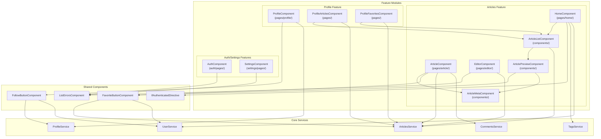
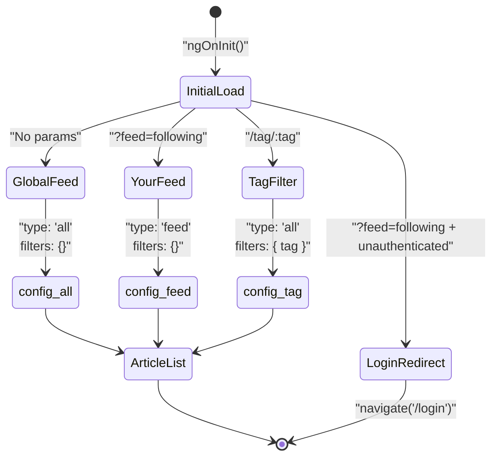

# Feature Modules

<details>
<summary>Relevant source files</summary>

The following files were used as context for generating this wiki page:

- [e2e/url-navigation.spec.ts](../e2e/url-navigation.spec.ts)
- [src/app/core/auth/if-authenticated.directive.ts](../src/app/core/auth/if-authenticated.directive.ts)
- [src/app/features/article/components/article-list.component.ts](../src/app/features/article/components/article-list.component.ts)
- [src/app/features/article/components/favorite-button.component.ts](../src/app/features/article/components/favorite-button.component.ts)
- [src/app/features/article/pages/editor/editor.component.html](../src/app/features/article/pages/editor/editor.component.html)
- [src/app/features/article/pages/home/home.component.html](../src/app/features/article/pages/home/home.component.html)
- [src/app/features/article/pages/home/home.component.ts](../src/app/features/article/pages/home/home.component.ts)
- [src/app/features/profile/components/follow-button.component.ts](../src/app/features/profile/components/follow-button.component.ts)

</details>

## Purpose and Scope

This document provides an overview of the feature modules in the Angular RealWorld application. Feature modules represent the main functional areas of the application that implement user-facing capabilities. Each feature module encapsulates related components, pages, and business logic for a specific domain area.

For detailed information about specific feature areas, see:

- [Articles Feature](5.1-articles-feature.md) - Article listing, viewing, creation, and favoriting
- [User Profiles](5.2-user-profiles.md) - Profile pages and social features
- [Settings & Authentication UI](5.3-settings-and-authentication-ui.md) - User settings and login/register forms
- [Home Page & Feed Navigation](5.4-home-page-and-feed-navigation.md) - Feed management and tag filtering

For information about the underlying services that features consume, see [Core Services](4-core-services.md).

---

## Feature Module Organization

The application is organized into four primary feature areas, each located under `src/app/features/`:

| Feature           | Location                     | Primary Functionality                                   |
| ----------------- | ---------------------------- | ------------------------------------------------------- |
| Articles          | `src/app/features/article/`  | Article CRUD, listing, pagination, comments, favoriting |
| Profiles          | `src/app/features/profile/`  | User profiles, following/unfollowing, author articles   |
| Authentication UI | `src/app/features/auth/`     | Login and registration forms                            |
| Settings          | `src/app/features/settings/` | User profile settings and updates                       |

Each feature module follows a consistent structure:

- **Pages** (`pages/`) - Route-level components that represent full page views
- **Components** (`components/`) - Reusable UI components specific to the feature
- **Services** (`services/`) - Domain-specific data access services
- **Models** (`models/`) - TypeScript interfaces and types for the feature's data

**Sources:** `src/app/features/article/components/article-list.component.ts:1-135`, `src/app/features/article/pages/home/home.component.ts:1-95`

---

## Feature Module Architecture

The following diagram illustrates how feature modules are organized and how they interact with core infrastructure:



**Key Architectural Patterns:**

1. **Component Reuse** - `ArticleListComponent` is reused by the home page, profile articles, and profile favorites, demonstrating the DRY principle
2. **Shared UI Components** - Cross-cutting UI elements like `FavoriteButtonComponent` and `FollowButtonComponent` are used across multiple features
3. **Service Dependency** - Feature components depend exclusively on domain services, never directly on HTTP infrastructure
4. **Conditional Rendering** - `IfAuthenticatedDirective` provides declarative authentication-based visibility control

**Sources:** `src/app/features/article/components/article-list.component.ts:1-135`, `src/app/features/article/pages/home/home.component.ts:1-95`, `src/app/features/profile/components/follow-button.component.ts:1-82`, `src/app/features/article/components/favorite-button.component.ts:1-80`

---

## Route-to-Feature Mapping

Feature modules are accessed through the application's routing system. The following table maps routes to their corresponding feature components:

| Route Pattern           | Component                   | Feature Module | Description                       |
| ----------------------- | --------------------------- | -------------- | --------------------------------- |
| `/`                     | `HomeComponent`             | Articles       | Global feed and tag filtering     |
| `/?feed=following`      | `HomeComponent`             | Articles       | Following feed (authenticated)    |
| `/tag/:tag`             | `HomeComponent`             | Articles       | Tag-filtered article list         |
| `/article/:slug`        | `ArticleComponent`          | Articles       | Article detail view with comments |
| `/editor`               | `EditorComponent`           | Articles       | Create new article                |
| `/editor/:slug`         | `EditorComponent`           | Articles       | Edit existing article             |
| `/@:username`           | `ProfileComponent`          | Profile        | User profile page                 |
| `/@:username/favorites` | `ProfileFavoritesComponent` | Profile        | User's favorited articles         |
| `/login`                | `AuthComponent`             | Auth           | Login form                        |
| `/register`             | `AuthComponent`             | Auth           | Registration form                 |
| `/settings`             | `SettingsComponent`         | Settings       | User settings form                |

**Navigation Features:**

- **URL State Management** - Feed selection, tag filtering, and pagination are reflected in the URL query parameters
- **Authentication Guards** - Routes like `/?feed=following` redirect unauthenticated users to `/login` (`src/app/features/article/pages/home/home.component.ts:51-55`)
- **Direct Navigation** - All routes support direct URL navigation, preserving application state

**Sources:** `src/app/features/article/pages/home/home.component.ts:41-73`, `e2e/url-navigation.spec.ts:1-245`

---

## Feature Data Flow Pattern

The following sequence diagram illustrates the typical data flow pattern used by feature components:

```mermaid
sequenceDiagram
    participant User
    participant Component["Feature Component<br/>(e.g., ArticleListComponent)"]
    participant Service["Domain Service<br/>(e.g., ArticlesService)"]
    participant HTTP["HTTP Infrastructure<br/>(Interceptors + HttpClient)"]
    participant API["RealWorld API"]

    User->>Component: "Navigate to page"
    Component->>Component: "Set loading state"
    Component->>Service: "query(config)"
    Service->>HTTP: "HTTP GET request"
    HTTP->>HTTP: "Add base URL (apiInterceptor)"
    HTTP->>HTTP: "Add auth token (tokenInterceptor)"
    HTTP->>API: "Authenticated request"
    API-->>HTTP: "Response data"
    HTTP-->>Service: "Typed response"
    Service-->>Component: "Observable<articles>"
    Component->>Component: "Update signals with results"
    Component-->>User: "Display articles"
```

**Pattern Characteristics:**

1. **Signal-Based State** - Components use Angular signals for reactive state management (`src/app/features/article/components/article-list.component.ts:66-69`)
2. **Loading States** - Features track loading/loaded/error states using the `LoadingState` enum (`src/app/features/article/components/article-list.component.ts:69-70`)
3. **Reactive Subscriptions** - Components use `takeUntilDestroyed()` for automatic cleanup (`src/app/features/article/components/article-list.component.ts:123`)
4. **Service Abstraction** - Feature components are decoupled from HTTP details through service interfaces

**Sources:** `src/app/features/article/components/article-list.component.ts:111-134`

---

## Shared Components Used Across Features

Several UI components are shared across multiple feature modules, providing consistent interaction patterns:

### FavoriteButtonComponent

Located at `src/app/features/article/components/favorite-button.component.ts`, this component handles article favoriting:

- **Authentication Check** - Redirects to `/register` if user is not authenticated (`src/app/features/article/components/favorite-button.component.ts:56-59`)
- **Optimistic UI** - Disables button during submission to prevent double-clicks (`src/app/features/article/components/favorite-button.component.ts:39`)
- **State Toggle** - Emits events to parent components to update article state (`src/app/features/article/components/favorite-button.component.ts:72`)

**Usage Pattern:**

```typescript
<app-favorite-button
  [article]="article"
  (toggle)="onFavoriteToggled($event)">
  {{ article.favoritesCount }}
</app-favorite-button>
```

### FollowButtonComponent

Located at `src/app/features/profile/components/follow-button.component.ts`, this component handles user following:

- **Authentication Check** - Redirects to `/login` if user is not authenticated (`src/app/features/profile/components/follow-button.component.ts:58-61`)
- **Conditional API Call** - Calls `follow()` or `unfollow()` based on current state (`src/app/features/profile/components/follow-button.component.ts:63-67`)
- **Profile Updates** - Emits updated profile to parent component (`src/app/features/profile/components/follow-button.component.ts:74`)

### IfAuthenticatedDirective

Located at `src/app/core/auth/if-authenticated.directive.ts`, this structural directive provides conditional rendering:

```typescript
// Show content only when authenticated
<div *ifAuthenticated="true">...</div>

// Show content only when NOT authenticated
<div *ifAuthenticated="false">...</div>
```

The directive:

- Subscribes to `UserService.isAuthenticated` observable (`src/app/core/auth/if-authenticated.directive.ts:21`)
- Dynamically creates/destroys template views based on auth state (`src/app/core/auth/if-authenticated.directive.ts:25-31`)
- Automatically cleans up subscriptions using `takeUntilDestroyed()` (`src/app/core/auth/if-authenticated.directive.ts:21`)

**Sources:** `src/app/features/article/components/favorite-button.component.ts:1-80`, `src/app/features/profile/components/follow-button.component.ts:1-82`, `src/app/core/auth/if-authenticated.directive.ts:1-39`

---

## Pagination and Query State Management

Feature modules implement pagination using a combination of URL query parameters and component state:

### ArticleListComponent Pagination

The `ArticleListComponent` handles pagination through:

1. **Page Signals** - Current page stored in signal (`src/app/features/article/components/article-list.component.ts:67`)
2. **Total Pages Calculation** - Computed from article count and limit (`src/app/features/article/components/article-list.component.ts:129-131`)
3. **Page Change Events** - Emits events to parent for URL updates (`src/app/features/article/components/article-list.component.ts:103-108`)
4. **Offset Calculation** - Converts page number to API offset (`src/app/features/article/components/article-list.component.ts:118`)

### URL State Preservation

Parent components like `HomeComponent` preserve pagination state in URLs:

```typescript
onPageChange(page: number): void {
  const queryParams: { page?: number; feed?: string } = {};

  // Preserve feed param if present
  const currentFeed = this.route.snapshot.queryParams['feed'];
  if (currentFeed) {
    queryParams.feed = currentFeed;
  }

  // Only add page param if not page 1
  if (page > 1) {
    queryParams.page = page;
  }

  void this.router.navigate([], {
    relativeTo: this.route,
    queryParams,
  });
}
```

This pattern:

- Preserves other query parameters like `feed=following` (`src/app/features/article/pages/home/home.component.ts:79-81`)
- Omits default page 1 from URL for cleaner URLs (`src/app/features/article/pages/home/home.component.ts:85-87`)
- Enables direct navigation to specific pages (`e2e/url-navigation.spec.ts:130-146`)

**Sources:** `src/app/features/article/components/article-list.component.ts:103-109`, `src/app/features/article/pages/home/home.component.ts:75-93`, `e2e/url-navigation.spec.ts:109-245`

---

## Feed Configuration Pattern

Features that display article lists use the `ArticleListConfig` model to configure queries:

```typescript
interface ArticleListConfig {
  type: 'all' | 'feed';
  filters: {
    tag?: string;
    author?: string;
    favorited?: string;
    limit?: number;
    offset?: number;
  };
}
```

### HomeComponent Feed Management

The `HomeComponent` demonstrates the feed configuration pattern:



The component:

1. Combines route params, query params, and auth state (`src/app/features/article/pages/home/home.component.ts:42-43`)
2. Redirects unauthenticated users trying to access following feed (`src/app/features/article/pages/home/home.component.ts:51-55`)
3. Constructs appropriate `ArticleListConfig` based on URL state (`src/app/features/article/pages/home/home.component.ts:57-71`)
4. Passes config to `ArticleListComponent` for rendering (`src/app/features/article/pages/home/home.component.html:41-47`)

**Empty Feed Handling:**

When the following feed is empty, the component displays a helpful message with a link to the global feed (`src/app/features/article/components/article-list.component.ts:34-39`):

```html
Your feed is empty. Follow some users to see their articles here, or check out the <a routerLink="/">Global Feed</a>!
```

**Sources:** `src/app/features/article/pages/home/home.component.ts:41-73`, `src/app/features/article/components/article-list.component.ts:33-40`, `e2e/url-navigation.spec.ts:88-100`

---

## Form Handling in Features

Feature modules that include forms (Editor, Auth, Settings) follow a consistent pattern:

### Form Structure

1. **Reactive Forms** - Uses Angular's `FormGroup` and `FormControl` (`src/app/features/article/pages/editor/editor.component.html:7`)
2. **Error Display** - Uses shared `ListErrorsComponent` to display validation/API errors (`src/app/features/article/pages/editor/editor.component.html:5`)
3. **Submission State** - Tracks `isSubmitting` signal to disable forms during submission (`src/app/features/article/pages/editor/editor.component.html:8`)
4. **Field Validation** - Individual fields can be required and validated

### Editor Tag Management

The article editor includes custom tag management (`src/app/features/article/pages/editor/editor.component.html:37-53`):

- Separate `FormControl` for tag input field
- `(keyup.enter)` event to add tags
- Click handler to remove tags from the list
- Visual tag pills showing current tags

**Sources:** `src/app/features/article/pages/editor/editor.component.html:1-64`

---

## Feature Module Testing

Feature modules are tested at multiple levels:

### E2E Testing

URL-based navigation is comprehensively tested in `e2e/url-navigation.spec.ts`:

| Test Case           | Coverage                                     |
| ------------------- | -------------------------------------------- |
| Global feed default | Root path shows global feed for all users    |
| Following feed auth | `?feed=following` requires authentication    |
| Tag filtering       | `/tag/:tag` displays filtered articles       |
| Tab hrefs           | Navigation tabs have correct href attributes |
| Pagination URLs     | Page changes update URL with `?page=N`       |
| Empty feed messages | Following feed shows helpful empty state     |
| Feed switching      | Switching feeds resets pagination            |

### Component Testing

Feature components use:

- **Vitest** for unit tests of component logic
- **TestBed** for Angular component testing infrastructure
- **HttpClientTestingModule** for mocking service dependencies

**Sources:** `e2e/url-navigation.spec.ts:1-245`

---

## Summary

Feature modules in the Angular RealWorld application follow consistent architectural patterns:

- **Clear Separation** - Each feature has its own directory with pages, components, services, and models
- **Shared Components** - Cross-cutting UI components like favorite/follow buttons are reused across features
- **Service Abstraction** - Features depend on domain services, not HTTP infrastructure
- **URL State** - Query parameters and route params preserve application state
- **Authentication Integration** - Features check authentication state and redirect when necessary
- **Signal-Based Reactivity** - Modern Angular signals provide reactive state management
- **Comprehensive Testing** - E2E tests validate complete user workflows

For detailed information about specific features, refer to the child pages: [Articles Feature](5.1-articles-feature.md), [User Profiles](5.2-user-profiles.md), [Settings & Authentication UI](5.3-settings-and-authentication-ui.md), and [Home Page & Feed Navigation](5.4-home-page-and-feed-navigation.md).

---

---

[← Back to documentation index](README.md)
