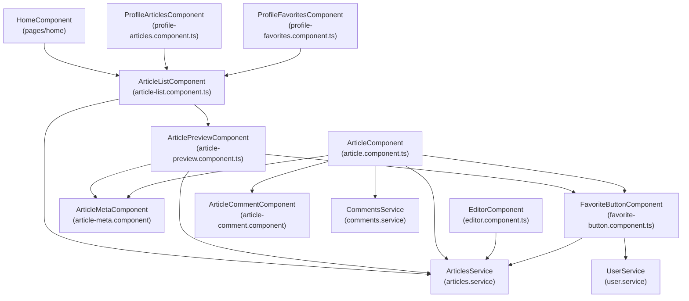
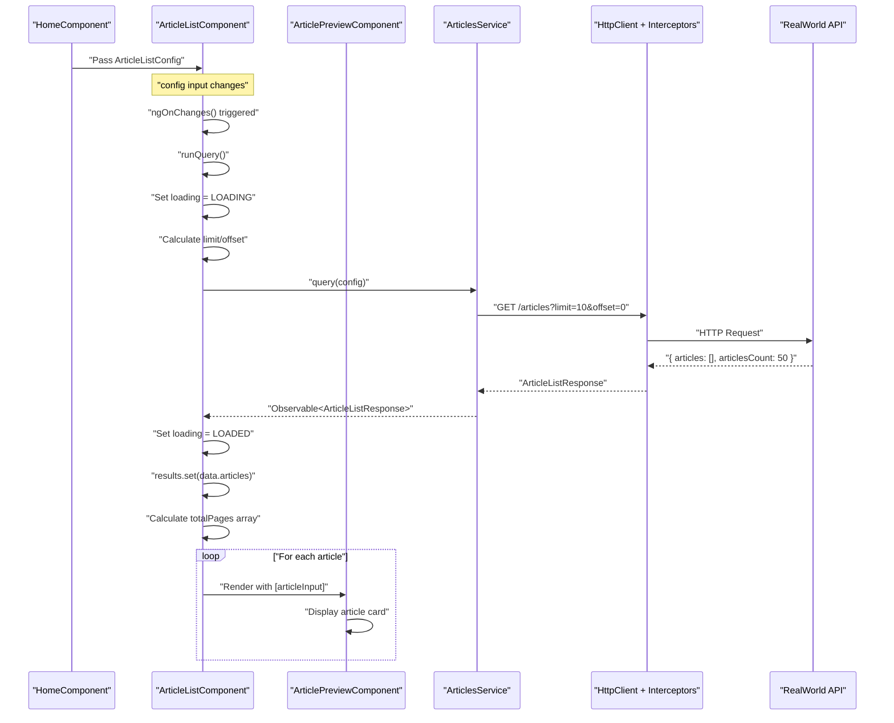
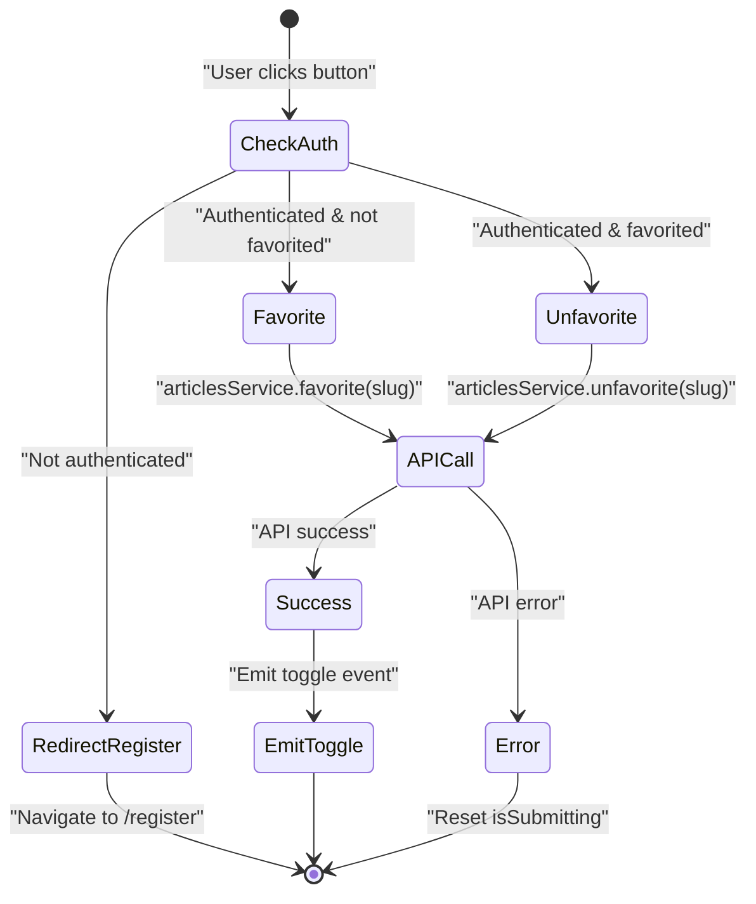
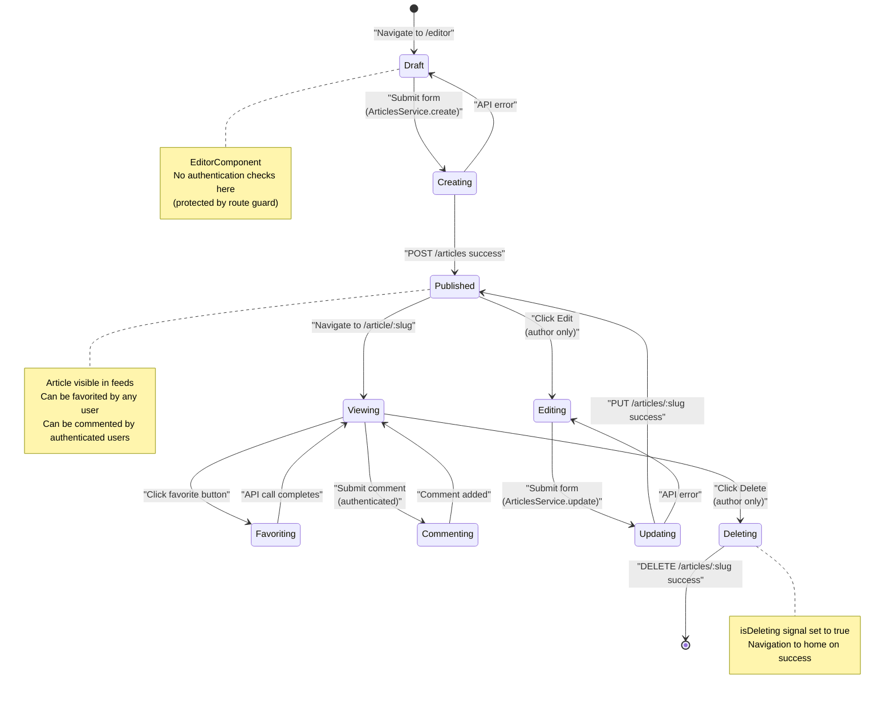

# Articles Feature

<details>
<summary>Relevant source files</summary>

The following files were used as context for generating this wiki page:

- [src/app/core/auth/if-authenticated.directive.ts](../src/app/core/auth/if-authenticated.directive.ts)
- [src/app/features/article/components/article-list.component.ts](../src/app/features/article/components/article-list.component.ts)
- [src/app/features/article/components/article-preview.component.ts](../src/app/features/article/components/article-preview.component.ts)
- [src/app/features/article/components/favorite-button.component.ts](../src/app/features/article/components/favorite-button.component.ts)
- [src/app/features/article/pages/article/article.component.ts](../src/app/features/article/pages/article/article.component.ts)
- [src/app/features/article/pages/editor/editor.component.ts](../src/app/features/article/pages/editor/editor.component.ts)
- [src/app/features/profile/components/follow-button.component.ts](../src/app/features/profile/components/follow-button.component.ts)
- [src/app/features/profile/components/profile-articles.component.ts](../src/app/features/profile/components/profile-articles.component.ts)
- [src/app/features/profile/components/profile-favorites.component.ts](../src/app/features/profile/components/profile-favorites.component.ts)
- [src/app/features/profile/pages/profile/profile.component.ts](../src/app/features/profile/pages/profile/profile.component.ts)

</details>

## Purpose and Scope

The Articles Feature encompasses all functionality related to article creation, viewing, listing, and interaction within the RealWorld application. This includes article CRUD operations, pagination, favoriting, commenting, and the display of article metadata. This document provides an overview of the feature's architecture and component interactions.

For detailed information about specific subsystems:

- Article listing and pagination mechanics: see [Article List & Pagination](5.1.1-article-list-and-pagination.md)
- Article detail page and commenting system: see [Article Detail & Comments](5.1.2-article-detail-and-comments.md)
- Article creation and editing: see [Article Editor](5.1.3-article-editor.md)
- User profile display: see [User Profiles](5.2-user-profiles.md)
- Authentication UI: see [Settings & Authentication UI](5.3-settings-and-authentication-ui.md)
- Home page feed: see [Home Page & Feed Navigation](5.4-home-page-and-feed-navigation.md)

---

## Component Architecture

### Component Hierarchy

The Articles Feature is organized around several key components that work together to provide article functionality throughout the application.



**Sources:** `src/app/features/article/components/article-list.component.ts:1-135`, `src/app/features/article/components/article-preview.component.ts:1-51`, `src/app/features/article/pages/article/article.component.ts:1-162`, `src/app/features/article/pages/editor/editor.component.ts:1-96`, `src/app/features/profile/components/profile-articles.component.ts:1-43`, `src/app/features/profile/components/profile-favorites.component.ts:1-44`

---

## Data Flow Architecture

### Article Query and Display Flow

This diagram illustrates how article data flows from API requests through services to UI components.



**Sources:** `src/app/features/article/components/article-list.component.ts:79-133`, `src/app/features/article/components/article-preview.component.ts:1-51`

---

## Core Components

### ArticleListComponent

`ArticleListComponent` is a reusable component that displays paginated lists of articles based on configurable query parameters.

**Key Responsibilities:**

- Execute article queries with filters (author, tag, favorited)
- Manage pagination state and UI
- Display loading states
- Render article previews using `ArticlePreviewComponent`
- Emit page change events to parent components

**Component Inputs:**
| Input | Type | Description |
|-------|------|-------------|
| `config` | `ArticleListConfig` | Query configuration including type and filters |
| `limit` | `number` | Articles per page |
| `currentPage` | `number` | Current page number |
| `isFollowingFeed` | `boolean` | Flag for feed-specific empty state message |

**Component Outputs:**
| Output | Type | Description |
|--------|------|-------------|
| `pageChange` | `EventEmitter<number>` | Emits when user navigates to different page |

**State Management:**

The component uses Angular signals for reactive state:

- `results = signal<Article[]>([])` - Current page articles
- `page = signal(1)` - Active page number
- `totalPages = signal<number[]>([])` - Array of page numbers for pagination UI
- `loading = signal(LoadingState.NOT_LOADED)` - Loading state tracking

**Sources:** `src/app/features/article/components/article-list.component.ts:1-135`

---

### ArticlePreviewComponent

`ArticlePreviewComponent` renders individual article cards within lists, displaying article metadata and providing favoriting functionality.

**Key Features:**

- Displays article title, description, and tag list
- Shows author metadata via `ArticleMetaComponent`
- Integrates `FavoriteButtonComponent` for favoriting
- Clickable link to full article detail
- Updates favorite count optimistically on user interaction

**Local State Management:**

```typescript
article = signal<Article>(null!);

toggleFavorite(favorited: boolean): void {
  this.article.update(article => ({
    ...article,
    favorited,
    favoritesCount: favorited ? article.favoritesCount + 1 : article.favoritesCount - 1,
  }));
}
```

The component maintains local article state and updates it optimistically when the favorite button is toggled, providing immediate UI feedback.

**Sources:** `src/app/features/article/components/article-preview.component.ts:1-51`

---

### ArticleComponent (Article Detail Page)

`ArticleComponent` provides the full article view including article content, comments, and interaction buttons.

**Component Structure:**

```mermaid
graph TB
    ArticleComponent["ArticleComponent"]

    subgraph "Article Header"
        ArticleMeta1["ArticleMetaComponent"]
        FollowBtn1["FollowButtonComponent"]
        FavoriteBtn1["FavoriteButtonComponent"]
        DeleteBtn["Delete Button<br/>(if canModify)"]
    end

    subgraph "Article Body"
        Content["Article Content<br/>(markdown rendered)"]
    end

    subgraph "Article Footer"
        ArticleMeta2["ArticleMetaComponent"]
        FollowBtn2["FollowButtonComponent"]
        FavoriteBtn2["FavoriteButtonComponent"]
    end

    subgraph "Comments Section"
        CommentForm["Comment Form<br/>(if authenticated)"]
        CommentList["Comment List"]
    end

    ArticleComponent --> ArticleMeta1
    ArticleComponent --> FollowBtn1
    ArticleComponent --> FavoriteBtn1
    ArticleComponent --> DeleteBtn
    ArticleComponent --> Content
    ArticleComponent --> ArticleMeta2
    ArticleComponent --> FollowBtn2
    ArticleComponent --> FavoriteBtn2
    ArticleComponent --> CommentForm
    ArticleComponent --> CommentList
```



**Initialization Flow:**

On component initialization, the component makes parallel requests for article data, comments, and current user:

```typescript
// From article.component.ts:69-83
combineLatest([this.articleService.get(slug), this.commentsService.getAll(slug), this.userService.currentUser]);
```

This pattern ensures all required data is loaded before rendering, with a single subscription managing the entire initialization.

**State Signals:**

- `article = signal<Article | null>(null)` - Article data
- `currentUser = signal<User | null>(null)` - Current authenticated user
- `comments = signal<Comment[]>([])` - Article comments
- `canModify = signal(false)` - Whether user can edit/delete article
- `isSubmitting = signal(false)` - Comment submission state
- `isDeleting = signal(false)` - Article deletion state

**Sources:** `src/app/features/article/pages/article/article.component.ts:1-162`

---

### EditorComponent (Create/Edit Articles)

`EditorComponent` provides a form-based interface for creating new articles and editing existing ones.

**Form Structure:**

The component uses Angular's reactive forms with typed form controls:

```typescript
interface ArticleForm {
  title: FormControl<string>;
  description: FormControl<string>;
  body: FormControl<string>;
}

articleForm: UntypedFormGroup = new FormGroup<ArticleForm>({
  title: new FormControl('', { nonNullable: true }),
  description: new FormControl('', { nonNullable: true }),
  body: new FormControl('', { nonNullable: true }),
});
```

**Tag Management:**

Tags are managed separately from the main form using a signal and dedicated input:

- `tagList = signal<string[]>([])` - Current article tags
- `tagField = new FormControl<string>('')` - Tag input field
- `addTag()` method adds tags if not already present
- `removeTag(tagName)` method filters out specified tag

**Edit Mode:**

When a slug is present in the route, the component:

1. Fetches the existing article
2. Verifies the current user is the author
3. Populates the form with article data
4. Redirects to home if user is not the author

**Sources:** `src/app/features/article/pages/editor/editor.component.ts:1-96`

---

## Interactive Components

### FavoriteButtonComponent

`FavoriteButtonComponent` provides a reusable button for favoriting/unfavoriting articles with authentication checks.

**Authentication Flow:**



**Implementation Pattern:**

The component uses RxJS operators to chain authentication check with API call:

```typescript
// From favorite-button.component.ts:53-68
this.userService.isAuthenticated.pipe(
  switchMap(authenticated => {
    if (!authenticated) {
      void this.router.navigate(['/register']);
      return EMPTY;
    }

    if (!this.article.favorited) {
      return this.articleService.favorite(this.article.slug);
    } else {
      return this.articleService.unfavorite(this.article.slug);
    }
  }),
  takeUntilDestroyed(this.destroyRef),
);
```

This pattern ensures unauthenticated users are redirected before attempting API calls.

**Sources:** `src/app/features/article/components/favorite-button.component.ts:1-80`

---

### FollowButtonComponent

`FollowButtonComponent` enables users to follow/unfollow article authors with similar authentication patterns to `FavoriteButtonComponent`.

**Key Differences from FavoriteButtonComponent:**

- Redirects to `/login` instead of `/register` for unauthenticated users
- Uses `ProfileService` instead of `ArticlesService`
- Operates on `Profile` objects instead of `Article` objects
- Emits the updated `Profile` object on successful toggle

**API Interaction:**

```typescript
// From follow-button.component.ts:63-67
if (!this.profile.following) {
  return this.profileService.follow(this.profile.username);
} else {
  return this.profileService.unfollow(this.profile.username);
}
```

**Sources:** `src/app/features/profile/components/follow-button.component.ts:1-82`

---

## Component Reuse Patterns

### ArticleListComponent Reuse

`ArticleListComponent` is designed for maximum reusability across different contexts by accepting configuration through inputs.

**Usage Contexts:**

| Context              | Component                   | Config Type                               | Filter Used       |
| -------------------- | --------------------------- | ----------------------------------------- | ----------------- |
| Home - Global Feed   | `HomeComponent`             | `{ type: 'all', filters: {} }`            | All articles      |
| Home - Personal Feed | `HomeComponent`             | `{ type: 'feed', filters: {} }`           | Followed authors  |
| Home - Tag Filter    | `HomeComponent`             | `{ type: 'all', filters: { tag } }`       | Articles with tag |
| Profile - Author     | `ProfileArticlesComponent`  | `{ type: 'all', filters: { author } }`    | User's articles   |
| Profile - Favorites  | `ProfileFavoritesComponent` | `{ type: 'all', filters: { favorited } }` | User's favorites  |

**ProfileArticlesComponent Example:**

```typescript
// From profile-articles.component.ts:33-39
this.articlesConfig.set({
  type: 'all',
  filters: {
    author: profile.username,
  },
});
```

**ProfileFavoritesComponent Example:**

```typescript
// From profile-favorites.component.ts:34-39
this.favoritesConfig.set({
  type: 'all',
  filters: {
    favorited: profile.username,
  },
});
```

Both components configure `ArticleListComponent` differently but rely on the same underlying implementation for querying, pagination, and display.

**Sources:** `src/app/features/profile/components/profile-articles.component.ts:1-43`, `src/app/features/profile/components/profile-favorites.component.ts:1-44`

---

## Authentication Integration

### Conditional Rendering with IfAuthenticatedDirective

The Articles Feature uses `IfAuthenticatedDirective` to conditionally show/hide UI elements based on authentication state.

**Directive Logic:**

```typescript
// From if-authenticated.directive.ts:21-32
this.userService.isAuthenticated.subscribe((isAuthenticated: boolean) => {
  const authRequired = isAuthenticated && this.condition();
  const unauthRequired = !isAuthenticated && !this.condition();

  if ((authRequired || unauthRequired) && !this.hasView()) {
    this.viewContainer.createEmbeddedView(this.templateRef);
    this.hasView.set(true);
  } else if (this.hasView()) {
    this.viewContainer.clear();
    this.hasView.set(false);
  }
});
```

**Usage in Article Detail:**

The directive controls visibility of:

- Comment form (authenticated only)
- Edit/delete buttons (authenticated author only)
- Follow/favorite buttons with login prompts

**Pattern:**

- `*ifAuthenticated="true"` - Show if authenticated
- `*ifAuthenticated="false"` - Show if NOT authenticated

This provides declarative authentication-based rendering without conditional logic in component code.

**Sources:** `src/app/core/auth/if-authenticated.directive.ts:1-39`, `src/app/features/article/pages/article/article.component.ts:1-162`

---

## Article Lifecycle

### State Transitions

This diagram shows the complete lifecycle of an article from creation to deletion.



**Sources:** `src/app/features/article/pages/editor/editor.component.ts:73-95`, `src/app/features/article/pages/article/article.component.ts:107-119`, `src/app/features/article/components/favorite-button.component.ts:50-78`

---

## Data Models

### ArticleListConfig

Configuration object for querying articles:

```typescript
interface ArticleListConfig {
  type: 'all' | 'feed';
  filters: {
    tag?: string;
    author?: string;
    favorited?: string;
    limit?: number;
    offset?: number;
  };
}
```

**Filter Combinations:**

- `type: 'feed'` - Fetches articles from followed users (requires authentication)
- `filters.tag` - Filters by tag
- `filters.author` - Filters by article author username
- `filters.favorited` - Filters by user who favorited the article
- `filters.limit` and `filters.offset` - Pagination parameters

These filters can be combined (e.g., `author + tag`) to create specific queries.

**Sources:** `src/app/features/article/components/article-list.component.ts:14`

---

### Article Model

The `Article` type represents article data throughout the application:

**Key Properties:**

- `slug: string` - URL-friendly unique identifier
- `title: string` - Article title
- `description: string` - Brief summary
- `body: string` - Full article content (markdown)
- `tagList: string[]` - Associated tags
- `createdAt: string` - ISO timestamp
- `updatedAt: string` - ISO timestamp
- `favorited: boolean` - Whether current user favorited
- `favoritesCount: number` - Total favorite count
- `author: Profile` - Author profile information

The article model integrates with the `Profile` model for author information, enabling features like following article authors.

**Sources:** `src/app/features/article/components/article-list.component.ts:15`, `src/app/features/article/components/article-preview.component.ts:2`

---

## Loading States

### LoadingState Enum

The Articles Feature uses a three-state loading pattern:

```typescript
enum LoadingState {
  NOT_LOADED, // Initial state
  LOADING, // Fetching data
  LOADED, // Data available
}
```

**Usage in ArticleListComponent:**

```typescript
// Initial state
loading = signal(LoadingState.NOT_LOADED);

// Start query
runQuery() {
  this.loading.set(LoadingState.LOADING);
  this.results.set([]);  // Clear previous results

  this.articlesService.query(this.query).subscribe(data => {
    this.loading.set(LoadingState.LOADED);
    this.results.set(data.articles);
  });
}
```

**UI Rendering:**

```typescript
// Template conditions
@if (loading() === LoadingState.LOADING) {
  <div class="article-preview">Loading articles...</div>
}

@if (loading() === LoadingState.LOADED) {
  // Render articles or empty state
}
```

This pattern ensures users see appropriate loading feedback during data fetching.

**Sources:** `src/app/features/article/components/article-list.component.ts:19`, `src/app/features/article/components/article-list.component.ts:25-54`, `src/app/features/article/components/article-list.component.ts:111-133`

---

## Pagination Implementation

### Pagination State and UI

`ArticleListComponent` implements client-side pagination state with server-side data fetching.

**Page Calculation:**

```typescript
// From article-list.component.ts:116-119
if (this.limit) {
  this.query.filters.limit = this.limit;
  this.query.filters.offset = this.limit * (this.page() - 1);
}
```

**Total Pages Calculation:**

```typescript
// From article-list.component.ts:129-131
this.totalPages.set(Array.from(new Array(Math.ceil(data.articlesCount / this.limit)), (val, index) => index + 1));
```

This creates an array `[1, 2, 3, ..., n]` for rendering page buttons.

**Page Navigation:**

```typescript
// From article-list.component.ts:103-109
setPageTo(pageNumber: number) {
  if (pageNumber !== this.page()) {
    this.page.set(pageNumber);
    this.pageChange.emit(pageNumber);  // Notify parent
    this.runQuery();                   // Fetch new page
  }
}
```

**Parent-Child Coordination:**

The component supports two pagination patterns:

1. **Internal state:** Component manages page state internally
2. **Parent-controlled:** Parent passes `currentPage` input and listens to `pageChange` output

This enables URL-based pagination where the parent component updates the route on page changes.

**Sources:** `src/app/features/article/components/article-list.component.ts:103-133`

---

## Error Handling

### Component-Level Error Management

Each component maintains its own error state using signals:

**Article Detail Component:**

```typescript
// From article.component.ts:50-54
errors = signal<Errors | null>(null);
commentFormErrors = signal<Errors | null>(null);
deleteCommentErrors = signal<Errors | null>(null);
```

This separation allows the UI to display errors contextually (e.g., comment form errors don't affect article display errors).

**Editor Component:**

```typescript
// From editor.component.ts:32
errors = signal<Errors | null>(null);
```

**Error Display:**

All error-handling components use `ListErrorsComponent` for consistent error presentation, which receives the `Errors` object and renders validation messages appropriately.

**Sources:** `src/app/features/article/pages/article/article.component.ts:50-54`, `src/app/features/article/pages/editor/editor.component.ts:32`

---

## Service Integration

### ArticlesService Methods

The Articles Feature interacts with `ArticlesService` for all article-related API operations:

| Method             | Purpose                     | HTTP Request                            |
| ------------------ | --------------------------- | --------------------------------------- |
| `query(config)`    | Fetch articles with filters | `GET /articles` or `GET /articles/feed` |
| `get(slug)`        | Fetch single article        | `GET /articles/:slug`                   |
| `create(article)`  | Create new article          | `POST /articles`                        |
| `update(article)`  | Update existing article     | `PUT /articles/:slug`                   |
| `delete(slug)`     | Delete article              | `DELETE /articles/:slug`                |
| `favorite(slug)`   | Favorite article            | `POST /articles/:slug/favorite`         |
| `unfavorite(slug)` | Unfavorite article          | `DELETE /articles/:slug/favorite`       |

### CommentsService Methods

Comment operations use `CommentsService`:

| Method             | Purpose                | HTTP Request                          |
| ------------------ | ---------------------- | ------------------------------------- |
| `getAll(slug)`     | Fetch article comments | `GET /articles/:slug/comments`        |
| `add(slug, body)`  | Add comment            | `POST /articles/:slug/comments`       |
| `delete(id, slug)` | Delete comment         | `DELETE /articles/:slug/comments/:id` |

All service methods return RxJS Observables, which components subscribe to using `takeUntilDestroyed(this.destroyRef)` for automatic cleanup.

**Sources:** `src/app/features/article/pages/article/article.component.ts:6-7`, `src/app/features/article/components/article-list.component.ts:13`

---

---

[← Back to documentation index](README.md)
