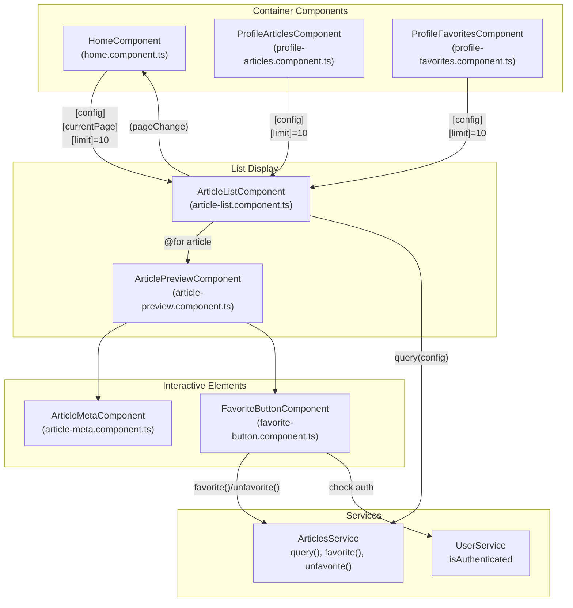
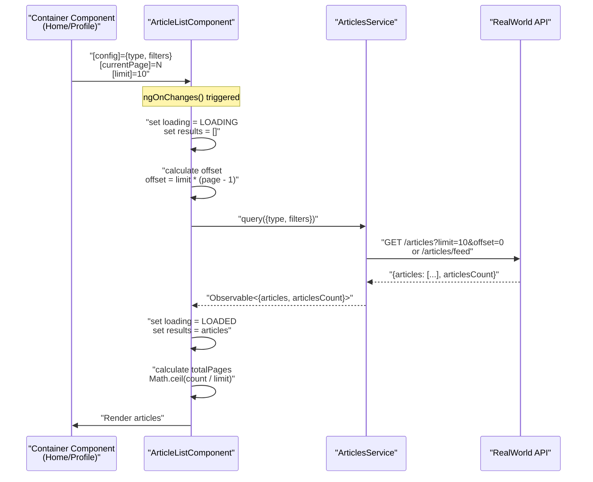
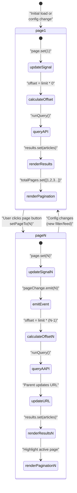
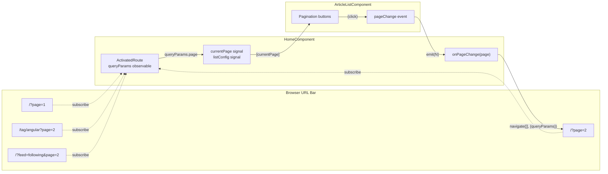
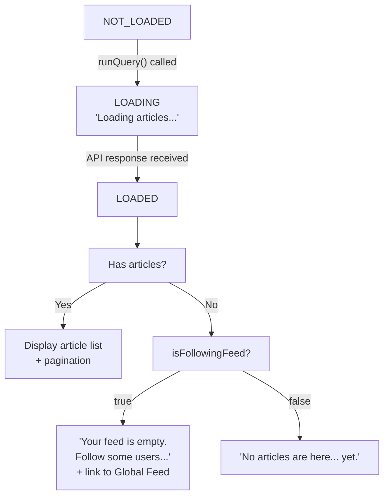
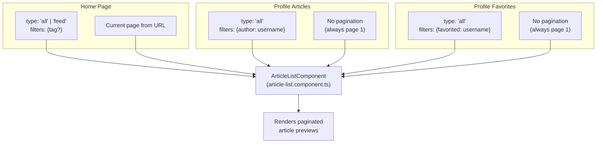
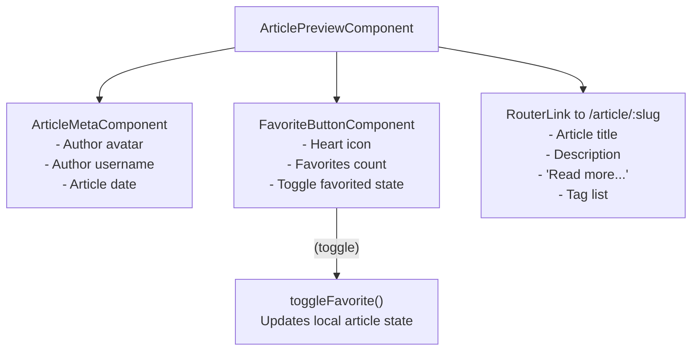

# Article List & Pagination

<details>
<summary>Relevant source files</summary>

The following files were used as context for generating this wiki page:

- [e2e/url-navigation.spec.ts](../e2e/url-navigation.spec.ts)
- [src/app/core/auth/if-authenticated.directive.ts](../src/app/core/auth/if-authenticated.directive.ts)
- [src/app/features/article/components/article-list.component.ts](../src/app/features/article/components/article-list.component.ts)
- [src/app/features/article/components/article-preview.component.ts](../src/app/features/article/components/article-preview.component.ts)
- [src/app/features/article/components/favorite-button.component.ts](../src/app/features/article/components/favorite-button.component.ts)
- [src/app/features/article/pages/editor/editor.component.html](../src/app/features/article/pages/editor/editor.component.html)
- [src/app/features/article/pages/editor/editor.component.ts](../src/app/features/article/pages/editor/editor.component.ts)
- [src/app/features/article/pages/home/home.component.html](../src/app/features/article/pages/home/home.component.html)
- [src/app/features/article/pages/home/home.component.ts](../src/app/features/article/pages/home/home.component.ts)
- [src/app/features/profile/components/follow-button.component.ts](../src/app/features/profile/components/follow-button.component.ts)
- [src/app/features/profile/components/profile-articles.component.ts](../src/app/features/profile/components/profile-articles.component.ts)
- [src/app/features/profile/components/profile-favorites.component.ts](../src/app/features/profile/components/profile-favorites.component.ts)

</details>

## Purpose and Scope

This document details the article list and pagination system, which provides a reusable, configurable component for displaying paginated lists of articles throughout the application. The `ArticleListComponent` is used on the home page, profile pages, and anywhere articles need to be displayed in a list format with pagination controls.

For information about viewing individual article details, see [Article Detail & Comments](5.1.2-article-detail-and-comments.md). For article creation and editing functionality, see [Article Editor](5.1.3-article-editor.md). For the home page's feed navigation and tag filtering, see [Home Page & Feed Navigation](5.4-home-page-and-feed-navigation.md).

---

## Component Architecture

The article list system consists of three primary components that work together to display paginated article lists:



**Sources:** `src/app/features/article/components/article-list.component.ts:1-134`, `src/app/features/article/components/article-preview.component.ts:1-51`, `src/app/features/article/pages/home/home.component.ts:1-94`, `src/app/features/profile/components/profile-articles.component.ts:1-43`, `src/app/features/profile/components/profile-favorites.component.ts:1-44`

### Component Responsibilities

| Component                 | Responsibility                                                    | Key Inputs                                          | Key Outputs                     |
| ------------------------- | ----------------------------------------------------------------- | --------------------------------------------------- | ------------------------------- |
| `ArticleListComponent`    | Queries and displays paginated articles, handles pagination logic | `config`, `limit`, `currentPage`, `isFollowingFeed` | `pageChange` event              |
| `ArticlePreviewComponent` | Displays individual article preview card                          | `articleInput` (Article)                            | None (contains favorite button) |
| `FavoriteButtonComponent` | Handles article favoriting/unfavoriting                           | `article` (Article)                                 | `toggle` event                  |
| `ArticleMetaComponent`    | Displays article author metadata and date                         | `article` (Article)                                 | None                            |

---

## Data Flow & Configuration

The article list system uses the `ArticleListConfig` model to configure what articles to display:



**Sources:** `src/app/features/article/components/article-list.component.ts:79-133`

### ArticleListConfig Model

The `ArticleListConfig` interface defines the query configuration:

```typescript
interface ArticleListConfig {
  type: 'all' | 'feed';
  filters: {
    tag?: string;
    author?: string;
    favorited?: string;
    limit?: number;
    offset?: number;
  };
}
```

**Configuration Examples:**

| Use Case           | Config                                            |
| ------------------ | ------------------------------------------------- |
| Global Feed        | `{type: 'all', filters: {}}`                      |
| Your Feed          | `{type: 'feed', filters: {}}`                     |
| Tag Filter         | `{type: 'all', filters: {tag: 'angular'}}`        |
| User's Articles    | `{type: 'all', filters: {author: 'username'}}`    |
| Favorited Articles | `{type: 'all', filters: {favorited: 'username'}}` |

**Sources:** `src/app/features/article/models/article-list-config.model.ts` (referenced), `src/app/features/article/pages/home/home.component.ts:23-26,57-71`, `src/app/features/profile/components/profile-articles.component.ts:34-39`, `src/app/features/profile/components/profile-favorites.component.ts:34-39`

---

## Pagination Mechanism

The pagination system synchronizes page state between the component, URL query parameters, and the backend API.

### Pagination State Flow



**Sources:** `src/app/features/article/components/article-list.component.ts:103-133`

### Key Methods

**`setPageTo(pageNumber: number)`** `src/app/features/article/components/article-list.component.ts:103-109`

Handles user clicks on pagination buttons:

1. Checks if page number changed
2. Updates `page` signal
3. Emits `pageChange` event to parent
4. Triggers `runQuery()` to fetch new page

**`runQuery()`** `src/app/features/article/components/article-list.component.ts:111-133`

Executes the article query:

1. Sets loading state to `LoadingState.LOADING`
2. Clears current results
3. Calculates `offset = limit * (page - 1)`
4. Calls `articlesService.query(config)`
5. Updates results and calculates total pages

**`ngOnChanges(changes: SimpleChanges)`** `src/app/features/article/components/article-list.component.ts:79-99`

Responds to input changes:

- When `config` changes: Updates query and resets to page 1 (unless `currentPage` also changed)
- When `currentPage` changes: Updates page signal
- Triggers `runQuery()` if config or page changed

---

## URL-Based Pagination

The home component manages pagination state through URL query parameters, enabling bookmarkable and shareable paginated views.



**Sources:** `src/app/features/article/pages/home/home.component.ts:41-93`, `e2e/url-navigation.spec.ts:109-244`

### URL Parameter Handling

The `HomeComponent.ngOnInit()` subscribes to route changes `src/app/features/article/pages/home/home.component.ts:41-73`:

```typescript
combineLatest([
  this.userService.isAuthenticated,
  this.route.params, // For /tag/:tag
  this.route.queryParams, // For ?feed=following&page=N
]).subscribe(([isAuthenticated, params, queryParams]) => {
  const page = queryParams['page'] ? parseInt(queryParams['page'], 10) : 1;
  this.currentPage.set(page);
  // ... configure listConfig based on params
});
```

The `onPageChange()` method updates the URL `src/app/features/article/pages/home/home.component.ts:75-93`:

```typescript
onPageChange(page: number): void {
  const queryParams: { page?: number; feed?: string } = {};

  // Preserve feed param if present
  const currentFeed = this.route.snapshot.queryParams['feed'];
  if (currentFeed) {
    queryParams.feed = currentFeed;
  }

  // Only add page param if not page 1
  if (page > 1) {
    queryParams.page = page;
  }

  void this.router.navigate([], {
    relativeTo: this.route,
    queryParams,
  });
}
```

### URL Patterns

| URL                       | Behavior            |
| ------------------------- | ------------------- |
| `/`                       | Global feed, page 1 |
| `/?page=2`                | Global feed, page 2 |
| `/?feed=following`        | Your feed, page 1   |
| `/?feed=following&page=2` | Your feed, page 2   |
| `/tag/angular`            | Tag filter, page 1  |
| `/tag/angular?page=2`     | Tag filter, page 2  |

**Sources:** `e2e/url-navigation.spec.ts:109-244`

---

## Loading States & Empty Messages

The component uses the `LoadingState` enum to manage display states:



**Sources:** `src/app/features/article/components/article-list.component.ts:25-54`

### Template Logic

The component template uses Angular's new control flow syntax `src/app/features/article/components/article-list.component.ts:24-54`:

```html
@if (loading() === LoadingState.LOADING) {
<div class="article-preview">Loading articles...</div>
} @if (loading() === LoadingState.LOADED) { @for (article of results(); track article.slug) {
<app-article-preview [articleInput]="article" />
} @empty {
<div class="article-preview empty-feed-message">
  @if (isFollowingFeed) { Your feed is empty. Follow some users to see their articles here, or check out the
  <a routerLink="/">Global Feed</a>! } @else { No articles are here... yet. }
</div>
}

<nav>
  <ul class="pagination">
    @for (pageNumber of totalPages(); track pageNumber) {
    <li class="page-item" [ngClass]="{ active: pageNumber === page() }">
      <button class="page-link" (click)="setPageTo(pageNumber)">{{ pageNumber }}</button>
    </li>
    }
  </ul>
</nav>
}
```

### Empty Feed Messages

The `isFollowingFeed` input `src/app/features/article/components/article-list.component.ts:76` determines which empty message to display:

- **Your Feed (empty):** Shows a helpful message with a link to the Global Feed `src/app/features/article/components/article-list.component.ts:34-36`
- **Other feeds (empty):** Shows generic "No articles are here... yet." message `src/app/features/article/components/article-list.component.ts:38`

**Sources:** `e2e/url-navigation.spec.ts:88-100`

---

## Component Signals & Reactive State

The `ArticleListComponent` uses Angular signals for reactive state management:

| Signal       | Type                   | Purpose                                                     |
| ------------ | ---------------------- | ----------------------------------------------------------- |
| `results`    | `signal<Article[]>`    | Currently displayed articles                                |
| `page`       | `signal<number>`       | Current page number (1-indexed)                             |
| `totalPages` | `signal<number[]>`     | Array of page numbers for pagination UI (e.g., `[1, 2, 3]`) |
| `loading`    | `signal<LoadingState>` | Current loading state                                       |

**Sources:** `src/app/features/article/components/article-list.component.ts:66-70`

### Total Pages Calculation

The total pages array is calculated after each successful query `src/app/features/article/components/article-list.component.ts:128-131`:

```typescript
this.totalPages.set(Array.from(new Array(Math.ceil(data.articlesCount / this.limit)), (val, index) => index + 1));
```

This creates an array like `[1, 2, 3]` for 3 pages, which is then rendered as pagination buttons.

---

## Component Reuse Patterns

The `ArticleListComponent` is designed for maximum reusability across different contexts:



**Sources:** `src/app/features/article/pages/home/home.component.html:41-47`, `src/app/features/profile/components/profile-articles.component.ts:11-13`, `src/app/features/profile/components/profile-favorites.component.ts:11-13`

### Usage Examples

**Home Page** `src/app/features/article/pages/home/home.component.html:41-47`:

```html
<app-article-list
  [limit]="10"
  [config]="listConfig()"
  [currentPage]="currentPage()"
  [isFollowingFeed]="isFollowingFeed()"
  (pageChange)="onPageChange($event)"
/>
```

**Profile Articles** `src/app/features/profile/components/profile-articles.component.ts:11-13`:

```html
<app-article-list [limit]="10" [config]="articlesConfig()!" />
```

**Profile Favorites** `src/app/features/profile/components/profile-favorites.component.ts:11-13`:

```html
<app-article-list [limit]="10" [config]="favoritesConfig()!" />
```

### Key Design Decisions

1. **Stateless Design**: The component doesn't manage route state itself; the parent component handles URL navigation
2. **Event-Based Communication**: Pagination clicks emit events rather than directly navigating
3. **Configuration-Based**: All query logic is driven by the `ArticleListConfig` input
4. **Separation of Concerns**: Loading states, pagination logic, and article display are cleanly separated

**Sources:** `src/app/features/article/components/article-list.component.ts:64-134`

---

## Article Preview Card

Each article in the list is rendered using `ArticlePreviewComponent`, which displays:



**Sources:** `src/app/features/article/components/article-preview.component.ts:1-51`

### Favorite State Management

When a user toggles the favorite button, the preview component updates its local article state optimistically `src/app/features/article/components/article-preview.component.ts:43-49`:

```typescript
toggleFavorite(favorited: boolean): void {
  this.article.update(article => ({
    ...article,
    favorited,
    favoritesCount: favorited
      ? article.favoritesCount + 1
      : article.favoritesCount - 1,
  }));
}
```

The `FavoriteButtonComponent` checks authentication before allowing the action `src/app/features/article/components/favorite-button.component.ts:50-78`:

- If authenticated: Calls `articlesService.favorite()` or `unfavorite()`
- If not authenticated: Redirects to `/register`

**Sources:** `src/app/features/article/components/favorite-button.component.ts:50-78`

---

## Change Detection Strategy

All components in the article list system use `ChangeDetectionStrategy.OnPush` for optimal performance:

- **ArticleListComponent**: `src/app/features/article/components/article-list.component.ts:62`
- **ArticlePreviewComponent**: `src/app/features/article/components/article-preview.component.ts:33`
- **FavoriteButtonComponent**: `src/app/features/article/components/favorite-button.component.ts:38`

This strategy ensures change detection only runs when:

1. Input properties change (by reference)
2. Events are emitted from the component
3. Signals are updated
4. Observables bound with `async` pipe emit

**Sources:** `src/app/features/article/components/article-list.component.ts:62`, `src/app/features/article/components/article-preview.component.ts:33`, `src/app/features/article/components/favorite-button.component.ts:38`

---

## Memory Management

Components use `takeUntilDestroyed(destroyRef)` to automatically unsubscribe from observables when the component is destroyed:

```typescript
destroyRef = inject(DestroyRef);

this.articlesService
  .query(this.query)
  .pipe(takeUntilDestroyed(this.destroyRef))
  .subscribe(data => {
    // Handle response
  });
```

This pattern prevents memory leaks by ensuring subscriptions are cleaned up when the component is destroyed.

**Sources:** `src/app/features/article/components/article-list.component.ts:71,123`, `src/app/features/article/components/favorite-button.component.ts:38,67`

---

---

[← Back to documentation index](README.md)
