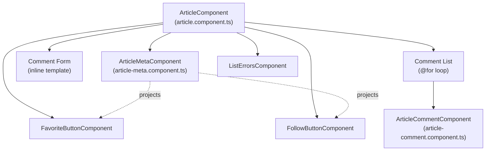
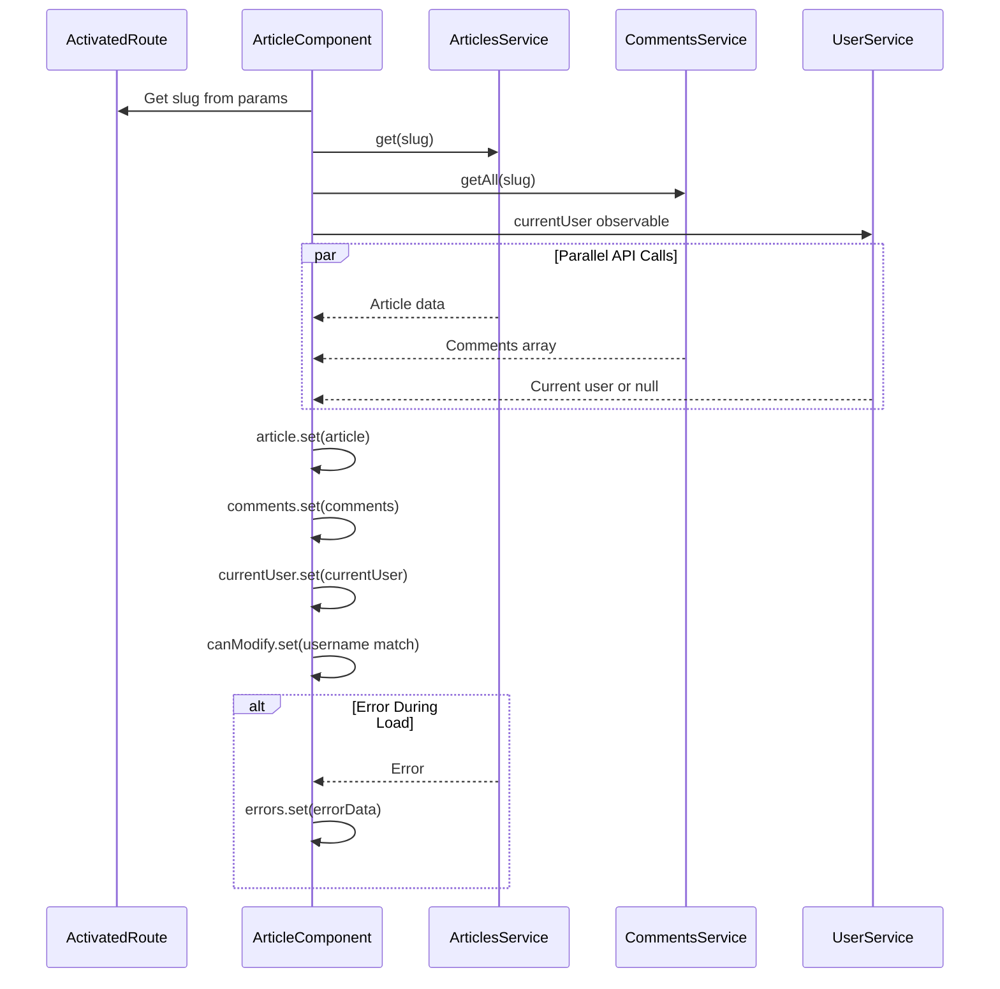
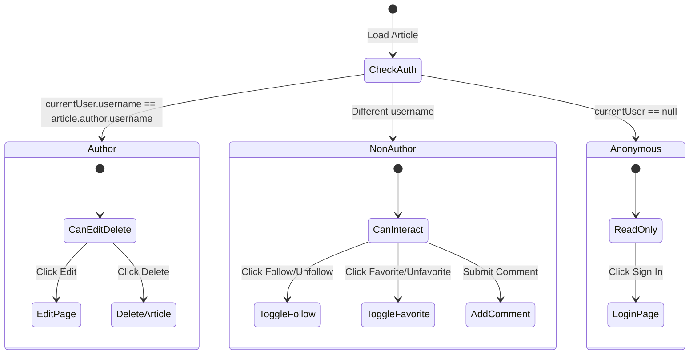
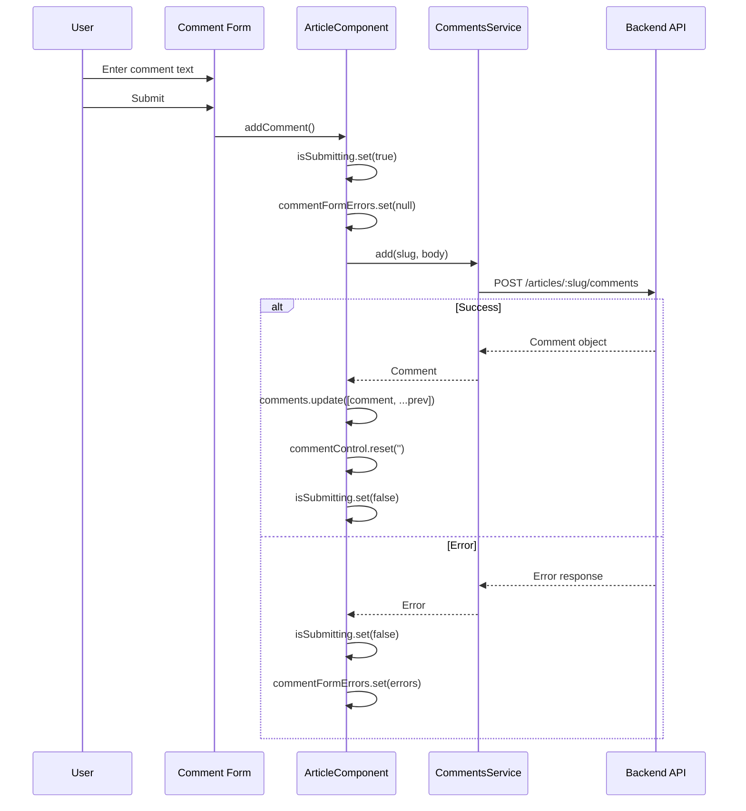

# Article Detail & Comments

<details>
<summary>Relevant source files</summary>

The following files were used as context for generating this wiki page:

- [e2e/null-fields.spec.ts](../e2e/null-fields.spec.ts)
- [src/app/core/auth/user.model.ts](../src/app/core/auth/user.model.ts)
- [src/app/features/article/components/article-comment.component.ts](../src/app/features/article/components/article-comment.component.ts)
- [src/app/features/article/components/article-meta.component.ts](../src/app/features/article/components/article-meta.component.ts)
- [src/app/features/article/pages/article/article.component.html](../src/app/features/article/pages/article/article.component.html)
- [src/app/features/article/pages/article/article.component.ts](../src/app/features/article/pages/article/article.component.ts)
- [src/app/features/profile/models/profile.model.ts](../src/app/features/profile/models/profile.model.ts)
- [src/app/features/profile/pages/profile/profile.component.html](../src/app/features/profile/pages/profile/profile.component.html)
- [src/app/features/profile/pages/profile/profile.component.ts](../src/app/features/profile/pages/profile/profile.component.ts)
- [src/app/features/profile/services/profile.service.ts](../src/app/features/profile/services/profile.service.ts)

</details>

## Purpose and Scope

This document describes the article detail page and comment system implementation. The article detail page displays a full article with metadata, allows authenticated users to interact via favoriting/following, and provides a complete comment system where users can add and delete comments.

For information about article creation and editing, see [Article Editor](5.1.3-article-editor.md). For article listing and pagination, see [Article List & Pagination](5.1.1-article-list-and-pagination.md).

## Component Architecture

The article detail page is implemented as a hierarchical component structure with a main container component and specialized child components for rendering specific UI elements.

### Component Hierarchy



**Sources:** `src/app/features/article/pages/article/article.component.ts:1-161`, `src/app/features/article/components/article-meta.component.ts:1-32`, `src/app/features/article/components/article-comment.component.ts:1-50`

### ArticleComponent

The main container component located at `src/app/features/article/pages/article/article.component.ts:45-161` manages the entire article detail page state and orchestrates interactions between child components.

#### State Management

The component uses Angular signals for reactive state management:

| Signal                | Type              | Purpose                                    |
| --------------------- | ----------------- | ------------------------------------------ |
| `article`             | `Article \| null` | Currently displayed article                |
| `currentUser`         | `User \| null`    | Authenticated user data                    |
| `comments`            | `Comment[]`       | List of comments for the article           |
| `canModify`           | `boolean`         | Whether current user is the article author |
| `errors`              | `Errors \| null`  | General page loading errors                |
| `commentFormErrors`   | `Errors \| null`  | Comment submission errors                  |
| `deleteCommentErrors` | `Errors \| null`  | Comment deletion errors                    |
| `isSubmitting`        | `boolean`         | Comment form submission state              |
| `isDeleting`          | `boolean`         | Article deletion in progress               |

**Sources:** `src/app/features/article/pages/article/article.component.ts:46-58`

#### Initialization Flow



The initialization at `src/app/features/article/pages/article/article.component.ts:68-84` uses `combineLatest` to load the article, comments, and current user data simultaneously. This ensures all required data is available before rendering.

**Sources:** `src/app/features/article/pages/article/article.component.ts:68-84`

## Article Display

### Banner Section

The banner displays the article title and metadata at the top of the page. Located at `src/app/features/article/pages/article/article.component.html:12-43`, it includes:

- Article title (H1)
- `ArticleMetaComponent` with author info and creation date
- Conditional action buttons based on authorship:
  - **Author view**: Edit and Delete buttons
  - **Non-author view**: Follow button and Favorite button

### Body Content

The article body is rendered at `src/app/features/article/pages/article/article.component.html:45-58` using the `MarkdownPipe` to convert Markdown content to HTML:

```typescript
<div [innerHTML]="a.body | markdown | async"></div>
```

Tags are displayed below the body as a list of styled badges.

**Sources:** `src/app/features/article/pages/article/article.component.html:12-58`

### ArticleMetaComponent

A presentational component at `src/app/features/article/components/article-meta.component.ts:1-32` that displays:

- Author profile image (with default avatar fallback via `DefaultImagePipe`)
- Author username (linked to profile page)
- Article creation date (formatted with `DatePipe`)

The component uses `<ng-content>` for content projection, allowing parent components to inject action buttons into the metadata display.

**Sources:** `src/app/features/article/components/article-meta.component.ts:7-32`

## Article Interactions

### Permission Model

The component implements a role-based permission system:



The `canModify` signal at `src/app/features/article/pages/article/article.component.ts:82` determines whether the current user is the article author by comparing usernames.

**Sources:** `src/app/features/article/pages/article/article.component.ts:82`

### Favorite Toggle

The `onToggleFavorite` method at `src/app/features/article/pages/article/article.component.ts:86-95` optimistically updates the article state when the favorite button is clicked:

- Updates the `favorited` boolean
- Increments or decrements `favoritesCount` accordingly

The actual API call is handled by the `FavoriteButtonComponent` (see [Interactive Buttons](6.2-interactive-buttons-favorite-and-follow.md)).

**Sources:** `src/app/features/article/pages/article/article.component.ts:86-95`

### Follow Toggle

The `toggleFollowing` method at `src/app/features/article/pages/article/article.component.ts:97-105` updates the author's follow status when the follow button is clicked, propagating the profile state change to the article's author property.

**Sources:** `src/app/features/article/pages/article/article.component.ts:97-105`

### Article Deletion

The `deleteArticle` method at `src/app/features/article/pages/article/article.component.ts:107-119` implements article deletion:

1. Sets `isDeleting` signal to `true` (disables delete button)
2. Calls `ArticlesService.delete(slug)`
3. Navigates to home page on success

The deletion flow is unidirectional—no error handling is implemented, as failed deletions will be caught by the global error interceptor.

**Sources:** `src/app/features/article/pages/article/article.component.ts:107-119`

## Comment System

### Comment Data Flow

```mermaid
graph TB
    User["User Input"]
    Form["Comment Form<br/>commentControl: FormControl"]
    Component["ArticleComponent<br/>addComment()"]
    Service["CommentsService<br/>add(slug, body)"]
    API["POST /articles/:slug/comments"]
    State["comments signal<br/>Comment[]"]
    List["Comment List<br/>@for loop"]
    CommentComp["ArticleCommentComponent"]

    User --> Form
    Form --> Component
    Component --> Service
    Service --> API
    API -.->|success| Service
    Service -.->|Comment| Component
    Component --> State
    State --> List
    List --> CommentComp

    CommentComp -.->|delete event| Component
    Component -.->|deleteComment()| Service
```

**Sources:** `src/app/features/article/pages/article/article.component.ts:121-160`

### Comment Form

The comment form at `src/app/features/article/pages/article/article.component.html:93-111` is conditionally rendered using the `IfAuthenticatedDirective`:

- **Authenticated**: Shows textarea and submit button
- **Unauthenticated**: Shows login/register links

The form uses a `FormControl` bound to `commentControl` at `src/app/features/article/pages/article/article.component.ts:52`. The fieldset is disabled during submission via the `isSubmitting` signal.

**Sources:** `src/app/features/article/pages/article/article.component.html:93-116`, `src/app/features/article/pages/article/article.component.ts:52`

### Adding Comments

The `addComment` method at `src/app/features/article/pages/article/article.component.ts:121-142` handles comment submission:



Key behaviors:

- New comments are prepended to the list (most recent first)
- Form is cleared on successful submission
- Errors are displayed above the form via `ListErrorsComponent`

**Sources:** `src/app/features/article/pages/article/article.component.ts:121-142`

### Comment Display

Comments are rendered at `src/app/features/article/pages/article/article.component.html:120-122` using an `@for` loop that iterates over the `comments` signal:

```html
@for (comment of comments(); track comment) {
<app-article-comment [comment]="comment" (delete)="deleteComment(comment)" />
}
```

Each comment is passed to an `ArticleCommentComponent` instance.

**Sources:** `src/app/features/article/pages/article/article.component.html:120-122`

### ArticleCommentComponent

Located at `src/app/features/article/components/article-comment.component.ts:10-50`, this component renders individual comments:

**Structure:**

- Comment body text
- Author profile image and username (linked to profile)
- Creation date (formatted with `DatePipe`)
- Delete icon (conditional based on authorship)

**Permission Check:**

The component uses an observable `canModify$` at `src/app/features/article/components/article-comment.component.ts:47-49` to determine if the delete icon should be shown:

```typescript
canModify$ = inject(UserService).currentUser.pipe(
  map((userData: User | null) => userData?.username === this.comment.author.username),
);
```

This compares the current user's username with the comment author's username. The delete icon is only visible to the comment author.

**Sources:** `src/app/features/article/components/article-comment.component.ts:10-50`

### Deleting Comments

The `deleteComment` method at `src/app/features/article/pages/article/article.component.ts:144-160` handles comment deletion:

1. Clears previous deletion errors
2. Calls `CommentsService.delete(commentId, slug)`
3. On success: Removes comment from the `comments` signal using `Array.filter()`
4. On error: Sets `deleteCommentErrors` for display

The deletion is optimistic—the comment is removed from the UI immediately upon successful API response.

**Sources:** `src/app/features/article/pages/article/article.component.ts:144-160`

## Error Handling

### Error Display Strategy

The component uses three separate error signals to isolate error contexts:

| Error Signal          | Display Location   | Purpose                          |
| --------------------- | ------------------ | -------------------------------- |
| `errors`              | Top of page        | Article/comment loading failures |
| `commentFormErrors`   | Above comment form | Comment submission failures      |
| `deleteCommentErrors` | Above comment list | Comment deletion failures        |

Each error is displayed using the `ListErrorsComponent`, which formats error messages consistently across the application.

**Sources:** `src/app/features/article/pages/article/article.component.ts:50-54`, `src/app/features/article/pages/article/article.component.html:2-9`, `src/app/features/article/pages/article/article.component.html:94`, `src/app/features/article/pages/article/article.component.html:118`

### Loading Error Handling

The initial load at `src/app/features/article/pages/article/article.component.ts:71-77` uses `catchError` to handle failures when loading the article, comments, or user data:

```typescript
.pipe(
  catchError(err => {
    this.errors.set(err.errors || { error: ['Failed to load article'] });
    return EMPTY;
  }),
  takeUntilDestroyed(this.destroyRef),
)
```

When an error occurs, the error message is displayed and no further processing occurs (`EMPTY` observable).

**Sources:** `src/app/features/article/pages/article/article.component.ts:71-77`

## Image and Bio Null Handling

The article detail page implements special handling for null or empty profile images and bio fields to ensure clean UI rendering.

### Default Avatar Display

The `DefaultImagePipe` is applied to all profile images throughout the page:

- Article author image in `ArticleMetaComponent` at `src/app/features/article/components/article-meta.component.ts:12`
- Comment author images in `ArticleCommentComponent` at `src/app/features/article/components/article-comment.component.ts:22`
- Current user image in comment form at `src/app/features/article/pages/article/article.component.html:106`

When the image URL is `null`, empty string, or invalid, the pipe returns a path to a default SVG avatar.

### Bio Field Handling

The bio field is handled differently:

- In the profile template at `src/app/features/profile/pages/profile/profile.component.html:18`, the nullish coalescing operator ensures null bio renders as empty string: `{{ p.bio ?? '' }}`
- This prevents the literal text "null" from appearing in the UI

**Sources:** `e2e/null-fields.spec.ts:1-157`, `src/app/features/article/components/article-meta.component.ts:12`, `src/app/features/article/components/article-comment.component.ts:22`, `src/app/features/article/pages/article/article.component.html:106`, `src/app/features/profile/pages/profile/profile.component.html:18`

## Template Rendering Patterns

### Conditional Rendering with Signals

The template uses Angular's new control flow syntax with signals:

```html
@if (errors()) {
<!-- Error display -->
} @if (article(); as a) {
<!-- Article content -->
}
```

This pattern unwraps the signal value and provides a local template variable.

### Content Projection

The `ArticleMetaComponent` uses `<ng-content>` to project action buttons, allowing the same component to display different actions based on context:

- In the banner: Edit/Delete buttons (for author) or Follow/Favorite buttons (for others)
- Below article body: Same buttons repeated for user convenience

**Sources:** `src/app/features/article/pages/article/article.component.html:1-127`, `src/app/features/article/components/article-meta.component.ts:24`

## Testing Coverage

The article detail and comment system is extensively tested in the E2E test suite:

| Test File                 | Coverage                                            |
| ------------------------- | --------------------------------------------------- |
| `e2e/articles.spec.ts`    | Article CRUD operations, deletion flows             |
| `e2e/comments.spec.ts`    | Comment creation, deletion, permission checks       |
| `e2e/null-fields.spec.ts` | Default avatar display in article meta and comments |
| `e2e/social.spec.ts`      | Favorite and follow interactions on article page    |

The `e2e/null-fields.spec.ts` specifically tests default avatar rendering in multiple contexts including article metadata at `e2e/null-fields.spec.ts:40-49` and comment sections at `e2e/null-fields.spec.ts:51-67`.

**Sources:** `e2e/null-fields.spec.ts:1-157`

---

---

[← Back to documentation index](README.md)
