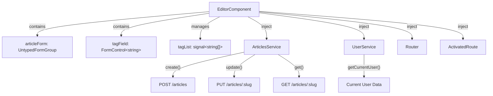
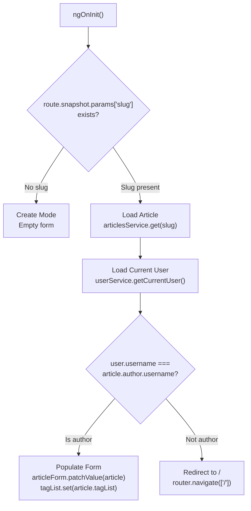
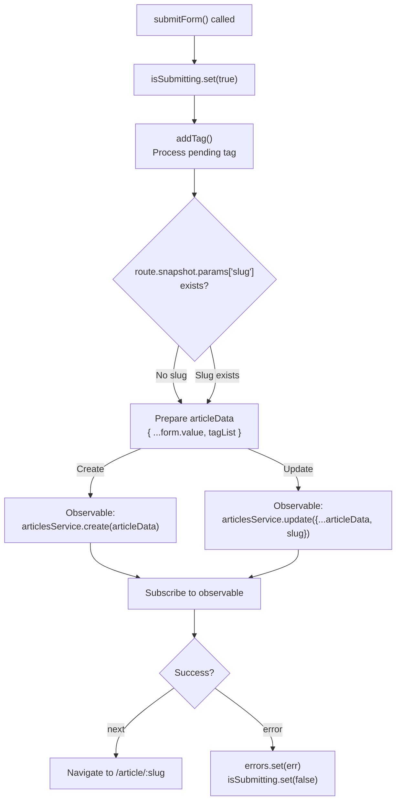

# Article Editor

<details>
<summary>Relevant source files</summary>

The following files were used as context for generating this wiki page:

- [src/app/features/article/components/article-preview.component.ts](../src/app/features/article/components/article-preview.component.ts)
- [src/app/features/article/pages/article/article.component.ts](../src/app/features/article/pages/article/article.component.ts)
- [src/app/features/article/pages/editor/editor.component.ts](../src/app/features/article/pages/editor/editor.component.ts)
- [src/app/features/profile/components/profile-articles.component.ts](../src/app/features/profile/components/profile-articles.component.ts)
- [src/app/features/profile/components/profile-favorites.component.ts](../src/app/features/profile/components/profile-favorites.component.ts)
- [src/app/features/profile/pages/profile/profile.component.ts](../src/app/features/profile/pages/profile/profile.component.ts)

</details>

## Purpose and Scope

The Article Editor provides the interface for creating new articles and editing existing articles in the RealWorld application. This component handles form management, tag manipulation, author authorization, and submission workflows that integrate with the Articles API.

For information about viewing articles, see [Article Detail & Comments](5.1.2-article-detail-and-comments.md). For listing and filtering articles, see [Article List & Pagination](5.1.1-article-list-and-pagination.md).

---

## Component Overview

The Article Editor is implemented in `EditorComponent`, a standalone Angular component that uses reactive forms for data management. The component operates in two modes: **create mode** (accessed via `/editor`) and **edit mode** (accessed via `/editor/:slug`).

| Property       | Type                             | Purpose                                           |
| -------------- | -------------------------------- | ------------------------------------------------- |
| `articleForm`  | `UntypedFormGroup`               | Main form containing title, description, and body |
| `tagField`     | `FormControl<string>`            | Separate control for adding tags                  |
| `tagList`      | `WritableSignal<string[]>`       | Array of tags associated with the article         |
| `errors`       | `WritableSignal<Errors \| null>` | Validation or API errors                          |
| `isSubmitting` | `WritableSignal<boolean>`        | Form submission state                             |

**Sources:** `src/app/features/article/pages/editor/editor.component.ts:23-33`

---

## Component Architecture



**Sources:** `src/app/features/article/pages/editor/editor.component.ts:36-41`

---

## Form Structure

The editor uses a typed reactive form interface that defines three core fields:

```typescript
interface ArticleForm {
  title: FormControl<string>;
  description: FormControl<string>;
  body: FormControl<string>;
}
```

The form is instantiated with non-nullable controls, ensuring all fields have string values (empty strings as defaults):

`src/app/features/article/pages/editor/editor.component.ts:25-29`

The tag list is managed separately from the main form through a dedicated `tagField` control and a `tagList` signal. This separation allows for dynamic tag addition/removal without affecting the main form's validation state.

**Sources:** `src/app/features/article/pages/editor/editor.component.ts:11-30`

---

## Initialization and Edit Mode Detection

The component determines its operational mode during `ngOnInit()` by checking for a `slug` route parameter:



**Key Authorization Check:** When editing an existing article, the component validates that the current user is the article's author `src/app/features/article/pages/editor/editor.component.ts:48`. If the check fails, the user is redirected to the home page `src/app/features/article/pages/editor/editor.component.ts:52`.

**Sources:** `src/app/features/article/pages/editor/editor.component.ts:43-56`

---

## Tag Management System

Tags are managed through three operations: adding, removing, and preserving tags during submission.

### Adding Tags

The `addTag()` method implements duplicate prevention and whitespace trimming:

`src/app/features/article/pages/editor/editor.component.ts:58-67`

**Logic:**

1. Retrieves the current value from `tagField`
2. Checks that the tag is non-empty after trimming
3. Verifies the tag doesn't already exist in `tagList()`
4. Appends to the signal array if validation passes
5. Resets the input field

### Removing Tags

Tags are removed through a filter operation:

`src/app/features/article/pages/editor/editor.component.ts:69-71`

### Tag Operations Flow

```mermaid
sequenceDiagram
    participant User
    participant TagField["tagField: FormControl"]
    participant AddTag["addTag()"]
    participant TagList["tagList: signal&lt;string[]&gt;"]
    participant RemoveTag["removeTag(tagName)"]

    User->>TagField: Type "angular"
    User->>AddTag: Press Enter / Click Add
    AddTag->>TagField: Get value
    AddTag->>AddTag: Validate (trim, not empty)
    AddTag->>TagList: Check for duplicates

    alt Tag is valid
        AddTag->>TagList: Update: [...tags, "angular"]
        AddTag->>TagField: Reset to ""
    else Tag invalid/duplicate
        AddTag->>TagField: Reset to ""
    end

    User->>RemoveTag: Click remove on "angular"
    RemoveTag->>TagList: Update: tags.filter(t => t !== "angular")
```

**Sources:** `src/app/features/article/pages/editor/editor.component.ts:58-71`

---

## Form Submission Workflow

The `submitForm()` method handles both article creation and updates through conditional logic:

### Submission Flow



**Sources:** `src/app/features/article/pages/editor/editor.component.ts:73-95`

### Key Implementation Details

**Pre-submission Tag Processing:** Before preparing the payload, `addTag()` is called `src/app/features/article/pages/editor/editor.component.ts:76` to ensure any tag currently in the input field is included in the submission.

**Conditional Observable:** The component selects between `create()` and `update()` based on slug presence:

`src/app/features/article/pages/editor/editor.component.ts:84-86`

**Navigation on Success:** Upon successful submission, the user is navigated to the article detail page using the returned article's slug `src/app/features/article/pages/editor/editor.component.ts:89`.

**Sources:** `src/app/features/article/pages/editor/editor.component.ts:73-95`

---

## Error Handling

The component manages submission errors through the `errors` signal:

| Error Source                       | Handling                                                                |
| ---------------------------------- | ----------------------------------------------------------------------- |
| API validation errors              | Captured in subscribe error callback, stored in `errors` signal         |
| Authorization failures (edit mode) | Handled during initialization; redirect to home                         |
| Network/server errors              | Propagated through ArticlesService, displayed via `ListErrorsComponent` |

The `ListErrorsComponent` is imported into the template to display errors from the `errors` signal `src/app/features/article/pages/editor/editor.component.ts:20`.

The submission state prevents duplicate submissions while a request is in-flight:

`src/app/features/article/pages/editor/editor.component.ts:74` and `src/app/features/article/pages/editor/editor.component.ts:92`

**Sources:** `src/app/features/article/pages/editor/editor.component.ts:32-33, 90-93`

---

## Service Integration

### ArticlesService Integration

The component interacts with `ArticlesService` for three operations:

| Method            | Purpose                        | When Used                    |
| ----------------- | ------------------------------ | ---------------------------- |
| `get(slug)`       | Retrieve existing article data | Edit mode initialization     |
| `create(article)` | Create new article             | Form submission without slug |
| `update(article)` | Update existing article        | Form submission with slug    |

### UserService Integration

`UserService.getCurrentUser()` is used to verify article authorship during edit mode initialization `src/app/features/article/pages/editor/editor.component.ts:45`. The method returns an observable that emits the current authenticated user along with the article data using `combineLatest`.

### Router Navigation

The `Router` service handles two navigation scenarios:

- **Authorization failure:** Redirects to home page `src/app/features/article/pages/editor/editor.component.ts:52`
- **Submission success:** Navigates to the article detail page `src/app/features/article/pages/editor/editor.component.ts:89`

**Sources:** `src/app/features/article/pages/editor/editor.component.ts:36-41, 45-54, 84-94`

---

## Lifecycle and Memory Management

The component uses Angular's `DestroyRef` for automatic subscription cleanup:

`src/app/features/article/pages/editor/editor.component.ts:34`

All observable subscriptions use the `takeUntilDestroyed()` operator to prevent memory leaks:

- Article loading subscription `src/app/features/article/pages/editor/editor.component.ts:46`
- Form submission subscription `src/app/features/article/pages/editor/editor.component.ts:88`

This pattern ensures that all subscriptions are automatically cleaned up when the component is destroyed, following Angular best practices for reactive programming.

**Sources:** `src/app/features/article/pages/editor/editor.component.ts:34, 46, 88`

---

## Component Configuration

The `EditorComponent` is configured as a standalone component with OnPush change detection:

`src/app/features/article/pages/editor/editor.component.ts:17-22`

**Change Detection Strategy:** Uses `ChangeDetectionStrategy.OnPush` for optimized rendering. Change detection is triggered only when:

- Input properties change (none in this component)
- Signals are updated (`tagList`, `errors`, `isSubmitting`)
- Events are emitted from the template

**Imports:** The component imports only two dependencies:

- `ListErrorsComponent` - For displaying validation/API errors
- `ReactiveFormsModule` - For reactive form functionality

**Sources:** `src/app/features/article/pages/editor/editor.component.ts:17-22`

---

---

[← Back to documentation index](README.md)
