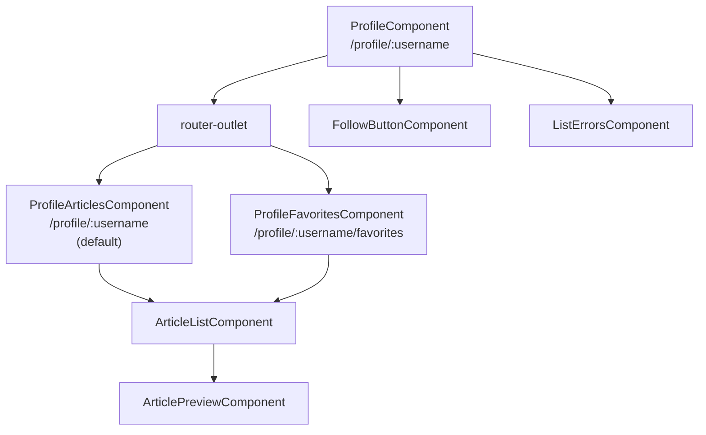
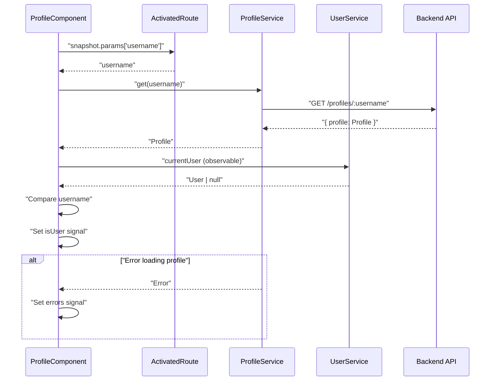
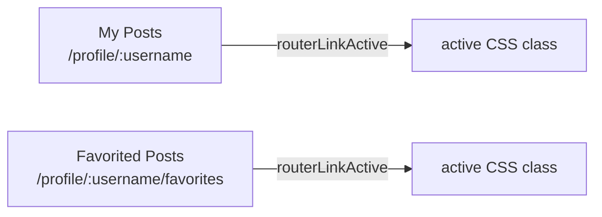
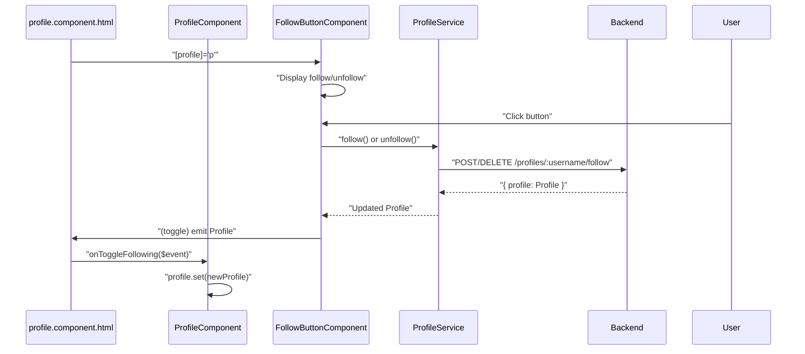
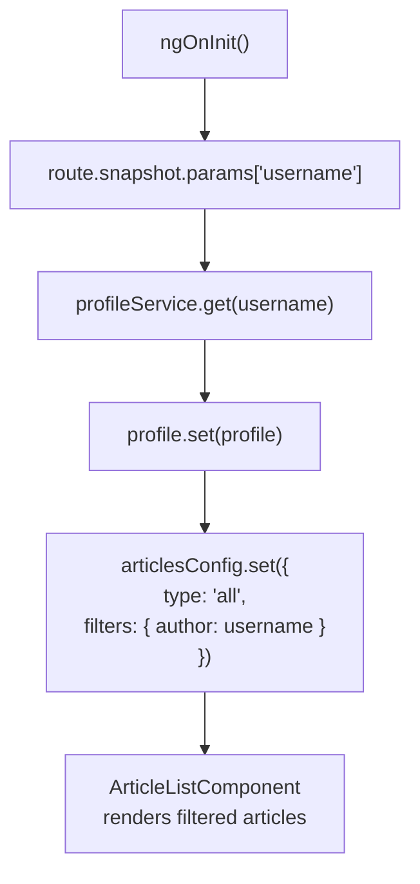
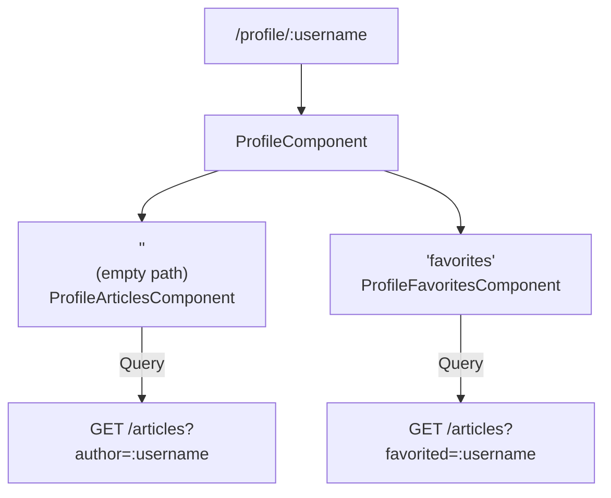
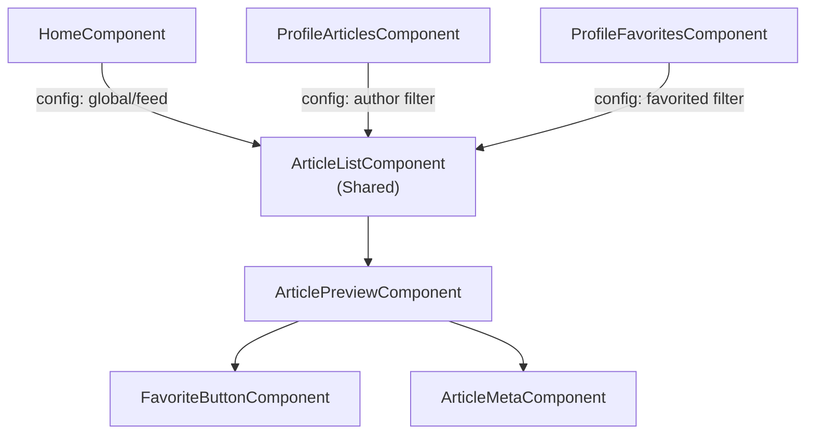
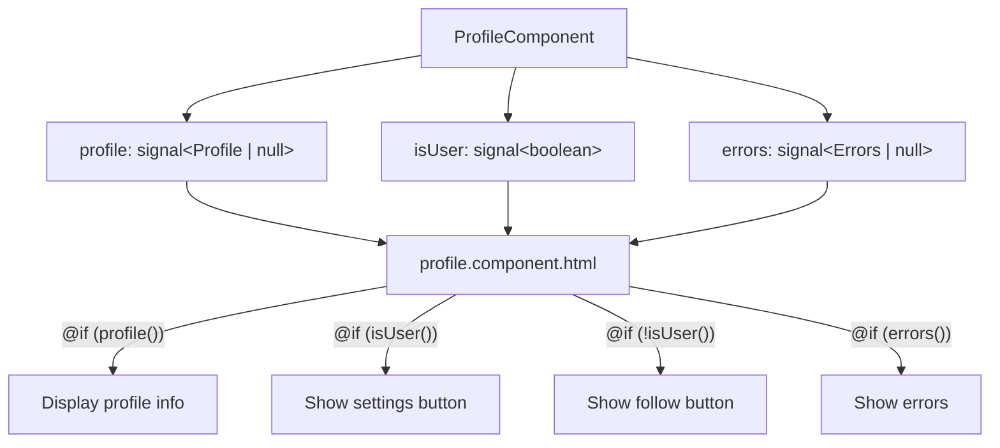

# User Profiles

<details>
<summary>Relevant source files</summary>

The following files were used as context for generating this wiki page:

- [src/app/features/article/components/article-preview.component.ts](../src/app/features/article/components/article-preview.component.ts)
- [src/app/features/article/pages/article/article.component.html](../src/app/features/article/pages/article/article.component.html)
- [src/app/features/article/pages/article/article.component.ts](../src/app/features/article/pages/article/article.component.ts)
- [src/app/features/article/pages/editor/editor.component.ts](../src/app/features/article/pages/editor/editor.component.ts)
- [src/app/features/profile/components/profile-articles.component.ts](../src/app/features/profile/components/profile-articles.component.ts)
- [src/app/features/profile/components/profile-favorites.component.ts](../src/app/features/profile/components/profile-favorites.component.ts)
- [src/app/features/profile/pages/profile/profile.component.html](../src/app/features/profile/pages/profile/profile.component.html)
- [src/app/features/profile/pages/profile/profile.component.ts](../src/app/features/profile/pages/profile/profile.component.ts)
- [src/app/features/profile/services/profile.service.ts](../src/app/features/profile/services/profile.service.ts)

</details>

## Purpose and Scope

This document covers the user profile feature, which allows users to view public profiles of any user in the system. Profiles display user information (username, bio, image), a follow/unfollow button (for other users), and two tabs showing the user's authored articles and favorited articles. The profile system integrates with the Articles feature for content display and provides social following functionality.

For authentication and user settings management, see [Settings & Authentication UI](5.3-settings-and-authentication-ui.md). For article display and interaction details, see [Articles Feature](5.1-articles-feature.md).

---

## Profile Component Architecture

The profile feature is organized into a parent component with two child route components that handle different article views.

### Component Hierarchy



**Sources:** `src/app/features/profile/pages/profile/profile.component.ts:1-63`, `src/app/features/profile/components/profile-articles.component.ts:1-43`, `src/app/features/profile/components/profile-favorites.component.ts:1-43`

---

## ProfileComponent Implementation

The `ProfileComponent` serves as the parent container for the profile page, located at `src/app/features/profile/pages/profile/profile.component.ts:28-63`.

### Component State

| Signal    | Type              | Purpose                                              |
| --------- | ----------------- | ---------------------------------------------------- |
| `profile` | `Profile \| null` | Stores the loaded profile data                       |
| `isUser`  | `boolean`         | Indicates if the profile belongs to the current user |
| `errors`  | `Errors \| null`  | Stores profile loading errors                        |

### Initialization Flow



The initialization logic at `src/app/features/profile/pages/profile/profile.component.ts:41-58` performs the following:

1. Extracts username from route parameters
2. Fetches profile from `ProfileService.get()`
3. Combines with current user from `UserService.currentUser`
4. Determines if viewing own profile by comparing usernames
5. Handles errors with fallback error message

**Sources:** `src/app/features/profile/pages/profile/profile.component.ts:41-58`

---

## Profile Service & API Integration

The `ProfileService` at `src/app/features/profile/services/profile.service.ts:14-36` provides three API methods for profile operations.

### Service Methods

| Method               | Endpoint                     | HTTP Method | Returns               | Purpose              |
| -------------------- | ---------------------------- | ----------- | --------------------- | -------------------- |
| `get(username)`      | `/profiles/:username`        | GET         | `Observable<Profile>` | Fetch public profile |
| `follow(username)`   | `/profiles/:username/follow` | POST        | `Observable<Profile>` | Follow a user        |
| `unfollow(username)` | `/profiles/:username/follow` | DELETE      | `Observable<Profile>` | Unfollow a user      |

### Profile vs User Distinction

The service includes an important comment at `src/app/features/profile/services/profile.service.ts:7-13`:

```
GET /profiles/:username → Public profile for any user (this service)
GET /user → Current authenticated user's own data (UserService)
```

The `ProfileService` fetches **public** profile data for any user, while `UserService` manages the **authenticated** user's own data. This separation maintains clear boundaries between viewing other users and managing your own account.

**Sources:** `src/app/features/profile/services/profile.service.ts:7-36`

---

## Profile Data Model

The `Profile` model represents public user information visible on profile pages.

### Profile Structure

```typescript
interface Profile {
  username: string;
  bio: string | null;
  image: string;
  following: boolean;
}
```

| Field       | Type             | Description                               |
| ----------- | ---------------- | ----------------------------------------- |
| `username`  | `string`         | Unique username identifier                |
| `bio`       | `string \| null` | User biography (optional)                 |
| `image`     | `string`         | URL to user avatar image                  |
| `following` | `boolean`        | Whether current user follows this profile |

The `following` field is used by `FollowButtonComponent` to display follow/unfollow state.

**Sources:** `src/app/features/profile/models/profile.model.ts` (referenced in imports)

---

## Profile Template Structure

The profile page template at `src/app/features/profile/pages/profile/profile.component.html:1-65` is divided into two main sections.

### User Information Section

Lines `12-30` display the profile header:

```
- User image (with default image fallback)
- Username (h4)
- Bio (paragraph, empty string if null)
- Follow button (if viewing another user)
- Edit Profile Settings link (if viewing own profile)
```

The conditional rendering at `19-26` shows either:

- `FollowButtonComponent` for other users
- Settings link for own profile

### Article Tabs Section

Lines `32-63` provide navigation between article views:



The tabs use `routerLinkActive` directive with `{ exact: true }` to highlight the active tab. The `router-outlet` at line `60` renders the child route component.

**Sources:** `src/app/features/profile/pages/profile/profile.component.html:1-65`

---

## Follow System Integration

The profile page integrates the `FollowButtonComponent` to provide social following functionality.

### Follow State Management



The follow button integration at `src/app/features/profile/pages/profile/profile.component.html:19-21` passes the profile to `FollowButtonComponent` and receives toggle events via the `onToggleFollowing()` method at `src/app/features/profile/pages/profile/profile.component.ts:60-62`.

### Follow Button Usage in Articles

The follow button is also used in article pages at `src/app/features/article/pages/article/article.component.html:33,80` to follow article authors. When the following state changes, the `toggleFollowing()` method at `src/app/features/article/pages/article/article.component.ts:97-105` updates the article's author profile.

**Sources:** `src/app/features/profile/pages/profile/profile.component.html:19-21`, `src/app/features/profile/pages/profile/profile.component.ts:60-62`, `src/app/features/article/pages/article/article.component.ts:97-105`

---

## Profile Articles Tab

The `ProfileArticlesComponent` at `src/app/features/profile/components/profile-articles.component.ts:17-43` displays articles authored by the profile user.

### ArticleListConfig Construction



The component:

1. Extracts username from route parameters at `line 29`
2. Fetches profile via `ProfileService.get()` at `lines 28-41`
3. Creates `ArticleListConfig` with `author` filter at `lines 34-38`
4. Passes config to `ArticleListComponent` in template at `line 12`

The `ArticleListConfig` structure:

```typescript
{
  type: 'all',
  filters: {
    author: profile.username
  }
}
```

This configuration tells `ArticleListComponent` to query articles where the author matches the profile username.

**Sources:** `src/app/features/profile/components/profile-articles.component.ts:27-41`

---

## Profile Favorites Tab

The `ProfileFavoritesComponent` at `src/app/features/profile/components/profile-favorites.component.ts:17-43` displays articles favorited by the profile user.

### Key Differences from Articles Tab

| Aspect             | ProfileArticlesComponent            | ProfileFavoritesComponent                   |
| ------------------ | ----------------------------------- | ------------------------------------------- |
| Route param source | `route.snapshot.params['username']` | `route.parent?.snapshot.params['username']` |
| Filter field       | `author: username`                  | `favorited: username`                       |
| API query          | `?author=username`                  | `?favorited=username`                       |

The favorites component uses `route.parent` at `line 29` because it's a child route and needs to access the parent's route parameters.

### ArticleListConfig for Favorites

```typescript
{
  type: 'all',
  filters: {
    favorited: profile.username
  }
}
```

This configuration at `lines 34-39` queries the backend for articles that the profile user has favorited.

**Sources:** `src/app/features/profile/components/profile-favorites.component.ts:27-41`

---

## Routing Configuration

The profile feature uses nested routes to organize the articles and favorites tabs.

### Route Structure



The route hierarchy:

```
/profile/:username                    → ProfileComponent
  ├── (empty/default)                 → ProfileArticlesComponent
  └── /favorites                      → ProfileFavoritesComponent
```

### Navigation URLs

| Tab             | URL                          | Component                   | Filter              |
| --------------- | ---------------------------- | --------------------------- | ------------------- |
| My Posts        | `/profile/johndoe`           | `ProfileArticlesComponent`  | `author=johndoe`    |
| Favorited Posts | `/profile/johndoe/favorites` | `ProfileFavoritesComponent` | `favorited=johndoe` |

The template uses `routerLink` at `lines 42,52` with the username parameter to construct these URLs.

**Sources:** `src/app/features/profile/pages/profile/profile.component.html:38-56`

---

## Error Handling

The profile system handles errors at multiple levels.

### Profile Loading Errors

The `ProfileComponent` catches errors from the profile fetch at `src/app/features/profile/pages/profile/profile.component.ts:45-47`:

```typescript
catchError(error => {
  this.errors.set(error.errors || { error: ['Failed to load profile'] });
  return EMPTY;
});
```

Errors are displayed using `ListErrorsComponent` at `src/app/features/profile/pages/profile/profile.component.html:2-9` when the `errors()` signal is truthy.

### Child Component Error Handling

The `ProfileArticlesComponent` and `ProfileFavoritesComponent` rely on `ArticleListComponent` for article loading error handling. Any errors from the articles API are handled within the article list component itself.

### Error Display Conditional

The profile template at `lines 2-10` shows errors only when they exist:

```html
@if (errors()) {
<div class="container">
  <app-list-errors [errors]="errors()" />
</div>
}
```

The profile content at `line 11` is only rendered when the profile is successfully loaded.

**Sources:** `src/app/features/profile/pages/profile/profile.component.ts:45-47`, `src/app/features/profile/pages/profile/profile.component.html:2-11`

---

## Integration with Article System

The profile feature heavily integrates with the article system for content display.

### Component Reuse



Both profile child components reuse `ArticleListComponent` at `src/app/features/profile/components/profile-articles.component.ts:12` and `src/app/features/profile/components/profile-favorites.component.ts:12`, passing different `ArticleListConfig` values to control filtering.

### ArticleListConfig Pattern

The pattern for configuring article queries:

```typescript
{
  type: 'all',           // Query all articles (not feed)
  filters: {
    author?: string,     // Filter by author username
    favorited?: string,  // Filter by favorited username
    tag?: string,        // Filter by tag (not used in profiles)
  }
}
```

This configuration model is used by `ArticleListComponent` to construct the appropriate API query parameters.

**Sources:** `src/app/features/profile/components/profile-articles.component.ts:34-38`, `src/app/features/profile/components/profile-favorites.component.ts:34-39`, `src/app/features/article/components/article-list.component.ts` (referenced)

---

## State Management

The profile feature uses Angular signals for reactive state management.

### Signal Usage



### Signal Update Pattern

At `src/app/features/profile/pages/profile/profile.component.ts:54-57`, the component updates signals from the subscription:

```typescript
.subscribe(([profile, user]) => {
  this.profile.set(profile);
  this.isUser.set(profile.username === user?.username);
});
```

The `onToggleFollowing()` method at `lines 60-62` updates the profile signal when following state changes:

```typescript
onToggleFollowing(profile: Profile) {
  this.profile.set(profile);
}
```

This reactive pattern ensures the template automatically updates when profile data changes.

**Sources:** `src/app/features/profile/pages/profile/profile.component.ts:29-62`

---

## Memory Management

All profile components use `takeUntilDestroyed` for automatic subscription cleanup.

### DestroyRef Injection

Each component injects `DestroyRef` at:

- `src/app/features/profile/pages/profile/profile.component.ts:32`
- `src/app/features/profile/components/profile-articles.component.ts:20`
- `src/app/features/profile/components/profile-favorites.component.ts:20`

### Subscription Pattern

The `takeUntilDestroyed` operator is applied to all subscriptions:

```typescript
this.profileService
  .get(username)
  .pipe(takeUntilDestroyed(this.destroyRef))
  .subscribe(...)
```

This ensures subscriptions are automatically cleaned up when components are destroyed, preventing memory leaks.

**Sources:** `src/app/features/profile/pages/profile/profile.component.ts:52`, `src/app/features/profile/components/profile-articles.component.ts:30`, `src/app/features/profile/components/profile-favorites.component.ts:30`

---

## Summary

The profile feature provides a complete user profile viewing experience with the following characteristics:

| Aspect               | Implementation                                          |
| -------------------- | ------------------------------------------------------- |
| **Main Component**   | `ProfileComponent` with nested routes                   |
| **Service Layer**    | `ProfileService` with three API methods                 |
| **Child Components** | `ProfileArticlesComponent`, `ProfileFavoritesComponent` |
| **Social Features**  | Follow/unfollow via `FollowButtonComponent`             |
| **Content Display**  | Reuses `ArticleListComponent` with filters              |
| **State Management** | Angular signals for reactive updates                    |
| **Error Handling**   | Catches and displays profile loading errors             |
| **Memory Safety**    | `takeUntilDestroyed` for subscription cleanup           |

The profile system demonstrates component reuse, clean separation of concerns, and integration with both the authentication system (for determining own profile) and the article system (for content display).

---

---

[← Back to documentation index](README.md)
