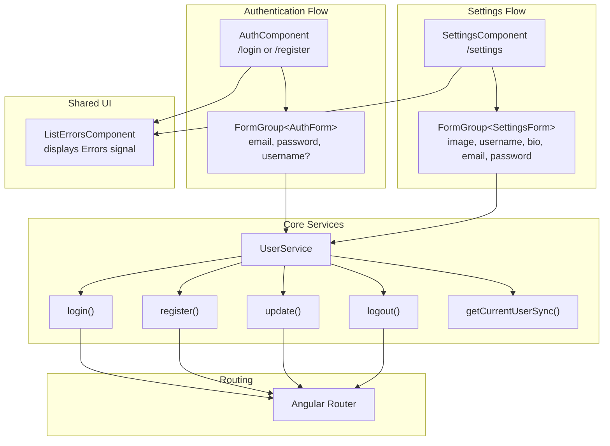
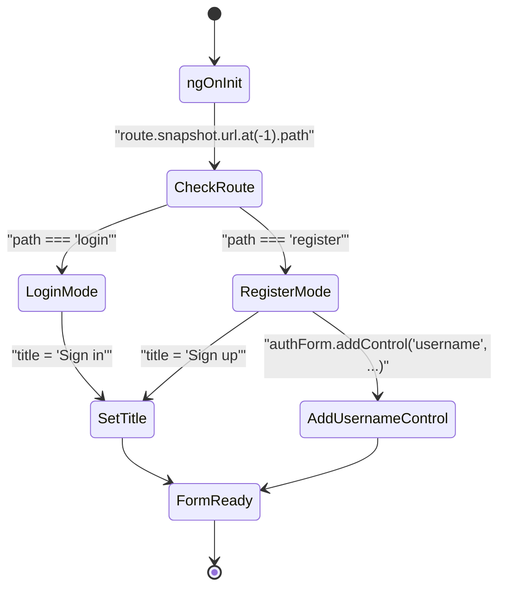
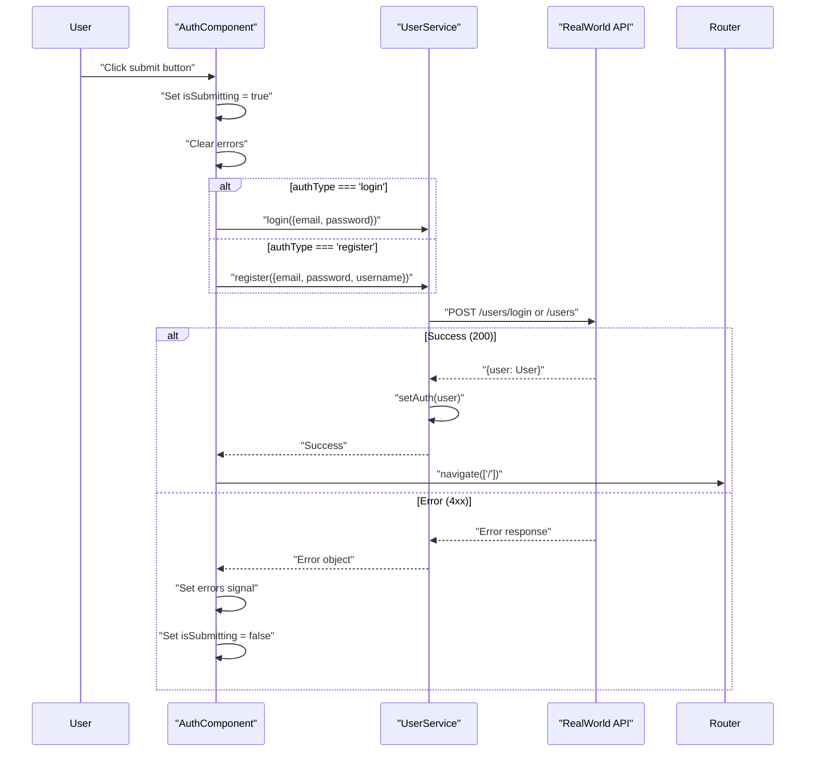
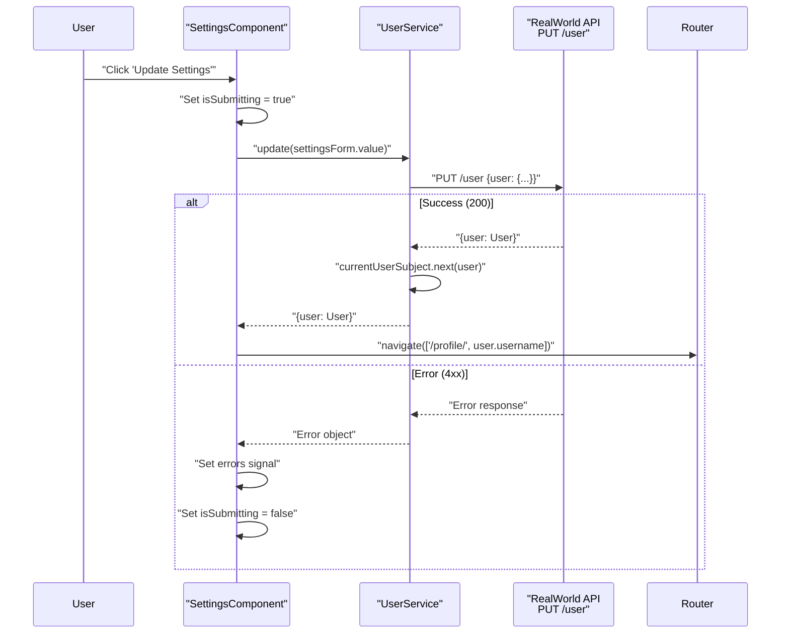
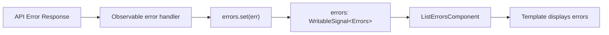
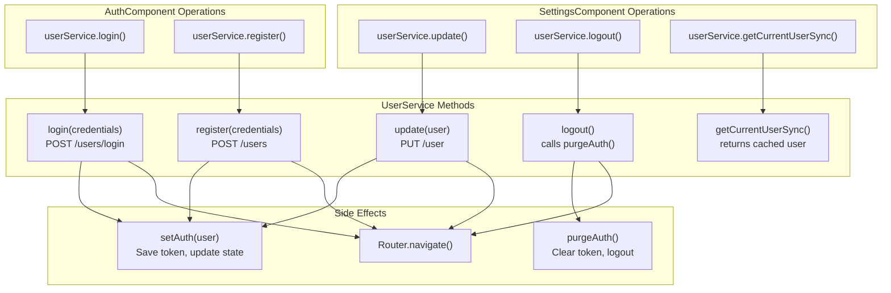
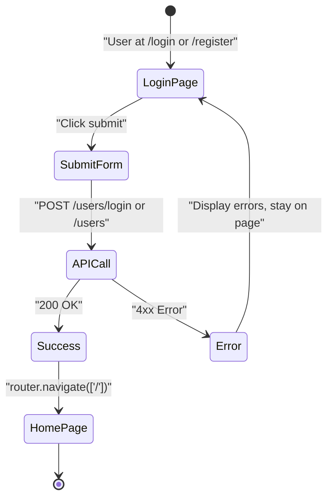
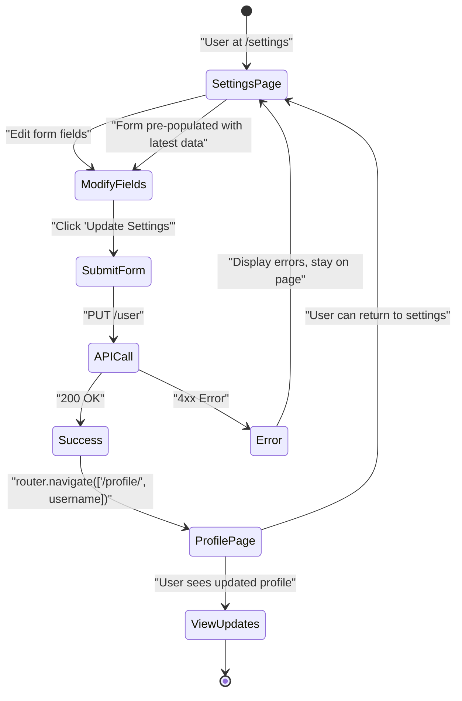

# Settings & Authentication UI

<details>
<summary>Relevant source files</summary>

The following files were used as context for generating this wiki page:

- [e2e/settings.spec.ts](../e2e/settings.spec.ts)
- [src/app/core/auth/auth.component.ts](../src/app/core/auth/auth.component.ts)
- [src/app/core/auth/services/jwt.service.ts](../src/app/core/auth/services/jwt.service.ts)
- [src/app/core/auth/services/user.service.ts](../src/app/core/auth/services/user.service.ts)
- [src/app/features/settings/settings.component.ts](../src/app/features/settings/settings.component.ts)

</details>

## Purpose and Scope

This page documents the user-facing components that handle authentication and profile management. The **AuthComponent** provides login and registration forms, while the **SettingsComponent** allows authenticated users to update their profile information. Both components integrate with [UserService](4.1-userservice-and-authentication-state.md) to perform API operations and manage authentication state.

For details on the underlying authentication system and state management, see [Authentication System](3.3-authentication-system.md) and [UserService & Authentication State](4.1-userservice-and-authentication-state.md). For profile viewing functionality, see [User Profiles](5.2-user-profiles.md).

---

## Component Architecture

The Settings & Authentication feature consists of two primary components that handle distinct user workflows:

| Component           | Route                 | Purpose                               | Authentication Required |
| ------------------- | --------------------- | ------------------------------------- | ----------------------- |
| `AuthComponent`     | `/login`, `/register` | User authentication (sign in/sign up) | No                      |
| `SettingsComponent` | `/settings`           | Profile updates and logout            | Yes                     |

Both components follow a shared pattern: reactive forms with validation, error display via `ListErrorsComponent`, and integration with `UserService` for API operations.

**Component Interaction Diagram**



Sources: `src/app/core/auth/auth.component.ts:1-84`, `src/app/features/settings/settings.component.ts:1-75`

---

## AuthComponent: Login and Registration

The `AuthComponent` handles both login and registration on a single component, dynamically adjusting its form based on the current route.

### Route-Based Configuration

The component determines its mode by inspecting the route URL at initialization:



**Implementation Details:**

- Route path extracted via `this.route.snapshot.url.at(-1)!.path` `src/app/core/auth/auth.component.ts:47`
- For registration, a `username` control is dynamically added to the form `src/app/core/auth/auth.component.ts:49-57`

Sources: `src/app/core/auth/auth.component.ts:46-58`

### Form Structure

The `AuthForm` interface defines the form controls:

| Field      | Type                  | Validators | Present In      |
| ---------- | --------------------- | ---------- | --------------- |
| `email`    | `FormControl<string>` | Required   | Login, Register |
| `password` | `FormControl<string>` | Required   | Login, Register |
| `username` | `FormControl<string>` | Required   | Register only   |

The form is initialized in the constructor with base fields (email, password), and the username field is conditionally added during `ngOnInit()` for registration.

Sources: `src/app/core/auth/auth.component.ts:9-13`, `src/app/core/auth/auth.component.ts:34-44`

### Authentication Flow

When the user submits the form, the component determines which `UserService` method to call based on `authType`:



**Key Implementation Points:**

- The observable selection uses a ternary: `this.authType === 'login' ? this.userService.login(...) : this.userService.register(...)` `src/app/core/auth/auth.component.ts:64-73`
- Success navigates to home page (`'/'`) `src/app/core/auth/auth.component.ts:76`
- Errors are captured and stored in a signal for display `src/app/core/auth/auth.component.ts:77-79`
- `takeUntilDestroyed(this.destroyRef)` ensures subscription cleanup `src/app/core/auth/auth.component.ts:75`

Sources: `src/app/core/auth/auth.component.ts:60-82`, `src/app/core/auth/services/user.service.ts:74-82`

### Error Handling and Display

Errors are stored in a signal and displayed via `ListErrorsComponent`:

- Signal declaration: `errors = signal<Errors>({ errors: {} })` `src/app/core/auth/auth.component.ts:24`
- Error clearing on submit: `this.errors.set({ errors: {} })` `src/app/core/auth/auth.component.ts:62`
- Error capture: `this.errors.set(err)` `src/app/core/auth/auth.component.ts:78`

The `ListErrorsComponent` is imported and used in the template to display validation errors returned from the API.

Sources: `src/app/core/auth/auth.component.ts:24`, `src/app/core/auth/auth.component.ts:4`

---

## SettingsComponent: Profile Management

The `SettingsComponent` allows authenticated users to update their profile information and logout.

### Form Initialization

The settings form is pre-populated with the current user's data on initialization:

```mermaid
sequenceDiagram
    participant SettingsComp as "SettingsComponent"
    participant UserSvc as "UserService"
    participant Form as "FormGroup&lt;SettingsForm&gt;"

    SettingsComp->>SettingsComp: "ngOnInit()"
    SettingsComp->>UserSvc: "getCurrentUserSync()"
    UserSvc-->>SettingsComp: "User | null"

    alt User exists
        SettingsComp->>Form: "patchValue({...user, image, bio})"
        Note over SettingsComp,Form: "Handle null image/bio with ?? ''"
    end
```

**Implementation Details:**

- `getCurrentUserSync()` retrieves the cached user without triggering HTTP request `src/app/features/settings/settings.component.ts:46`
- Null coalescing handles optional fields: `image: user.image ?? ''` `src/app/features/settings/settings.component.ts:50-51`
- Form patch occurs only if user exists `src/app/features/settings/settings.component.ts:47-53`

Sources: `src/app/features/settings/settings.component.ts:45-54`

### Form Structure

The `SettingsForm` interface defines all updatable user fields:

| Field      | Type                  | Validators | Notes          |
| ---------- | --------------------- | ---------- | -------------- |
| `image`    | `FormControl<string>` | None       | Avatar URL     |
| `username` | `FormControl<string>` | None       | Display name   |
| `bio`      | `FormControl<string>` | None       | User biography |
| `email`    | `FormControl<string>` | None       | Email address  |
| `password` | `FormControl<string>` | Required   | Password field |

All controls are marked `nonNullable: true` to ensure TypeScript type safety and prevent null values.

Sources: `src/app/features/settings/settings.component.ts:10-16`, `src/app/features/settings/settings.component.ts:26-35`

### Profile Update Flow



**Key Behaviors:**

- Form value is passed directly to `UserService.update()` `src/app/features/settings/settings.component.ts:64`
- Success navigates to the user's profile page `src/app/features/settings/settings.component.ts:67`
- `UserService.update()` internally updates `currentUserSubject` to reflect changes immediately `src/app/core/auth/services/user.service.ts:158-164`
- The token remains valid (no re-authentication required) `e2e/settings.spec.ts:48-49`

Sources: `src/app/features/settings/settings.component.ts:60-73`, `src/app/core/auth/services/user.service.ts:158-164`, `e2e/settings.spec.ts:18-56`

### Logout Functionality

The logout function is a simple wrapper around `UserService.logout()`:

```typescript
logout(): void {
  this.userService.logout();
}
```

This method:

1. Calls `UserService.logout()` `src/app/features/settings/settings.component.ts:56-58`
2. Which internally calls `purgeAuth()` to clear token and auth state `src/app/core/auth/services/user.service.ts:84-87`
3. Navigates to home page `src/app/core/auth/services/user.service.ts:86`

Sources: `src/app/features/settings/settings.component.ts:56-58`, `src/app/core/auth/services/user.service.ts:84-87`

---

## Shared Patterns

Both components follow consistent patterns for form handling, error management, and state tracking.

### Error Management Pattern



**Pattern Details:**

- Errors stored as signals: `errors = signal<Errors | null>(null)` or `signal<Errors>({ errors: {} })`
- Error clearing on form submit: `errors.set({ errors: {} })`
- Error capture in subscribe error handler: `error: err => this.errors.set(err)`
- Display via `ListErrorsComponent` which accepts errors as input

Sources: `src/app/core/auth/auth.component.ts:24`, `src/app/features/settings/settings.component.ts:36`

### Submission State Pattern

Both components track submission state with a boolean signal:

```typescript
isSubmitting = signal(false);
```

**Usage Pattern:**

1. Set to `true` when form submitted `src/app/core/auth/auth.component.ts:61`, `src/app/features/settings/settings.component.ts:61`
2. Remains `true` during API request
3. Reset to `false` only on error `src/app/core/auth/auth.component.ts:79`, `src/app/features/settings/settings.component.ts:70`
4. Not reset on success (component navigates away)

This pattern prevents duplicate submissions and can be used in templates to disable submit buttons or show loading indicators.

Sources: `src/app/core/auth/auth.component.ts:25`, `src/app/core/auth/auth.component.ts:61`, `src/app/features/settings/settings.component.ts:37`

### Subscription Cleanup Pattern

Both components use Angular's `takeUntilDestroyed` operator for automatic subscription cleanup:

```typescript
destroyRef = inject(DestroyRef);

// In subscription:
.pipe(takeUntilDestroyed(this.destroyRef))
.subscribe(...)
```

This ensures that subscriptions are automatically unsubscribed when the component is destroyed, preventing memory leaks.

Sources: `src/app/core/auth/auth.component.ts:27`, `src/app/core/auth/auth.component.ts:75`, `src/app/features/settings/settings.component.ts:38`, `src/app/features/settings/settings.component.ts:65`

---

## Integration with UserService

Both components delegate all authentication and profile management logic to `UserService`.

### Service Method Integration



**Integration Points:**

| Component                | UserService Method                      | HTTP Endpoint       | Success Action                   |
| ------------------------ | --------------------------------------- | ------------------- | -------------------------------- |
| AuthComponent (login)    | `login({email, password})`              | `POST /users/login` | Navigate to `/`                  |
| AuthComponent (register) | `register({username, email, password})` | `POST /users`       | Navigate to `/`                  |
| SettingsComponent        | `update(partialUser)`                   | `PUT /user`         | Navigate to `/profile/:username` |
| SettingsComponent        | `logout()`                              | None (local)        | Navigate to `/`                  |
| SettingsComponent        | `getCurrentUserSync()`                  | None (cached)       | Pre-populate form                |

Sources: `src/app/core/auth/auth.component.ts:64-73`, `src/app/features/settings/settings.component.ts:46`, `src/app/features/settings/settings.component.ts:56-58`, `src/app/features/settings/settings.component.ts:63-64`, `src/app/core/auth/services/user.service.ts:74-87`, `src/app/core/auth/services/user.service.ts:158-164`

---

## Navigation Flows

Both components use Angular Router to navigate after successful operations.

### Post-Authentication Navigation



After successful login or registration, the user is redirected to the home page where they can access authenticated features.

Sources: `src/app/core/auth/auth.component.ts:76`

### Post-Update Navigation



After a successful profile update, users are redirected to their profile page where they can verify their changes. They can return to settings to make additional updates, and the form will be pre-populated with the most recent data.

Sources: `src/app/features/settings/settings.component.ts:67`, `e2e/settings.spec.ts:197-232`

---

## Testing Coverage

The E2E test suite validates both individual field updates and complex scenarios.

### Settings Test Scenarios

| Test Case                        | Validates                                |
| -------------------------------- | ---------------------------------------- |
| Update bio only                  | Single field update works correctly      |
| Update image only                | Image URL updates successfully           |
| Update bio and image together    | Multiple fields update in single request |
| Display updated bio on profile   | Changes visible immediately after update |
| Display updated image on profile | Image changes reflected in profile       |
| Preserve username in navbar      | Auth state not corrupted by updates      |
| Multiple sequential updates      | Form repopulation and state consistency  |

**Key Test Assertions:**

- API response validation (200 status, correct field values) `e2e/settings.spec.ts:38-42`
- Navigation verification (redirects to profile page) `e2e/settings.spec.ts:45`
- Token persistence (auth not corrupted) `e2e/settings.spec.ts:48-49`
- State synchronization (`getCurrentUser()` reflects changes) `e2e/settings.spec.ts:52-55`
- UI reflection (updated values visible in DOM) `e2e/settings.spec.ts:152`

Sources: `e2e/settings.spec.ts:1-234`

---

---

[← Back to documentation index](README.md)
