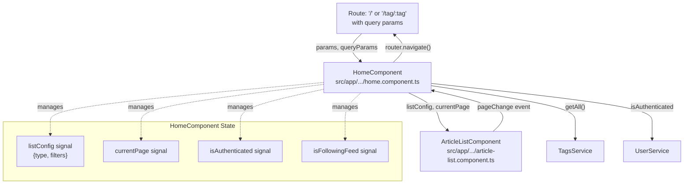
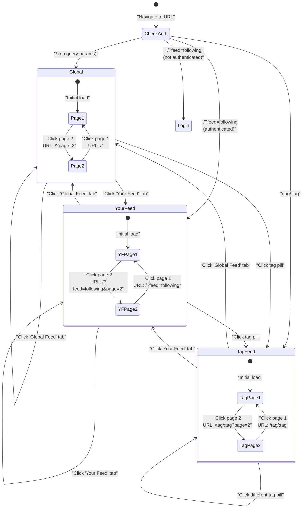
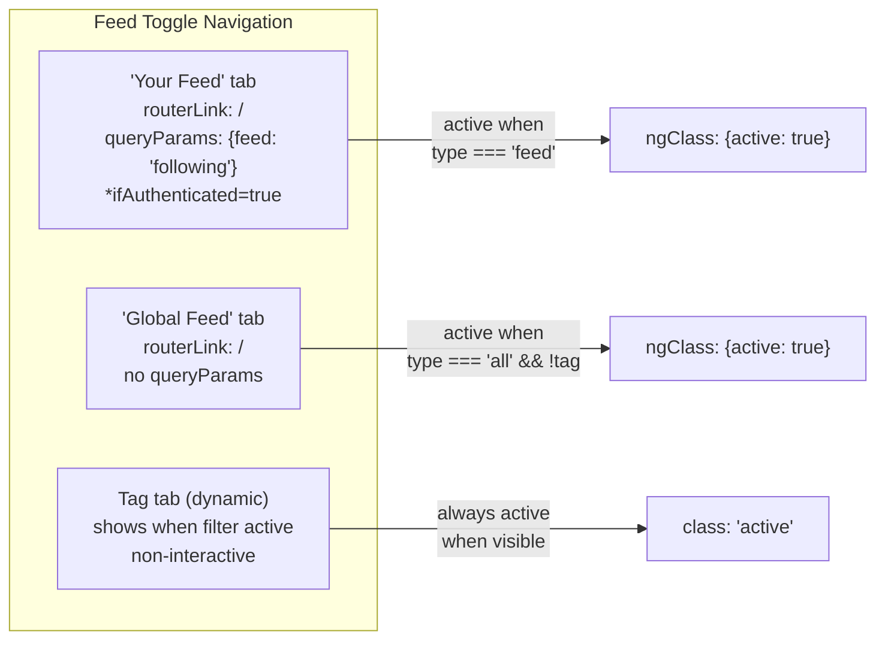
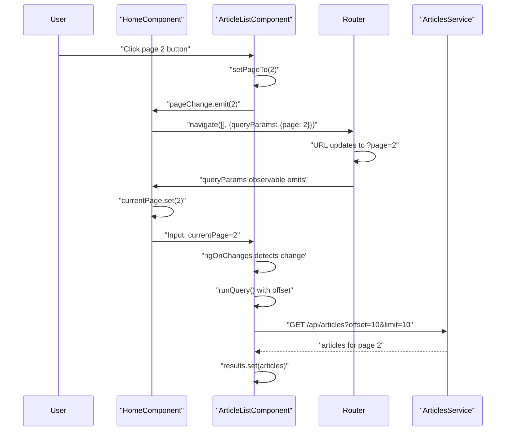
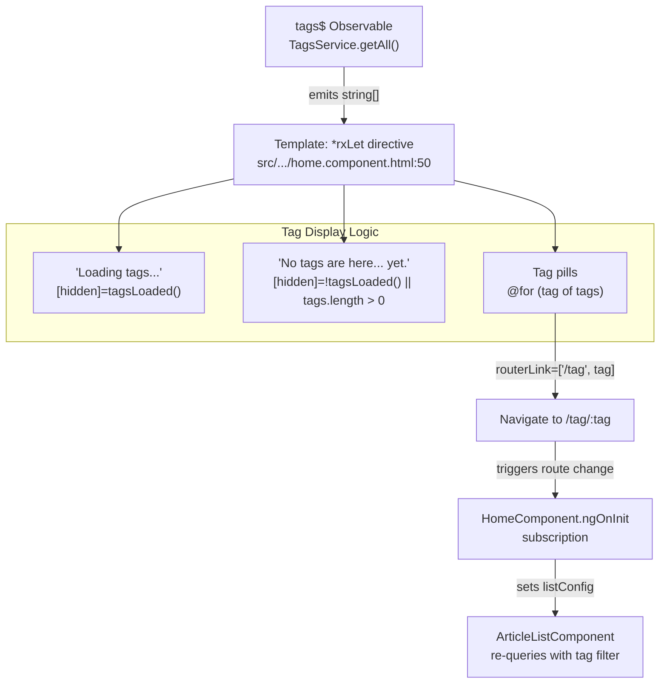
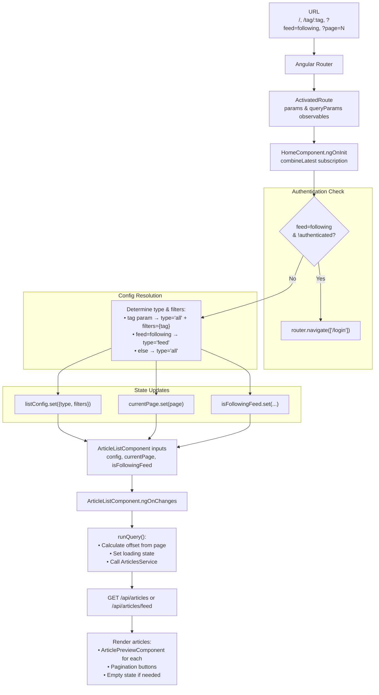

# Home Page & Feed Navigation

<details>
<summary>Relevant source files</summary>

The following files were used as context for generating this wiki page:

- [e2e/url-navigation.spec.ts](../e2e/url-navigation.spec.ts)
- [src/app/core/auth/if-authenticated.directive.ts](../src/app/core/auth/if-authenticated.directive.ts)
- [src/app/features/article/components/article-list.component.ts](../src/app/features/article/components/article-list.component.ts)
- [src/app/features/article/components/favorite-button.component.ts](../src/app/features/article/components/favorite-button.component.ts)
- [src/app/features/article/pages/editor/editor.component.html](../src/app/features/article/pages/editor/editor.component.html)
- [src/app/features/article/pages/home/home.component.html](../src/app/features/article/pages/home/home.component.html)
- [src/app/features/article/pages/home/home.component.ts](../src/app/features/article/pages/home/home.component.ts)
- [src/app/features/profile/components/follow-button.component.ts](../src/app/features/profile/components/follow-button.component.ts)

</details>

## Purpose and Scope

This document covers the home page component and its feed navigation system, including feed switching between Global Feed and Your Feed, tag filtering, and URL-based navigation with pagination. For information about article listing and display logic, see [Article List & Pagination](5.1.1-article-list-and-pagination.md). For authentication UI, see [Settings & Authentication UI](5.3-settings-and-authentication-ui.md).

## Component Architecture

The home page is implemented by `HomeComponent` located at `src/app/features/article/pages/home/home.component.ts:21-94`, which coordinates feed selection, tag filtering, and pagination. It delegates article rendering to `ArticleListComponent` `src/app/features/article/components/article-list.component.ts:64-134`.



**Sources:** `src/app/features/article/pages/home/home.component.ts:1-94`, `src/app/features/article/components/article-list.component.ts:1-134`

### State Management in HomeComponent

`HomeComponent` maintains several signals to track the current view state:

| Signal            | Type                | Purpose                                                                                 |
| ----------------- | ------------------- | --------------------------------------------------------------------------------------- |
| `listConfig`      | `ArticleListConfig` | Defines article query type (`'all'` or `'feed'`) and filters (e.g., `{tag: 'dragons'}`) |
| `currentPage`     | `number`            | Current pagination page number                                                          |
| `isAuthenticated` | `boolean`           | Whether user is logged in                                                               |
| `isFollowingFeed` | `boolean`           | Whether "Your Feed" is active (used for empty state messaging)                          |
| `tagsLoaded`      | `boolean`           | Whether popular tags have been fetched                                                  |

**Sources:** `src/app/features/article/pages/home/home.component.ts:22-33`

## Feed Types and Selection

The home page supports three distinct feed modes, determined by route parameters and authentication state:

### Global Feed

Displays all articles from all users. This is the default view when navigating to `/` without query parameters.

- **Route:** `/`
- **Config:** `{type: 'all', filters: {}}`
- **Authentication:** Not required
- **API endpoint:** `GET /api/articles`

### Your Feed

Displays articles from followed users. Only available to authenticated users.

- **Route:** `/?feed=following`
- **Config:** `{type: 'feed', filters: {}}`
- **Authentication:** Required (redirects to `/login` if not authenticated)
- **API endpoint:** `GET /api/articles/feed`

### Tag Filtered Feed

Displays articles tagged with a specific tag.

- **Route:** `/tag/:tagName`
- **Config:** `{type: 'all', filters: {tag: 'tagName'}}`
- **Authentication:** Not required
- **API endpoint:** `GET /api/articles?tag=tagName`

**Sources:** `src/app/features/article/pages/home/home.component.ts:41-72`, `e2e/url-navigation.spec.ts:11-48`

## URL-based Navigation and Route Handling

The home page implements comprehensive URL-based navigation, allowing users to bookmark and share specific feed views. All navigation state is reflected in the URL.



**Sources:** `src/app/features/article/pages/home/home.component.ts:41-72`, `e2e/url-navigation.spec.ts:1-246`

### Route Parameter Handling

The `ngOnInit` method subscribes to a combination of route observables to reactively handle URL changes:

```typescript
combineLatest([this.userService.isAuthenticated, this.route.params, this.route.queryParams]);
```

This subscription extracts three pieces of information:

1. **Tag parameter** from `params['tag']` - indicates tag filtering
2. **Feed parameter** from `queryParams['feed']` - when set to `'following'`, activates Your Feed
3. **Page parameter** from `queryParams['page']` - numeric page number (defaults to 1)

The logic flow at `src/app/features/article/pages/home/home.component.ts:47-72` is:

1. Check if `feed=following` but user not authenticated → redirect to `/login`
2. If tag parameter present → set `type: 'all'` with `filters: {tag}`
3. Else if `feed=following` → set `type: 'feed'`
4. Else → set `type: 'all'` (Global Feed)

**Sources:** `src/app/features/article/pages/home/home.component.ts:41-72`, `e2e/url-navigation.spec.ts:21-35`

### Authentication Guard for Your Feed

When a user attempts to access `/?feed=following` without being authenticated, the component performs an immediate redirect:

```typescript
if (feed === 'following' && !isAuthenticated) {
  void this.router.navigate(['/login']);
  return;
}
```

This happens at `src/app/features/article/pages/home/home.component.ts:52-55`. The E2E test at `e2e/url-navigation.spec.ts:31-35` verifies this behavior.

**Sources:** `src/app/features/article/pages/home/home.component.ts:51-55`, `e2e/url-navigation.spec.ts:31-35`

## Feed Navigation UI

The feed navigation tabs are rendered by the template at `src/app/features/article/pages/home/home.component.html:12-39`:



### Tab Link Attributes

The feed tabs use Angular's `RouterLink` directive with specific attributes:

| Tab           | `routerLink` | `queryParams`         | Visibility                             |
| ------------- | ------------ | --------------------- | -------------------------------------- |
| Your Feed     | `/`          | `{feed: 'following'}` | `*ifAuthenticated="true"`              |
| Global Feed   | `/`          | (none)                | Always visible                         |
| Tag (dynamic) | (none)       | (none)                | `[hidden]="!listConfig().filters.tag"` |

The tag tab displays the currently active tag filter with a hashtag icon and is always shown with the `active` class when visible `src/app/features/article/pages/home/home.component.html:35-37`.

**Sources:** `src/app/features/article/pages/home/home.component.html:14-37`, `e2e/url-navigation.spec.ts:50-61`

## Pagination

Pagination is managed collaboratively between `HomeComponent` and `ArticleListComponent`.



**Sources:** `src/app/features/article/pages/home/home.component.ts:75-93`, `src/app/features/article/components/article-list.component.ts:103-133`

### Page Change Handling

When `ArticleListComponent` emits a `pageChange` event `src/app/features/article/components/article-list.component.ts:106`, `HomeComponent` handles it in `onPageChange()` `src/app/features/article/pages/home/home.component.ts:75-93`:

1. Preserve `feed` query parameter if present
2. Only include `page` parameter if `page > 1` (keep URL clean for page 1)
3. Navigate using `router.navigate([], {relativeTo: this.route, queryParams})`

This approach ensures URL state is always synchronized with UI state, and page numbers are properly preserved when switching between feeds.

### Pagination Reset Logic

Page numbers reset to 1 when switching feeds. This is handled by two mechanisms:

1. `ArticleListComponent` resets `page` signal when `config` input changes without a concurrent `currentPage` change `src/app/features/article/components/article-list.component.ts:85-88`
2. `HomeComponent` does not preserve `page` query parameter when navigating to a different feed type

The E2E test at `e2e/url-navigation.spec.ts:191-212` verifies that clicking "Global Feed" from page 2 of a tag feed navigates to `/` without a page parameter.

**Sources:** `src/app/features/article/components/article-list.component.ts:79-99`, `e2e/url-navigation.spec.ts:191-212`

### Limit and Offset Calculation

`ArticleListComponent` calculates the API query offset based on the current page:

```typescript
if (this.limit) {
  this.query.filters.limit = this.limit;
  this.query.filters.offset = this.limit * (this.page() - 1);
}
```

With the default limit of 10 `src/app/features/article/pages/home/home.component.html:42`:

- Page 1: `offset=0`
- Page 2: `offset=10`
- Page 3: `offset=20`

The total page count is calculated at `src/app/features/article/components/article-list.component.ts:129-131` using `Math.ceil(articlesCount / limit)`.

**Sources:** `src/app/features/article/components/article-list.component.ts:116-119`, `src/app/features/article/components/article-list.component.ts:129-131`

## Tag Sidebar and Filtering

The right sidebar displays popular tags fetched from the API. Clicking a tag navigates to `/tag/:tagName`.



**Sources:** `src/app/features/article/pages/home/home.component.ts:28-30`, `src/app/features/article/pages/home/home.component.html:50-65`

### Tag Rendering

The sidebar uses the `*rxLet` directive from `@rx-angular/template` to subscribe to `tags$` observable `src/app/features/article/pages/home/home.component.html:50`. Each tag is rendered as a link:

```html
<a class="tag-default tag-pill" [routerLink]="['/tag', tag]"> {{ tag }} </a>
```

The `[routerLink]` array syntax constructs URLs like `/tag/dragons`, `/tag/implementations`, etc.

Loading and empty states are controlled by the `tagsLoaded` signal:

- **Loading message:** Shown when `tagsLoaded() === false`
- **Empty message:** Shown when `tagsLoaded() === true` and `tags.length === 0`

**Sources:** `src/app/features/article/pages/home/home.component.html:54-64`

## Empty State Messaging

`ArticleListComponent` displays context-aware empty state messages based on the feed type.

### Your Feed Empty State

When `isFollowingFeed` is `true` and no articles are returned, the component displays:

```
Your feed is empty. Follow some users to see their articles here, or check out the Global Feed!
```

The message includes a `routerLink="/"` anchor that navigates to the Global Feed `src/app/features/article/components/article-list.component.ts:34-36`.

### Global/Tag Feed Empty State

For other feed types (Global Feed or tag filtering), the message is:

```
No articles are here... yet.
```

This is shown at `src/app/features/article/components/article-list.component.ts:38`.

The E2E test at `e2e/url-navigation.spec.ts:88-100` verifies the empty Your Feed message and link functionality.

**Sources:** `src/app/features/article/components/article-list.component.ts:32-40`, `e2e/url-navigation.spec.ts:88-100`

## Banner Display

The home page displays a welcome banner only for unauthenticated users using the `*ifAuthenticated` directive:

```html
<div class="banner" *ifAuthenticated="false">
  <div class="container">
    <h1 class="logo-font">conduit</h1>
    <p>A place to share your <i>Angular</i> knowledge.</p>
  </div>
</div>
```

The directive at `src/app/core/auth/if-authenticated.directive.ts:1-38` subscribes to `UserService.isAuthenticated` and conditionally renders the template. When `*ifAuthenticated="false"`, the content is shown only when the user is NOT authenticated.

**Sources:** `src/app/features/article/pages/home/home.component.html:2-7`, `src/app/core/auth/if-authenticated.directive.ts:20-32`

## Integration with ArticleListComponent

`HomeComponent` passes configuration and state to `ArticleListComponent` via input properties:

| Input             | Value                      | Purpose                                |
| ----------------- | -------------------------- | -------------------------------------- |
| `limit`           | `10`                       | Articles per page                      |
| `config`          | `listConfig()` signal      | Query configuration (type and filters) |
| `currentPage`     | `currentPage()` signal     | Current page number                    |
| `isFollowingFeed` | `isFollowingFeed()` signal | Controls empty state message           |

Output event:

- `(pageChange)` → `onPageChange($event)` - Updates URL when user clicks pagination buttons

This separation allows `ArticleListComponent` to be reused across different contexts (home page, profile pages) while `HomeComponent` handles URL state management and authentication logic.

**Sources:** `src/app/features/article/pages/home/home.component.html:41-47`, `src/app/features/article/components/article-list.component.ts:73-77`

## Complete Navigation Flow

The following diagram illustrates the complete data flow from URL to rendered articles:



**Sources:** `src/app/features/article/pages/home/home.component.ts:41-73`, `src/app/features/article/components/article-list.component.ts:79-133`

---

---

[← Back to documentation index](README.md)
