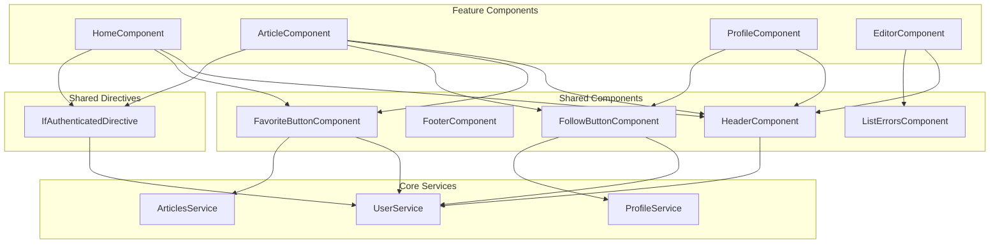
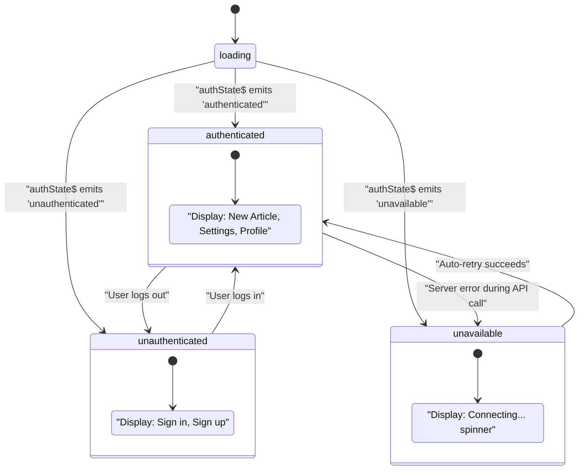
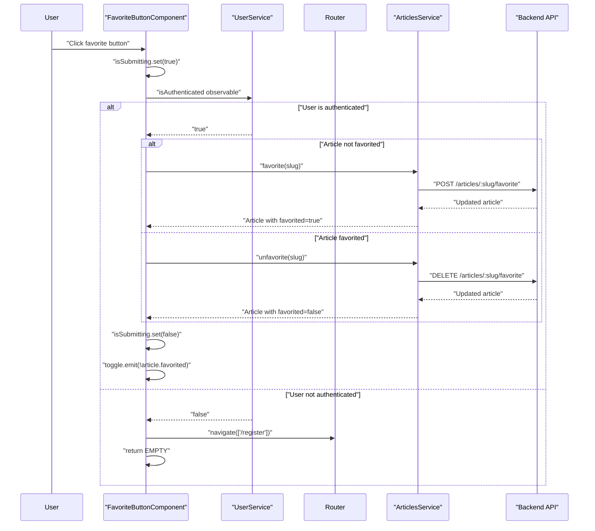
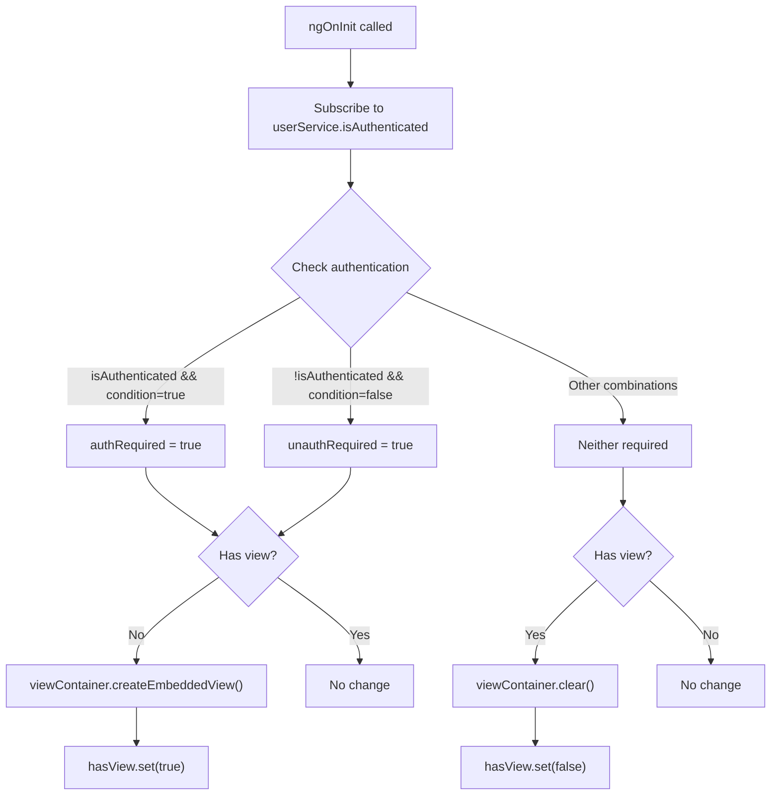
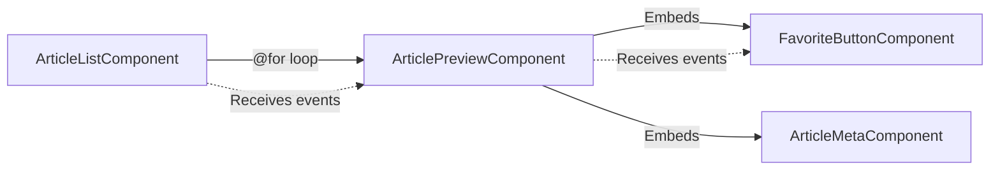
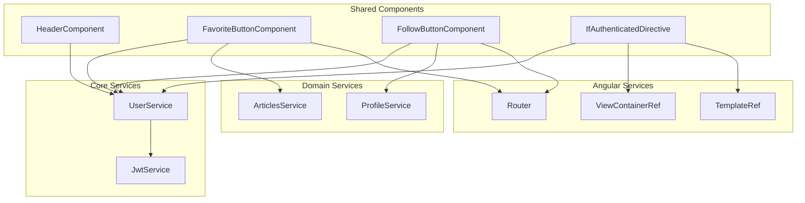

# Shared Components & Directives

<details>
<summary>Relevant source files</summary>

The following files were used as context for generating this wiki page:

- [src/app/core/auth/if-authenticated.directive.ts](../src/app/core/auth/if-authenticated.directive.ts)
- [src/app/core/layout/header.component.html](../src/app/core/layout/header.component.html)
- [src/app/core/layout/header.component.ts](../src/app/core/layout/header.component.ts)
- [src/app/features/article/components/article-list.component.ts](../src/app/features/article/components/article-list.component.ts)
- [src/app/features/article/components/favorite-button.component.ts](../src/app/features/article/components/favorite-button.component.ts)
- [src/app/features/profile/components/follow-button.component.ts](../src/app/features/profile/components/follow-button.component.ts)

</details>

## Purpose and Scope

This document covers the reusable UI components and directives that are used across multiple features in the Angular RealWorld application. These shared components provide consistent user interface elements, handle cross-cutting concerns like authentication checks, and reduce code duplication throughout the application.

For information about feature-specific components, see the [Feature Modules](5-feature-modules.md) section and its subsections. For core services that these components depend on, see [Core Services](4-core-services.md).

---

## Overview

The shared components and directives system provides reusable UI elements that maintain consistent behavior and appearance across the application. These components are standalone and can be imported directly into any feature module without requiring a shared module declaration.

The shared components fall into three main categories:

| Category                  | Components/Directives                              | Purpose                                    |
| ------------------------- | -------------------------------------------------- | ------------------------------------------ |
| **Layout**                | `HeaderComponent`, `FooterComponent`               | Application-wide navigation and structure  |
| **Interactive Buttons**   | `FavoriteButtonComponent`, `FollowButtonComponent` | User interactions requiring authentication |
| **Conditional Rendering** | `IfAuthenticatedDirective`                         | Authentication-based visibility control    |
| **Error Display**         | `ListErrorsComponent`                              | Consistent error message formatting        |

### Shared Component Architecture



**Sources:** `src/app/core/layout/header.component.ts`, `src/app/features/article/components/favorite-button.component.ts`, `src/app/features/profile/components/follow-button.component.ts`, `src/app/core/auth/if-authenticated.directive.ts`

---

## Layout Components

### HeaderComponent

The `HeaderComponent` provides the main navigation bar for the application, displaying different navigation options based on the user's authentication state.

#### Authentication State Integration

The header component subscribes to two observables from `UserService`:

- **`authState$`**: Determines which navigation menu to display (`authenticated`, `unauthenticated`, `loading`, `unavailable`)
- **`currentUser$`**: Provides user profile data for displaying username and avatar

#### Navigation States

The component renders four distinct navigation states:

| State             | Navigation Items                           | Description                                                                                     |
| ----------------- | ------------------------------------------ | ----------------------------------------------------------------------------------------------- |
| `unauthenticated` | Home, Sign in, Sign up                     | Public navigation for logged-out users                                                          |
| `authenticated`   | Home, New Article, Settings, Profile       | Full navigation with user profile link                                                          |
| `loading`         | Home, Loading...                           | Temporary state during authentication check                                                     |
| `unavailable`     | Home, New Article, Settings, Connecting... | Degraded state during server errors (see [Authentication System](3.3-authentication-system.md)) |



**Sources:** `src/app/core/layout/header.component.ts:1-17`, `src/app/core/layout/header.component.html:1-97`

#### Implementation Details

The component uses Angular's async pipe to handle observable subscriptions automatically:

```typescript
// Component class
currentUser$ = this.userService.currentUser;
authState$ = this.userService.authState;
```

The template uses control flow syntax (`@if`) to conditionally render navigation based on `authState$`:

- **Lines 7-20**: Unauthenticated navigation (Sign in, Sign up)
- **Lines 24-52**: Authenticated navigation (New Article, Settings, Profile with avatar)
- **Lines 56-82**: Unavailable state navigation (Connecting... indicator)
- **Lines 85-93**: Loading state navigation (Loading... text)

The profile link uses the `DefaultImagePipe` to handle missing avatar images:

```html

```

**Sources:** `src/app/core/layout/header.component.ts:1-17`, `src/app/core/layout/header.component.html:44-50`

### FooterComponent

The `FooterComponent` provides consistent footer content across all pages. While not included in the provided files, it follows the same standalone component pattern as `HeaderComponent` and is referenced in the application layout structure.

**Sources:** Diagram 4 in architecture overview

---

## Interactive Buttons

### FavoriteButtonComponent

The `FavoriteButtonComponent` provides a reusable button for favoriting and unfavoriting articles throughout the application.

#### Component API

| Property       | Type                    | Direction   | Description                                           |
| -------------- | ----------------------- | ----------- | ----------------------------------------------------- |
| `article`      | `Article`               | `@Input()`  | The article to favorite/unfavorite                    |
| `toggle`       | `EventEmitter<boolean>` | `@Output()` | Emits the new favorited state after successful toggle |
| `isSubmitting` | `signal<boolean>`       | Internal    | Tracks whether an API request is in progress          |

#### Authentication Check Flow



**Sources:** `src/app/features/article/components/favorite-button.component.ts:1-79`

#### Implementation Details

The component uses RxJS operators to handle authentication checks and API calls:

```typescript
this.userService.isAuthenticated
  .pipe(
    switchMap(authenticated => {
      if (!authenticated) {
        void this.router.navigate(['/register']);
        return EMPTY; // Terminates the observable chain
      }
      // Proceed with favorite/unfavorite
    }),
    takeUntilDestroyed(this.destroyRef),
  )
  .subscribe({
    next: () => {
      this.isSubmitting.set(false);
      this.toggle.emit(!this.article.favorited);
    },
    error: () => {
      this.isSubmitting.set(false);
    },
  });
```

**Key behaviors:**

- **Authentication required**: Redirects to `/register` if user is not authenticated
- **Optimistic UI prevention**: Disables button during submission using `isSubmitting` signal
- **Error handling**: Re-enables button on error without modifying state
- **Parent notification**: Emits toggle event so parent component can update article state

**Sources:** `src/app/features/article/components/favorite-button.component.ts:50-78`

#### Button Styling

The button dynamically applies CSS classes based on state:

```typescript
[ngClass]="{
  disabled: isSubmitting(),
  'btn-outline-primary': !article.favorited,
  'btn-primary': article.favorited,
}"
```

- **Disabled state**: Gray appearance when `isSubmitting` is true
- **Outline style**: Used when article is not favorited
- **Filled style**: Used when article is favorited

**Sources:** `src/app/features/article/components/favorite-button.component.ts:22-32`

### FollowButtonComponent

The `FollowButtonComponent` provides a reusable button for following and unfollowing users on profile pages and article metadata sections.

#### Component API

| Property       | Type                    | Direction   | Description                                       |
| -------------- | ----------------------- | ----------- | ------------------------------------------------- |
| `profile`      | `Profile`               | `@Input()`  | The user profile to follow/unfollow               |
| `toggle`       | `EventEmitter<Profile>` | `@Output()` | Emits the updated profile after successful toggle |
| `isSubmitting` | `signal<boolean>`       | Internal    | Tracks whether an API request is in progress      |

#### Implementation Comparison

The `FollowButtonComponent` follows the same pattern as `FavoriteButtonComponent` with key differences:

| Aspect                          | FavoriteButtonComponent              | FollowButtonComponent                    |
| ------------------------------- | ------------------------------------ | ---------------------------------------- |
| Authentication failure redirect | `/register`                          | `/login`                                 |
| API service                     | `ArticlesService`                    | `ProfileService`                         |
| Methods called                  | `favorite(slug)`, `unfavorite(slug)` | `follow(username)`, `unfollow(username)` |
| Event emission                  | `boolean` (new favorited state)      | `Profile` (complete updated profile)     |

#### Button Text Logic

The button text dynamically reflects the current follow state:

```typescript
{
  {
    profile.following ? 'Unfollow' : 'Follow';
  }
}
{
  {
    profile.username;
  }
}
```

This produces text like:

- `Follow john_doe` (when not following)
- `Unfollow john_doe` (when following)

**Sources:** `src/app/features/profile/components/follow-button.component.ts:1-81`

---

## Conditional Rendering Directive

### IfAuthenticatedDirective

The `IfAuthenticatedDirective` provides declarative control over element visibility based on authentication state. It is a structural directive that adds or removes elements from the DOM.

#### Directive API

| Property            | Type      | Description                                                             |
| ------------------- | --------- | ----------------------------------------------------------------------- |
| `[ifAuthenticated]` | `boolean` | `true` to show when authenticated, `false` to show when unauthenticated |

#### Usage Patterns

```html
<!-- Show only when authenticated -->
<div *ifAuthenticated="true">This content is visible to logged-in users only</div>

<!-- Show only when NOT authenticated -->
<div *ifAuthenticated="false">This content is visible to logged-out users only</div>
```

#### DOM Manipulation Flow



**Sources:** `src/app/core/auth/if-authenticated.directive.ts:1-38`

#### Implementation Details

The directive uses Angular's `ViewContainerRef` to manipulate the DOM:

```typescript
ngOnInit() {
  this.userService.isAuthenticated
    .pipe(takeUntilDestroyed(this.destroyRef))
    .subscribe((isAuthenticated: boolean) => {
      const authRequired = isAuthenticated && this.condition();
      const unauthRequired = !isAuthenticated && !this.condition();

      if ((authRequired || unauthRequired) && !this.hasView()) {
        this.viewContainer.createEmbeddedView(this.templateRef);
        this.hasView.set(true);
      } else if (this.hasView()) {
        this.viewContainer.clear();
        this.hasView.set(false);
      }
    });
}
```

**Key behaviors:**

- **Dynamic evaluation**: Re-evaluates visibility whenever authentication state changes
- **Efficient DOM updates**: Only creates/destroys views when necessary using `hasView` signal
- **Template preservation**: The original template is preserved in `TemplateRef` for re-insertion
- **Memory cleanup**: Uses `takeUntilDestroyed` to prevent memory leaks

The directive tracks two conditions:

1. **`authRequired`**: Show content when user is authenticated AND directive input is `true`
2. **`unauthRequired`**: Show content when user is NOT authenticated AND directive input is `false`

**Sources:** `src/app/core/auth/if-authenticated.directive.ts:20-32`

---

## Component Reuse Patterns

### Shared Component Usage Across Features

The following table shows how shared components are reused across different feature modules:

| Component                  | Used In                                     | Purpose               |
| -------------------------- | ------------------------------------------- | --------------------- |
| `HeaderComponent`          | All pages (app root)                        | Consistent navigation |
| `FavoriteButtonComponent`  | Home feed, Article detail, Profile articles | Article favoriting    |
| `FollowButtonComponent`    | Profile page, Article metadata              | User following        |
| `IfAuthenticatedDirective` | Article editor, Comments form               | Feature gating        |
| `ListErrorsComponent`      | Login, Register, Settings, Editor           | Error display         |

### Integration with ArticleListComponent

The `ArticleListComponent` demonstrates how shared components are integrated into feature components. It uses `ArticlePreviewComponent`, which in turn uses `FavoriteButtonComponent`:



**Sources:** `src/app/features/article/components/article-list.component.ts:30-31`

### Event Propagation Pattern

Both `FavoriteButtonComponent` and `FollowButtonComponent` follow the same event propagation pattern:

1. **User action**: Button click
2. **Local state update**: `isSubmitting.set(true)`
3. **Authentication check**: Query `UserService.isAuthenticated`
4. **API call**: Call appropriate service method
5. **Event emission**: Emit updated data to parent via `@Output()`
6. **Parent update**: Parent component updates its local state

This pattern allows parent components to maintain state while the shared components handle the interaction logic and authentication checks.

**Sources:** `src/app/features/article/components/favorite-button.component.ts:50-78`, `src/app/features/profile/components/follow-button.component.ts:52-79`

---

## Shared Component Dependencies

### Service Injection Map



**Sources:** `src/app/core/layout/header.component.ts:14-16`, `src/app/features/article/components/favorite-button.component.ts:44-48`, `src/app/features/profile/components/follow-button.component.ts:46-50`, `src/app/core/auth/if-authenticated.directive.ts:11-15`

### Design Patterns

The shared components demonstrate several important design patterns:

#### 1. Dependency Injection Pattern

All components use constructor injection to receive dependencies, enabling easy testing and loose coupling:

```typescript
constructor(
  private readonly articleService: ArticlesService,
  private readonly router: Router,
  private readonly userService: UserService,
) {}
```

#### 2. Observable-Based State Management

Components subscribe to observables from services rather than directly accessing properties, enabling reactive updates:

```typescript
currentUser$ = this.userService.currentUser;
authState$ = this.userService.authState;
```

#### 3. Signal-Based Local State

Components use signals for local state management (e.g., `isSubmitting`), providing reactive updates with minimal overhead:

```typescript
isSubmitting = signal(false);
```

#### 4. Event Emitter Pattern

Components emit events to notify parents of state changes rather than directly mutating parent state:

```typescript
@Output() toggle = new EventEmitter<Profile>();
```

**Sources:** `src/app/core/layout/header.component.ts:1-17`, `src/app/features/article/components/favorite-button.component.ts:1-79`, `src/app/features/profile/components/follow-button.component.ts:1-81`

---

---

[← Back to documentation index](README.md)
