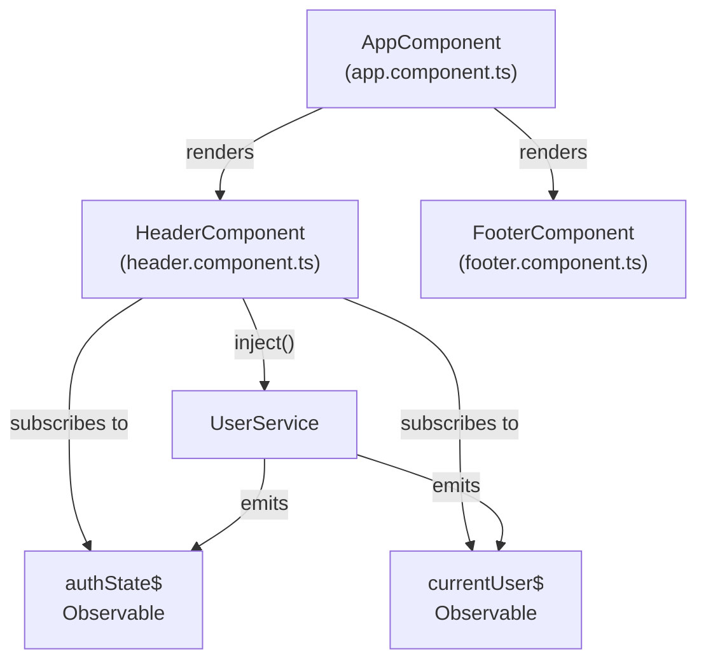
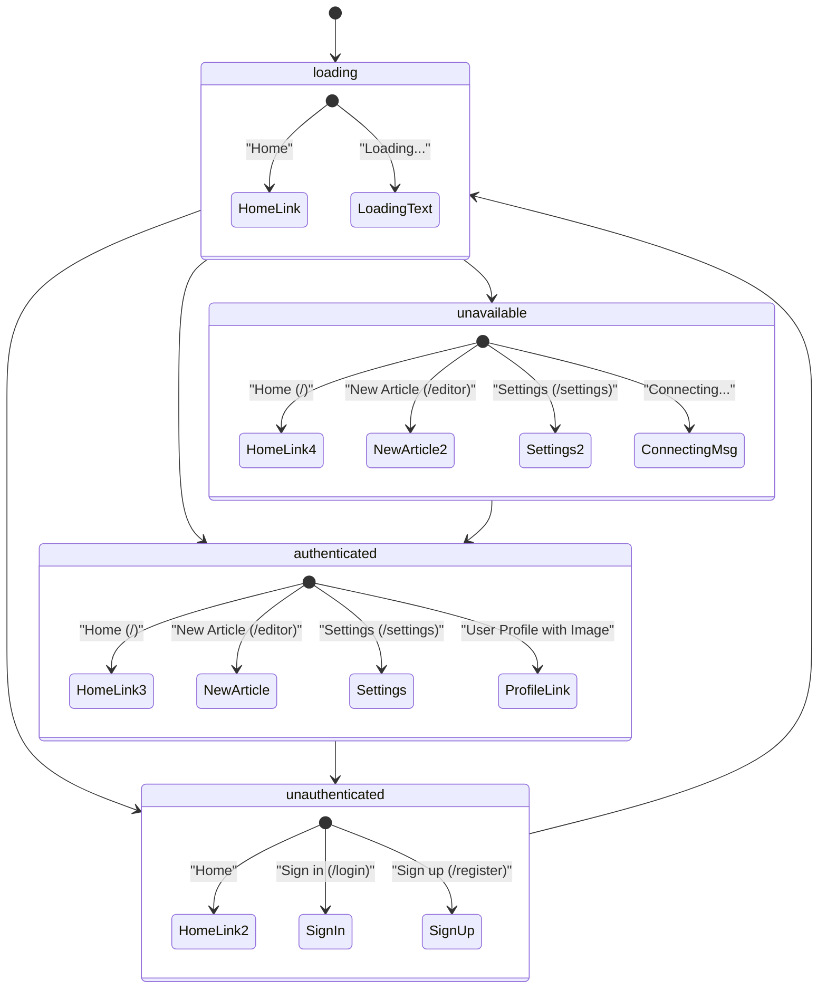
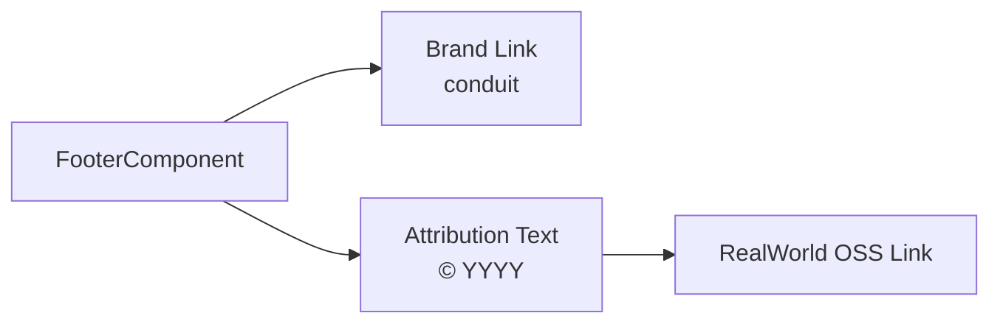
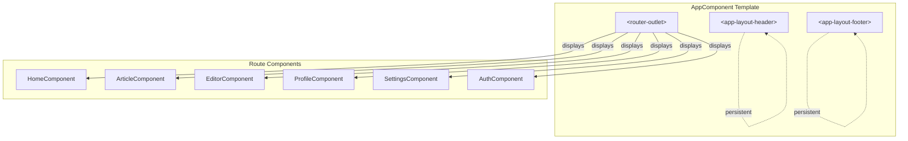
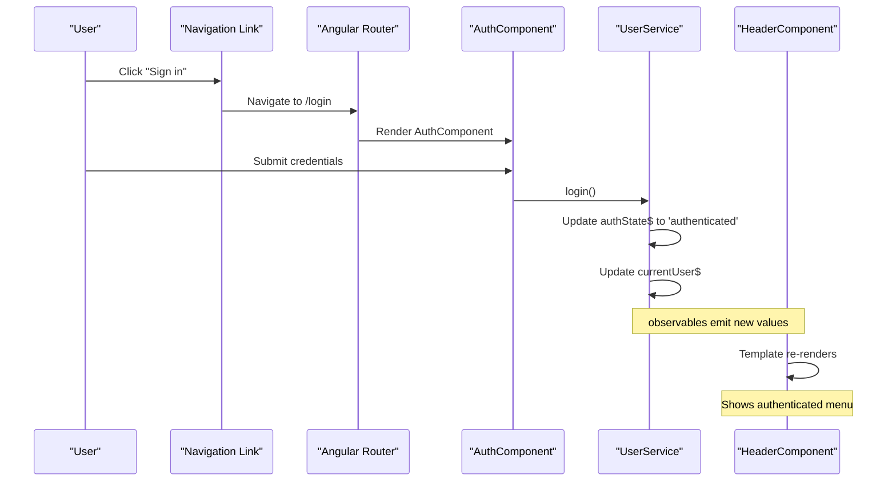

# Layout Components

<details>
<summary>Relevant source files</summary>

The following files were used as context for generating this wiki page:

- [LICENSE](../LICENSE)
- [README.md](../README.md)
- [src/app/core/interceptors/api.interceptor.ts](../src/app/core/interceptors/api.interceptor.ts)
- [src/app/core/interceptors/token.interceptor.ts](../src/app/core/interceptors/token.interceptor.ts)
- [src/app/core/layout/footer.component.html](../src/app/core/layout/footer.component.html)
- [src/app/core/layout/footer.component.ts](../src/app/core/layout/footer.component.ts)
- [src/app/core/layout/header.component.html](../src/app/core/layout/header.component.html)
- [src/app/core/layout/header.component.ts](../src/app/core/layout/header.component.ts)

</details>

This document describes the persistent layout components that appear on every page of the application: `HeaderComponent` and `FooterComponent`. These components provide navigation structure and branding, with the header adapting its display based on authentication state.

For information about authentication state management, see [UserService & Authentication State](4.1-userservice-and-authentication-state.md). For other shared UI components like buttons and directives, see [Interactive Buttons (Favorite & Follow)](6.2-interactive-buttons-favorite-and-follow.md) and [Conditional Rendering & Error Display](6.3-conditional-rendering-and-error-display.md).

---

## Purpose and Scope

The layout components serve as the application's structural frame:

- **HeaderComponent**: Provides authentication-aware navigation and branding
- **FooterComponent**: Displays copyright information and links

Both components are standalone Angular components that use `ChangeDetectionStrategy.OnPush` for optimal performance.

---

## Component Overview

### Component Structure



**Sources**: `src/app/core/layout/header.component.ts:1-18`, `src/app/core/layout/footer.component.ts:1-14`

---

## HeaderComponent

### Component Implementation

The `HeaderComponent` is a minimal class that injects `UserService` and exposes two observables for template consumption:

| Property       | Type                    | Source                    | Purpose                                                                                       |
| -------------- | ----------------------- | ------------------------- | --------------------------------------------------------------------------------------------- |
| `currentUser$` | `Observable<User>`      | `UserService.currentUser` | Current authenticated user data                                                               |
| `authState$`   | `Observable<AuthState>` | `UserService.authState`   | Authentication state: `'loading'`, `'authenticated'`, `'unauthenticated'`, or `'unavailable'` |

**Sources**: `src/app/core/layout/header.component.ts:13-16`

### Authentication State Navigation

The header template renders different navigation menus based on the `authState$` value:



**Sources**: `src/app/core/layout/header.component.html:1-98`

### Navigation Menu Breakdown

#### Loading State (`authState === 'loading'`)

Displayed during initial authentication check on app startup:

- Home link
- "Loading..." placeholder text

**Template lines**: `src/app/core/layout/header.component.html:85-94`

#### Unauthenticated State (`authState === 'unauthenticated'`)

Displayed when no user is logged in:

- Home link (`/`)
- Sign in link (`/login`) with `routerLinkActive="active"`
- Sign up link (`/register`) with `routerLinkActive="active"`

**Template lines**: `src/app/core/layout/header.component.html:7-21`

#### Authenticated State (`authState === 'authenticated'`)

Displayed when a user is successfully authenticated:

- Home link (`/`) with exact matching
- New Article link (`/editor`) with compose icon
- Settings link (`/settings`) with gear icon
- User profile link (`/profile/:username`) with user image and username

The user profile link uses the `currentUser$` observable to access the username and image. The image is processed through the `DefaultImagePipe` to handle missing images.

**Template lines**: `src/app/core/layout/header.component.html:24-53`

#### Unavailable State (`authState === 'unavailable'`)

Displayed when authentication server is temporarily unreachable but the app retains the JWT token for automatic retry:

- Home link (`/`)
- New Article link (`/editor`)
- Settings link (`/settings`)
- "Connecting..." status with loading icon

This state allows users to continue navigating while the app attempts to reconnect to the authentication server.

**Template lines**: `src/app/core/layout/header.component.html:56-82`

### Template Patterns

The header uses several Angular patterns:

| Pattern                   | Usage                                | Example                                       |
| ------------------------- | ------------------------------------ | --------------------------------------------- |
| `AsyncPipe`               | Subscribe to observables in template | `@if (authState$ \| async; as authState)`     |
| `RouterLink`              | Declarative navigation               | `routerLink="/editor"`                        |
| `RouterLinkActive`        | Highlight active route               | `routerLinkActive="active"`                   |
| `RouterLinkActiveOptions` | Configure exact matching             | `[routerLinkActiveOptions]="{ exact: true }"` |
| `DefaultImagePipe`        | Handle missing images                | `[src]="currentUser.image \| defaultImage"`   |

**Sources**: `src/app/core/layout/header.component.html:5-50`

### Imports

The component imports:

- `RouterLink` and `RouterLinkActive` from `@angular/router`
- `AsyncPipe` from `@angular/common`
- `DefaultImagePipe` from shared pipes

**Sources**: `src/app/core/layout/header.component.ts:3-5,10`

---

## FooterComponent

### Component Implementation

The `FooterComponent` is a simple component with minimal logic:

```typescript
export class FooterComponent {
  today: number = Date.now();
}
```

The `today` property provides the current timestamp for displaying the copyright year.

**Sources**: `src/app/core/layout/footer.component.ts:11-13`

### Template Structure

The footer template contains:

- Brand link (`routerLink="/"`) displaying "conduit"
- Attribution text with dynamic year (formatted via `DatePipe`)
- Link to the RealWorld OSS Project
- MIT license reference



**Template content**: `src/app/core/layout/footer.component.html:1-10`

### Imports

The component imports:

- `DatePipe` from `@angular/common` for year formatting
- `RouterLink` from `@angular/router` for navigation

**Sources**: `src/app/core/layout/footer.component.ts:2-3,9`

---

## Layout Component Integration

### Application Composition

Both layout components are rendered by the root `AppComponent`. They appear on every page and persist across route changes:



The layout components remain mounted while route components swap in and out via the router outlet.

**Sources**: `README.md:37-56`

---

## Authentication State Flow

### Header Response to Authentication Changes

The header automatically updates when authentication state changes:



The `AsyncPipe` automatically subscribes to observables and triggers change detection when values emit.

**Sources**: `src/app/core/layout/header.component.html:5-53`

---

## Styling and Presentation

### CSS Classes

The header uses Bootstrap-based CSS classes:

| Class                          | Applied To        | Purpose                       |
| ------------------------------ | ----------------- | ----------------------------- |
| `navbar navbar-light`          | `<nav>`           | Main navigation bar styling   |
| `container`                    | `<div>`           | Center content with padding   |
| `navbar-brand`                 | `<a>`             | Brand/logo styling            |
| `nav navbar-nav pull-xs-right` | `<ul>`            | Right-aligned navigation list |
| `nav-item`                     | `<li>`            | Individual navigation item    |
| `nav-link`                     | `<a>` or `<span>` | Navigation link styling       |
| `user-pic`                     | ``           | User profile image styling    |

**Sources**: `src/app/core/layout/header.component.html:1-97`

### Icons

The header uses Ionicons for visual elements:

- `ion-compose`: New Article button
- `ion-gear-a`: Settings button
- `ion-load-c`: Loading/connecting indicator

**Sources**: `src/app/core/layout/header.component.html:34,40,78`

---

## Performance Considerations

### Change Detection Strategy

Both components use `ChangeDetectionStrategy.OnPush`:

```typescript
changeDetection: ChangeDetectionStrategy.OnPush;
```

This optimization ensures components only check for changes when:

- Input properties change (not applicable here as neither component has inputs)
- Observables subscribed via `AsyncPipe` emit new values
- Events are triggered from the template

**Sources**: `src/app/core/layout/header.component.ts:11`, `src/app/core/layout/footer.component.ts:8`

### Observable Subscription Management

The `AsyncPipe` automatically handles subscription lifecycle:

- Subscribes when the component initializes
- Unsubscribes when the component destroys
- Prevents memory leaks

**Sources**: `src/app/core/layout/header.component.html:5,44`

---

## Summary

The layout components provide the structural foundation for the application:

| Component         | Responsibility                  | Key Dependencies                         |
| ----------------- | ------------------------------- | ---------------------------------------- |
| `HeaderComponent` | Authentication-aware navigation | `UserService`, `RouterLink`, `AsyncPipe` |
| `FooterComponent` | Static footer with attribution  | `DatePipe`, `RouterLink`                 |

The header's authentication-aware behavior is central to the user experience, seamlessly adapting the navigation based on whether users are logged in, logged out, loading, or experiencing temporary connectivity issues.

**Sources**: `src/app/core/layout/header.component.ts:1-18`, `src/app/core/layout/footer.component.ts:1-14`

---

---

[← Back to documentation index](README.md)
