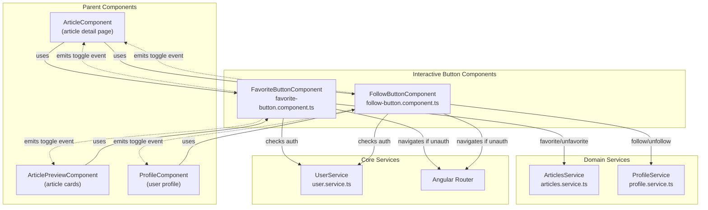
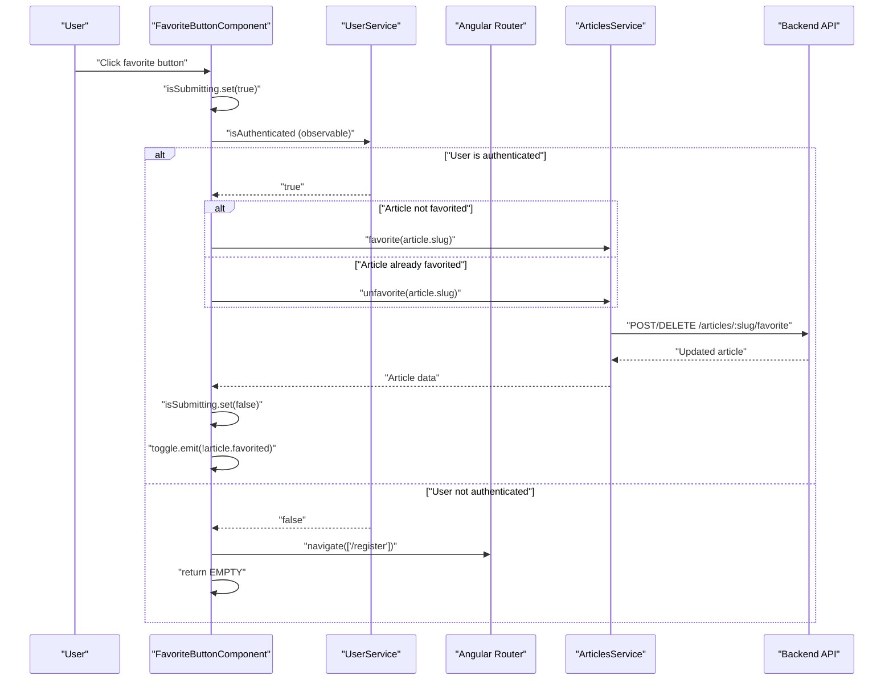
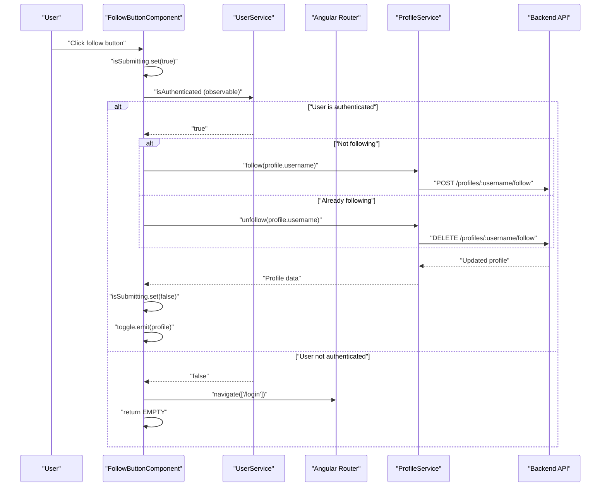
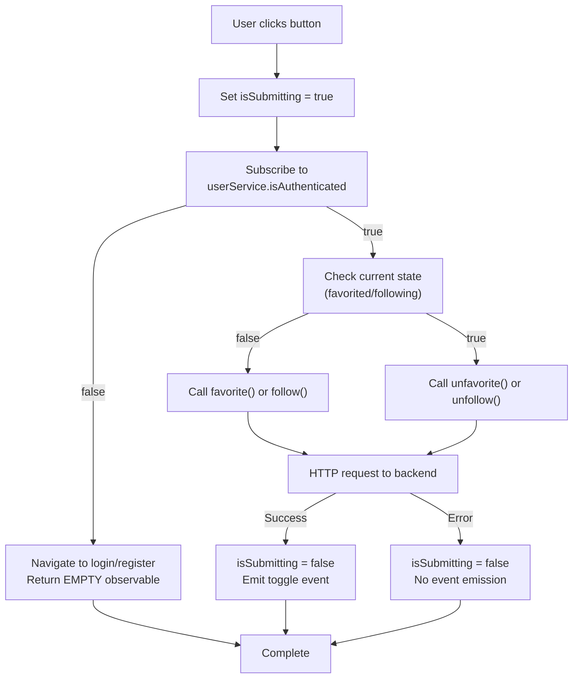

# Interactive Buttons (Favorite & Follow)

<details>
<summary>Relevant source files</summary>

The following files were used as context for generating this wiki page:

- [src/app/core/auth/if-authenticated.directive.ts](../src/app/core/auth/if-authenticated.directive.ts)
- [src/app/features/article/components/article-list.component.ts](../src/app/features/article/components/article-list.component.ts)
- [src/app/features/article/components/favorite-button.component.ts](../src/app/features/article/components/favorite-button.component.ts)
- [src/app/features/article/pages/article/article.component.html](../src/app/features/article/pages/article/article.component.html)
- [src/app/features/profile/components/follow-button.component.ts](../src/app/features/profile/components/follow-button.component.ts)
- [src/app/features/profile/pages/profile/profile.component.html](../src/app/features/profile/pages/profile/profile.component.html)
- [src/app/features/profile/services/profile.service.ts](../src/app/features/profile/services/profile.service.ts)

</details>

## Purpose and Scope

This document describes the `FavoriteButtonComponent` and `FollowButtonComponent`, which provide user interaction capabilities for favoriting articles and following users. Both components implement authentication-aware actions with optimistic UI updates and navigation for unauthenticated users.

For information about article listing and preview display, see [Article List & Pagination](5.1.1-article-list-and-pagination.md). For authentication state management, see [UserService & Authentication State](4.1-userservice-and-authentication-state.md).

**Sources:** `src/app/features/article/components/favorite-button.component.ts:1-79`, `src/app/features/profile/components/follow-button.component.ts:1-81`

---

## Component Architecture Overview

Both button components follow a common architectural pattern: they are standalone, presentational components with minimal logic that delegate to domain services for data operations. They integrate with the authentication system to conditionally enable functionality and redirect unauthenticated users to appropriate pages.



**Sources:** `src/app/features/article/components/favorite-button.component.ts:1-79`, `src/app/features/profile/components/follow-button.component.ts:1-81`, `src/app/features/article/pages/article/article.component.html:1-127`, `src/app/features/profile/pages/profile/profile.component.html:1-65`

---

## FavoriteButtonComponent

### Component Structure

The `FavoriteButtonComponent` is a standalone component located at `src/app/features/article/components/favorite-button.component.ts:19-79`. It accepts an `Article` input and emits a `toggle` event when the favorite state changes.

**Key Properties:**

| Property       | Type                    | Purpose                                                              |
| -------------- | ----------------------- | -------------------------------------------------------------------- |
| `article`      | `Article`               | Input containing article data including `slug` and `favorited` state |
| `toggle`       | `EventEmitter<boolean>` | Emits the new favorited state to parent component                    |
| `isSubmitting` | `signal<boolean>`       | Tracks whether an API request is in progress                         |

The component template `src/app/features/article/components/favorite-button.component.ts:22-32` displays a button with dynamic styling based on the favorited state and disabled state during submission.

**Sources:** `src/app/features/article/components/favorite-button.component.ts:37-42`

### Authentication Flow

The favorite action follows a strict authentication check before execution:



**Sources:** `src/app/features/article/components/favorite-button.component.ts:50-78`

### Implementation Details

The `toggleFavorite()` method `src/app/features/article/components/favorite-button.component.ts:50-78` implements the following logic:

1. **Set submitting state**: `isSubmitting.set(true)` to disable the button
2. **Check authentication**: Subscribe to `userService.isAuthenticated`
3. **Redirect if unauthenticated**: Navigate to `/register` and return `EMPTY` observable
4. **Execute API call**: Call `articleService.favorite()` or `unfavorite()` based on current state
5. **Handle response**: Reset `isSubmitting` and emit toggle event
6. **Handle errors**: Reset `isSubmitting` on error (implicit retry allowed)

The component uses `switchMap` `src/app/features/article/components/favorite-button.component.ts:55` to chain the authentication check with the API call, ensuring that the API call only executes for authenticated users.

**Sources:** `src/app/features/article/components/favorite-button.component.ts:50-78`

### Button Styling

The button applies conditional CSS classes via `NgClass` directive `src/app/features/article/components/favorite-button.component.ts:24-28`:

| State         | CSS Classes                      |
| ------------- | -------------------------------- |
| Not favorited | `btn btn-sm btn-outline-primary` |
| Favorited     | `btn btn-sm btn-primary`         |
| Submitting    | Additional `disabled` class      |

The heart icon (`ion-heart`) is always displayed, with the button text provided via `<ng-content>` for flexibility `src/app/features/article/components/favorite-button.component.ts:31`.

**Sources:** `src/app/features/article/components/favorite-button.component.ts:22-32`

### Usage Locations

The `FavoriteButtonComponent` appears in two contexts:

1. **Article Detail Page** `src/app/features/article/pages/article/article.component.html:35-38`: Displays with article title and favorites count
2. **Article Preview Cards** (indirectly via `ArticlePreviewComponent`): Shown on each article card in lists

In the article detail template, the button includes custom content showing the action text and counter:

```html
<app-favorite-button [article]="a" (toggle)="onToggleFavorite($event)">
  {{ a.favorited ? 'Unfavorite' : 'Favorite' }} Article
  <span class="counter">({{ a.favoritesCount }})</span>
</app-favorite-button>
```

**Sources:** `src/app/features/article/pages/article/article.component.html:35-38`, `src/app/features/article/pages/article/article.component.html:82-85`

---

## FollowButtonComponent

### Component Structure

The `FollowButtonComponent` is a standalone component located at `src/app/features/profile/components/follow-button.component.ts:20-81`. It accepts a `Profile` input and emits a `toggle` event when the following state changes.

**Key Properties:**

| Property       | Type                    | Purpose                                                                       |
| -------------- | ----------------------- | ----------------------------------------------------------------------------- |
| `profile`      | `Profile`               | Input containing user profile data including `username` and `following` state |
| `toggle`       | `EventEmitter<Profile>` | Emits the updated profile object to parent component                          |
| `isSubmitting` | `signal<boolean>`       | Tracks whether an API request is in progress                                  |

The component template `src/app/features/profile/components/follow-button.component.ts:23-35` displays an action button with a plus icon and dynamic text.

**Sources:** `src/app/features/profile/components/follow-button.component.ts:41-44`

### Authentication Flow

The follow action mirrors the favorite pattern with a different redirect target:



**Sources:** `src/app/features/profile/components/follow-button.component.ts:52-79`

### Implementation Details

The `toggleFollowing()` method `src/app/features/profile/components/follow-button.component.ts:52-79` implements:

1. **Set submitting state**: `isSubmitting.set(true)` to disable the button
2. **Check authentication**: Subscribe to `userService.isAuthenticated`
3. **Redirect if unauthenticated**: Navigate to `/login` (different from FavoriteButton's `/register`)
4. **Execute API call**: Call `profileService.follow()` or `unfollow()` based on current state
5. **Handle response**: Reset `isSubmitting` and emit updated profile
6. **Handle errors**: Reset `isSubmitting` on error

Notable differences from `FavoriteButtonComponent`:

- Redirects to `/login` instead of `/register` `src/app/features/profile/components/follow-button.component.ts:59`
- Emits the full `Profile` object rather than a boolean `src/app/features/profile/components/follow-button.component.ts:74`

**Sources:** `src/app/features/profile/components/follow-button.component.ts:52-79`

### Button Styling

The button applies conditional CSS classes `src/app/features/profile/components/follow-button.component.ts:25-29`:

| State         | CSS Classes                                   |
| ------------- | --------------------------------------------- |
| Not following | `btn btn-sm action-btn btn-outline-secondary` |
| Following     | `btn btn-sm action-btn btn-secondary`         |
| Submitting    | Additional `disabled` class                   |

The button displays a plus icon (`ion-plus-round`) and dynamic text showing the action and username `src/app/features/profile/components/follow-button.component.ts:34`.

**Sources:** `src/app/features/profile/components/follow-button.component.ts:23-35`

### Usage Locations

The `FollowButtonComponent` appears in:

1. **Profile Page** `src/app/features/profile/pages/profile/profile.component.html:20`: Shows below user bio when viewing another user's profile
2. **Article Detail Page** `src/app/features/article/pages/article/article.component.html:33`: Displayed alongside article metadata for the article author

The profile page conditionally renders the button only when viewing another user's profile (not your own) `src/app/features/profile/pages/profile/profile.component.html:19-21`.

**Sources:** `src/app/features/profile/pages/profile/profile.component.html:19-21`, `src/app/features/article/pages/article/article.component.html:33`

---

## Common Architectural Patterns

### Authentication-Gated Actions

Both components follow an identical pattern for authentication checks using RxJS operators:



The key operator chain is:

1. `userService.isAuthenticated` - Observable that emits authentication state
2. `switchMap` - Conditionally chains to API call or navigation
3. `takeUntilDestroyed(destroyRef)` - Automatic cleanup on component destruction

**Sources:** `src/app/features/article/components/favorite-button.component.ts:53-67`, `src/app/features/profile/components/follow-button.component.ts:55-68`

### State Management with Signals

Both components use Angular signals for local UI state:

```typescript
isSubmitting = signal(false);
```

This signal drives:

- Button disabled state via `NgClass` directive
- Visual feedback during API operations
- Prevention of duplicate requests

The signal is set to `true` at the start of the operation `src/app/features/article/components/favorite-button.component.ts:51` and reset to `false` in both success and error handlers `src/app/features/article/components/favorite-button.component.ts:71`.

**Sources:** `src/app/features/article/components/favorite-button.component.ts:39`, `src/app/features/profile/components/follow-button.component.ts:43`

### Memory Management

Both components use the modern `takeUntilDestroyed` operator with `DestroyRef` injection:

```typescript
destroyRef = inject(DestroyRef);

// In subscription
.pipe(takeUntilDestroyed(this.destroyRef))
```

This ensures automatic unsubscription when the component is destroyed, preventing memory leaks. The `DestroyRef` is injected at the class level `src/app/features/article/components/favorite-button.component.ts:38`.

**Sources:** `src/app/features/article/components/favorite-button.component.ts:38`, `src/app/features/article/components/favorite-button.component.ts:67`, `src/app/features/profile/components/follow-button.component.ts:44`, `src/app/features/profile/components/follow-button.component.ts:69`

---

## Parent Component Integration

### Event Handling Pattern

Parent components handle toggle events to update their local state:

**Article Detail Page:**

```typescript
// Handler for favorite toggle
onToggleFavorite(favorited: boolean): void {
  // Update local article state
}

// Handler for follow toggle
toggleFollowing(profile: Profile): void {
  // Update article author data
}
```

**Profile Page:**

```typescript
onToggleFollowing(profile: Profile): void {
  // Update profile data
}
```

The event payloads differ:

- `FavoriteButtonComponent` emits a `boolean` representing the new favorited state `src/app/features/article/components/favorite-button.component.ts:72`
- `FollowButtonComponent` emits the complete updated `Profile` object `src/app/features/profile/components/follow-button.component.ts:74`

**Sources:** `src/app/features/article/pages/article/article.component.html:35`, `src/app/features/profile/pages/profile/profile.component.html:20`

### Conditional Rendering

Components are conditionally rendered based on user context:

**Profile Page Example:**
The follow button only appears when viewing another user's profile `src/app/features/profile/pages/profile/profile.component.html:19-26`:

```html
@if (!isUser()) {
<app-follow-button [profile]="p" (toggle)="onToggleFollowing($event)" />
} @if (isUser()) {
<a [routerLink]="['/settings']" class="btn btn-sm btn-outline-secondary action-btn">
  <i class="ion-gear-a"></i> Edit Profile Settings
</a>
}
```

**Article Detail Page Example:**
Favorite and follow buttons only appear for articles not authored by the current user `src/app/features/article/pages/article/article.component.html:31-39`.

**Sources:** `src/app/features/profile/pages/profile/profile.component.html:19-26`, `src/app/features/article/pages/article/article.component.html:17-40`

---

## Service Integration

### ArticlesService Integration

The `FavoriteButtonComponent` delegates to `ArticlesService` methods:

| Method                     | HTTP Request                      | Purpose                       |
| -------------------------- | --------------------------------- | ----------------------------- |
| `favorite(slug: string)`   | `POST /articles/:slug/favorite`   | Add article to favorites      |
| `unfavorite(slug: string)` | `DELETE /articles/:slug/favorite` | Remove article from favorites |

Both methods return an `Observable<Article>` containing the updated article data with the new `favorited` state and `favoritesCount`.

**Sources:** `src/app/features/article/components/favorite-button.component.ts:62-64`

### ProfileService Integration

The `FollowButtonComponent` delegates to `ProfileService` methods:

| Method                       | HTTP Request                        | Purpose         |
| ---------------------------- | ----------------------------------- | --------------- |
| `follow(username: string)`   | `POST /profiles/:username/follow`   | Follow a user   |
| `unfollow(username: string)` | `DELETE /profiles/:username/follow` | Unfollow a user |

Both methods return an `Observable<Profile>` containing the updated profile data `src/app/features/profile/services/profile.service.ts:25-35`.

**Sources:** `src/app/features/profile/components/follow-button.component.ts:64-66`, `src/app/features/profile/services/profile.service.ts:25-35`

### Error Handling

Both components handle errors by:

1. Resetting the `isSubmitting` signal to `false`
2. Not emitting the toggle event (parent state remains unchanged)
3. Relying on global error interceptor for user notification

Error handlers `src/app/features/article/components/favorite-button.component.ts:74-76` are minimal, allowing the HTTP error interceptor to handle error display and logging.

**Sources:** `src/app/features/article/components/favorite-button.component.ts:74-76`, `src/app/features/profile/components/follow-button.component.ts:76-78`

---

---

[← Back to documentation index](README.md)
