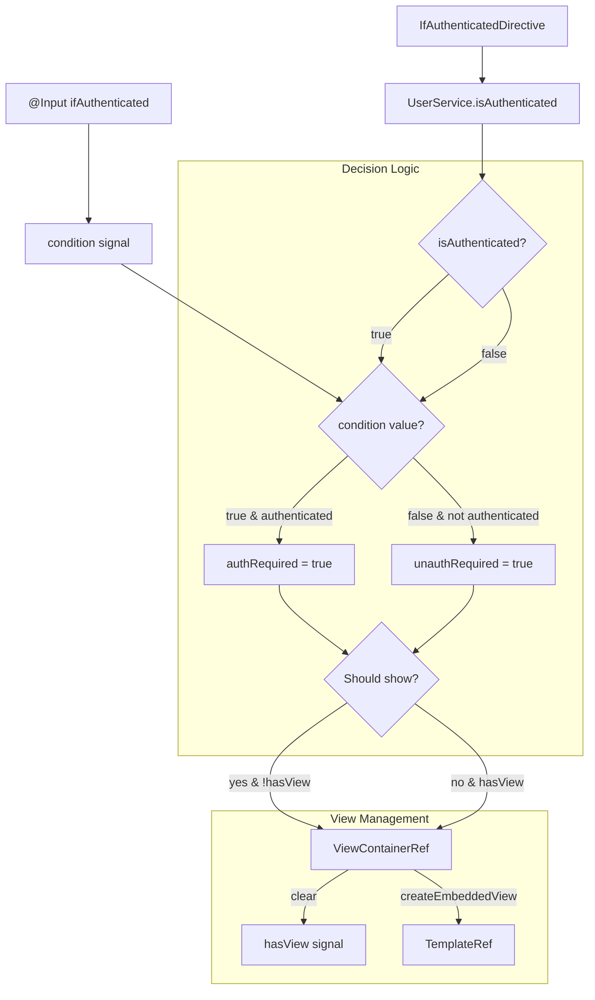
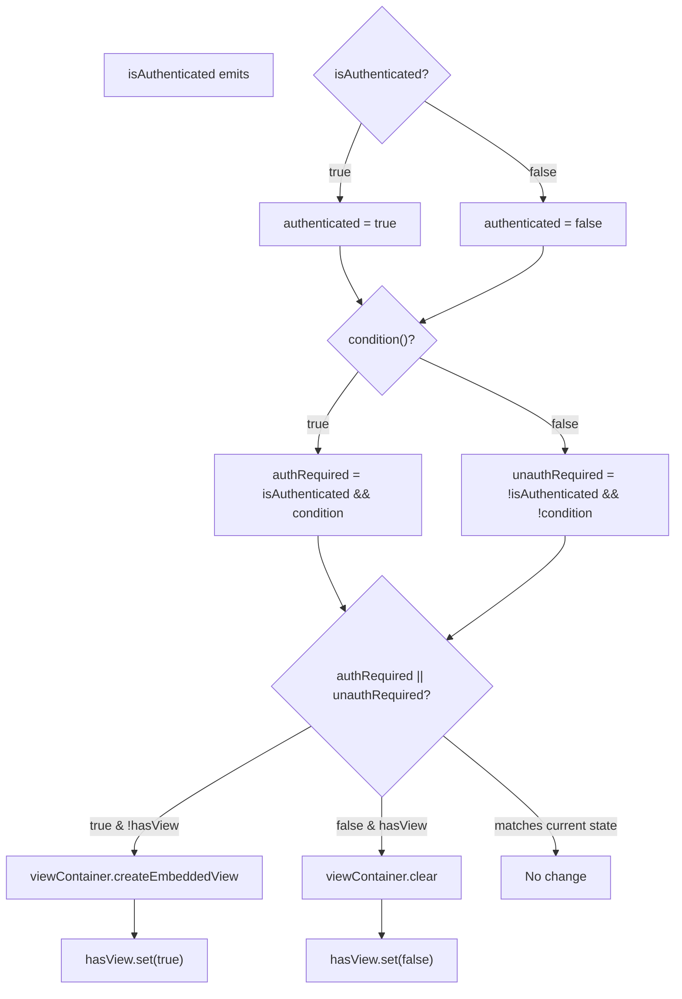
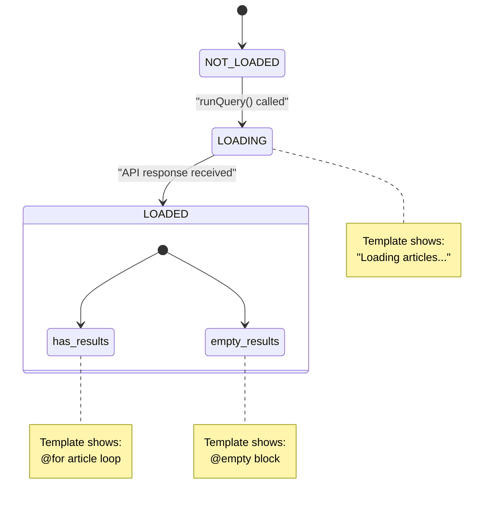
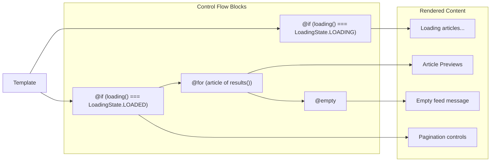
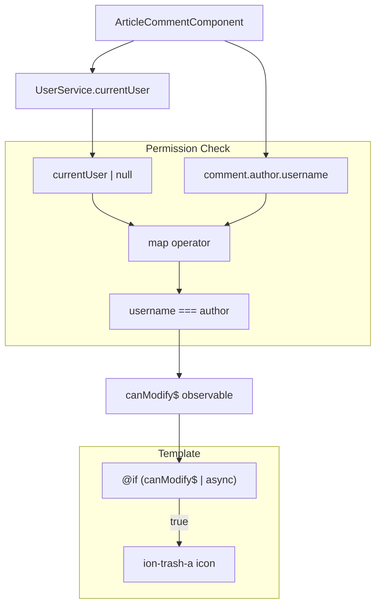
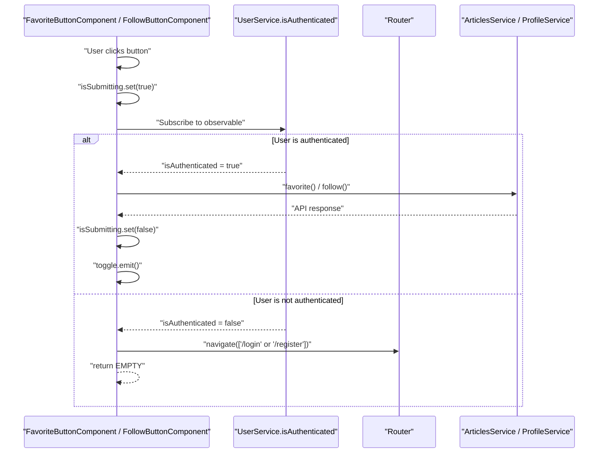
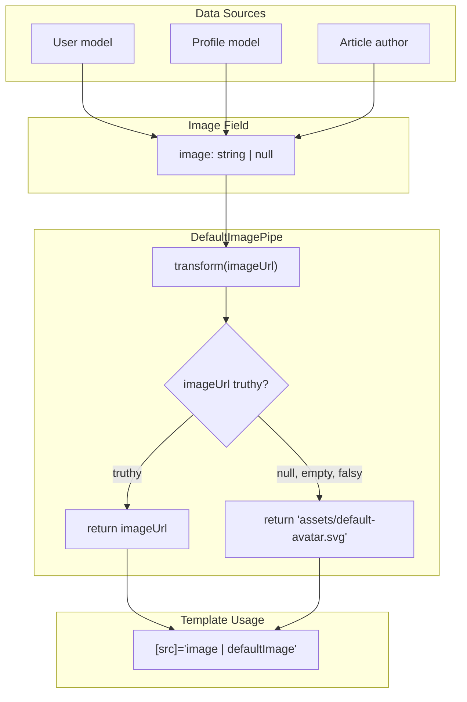
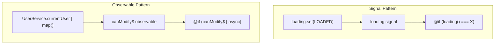

# Conditional Rendering & Error Display

Relevant source files

The following files were used as context for generating this wiki page:

- [e2e/null-fields.spec.ts](../e2e/null-fields.spec.ts)
- [src/app/core/auth/if-authenticated.directive.ts](../src/app/core/auth/if-authenticated.directive.ts)
- [src/app/core/auth/user.model.ts](../src/app/core/auth/user.model.ts)
- [src/app/features/article/components/article-comment.component.ts](../src/app/features/article/components/article-comment.component.ts)
- [src/app/features/article/components/article-list.component.ts](../src/app/features/article/components/article-list.component.ts)
- [src/app/features/article/components/article-meta.component.ts](../src/app/features/article/components/article-meta.component.ts)
- [src/app/features/article/components/favorite-button.component.ts](../src/app/features/article/components/favorite-button.component.ts)
- [src/app/features/profile/components/follow-button.component.ts](../src/app/features/profile/components/follow-button.component.ts)
- [src/app/features/profile/models/profile.model.ts](../src/app/features/profile/models/profile.model.ts)

## Purpose & Scope

This page documents the mechanisms used throughout the application for conditional rendering and error display. It covers the `IfAuthenticatedDirective` for authentication-based visibility control, Angular's control flow syntax for loading and empty states, permission-based rendering patterns, and handling of null or empty field values.

For information about the authentication state machine that drives many of these conditional rendering decisions, see [Authentication System](3.3-authentication-system.md). For details on how errors are propagated from HTTP requests, see [HTTP Interceptors](4.2-http-interceptors.md).

---

## IfAuthenticatedDirective Overview

The `IfAuthenticatedDirective` is a structural directive that conditionally renders content based on the user's authentication state. It subscribes to the `UserService.isAuthenticated` observable and dynamically creates or destroys views in response to authentication changes.

### Directive Logic Flow

**Directive Mechanics**: The directive evaluates two conditions: (1) authenticated user with `condition=true`, or (2) unauthenticated user with `condition=false`. Views are created only when needed and destroyed when conditions no longer match.

### Usage Patterns

The directive accepts a boolean input that determines whether to show content for authenticated or unauthenticated users:

| Input Value | Authentication State | Behavior     |
| ----------- | -------------------- | ------------ |
| `true`      | Authenticated        | Show content |
| `true`      | Unauthenticated      | Hide content |
| `false`     | Authenticated        | Hide content |
| `false`     | Unauthenticated      | Show content |

**Sources**: `src/app/core/auth/if-authenticated.directive.ts:1-38`

---

## Implementation Details

### Signal-Based State Management

The directive uses Angular signals to track internal state:

- **`condition`**: Stores the input value determining show/hide logic
- **`hasView`**: Tracks whether the template is currently rendered

The `ViewContainerRef` manages the DOM by either creating an embedded view from the `TemplateRef` or clearing all views. The subscription to `isAuthenticated` uses `takeUntilDestroyed(this.destroyRef)` to automatically unsubscribe when the directive is destroyed.

### Evaluation Logic

**Conditional Logic**: The directive calculates `authRequired` (authenticated user needs content) and `unauthRequired` (unauthenticated user needs content), then updates the view only when necessary.

**Sources**: `src/app/core/auth/if-authenticated.directive.ts:20-33`

---

## Angular Control Flow Syntax

The application uses Angular's modern control flow syntax (`@if`, `@for`, `@empty`) for template-based conditional rendering. This syntax replaces the older `*ngIf` and `*ngFor` structural directives with a more concise and performant approach.

### Loading State Pattern

**Loading State Enum**: The application defines a `LoadingState` enum with values `NOT_LOADED`, `LOADING`, and `LOADED` to represent data fetching states.

### ArticleListComponent Loading UI

The `ArticleListComponent` demonstrates the complete loading state pattern:

**Nested Control Flow**: The template first checks loading state with `@if`, then uses `@for` to iterate articles, with `@empty` providing fallback content when no articles exist.

**Sources**: `src/app/features/article/components/article-list.component.ts:25-54`

---

## Empty State Messaging

The `ArticleListComponent` provides context-aware empty state messages based on the feed type:

| Feed Type          | Empty Message                  | Additional Content                         |
| ------------------ | ------------------------------ | ------------------------------------------ |
| Following Feed     | "Your feed is empty."          | Link to Global Feed with follow suggestion |
| Global Feed        | "No articles are here... yet." | Plain message                              |
| Profile Articles   | "No articles are here... yet." | Plain message                              |
| Favorited Articles | "No articles are here... yet." | Plain message                              |

The template determines which message to show using the `isFollowingFeed` input property, which is set by parent components when displaying the user's personal feed.

**Sources**: `src/app/features/article/components/article-list.component.ts:32-41`

---

## Permission-Based Conditional Rendering

Components implement permission checks to show or hide user actions based on ownership or authentication state.

### Comment Deletion Permission

**Observable Permission Pattern**: The component creates a `canModify$` observable by piping `UserService.currentUser` through a `map` operator that compares the current user's username with the comment author's username.

The template uses the `async` pipe to subscribe to this observable and conditionally renders the delete icon only when the user has permission.

**Sources**: `src/app/features/article/components/article-comment.component.ts:31-35`, `src/app/features/article/components/article-comment.component.ts:47-49`

---

## Authentication-Gated Actions

Interactive buttons check authentication state before performing actions, redirecting unauthenticated users to login/register pages.

### Authentication Check Flow

**RxJS Pattern**: Both `FavoriteButtonComponent` and `FollowButtonComponent` use the same pattern: subscribe to `UserService.isAuthenticated`, then use `switchMap` to either navigate to auth pages or perform the action.

### Button State Management

Both components use signals to track submission state and disable the button during API calls:

| State      | Signal Value           | Button Appearance                |
| ---------- | ---------------------- | -------------------------------- |
| Ready      | `isSubmitting = false` | Enabled with appropriate styling |
| Submitting | `isSubmitting = true`  | Disabled with `.disabled` class  |

The `NgClass` directive applies the `disabled` class based on the `isSubmitting()` signal value, providing visual feedback during API operations.

**Sources**: `src/app/features/article/components/favorite-button.component.ts:50-78`, `src/app/features/profile/components/follow-button.component.ts:52-80`

---

## Null Field Handling & Default Values

The application handles null or empty field values gracefully by providing default images and preventing literal "null" text from appearing in the UI.

### Default Avatar Implementation

**DefaultImagePipe Pattern**: The application uses a `defaultImage` pipe throughout templates wherever user images are displayed. This pipe checks if the image URL is truthy and returns a default SVG asset if not.

### Null Field Test Coverage

The E2E test suite validates null field handling across multiple UI contexts:

| Context                | Test Case                 | Expected Behavior              |
| ---------------------- | ------------------------- | ------------------------------ |
| Profile page avatar    | User with null image      | Shows `default-avatar.svg`     |
| Navbar avatar          | User with null image      | Shows `default-avatar.svg`     |
| Article meta avatar    | Author with null image    | Shows `default-avatar.svg`     |
| Comment author avatar  | Commenter with null image | Shows `default-avatar.svg`     |
| Article preview avatar | Author with null image    | Shows `default-avatar.svg`     |
| Profile bio            | User with null bio        | Shows empty string, not "null" |
| Settings form image    | User with null image      | Input value is empty string    |
| Settings form bio      | User with null bio        | Textarea value is empty string |

**Empty String Normalization**: When fields are cleared to empty strings or null values, the application ensures that the literal text "null" never appears in the UI. This is handled through the pipe for images and through template binding for text fields.

**Sources**: `e2e/null-fields.spec.ts:20-156`, `src/app/features/article/components/article-meta.component.ts:12`, `src/app/features/article/components/article-comment.component.ts:22`

---

## Component-Level Conditional Rendering Summary

### Conditional Rendering Techniques by Component

| Component                 | Technique                                  | Purpose                         |
| ------------------------- | ------------------------------------------ | ------------------------------- |
| `ArticleListComponent`    | `@if (loading() === LoadingState.X)`       | Loading state display           |
| `ArticleListComponent`    | `@for` with `@empty`                       | Article iteration with fallback |
| `ArticleListComponent`    | `@if (isFollowingFeed)`                    | Context-specific empty message  |
| `ArticleCommentComponent` | `@if (canModify$ \| async)`                | Permission-based delete button  |
| `FavoriteButtonComponent` | `[ngClass]="{ disabled: isSubmitting() }"` | Button state styling            |
| `FollowButtonComponent`   | `[ngClass]="{ disabled: isSubmitting() }"` | Button state styling            |
| `HeaderComponent`         | `*ifAuthenticated="true"`                  | Auth-only navigation items      |
| `HeaderComponent`         | `*ifAuthenticated="false"`                 | Guest-only navigation items     |

### Signal vs Observable Patterns

**Pattern Selection**: The application uses signals for component-local state (loading states, submission states) and observables for derived state that depends on external services (authentication state, permission checks).

**Sources**: `src/app/features/article/components/article-list.component.ts:25-54`, `src/app/features/article/components/article-comment.component.ts:31-35`, `src/app/features/article/components/favorite-button.component.ts:22-32`, `src/app/features/profile/components/follow-button.component.ts:22-35`

---

## Error Display Mechanisms

While the `ListErrorsComponent` is not included in the provided files, the application follows a consistent pattern for error display:

1. **HTTP Error Normalization**: The `errorInterceptor` normalizes error responses into a consistent format (see [HTTP Interceptors](4.2-http-interceptors.md))

2. **Form Validation Errors**: Components display validation errors and API errors near form fields

3. **Loading State Errors**: Components can track error states alongside loading states

4. **Toast/Notification Errors**: Global errors may be displayed through notification mechanisms

Components typically store errors in signals or properties and conditionally render error messages using `@if` blocks in templates.

**Sources**: Referenced from system architecture diagrams and error handling patterns

---

---

[← Back to documentation index](README.md)
