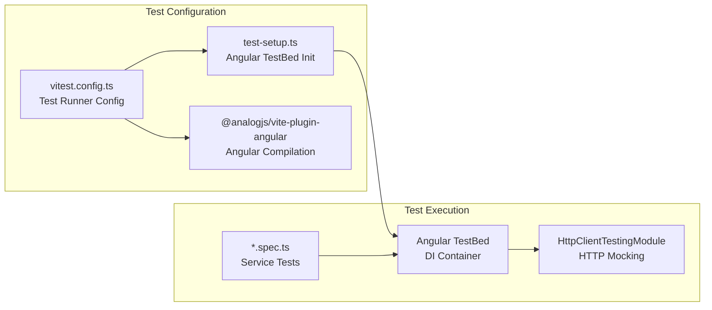
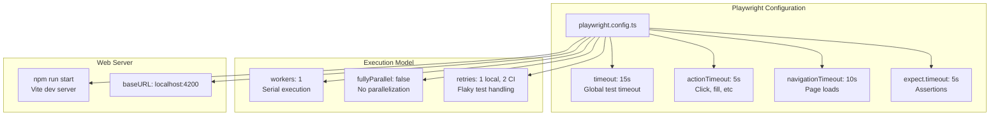
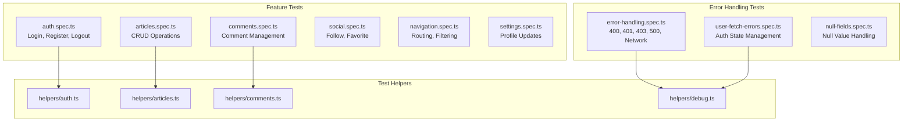
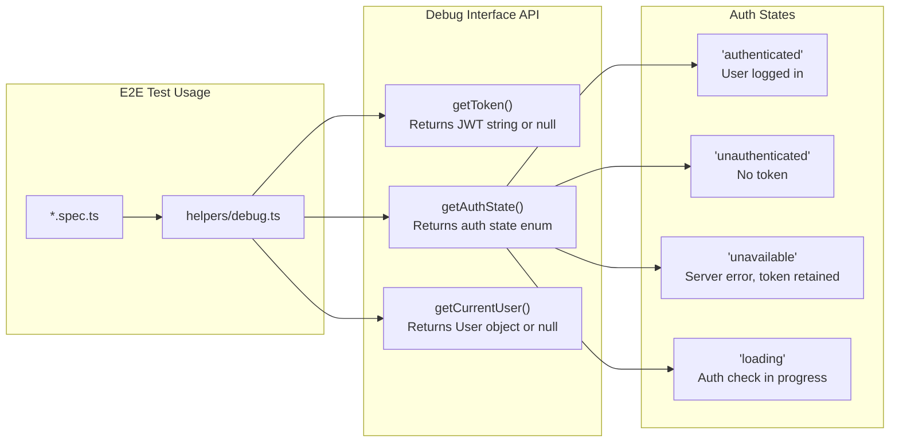
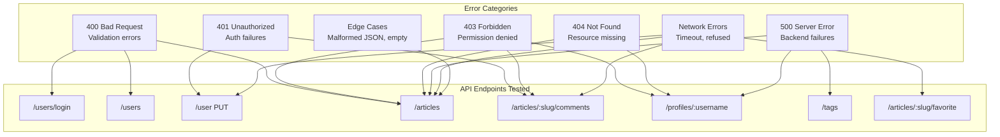
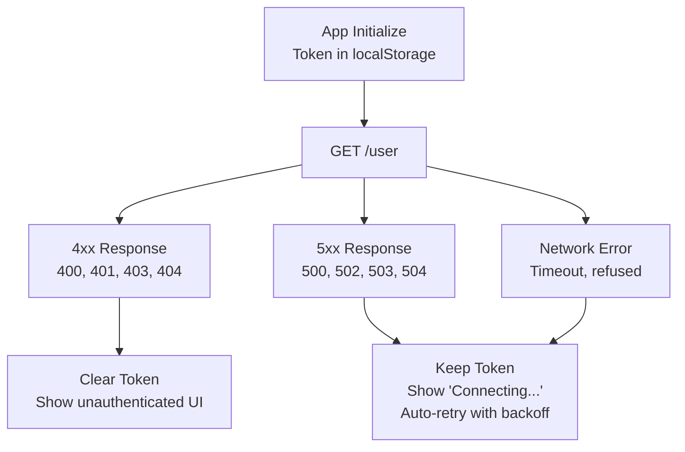
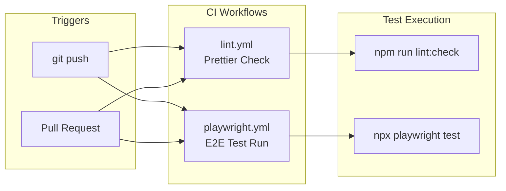

# Testing Strategy

<details>
<summary>Relevant source files</summary>

The following files were used as context for generating this wiki page:

- [e2e/articles.spec.ts](../e2e/articles.spec.ts)
- [e2e/auth.spec.ts](../e2e/auth.spec.ts)
- [e2e/comments.spec.ts](../e2e/comments.spec.ts)
- [e2e/error-handling.spec.ts](../e2e/error-handling.spec.ts)
- [e2e/health.spec.ts](../e2e/health.spec.ts)
- [e2e/helpers/comments.ts](../e2e/helpers/comments.ts)
- [e2e/helpers/debug.ts](../e2e/helpers/debug.ts)
- [e2e/navigation.spec.ts](../e2e/navigation.spec.ts)
- [e2e/social.spec.ts](../e2e/social.spec.ts)
- [e2e/user-fetch-errors.spec.ts](../e2e/user-fetch-errors.spec.ts)
- [playwright.config.ts](../playwright.config.ts)
- [src/app/core/auth/services/jwt.service.spec.ts](../src/app/core/auth/services/jwt.service.spec.ts)
- [src/app/core/auth/services/user.service.spec.ts](../src/app/core/auth/services/user.service.spec.ts)
- [src/app/features/article/services/articles.service.spec.ts](../src/app/features/article/services/articles.service.spec.ts)
- [src/app/features/article/services/comments.service.spec.ts](../src/app/features/article/services/comments.service.spec.ts)
- [src/app/features/article/services/tags.service.spec.ts](../src/app/features/article/services/tags.service.spec.ts)
- [src/app/features/profile/services/profile.service.spec.ts](../src/app/features/profile/services/profile.service.spec.ts)
- [src/test-setup.ts](../src/test-setup.ts)
- [vitest.config.ts](../vitest.config.ts)

</details>

This document describes the comprehensive testing infrastructure for the Angular RealWorld application, including unit testing with Vitest, end-to-end testing with Playwright, test helpers, and CI/CD integration. The testing strategy emphasizes both service-level correctness and complete user workflow validation, with particular attention to error handling scenarios.

For details on specific service implementations being tested, see [Core Services](4-core-services.md). For build and CI/CD workflows that execute these tests, see [CI/CD Pipeline](8.2-ci-cd-pipeline.md).

---

## Testing Philosophy

The application employs a **two-layer testing strategy** that provides complementary coverage:

| Testing Layer  | Purpose                                   | Technology               | Scope                                            |
| -------------- | ----------------------------------------- | ------------------------ | ------------------------------------------------ |
| **Unit Tests** | Validate individual services in isolation | Vitest + Angular TestBed | Service methods, HTTP requests, state management |
| **E2E Tests**  | Validate complete user workflows          | Playwright               | User interactions, navigation, error scenarios   |

The unit tests use Angular's `HttpClientTestingModule` to mock HTTP requests and verify service behavior without external dependencies. The E2E tests run against the real application and backend API, validating the complete system integration.

**Error handling receives exceptional coverage**: the test suite includes dedicated test files for 4xx errors, 5xx errors, network failures, and edge cases like malformed JSON and timeout scenarios.

**Sources:** `playwright.config.ts:1-54`, `vitest.config.ts:1-27`, `e2e/error-handling.spec.ts:1-50`

---

## Unit Testing Infrastructure

### Vitest Configuration and Setup

The application uses **Vitest** as its unit test runner, configured to work with Angular's testing environment. The configuration integrates the `@analogjs/vite-plugin-angular` for Angular compilation.



**Key configuration in vitest.config.ts:**

| Setting       | Value              | Purpose                                  |
| ------------- | ------------------ | ---------------------------------------- |
| `globals`     | `false`            | Explicit imports for better tree-shaking |
| `environment` | `"jsdom"`          | Browser-like environment for Angular     |
| `setupFiles`  | `test-setup.ts`    | Initialize TestBed once                  |
| `include`     | `src/**/*.spec.ts` | Test file pattern                        |
| `pool`        | `"threads"`        | Parallel test execution                  |

**Sources:** `vitest.config.ts:1-27`, `src/test-setup.ts:1-17`

### Angular TestBed Configuration Pattern

All unit tests follow a consistent pattern for initializing the Angular testing environment:

```typescript
// Pattern used across all service tests
beforeAll(() => {
  getTestBed().initTestEnvironment(BrowserDynamicTestingModule, platformBrowserDynamicTesting());
});

beforeEach(() => {
  TestBed.configureTestingModule({
    imports: [HttpClientTestingModule],
    providers: [ServiceUnderTest],
  });
  service = TestBed.inject(ServiceUnderTest);
  httpMock = TestBed.inject(HttpTestingController);
});

afterEach(() => {
  httpMock.verify(); // Ensures no outstanding HTTP requests
  TestBed.resetTestingModule();
});
```

The `HttpClientTestingModule` intercepts all HTTP requests and allows tests to mock responses without making actual network calls.

**Sources:** `src/app/features/article/services/tags.service.spec.ts:10-33`, `src/app/core/auth/services/user.service.spec.ts:13-54`

### Service Testing Patterns

#### HTTP Request Verification

Tests verify that services make correct HTTP requests with proper methods, URLs, and payloads:

```typescript
// Example from ArticlesService tests
it('should fetch articles with default config', () => {
  service.query(config).subscribe(response => {
    expect(response.articles).toEqual(mockArticleList);
  });
  const req = httpMock.expectOne('/articles');
  expect(req.request.method).toBe('GET');
  req.flush({ articles: mockArticleList, articlesCount: 2 });
});
```

**Sources:** `src/app/features/article/services/articles.service.spec.ts:66-78`

#### Error Handling Verification

Tests verify that services properly handle and propagate errors:

```typescript
// Network error handling
it('should handle server error', async () => {
  const errorResponse = { status: 500, statusText: 'Server Error' };
  const promise = firstValueFrom(service.getAll());
  const req = httpMock.expectOne('/tags');
  req.flush('Server error', errorResponse);
  await expect(promise).rejects.toMatchObject({ status: 500 });
});
```

**Sources:** `src/app/features/article/services/tags.service.spec.ts:182-188`

#### Observable Stream Testing

Tests verify that RxJS observables emit correct values and complete properly:

```typescript
// Testing distinct value emissions
it('should emit distinct values only', async () => {
  const emissions: (User | null)[] = [];
  const sub = service.currentUser.subscribe(user => {
    emissions.push(user);
  });
  service.setAuth(mockUser);
  service.setAuth(mockUser); // Should not emit again
  expect(emissions).toEqual([null, mockUser]);
  sub.unsubscribe();
});
```

**Sources:** `src/app/core/auth/services/user.service.spec.ts:65-76`

---

## E2E Testing Infrastructure

### Playwright Configuration

The application uses **Playwright** for end-to-end testing, configured for fast execution with aggressive timeouts that reflect the application's performance characteristics.



**Key configuration decisions:**

| Setting         | Value             | Rationale                                         |
| --------------- | ----------------- | ------------------------------------------------- |
| `workers`       | `1`               | Serial execution prevents backend/state conflicts |
| `fullyParallel` | `false`           | Avoids race conditions with shared backend        |
| `timeout`       | `15000ms`         | Fast apps need fast timeouts                      |
| `actionTimeout` | `5000ms`          | If an action takes >5s, it's a real problem       |
| `retries`       | `1` local, `2` CI | Handle occasional flakiness                       |

The aggressive timeout configuration reflects the application's excellent performance: most operations complete in under 1 second.

**Sources:** `playwright.config.ts:1-54`

### Test Organization Structure

E2E tests are organized by feature area, with dedicated test files for comprehensive error handling:



**Sources:** `e2e/error-handling.spec.ts:1-10`, `e2e/auth.spec.ts:1-5`, `e2e/articles.spec.ts:1-12`

### Test Execution Lifecycle Hooks

Tests implement cleanup hooks to prevent resource exhaustion during test runs:

```typescript
// Pattern used in multiple test suites
test.afterEach(async ({ context }) => {
  // Close browser context for complete isolation
  await context.close();
  // Wait for async cleanup (network connections, file descriptors)
  await new Promise(resolve => setTimeout(resolve, 500));
});
```

This pattern emerged from debugging flaky test failures when running 6+ tests sequentially. Without the cleanup delay, resource exhaustion causes timeout failures.

**Sources:** `e2e/social.spec.ts:7-17`, `e2e/articles.spec.ts:19-29`

---

## Test Helpers and Utilities

### Authentication Helpers

The authentication helper module (`helpers/auth.ts`) provides reusable functions for test authentication flows:

```typescript
// Core authentication operations
function generateUniqueUser(): { username; email; password };
async function register(page, username, email, password);
async function login(page, email, password);
async function logout(page);
```

These helpers abstract the common authentication patterns used across multiple test files, reducing duplication and improving test maintainability.

**Sources:** `e2e/auth.spec.ts:2-3`, `e2e/articles.spec.ts:2-3`

### Debug Interface (`__conduit_debug__`)

The application exposes a **standardized debug interface** on `window.__conduit_debug__` specifically for E2E testing. This interface provides programmatic access to internal application state without relying on DOM inspection.



**Interface definition:**

```typescript
interface ConduitDebug {
  getToken: () => string | null;
  getAuthState: () => 'authenticated' | 'unauthenticated' | 'unavailable' | 'loading';
  getCurrentUser: () => User | null;
}
```

**Example usage in tests:**

```typescript
// Verify token is cleared after 401
const token = await getToken(page);
expect(token).toBeNull();

// Verify auth state transition
const authState = await getAuthState(page);
expect(authState).toBe('unauthenticated');
```

The debug interface enables assertions about internal application state that would otherwise require complex DOM inspection or timing-dependent checks.

**Sources:** `e2e/helpers/debug.ts:1-76`, `e2e/auth.spec.ts:98-102`, `e2e/user-fetch-errors.spec.ts:60-63`

### Comment Helpers

The comment helper module provides utilities for comment management operations:

```typescript
// Add a comment and wait for it to appear
async function addComment(page: Page, commentText: string);

// Delete a comment by text
async function deleteComment(page: Page, commentText: string);

// Get the current comment count
async function getCommentCount(page: Page): Promise<number>;
```

These helpers implement proper waiting strategies to avoid race conditions when comments are added or removed.

**Sources:** `e2e/helpers/comments.ts:1-34`

---

## Error Handling Test Coverage

### Comprehensive Error Scenario Matrix

The test suite includes **exceptional error handling coverage**, with dedicated tests for all error categories across multiple API endpoints:



**Sources:** `e2e/error-handling.spec.ts:30-906`

### 4xx Client Error Handling

The test suite verifies that the application handles client errors gracefully without crashing:

**400 Bad Request scenarios:**

- Login with invalid credentials
- Registration with validation errors (email taken, username too short)
- Article creation with missing required fields

**401 Unauthorized scenarios:**

- Settings form submission with expired session
- Comment posting with invalid token
- Special handling: 401 on `/user` endpoint clears token and shows unauthenticated UI

**403 Forbidden scenarios:**

- Updating articles not owned by current user
- Deleting comments from other users
- Following users who have blocked you

**404 Not Found scenarios:**

- Non-existent article slugs
- Non-existent user profiles

**Expected behavior:** The application displays appropriate error messages, keeps forms usable, and does not crash or show blank screens.

**Sources:** `e2e/error-handling.spec.ts:30-94`, `e2e/error-handling.spec.ts:96-191`, `e2e/error-handling.spec.ts:193-371`

### 5xx Server Error Handling

The test suite includes extensive coverage of server error scenarios:

| Endpoint              | Test Scenario          | Expected Behavior                             |
| --------------------- | ---------------------- | --------------------------------------------- |
| `/articles`           | 500 on feed load       | Navbar and banner remain visible              |
| `/tags`               | 500 on tags load       | App loads without tags, feed still functional |
| `/profiles/:username` | 500 on profile load    | Shows error state, does not crash             |
| `/articles/:slug`     | 500 on article load    | Article page container renders                |
| `/user` PUT           | 500 on settings submit | Shows error message, form remains usable      |

**Intermittent failure handling:** Tests verify the app gracefully handles temporary 500 errors (e.g., first request fails, second succeeds).

**Sources:** `e2e/error-handling.spec.ts:373-524`

### Network Error Handling

Network errors (timeouts, connection refused, disconnected) receive special handling:

```typescript
// Example: Testing network timeout
test('should handle network timeout', async ({ page }) => {
  await page.route(`${API_BASE}/articles*`, route => {
    route.abort('timedout');
  });
  await page.goto('/');
  // App should not crash
  await expect(page.locator('nav.navbar')).toBeVisible();
});
```

**Network error scenarios tested:**

- Timeout errors (`timedout`)
- Connection refused (`connectionrefused`)
- Internet disconnected (`internetdisconnected`)

**Expected behavior:** The application shows "Unable to connect" error messages, forms remain usable, and the application does not crash.

**Sources:** `e2e/error-handling.spec.ts:526-854`

### User Fetch Error Handling (`/user` endpoint)

The `/user` endpoint receives **special error handling** because it's called during application initialization. The test suite distinguishes between:

**4xx errors (client errors):**

- Clear the JWT token
- Show unauthenticated UI
- Allow normal browsing

**5xx errors (server errors):**

- **Retain the JWT token** (server might recover)
- Enter "unavailable" mode
- Show "Connecting..." UI
- Continue allowing browsing



This distinction ensures users aren't unnecessarily logged out during temporary server outages.

**Sources:** `e2e/user-fetch-errors.spec.ts:1-305`

### Edge Cases and Malformed Data

The test suite includes edge case coverage:

| Edge Case               | Test Coverage        |
| ----------------------- | -------------------- |
| Malformed JSON response | App does not crash   |
| Empty response body     | Handles gracefully   |
| Missing response fields | No errors thrown     |
| Null/undefined values   | Proper null handling |
| Very long strings       | No truncation errors |
| Special characters      | Proper encoding      |
| Unicode/emoji           | Renders correctly    |

**Sources:** `e2e/error-handling.spec.ts:856-906`, `src/app/features/article/services/tags.service.spec.ts:256-290`

---

## CI/CD Integration

### GitHub Actions Workflows

The repository includes GitHub Actions workflows for automated testing:



The CI configuration uses `retries: 2` for E2E tests to handle occasional flakiness in the CI environment.

**Sources:** `playwright.config.ts:9-10`

---

## Test Coverage Summary

### Unit Test Coverage by Service

| Service           | Test File                  | Key Test Areas                                         |
| ----------------- | -------------------------- | ------------------------------------------------------ |
| `UserService`     | `user.service.spec.ts`     | Login, register, logout, token management, observables |
| `ArticlesService` | `articles.service.spec.ts` | CRUD operations, query filters, favorite/unfavorite    |
| `CommentsService` | `comments.service.spec.ts` | Add, delete, list comments                             |
| `ProfileService`  | `profile.service.spec.ts`  | Get profile, follow/unfollow                           |
| `TagsService`     | `tags.service.spec.ts`     | Fetch tags, edge cases                                 |
| `JwtService`      | `jwt.service.spec.ts`      | Save, get, destroy token                               |

**Total unit tests:** 200+ individual test cases covering service methods, error handling, and edge cases.

**Sources:** `src/app/core/auth/services/user.service.spec.ts:1-50`, `src/app/features/article/services/articles.service.spec.ts:1-50`

### E2E Test Coverage by Feature

| Feature Area      | Test File                   | Test Count | Key Scenarios                                      |
| ----------------- | --------------------------- | ---------- | -------------------------------------------------- |
| Authentication    | `auth.spec.ts`              | 8 tests    | Register, login, logout, session persistence       |
| Articles          | `articles.spec.ts`          | 11 tests   | Create, edit, delete, favorite, preview display    |
| Comments          | `comments.spec.ts`          | 10 tests   | Add, delete, permissions, long comments            |
| Social            | `social.spec.ts`            | 6 tests    | Follow/unfollow, profile views, favorited articles |
| Navigation        | `navigation.spec.ts`        | 12 tests   | Page navigation, tag filtering, pagination         |
| Error Handling    | `error-handling.spec.ts`    | 50+ tests  | All error types across all endpoints               |
| User Fetch Errors | `user-fetch-errors.spec.ts` | 16 tests   | 4xx vs 5xx distinction, unavailable mode           |
| Health Checks     | `health.spec.ts`            | 4 tests    | App loads, API accessible, basic navigation        |

**Total E2E tests:** 120+ test scenarios covering complete user workflows and error conditions.

**Sources:** `e2e/auth.spec.ts:5-103`, `e2e/error-handling.spec.ts:1-907`

---

## Testing Best Practices Demonstrated

### Pattern: Waiting for Asynchronous Operations

Tests use explicit wait strategies to handle asynchronous operations:

```typescript
// Wait for comment count to increase (not just DOM presence)
await page.waitForFunction(
  expectedCount => document.querySelectorAll('.card:not(.comment-form)').length >= expectedCount,
  initialCount + 1,
  { timeout: 5000 },
);
```

**Sources:** `e2e/helpers/comments.ts:14-18`

### Pattern: Test Isolation with Context Cleanup

Tests ensure complete isolation by closing browser contexts:

```typescript
test.afterEach(async ({ context }) => {
  await context.close(); // Release all resources
  await new Promise(resolve => setTimeout(resolve, 500)); // Allow cleanup
});
```

**Sources:** `e2e/social.spec.ts:7-17`

### Pattern: HTTP Status Code Flexibility

Tests verify the frontend handles status code **classes** (2xx, 4xx, 5xx) rather than specific codes:

```typescript
// Frontend should accept 200 OR 204 for DELETE operations
test('should delete comment when server returns 200 instead of 204', async ({ page }) => {
  // Mock DELETE to return 200 instead of expected 204
  await page.route('**/api/articles/*/comments/*', async route => {
    if (route.request().method() === 'DELETE') {
      await route.fulfill({ status: 200, body: JSON.stringify({}) });
    }
  });
  // Test proceeds normally
});
```

This demonstrates good HTTP client implementation: accepting any 2xx status as success.

**Sources:** `e2e/comments.spec.ts:59-82`, `e2e/articles.spec.ts:96-119`

---

---

[← Back to documentation index](README.md)
