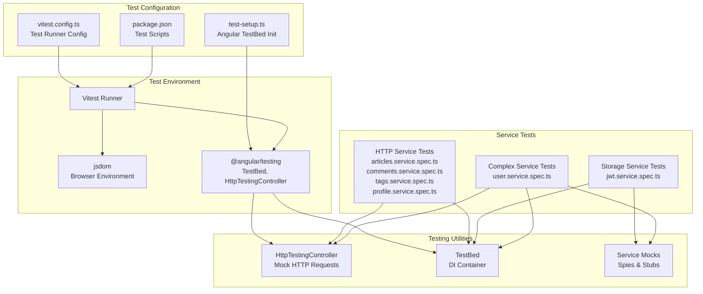
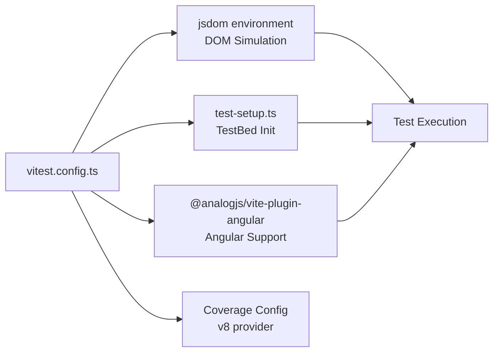
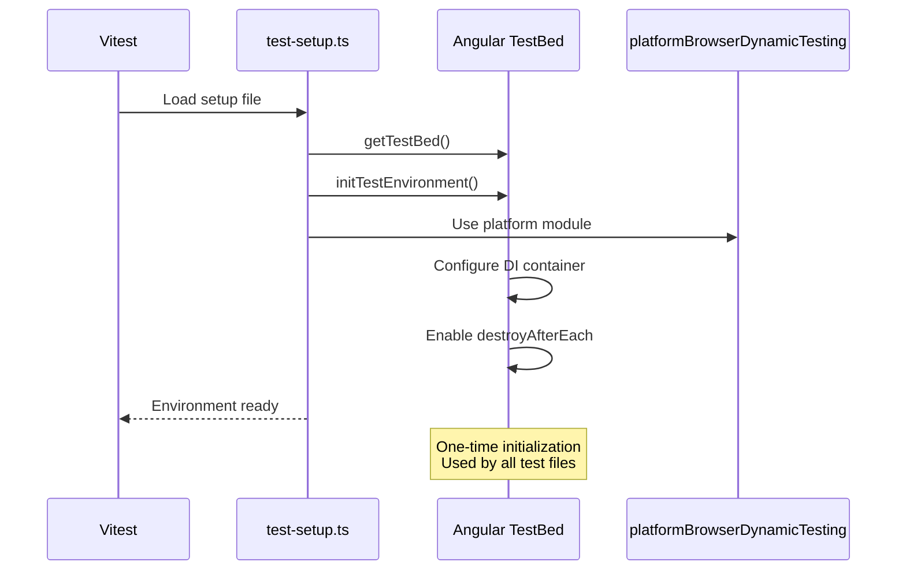
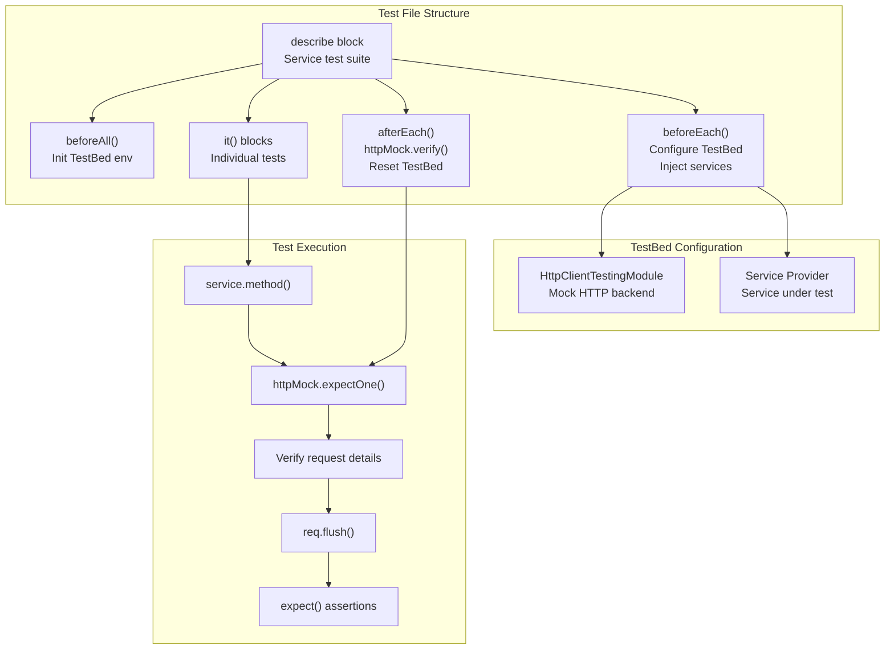
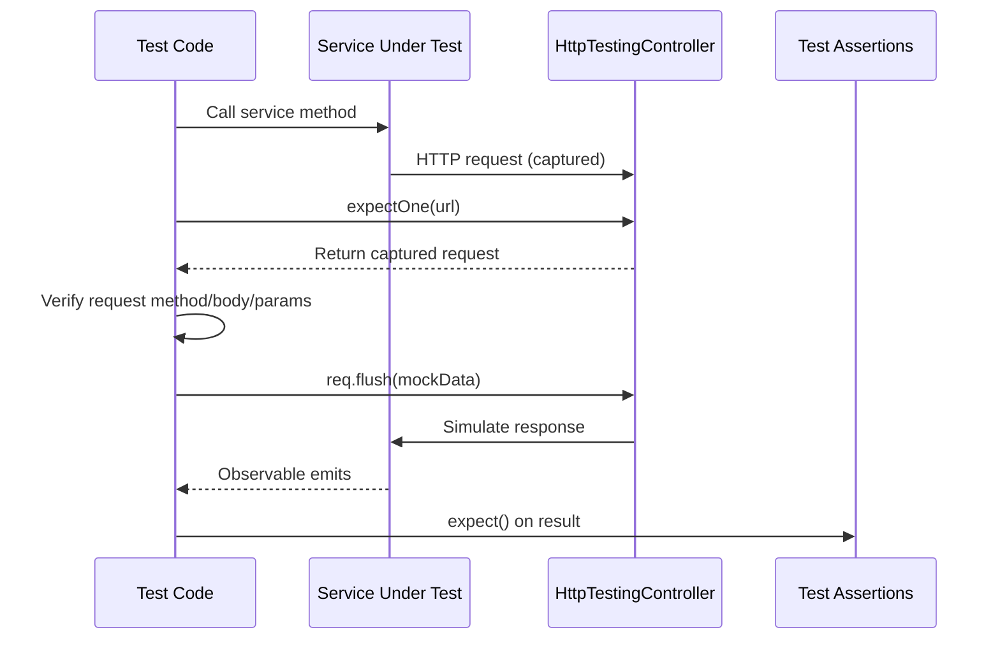
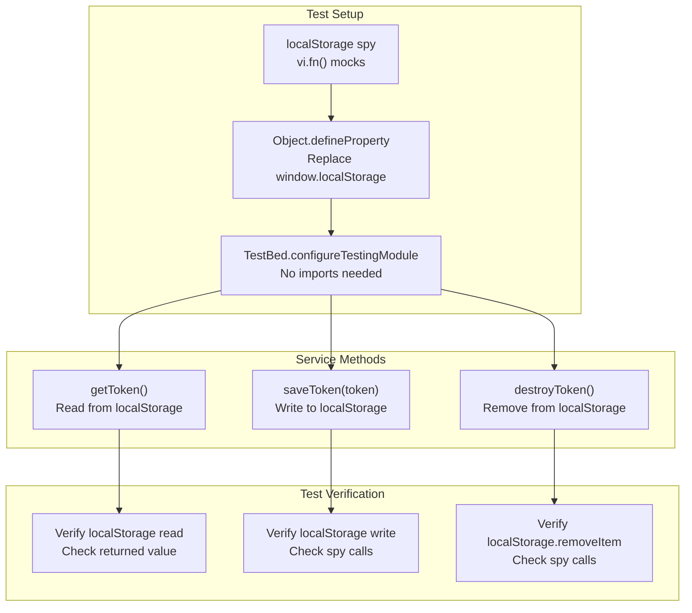
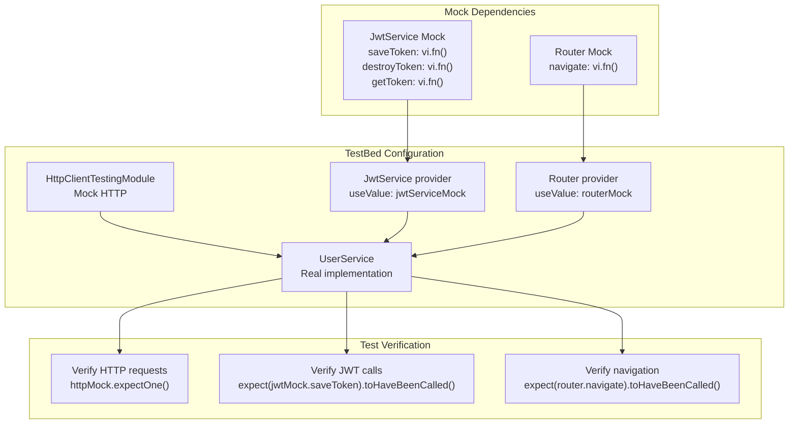
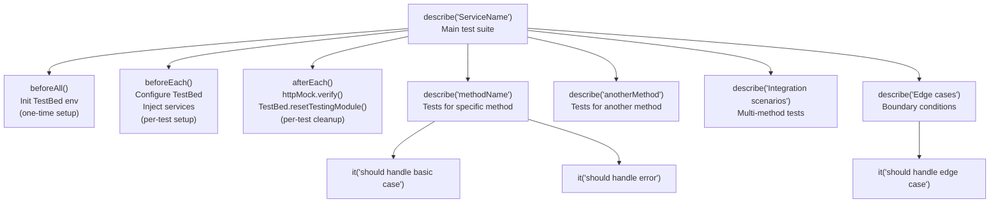
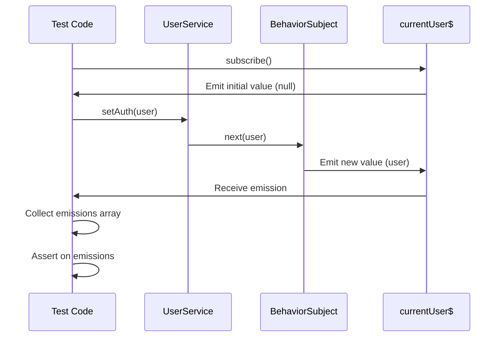

# Unit Testing with Vitest

<details>
<summary>Relevant source files</summary>

The following files were used as context for generating this wiki page:

- [angular.json](../angular.json)
- [package.json](../package.json)
- [src/\_redirects](../src/_redirects)
- [src/app/core/auth/services/jwt.service.spec.ts](../src/app/core/auth/services/jwt.service.spec.ts)
- [src/app/core/auth/services/user.service.spec.ts](../src/app/core/auth/services/user.service.spec.ts)
- [src/app/features/article/services/articles.service.spec.ts](../src/app/features/article/services/articles.service.spec.ts)
- [src/app/features/article/services/comments.service.spec.ts](../src/app/features/article/services/comments.service.spec.ts)
- [src/app/features/article/services/tags.service.spec.ts](../src/app/features/article/services/tags.service.spec.ts)
- [src/app/features/profile/services/profile.service.spec.ts](../src/app/features/profile/services/profile.service.spec.ts)
- [src/test-setup.ts](../src/test-setup.ts)
- [vitest.config.ts](../vitest.config.ts)

</details>

## Purpose and Scope

This document explains the unit testing infrastructure for the Angular RealWorld application using Vitest. It covers test configuration, test environment setup with Angular's TestBed, and common testing patterns for services. Unit tests validate individual services in isolation using mocked dependencies.

For end-to-end testing that validates complete user workflows, see [E2E Testing Infrastructure](7.2-e2e-testing-infrastructure.md). For comprehensive error handling tests, see [Error Handling Tests](7.3-error-handling-tests.md).

---

## Test Infrastructure Overview

The unit testing infrastructure consists of three main components: Vitest configuration, Angular TestBed initialization, and service-specific test files. All service tests follow consistent patterns for setup, mocking, and assertions.



**Sources**: `vitest.config.ts:1-27`, `src/test-setup.ts:1-17`, `package.json:5-21`

---

## Vitest Configuration

The Vitest configuration file defines the test runner settings, environment, and coverage options.

### Configuration File Structure

| Setting       | Value               | Purpose                                              |
| ------------- | ------------------- | ---------------------------------------------------- |
| `environment` | `jsdom`             | Provides browser-like DOM API for Angular components |
| `setupFiles`  | `src/test-setup.ts` | Angular TestBed initialization                       |
| `include`     | `src/**/*.spec.ts`  | Test file pattern                                    |
| `pool`        | `threads`           | Parallel test execution                              |
| `globals`     | `false`             | Requires explicit imports (Vitest best practice)     |



The configuration uses the `@analogjs/vite-plugin-angular` plugin for Angular-specific transformations and enables code coverage reporting with the v8 provider.

**Sources**: `vitest.config.ts:1-27`

### Test Scripts

The following npm scripts are available for running unit tests:

| Script          | Command             | Purpose                        |
| --------------- | ------------------- | ------------------------------ |
| `test`          | `vitest`            | Run tests in watch mode        |
| `test:ui`       | `vitest --ui`       | Run tests with UI interface    |
| `test:coverage` | `vitest --coverage` | Run tests with coverage report |

**Sources**: `package.json:9-11`

---

## Test Setup and Angular TestBed Initialization

The `test-setup.ts` file initializes the Angular testing environment once before all tests run. This setup is required for Angular's dependency injection and component testing infrastructure.

### TestBed Initialization Flow



The `initTestEnvironment` method is called with `BrowserDynamicTestingModule` and `platformBrowserDynamicTesting()`, establishing the Angular testing platform. The `teardown: { destroyAfterEach: true }` option ensures components are destroyed after each test, preventing memory leaks.

**Sources**: `src/test-setup.ts:1-17`

### Zone.js Requirements

All test files must import Zone.js before Angular testing utilities:

```typescript
import 'zone.js';
import 'zone.js/testing';
```

Zone.js is required for Angular's change detection and asynchronous operation handling in tests.

**Sources**: `src/app/features/article/services/tags.service.spec.ts:1-2`

---

## HTTP Service Testing Patterns

Services that make HTTP requests use `HttpClientTestingModule` and `HttpTestingController` to mock API calls. This pattern is used in `ArticlesService`, `CommentsService`, `TagsService`, and `ProfileService`.

### HTTP Testing Architecture



**Sources**: `src/app/features/article/services/tags.service.spec.ts:10-33`

### TestBed Configuration for HTTP Services

Each test suite configures TestBed in `beforeEach` with the necessary imports and providers:

```typescript
beforeEach(() => {
  TestBed.configureTestingModule({
    imports: [HttpClientTestingModule],
    providers: [ServiceUnderTest],
  });

  service = TestBed.inject(ServiceUnderTest);
  httpMock = TestBed.inject(HttpTestingController);
});
```

The `HttpClientTestingModule` replaces Angular's `HttpClient` with a test double that captures requests instead of sending them to a real backend.

**Sources**: `src/app/features/article/services/tags.service.spec.ts:20-28`

### HTTP Request Testing Pattern

The standard pattern for testing HTTP requests follows this sequence:



**Example from TagsService tests**:

1. Call service method and get promise/observable
2. Use `httpMock.expectOne()` to capture the request
3. Verify request details (method, URL, body, params)
4. Call `req.flush()` to simulate server response
5. Assert on the service method's return value

**Sources**: `src/app/features/article/services/tags.service.spec.ts:40-48`

### Using firstValueFrom for Async Testing

Tests convert observables to promises using `firstValueFrom` from RxJS:

```typescript
const promise = firstValueFrom(service.getAll());
const req = httpMock.expectOne('/tags');
req.flush({ tags: mockTags });
const tags = await promise;
expect(tags).toEqual(mockTags);
```

This pattern provides cleaner async/await syntax compared to subscribing with callbacks.

**Sources**: `src/app/features/article/services/tags.service.spec.ts:41-46`

### Request Verification

Tests verify multiple aspects of HTTP requests:

| Verification  | Method               | Example                                                   |
| ------------- | -------------------- | --------------------------------------------------------- |
| URL           | `expectOne(url)`     | `httpMock.expectOne('/tags')`                             |
| HTTP Method   | `req.request.method` | `expect(req.request.method).toBe('GET')`                  |
| Request Body  | `req.request.body`   | `expect(req.request.body).toEqual({ comment: { body } })` |
| Query Params  | `req.request.params` | `req.params.get('tag') === 'angular'`                     |
| Request Count | `match(url).length`  | `expect(requests.length).toBe(1)`                         |

**Sources**: `src/app/features/article/services/tags.service.spec.ts:42-44`, `src/app/features/article/services/comments.service.spec.ts:168-178`

### Response Simulation

The `flush()` method simulates different server responses:

| Response Type   | Method                           | Example                                                            |
| --------------- | -------------------------------- | ------------------------------------------------------------------ |
| Success (200)   | `req.flush(data)`                | `req.flush({ tags: mockTags })`                                    |
| Error (4xx/5xx) | `req.flush(body, errorResponse)` | `req.flush('Not found', { status: 404, statusText: 'Not Found' })` |
| Empty Response  | `req.flush(null)`                | Used for DELETE operations                                         |

**Sources**: `src/app/features/article/services/tags.service.spec.ts:44`, `src/app/features/article/services/tags.service.spec.ts:186-187`

### Test Cleanup with httpMock.verify()

The `afterEach` block calls `httpMock.verify()` to ensure no unexpected HTTP requests were made:

```typescript
afterEach(() => {
  httpMock.verify();
  TestBed.resetTestingModule();
});
```

`httpMock.verify()` throws an error if any HTTP requests were not explicitly handled by the test, catching missing expectations.

**Sources**: `src/app/features/article/services/tags.service.spec.ts:30-33`

---

## Non-HTTP Service Testing

Services that don't make HTTP requests, like `JwtService`, use simpler test setups with mocked dependencies.

### JwtService Testing Pattern



**Sources**: `src/app/core/auth/services/jwt.service.spec.ts:8-42`

### Mocking localStorage

JwtService tests create a spy object for localStorage and replace the global `window.localStorage`:

```typescript
localStorageSpy = {
  getItem: vi.fn(),
  setItem: vi.fn(),
  removeItem: vi.fn(),
  clear: vi.fn(),
};

Object.defineProperty(window, 'localStorage', {
  value: localStorageSpy,
  writable: true,
  configurable: true,
});
```

This approach isolates tests from the browser's actual localStorage, preventing cross-test pollution.

**Sources**: `src/app/core/auth/services/jwt.service.spec.ts:17-30`

### Testing Direct Storage Access

The spy object can be accessed directly to simulate stored values:

```typescript
localStorageSpy['jwtToken'] = mockToken;
const token = service.getToken();
expect(token).toBe(mockToken);
```

This simulates a token being present in localStorage without actually storing it.

**Sources**: `src/app/core/auth/services/jwt.service.spec.ts:49-53`

---

## Testing Services with Multiple Dependencies

`UserService` demonstrates testing services with multiple injected dependencies. It requires both `HttpClient` (for API calls) and other services (`JwtService`, `Router`).

### Dependency Mocking Strategy



**Sources**: `src/app/core/auth/services/user.service.spec.ts:31-48`

### Creating Service Mocks

Mock objects are created with Vitest's `vi.fn()` for each dependency method:

```typescript
jwtService = {
  saveToken: vi.fn(),
  destroyToken: vi.fn(),
  getToken: vi.fn(),
};

router = {
  navigate: vi.fn(),
};
```

These mocks are provided to TestBed using the `useValue` provider strategy.

**Sources**: `src/app/core/auth/services/user.service.spec.ts:32-39`

### TestBed Configuration with Mock Providers

The TestBed configuration includes both real and mocked providers:

```typescript
TestBed.configureTestingModule({
  imports: [HttpClientTestingModule],
  providers: [UserService, { provide: JwtService, useValue: jwtService }, { provide: Router, useValue: router }],
});
```

This configuration injects the real `UserService` with mocked `JwtService` and `Router` dependencies.

**Sources**: `src/app/core/auth/services/user.service.spec.ts:41-44`

### Verifying Mock Interactions

Tests verify that the service correctly interacts with its dependencies:

```typescript
await promise;
expect(jwtService.saveToken).toHaveBeenCalledWith(mockUser.token);
```

```typescript
service.logout();
expect(router.navigate).toHaveBeenCalledWith(['/']);
```

**Sources**: `src/app/core/auth/services/user.service.spec.ts:114`, `src/app/core/auth/services/user.service.spec.ts:191`

---

## Test Organization and Structure

All test files follow a consistent structure with nested `describe` blocks and lifecycle hooks.

### Test File Structure



**Sources**: `src/app/features/article/services/tags.service.spec.ts:10-387`

### Lifecycle Hooks

| Hook           | Purpose          | When Executed         | Common Use                         |
| -------------- | ---------------- | --------------------- | ---------------------------------- |
| `beforeAll()`  | One-time setup   | Once before all tests | Initialize TestBed environment     |
| `beforeEach()` | Per-test setup   | Before each test      | Configure TestBed, inject services |
| `afterEach()`  | Per-test cleanup | After each test       | Verify HTTP mocks, reset TestBed   |

**Sources**: `src/app/features/article/services/tags.service.spec.ts:11-33`

### Test Grouping Strategies

Tests are organized into logical groups:

| Group Name            | Purpose                | Example Tests                                  |
| --------------------- | ---------------------- | ---------------------------------------------- |
| Method-specific       | Tests for one method   | `describe('getAll')`, `describe('add')`        |
| Integration scenarios | Multi-method workflows | Login → Update → Logout sequence               |
| Edge cases            | Boundary conditions    | Empty strings, null values, special characters |
| Error handling        | Error responses        | 404, 500, network errors                       |
| Performance           | Large data sets        | 1000+ items, very long strings                 |

**Sources**: `src/app/features/article/services/tags.service.spec.ts:39-387`

---

## Common Test Patterns

### Testing Observable Emissions

Services with observable properties (like `UserService.currentUser`) require special testing patterns:



The pattern collects emissions in an array and asserts on the values:

```typescript
const emissions: (User | null)[] = [];
const sub = service.currentUser.subscribe(user => {
  emissions.push(user);
});

service.setAuth(mockUser);
await new Promise(resolve => setTimeout(resolve, 10));

expect(emissions).toEqual([null, mockUser]);
sub.unsubscribe();
```

**Sources**: `src/app/core/auth/services/user.service.spec.ts:65-75`

### Testing Error Scenarios

Error tests simulate server errors with `flush()`:

```typescript
const errorResponse = { status: 404, statusText: 'Not Found' };
const promise = firstValueFrom(service.get(slug));
const req = httpMock.expectOne(`/articles/${slug}`);
req.flush('Article not found', errorResponse);
await expect(promise).rejects.toMatchObject({ status: 404 });
```

The test verifies the promise rejects with the expected error.

**Sources**: `src/app/features/article/services/articles.service.spec.ts:163-170`

### Testing Request Parameters

For services that build query parameters, tests verify parameter construction:

```typescript
const config: ArticleListConfig = {
  type: 'all',
  filters: {
    tag: 'angular',
    author: 'testuser',
    limit: 10,
    offset: 0,
  },
};

service.query(config).subscribe();

const req = httpMock.expectOne(request => {
  return (
    request.url === '/articles' &&
    request.params.get('tag') === 'angular' &&
    request.params.get('author') === 'testuser' &&
    request.params.get('limit') === '10' &&
    request.params.get('offset') === '0'
  );
});
```

This pattern uses a predicate function to verify multiple parameter values.

**Sources**: `src/app/features/article/services/articles.service.spec.ts:91-116`

### Testing Multiple Subscribers

Tests verify behavior with multiple observers:

```typescript
const observable = service.getAll();
observable.subscribe();
observable.subscribe();
observable.subscribe();

const requests = httpMock.match('/tags');
expect(requests.length).toBe(3);
requests.forEach(req => req.flush({ tags: mockTags }));
```

This verifies whether a service uses `shareReplay()` or makes multiple requests.

**Sources**: `src/app/features/article/services/tags.service.spec.ts:237-246`

---

## Test Coverage Examples

The codebase demonstrates comprehensive test coverage patterns across different service types.

### Coverage Categories

| Service         | Test Count Range | Test Categories                                                                                                   |
| --------------- | ---------------- | ----------------------------------------------------------------------------------------------------------------- |
| TagsService     | 50+ tests        | Basic operations, error handling, edge cases (special chars, unicode, empty values), performance (large datasets) |
| CommentsService | 40+ tests        | CRUD operations, validation, error responses, integration sequences                                               |
| ProfileService  | 30+ tests        | Get/follow/unfollow, error handling, integration flows, shareReplay verification                                  |
| ArticlesService | 30+ tests        | Query with filters, CRUD, favorite/unfavorite, pagination                                                         |
| JwtService      | 40+ tests        | Storage operations, lifecycle, edge cases, security scenarios                                                     |
| UserService     | 40+ tests        | Auth flows, observables, error handling, integration scenarios                                                    |

**Sources**: `src/app/features/article/services/tags.service.spec.ts:1-388`, `src/app/features/article/services/comments.service.spec.ts:1-406`, `src/app/features/profile/services/profile.service.spec.ts:1-353`, `src/app/features/article/services/articles.service.spec.ts:1-267`, `src/app/core/auth/services/jwt.service.spec.ts:1-335`, `src/app/core/auth/services/user.service.spec.ts:1-366`

### Edge Case Testing Examples

Tests systematically verify boundary conditions:

- **Empty values**: Empty arrays, empty strings, null, undefined
- **Special characters**: Quotes, HTML tags, emojis, unicode
- **Large data**: 1000+ items, very long strings (1000+ chars)
- **URL characters**: Hyphens, underscores, special URL chars
- **Whitespace**: Leading/trailing spaces, only whitespace, newlines

**Sources**: `src/app/features/article/services/tags.service.spec.ts:317-365`

---

## Running Tests

### Test Execution Commands

| Command                 | Behavior                            | Use Case                 |
| ----------------------- | ----------------------------------- | ------------------------ |
| `npm test`              | Watch mode, re-runs on file changes | Active development       |
| `npm run test:ui`       | Opens Vitest UI in browser          | Visual test debugging    |
| `npm run test:coverage` | Generates coverage report           | CI/CD, coverage analysis |

**Sources**: `package.json:9-11`

### Test Output

Tests output using Vitest's standard reporter showing:

- Pass/fail status per test
- Execution time
- Error messages and stack traces for failures
- Summary statistics (total, passed, failed)

### Coverage Reports

The coverage configuration generates three report formats:

| Format | Output         | Purpose           |
| ------ | -------------- | ----------------- |
| `text` | Console output | Quick overview    |
| `json` | JSON file      | Tool integration  |
| `html` | HTML report    | Detailed browsing |

**Sources**: `vitest.config.ts:13-16`

---

## Best Practices Summary

The codebase demonstrates these unit testing best practices:

### Test Isolation

- Each test configures its own TestBed instance
- `afterEach` cleanup prevents cross-test pollution
- Mocks prevent dependencies on external systems

### Comprehensive Coverage

- Test happy paths and error scenarios
- Cover edge cases and boundary conditions
- Verify integration between methods

### Clear Test Structure

- Descriptive test names using `should...` convention
- Nested `describe` blocks group related tests
- Consistent lifecycle hook usage

### Async Testing

- Use `firstValueFrom` for cleaner async/await syntax
- Properly handle observable subscriptions with unsubscribe
- Use `await` to ensure assertions run after async operations complete

### HTTP Testing

- Always call `httpMock.verify()` in `afterEach`
- Verify request details before flushing responses
- Test both success and error responses

### Mock Management

- Use Vitest's `vi.fn()` for spy functions
- Reset mocks in `afterEach` with `vi.clearAllMocks()`
- Verify mock interactions with `expect().toHaveBeenCalled()`

**Sources**: All test files demonstrate these patterns throughout

---

---

[← Back to documentation index](README.md)
