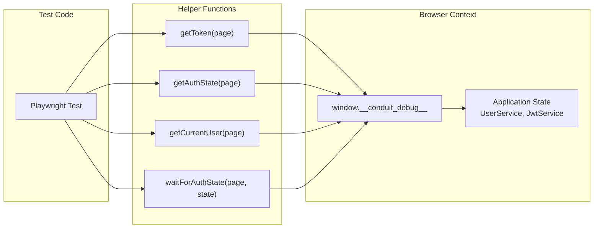
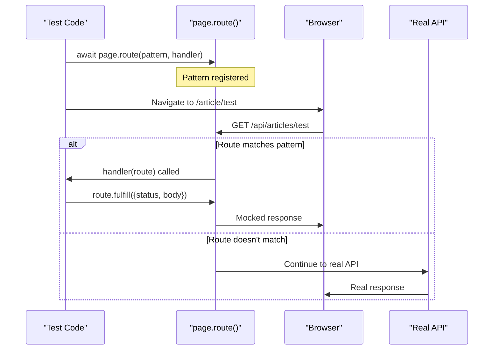
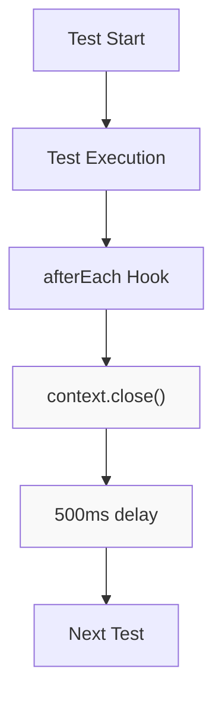
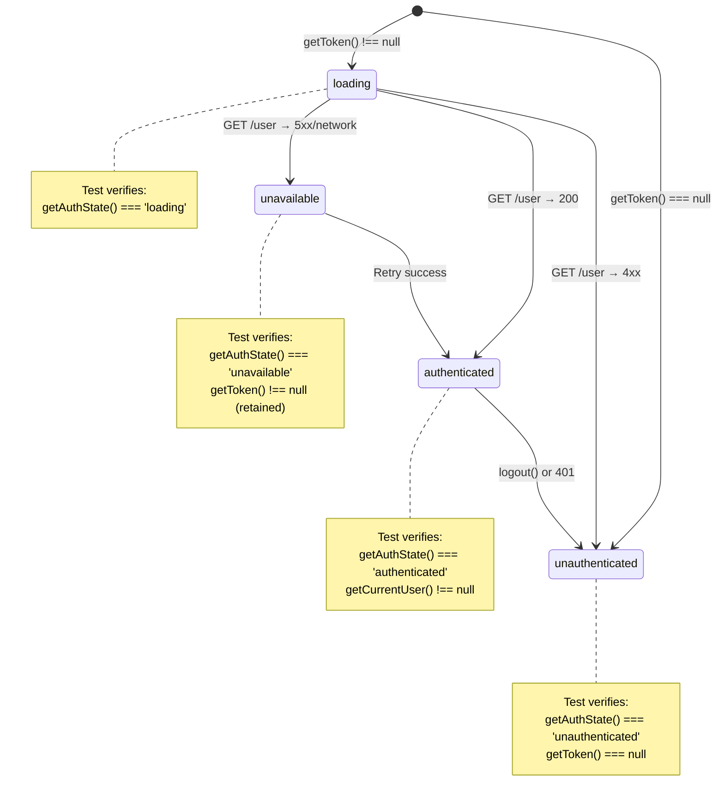

# E2E Testing Infrastructure

<details>
<summary>Relevant source files</summary>

The following files were used as context for generating this wiki page:

- [angular.json](../angular.json)
- [e2e/articles.spec.ts](../e2e/articles.spec.ts)
- [e2e/auth.spec.ts](../e2e/auth.spec.ts)
- [e2e/comments.spec.ts](../e2e/comments.spec.ts)
- [e2e/error-handling.spec.ts](../e2e/error-handling.spec.ts)
- [e2e/health.spec.ts](../e2e/health.spec.ts)
- [e2e/helpers/comments.ts](../e2e/helpers/comments.ts)
- [e2e/helpers/debug.ts](../e2e/helpers/debug.ts)
- [e2e/navigation.spec.ts](../e2e/navigation.spec.ts)
- [e2e/social.spec.ts](../e2e/social.spec.ts)
- [e2e/user-fetch-errors.spec.ts](../e2e/user-fetch-errors.spec.ts)
- [package.json](../package.json)
- [playwright.config.ts](../playwright.config.ts)
- [src/\_redirects](../src/_redirects)

</details>

## Purpose and Scope

This document describes the end-to-end testing infrastructure built with Playwright. It covers test configuration, organization, helper utilities, the debug interface, and execution patterns. For unit testing with Vitest, see [7.1](7.1-unit-testing-with-vitest.md). For specific error handling test scenarios, see [7.3](7.3-error-handling-tests.md). For feature-specific E2E tests, see [7.4](7.4-feature-e2e-tests.md).

The E2E test suite validates complete user workflows by running tests in a real browser against a running application instance. Tests interact with the backend API at `https://api.realworld.show/api` and use API mocking to simulate error conditions.

---

## Playwright Configuration

The test infrastructure is configured in `playwright.config.ts:1-54`. Key configuration decisions include:

| Setting             | Value                 | Rationale                                        |
| ------------------- | --------------------- | ------------------------------------------------ |
| `fullyParallel`     | `false`               | Prevents race conditions on shared backend state |
| `workers`           | `1`                   | Runs tests serially to avoid state conflicts     |
| `timeout`           | `15000` ms            | Fast timeout for fast app and backend            |
| `actionTimeout`     | `5000` ms             | Aggressive timeout for clicks, fills             |
| `navigationTimeout` | `10000` ms            | Page load timeout                                |
| `retries`           | `1` (local), `2` (CI) | Handles flaky tests                              |

The configuration uses only Chromium by default (`playwright.config.ts:31-45`), with Firefox and WebKit commented out for speed. The web server is automatically started before tests using `npm run start` (`playwright.config.ts:47-52`).

**Sources:** `playwright.config.ts:1-54`

---

## Test Suite Organization

```mermaid
graph TB
    E2E_DIR["e2e/"]

    subgraph "Test Suites"
        HEALTH["health.spec.ts<br/>Basic Health Checks"]
        AUTH["auth.spec.ts<br/>Login/Register/Logout"]
        ARTICLES["articles.spec.ts<br/>Article CRUD"]
        COMMENTS["comments.spec.ts<br/>Comment Management"]
        SOCIAL["social.spec.ts<br/>Follow/Favorite"]
        NAV["navigation.spec.ts<br/>Routing & Filtering"]
        URL_NAV["url-navigation.spec.ts<br/>URL-based Navigation"]
        SETTINGS["settings.spec.ts<br/>Profile Updates"]
        ERROR["error-handling.spec.ts<br/>4xx/5xx/Network Errors"]
        USER_FETCH["user-fetch-errors.spec.ts<br/>Auth State Errors"]
        NULL["null-fields.spec.ts<br/>Null Handling"]
    end

    subgraph "Helper Modules"
        AUTH_HELP["helpers/auth.ts<br/>register(), login(), logout()"]
        ARTICLES_HELP["helpers/articles.ts<br/>createArticle(), editArticle()"]
        COMMENTS_HELP["helpers/comments.ts<br/>addComment(), deleteComment()"]
        PROFILE_HELP["helpers/profile.ts<br/>followUser(), unfollowUser()"]
        API_HELP["helpers/api.ts<br/>registerUserViaAPI()"]
        DEBUG_HELP["helpers/debug.ts<br/>getToken(), getAuthState()"]
    end

    E2E_DIR --> HEALTH
    E2E_DIR --> AUTH
    E2E_DIR --> ARTICLES
    E2E_DIR --> COMMENTS
    E2E_DIR --> SOCIAL
    E2E_DIR --> NAV
    E2E_DIR --> URL_NAV
    E2E_DIR --> SETTINGS
    E2E_DIR --> ERROR
    E2E_DIR --> USER_FETCH
    E2E_DIR --> NULL

    AUTH --> AUTH_HELP
    ARTICLES --> ARTICLES_HELP
    COMMENTS --> COMMENTS_HELP
    SOCIAL --> PROFILE_HELP
    NAV --> API_HELP
    AUTH --> DEBUG_HELP
    USER_FETCH --> DEBUG_HELP
```



Tests are organized by feature area in the `e2e/` directory. Each spec file contains a `test.describe()` block grouping related tests. Helper functions are extracted to `e2e/helpers/` for reuse across test suites.

**Sources:** `e2e/error-handling.spec.ts:1`, `e2e/auth.spec.ts:1`, `e2e/social.spec.ts:1`, `e2e/articles.spec.ts:1`, `e2e/navigation.spec.ts:1`, `e2e/comments.spec.ts:1`, `e2e/user-fetch-errors.spec.ts:1`, `e2e/health.spec.ts:1`, `e2e/helpers/debug.ts:1`, `e2e/helpers/comments.ts:1`

---

## Test Execution Scripts

The `package.json:5-21` defines multiple test execution modes:

| Script              | Command                                   | Purpose                                 |
| ------------------- | ----------------------------------------- | --------------------------------------- |
| `test:e2e`          | `playwright test --grep-invert @security` | Run all E2E tests except security tests |
| `test:e2e:security` | `playwright test --grep @security`        | Run only security-tagged tests          |
| `test:e2e:ui`       | `playwright test --ui`                    | Interactive UI mode for debugging       |
| `test:e2e:headed`   | `playwright test --headed`                | Run with visible browser                |
| `test:e2e:debug`    | `playwright test --debug`                 | Step-by-step debugging                  |
| `test:e2e:report`   | `playwright show-report`                  | View HTML test report                   |
| `test:e2e:disabled` | `cat e2e/DISABLED_TESTS.md`               | List disabled tests                     |

The `@security` tag system allows separating security-focused tests from functional tests.

**Sources:** `package.json:12-18`

---

## Helper Functions & Utilities

### Debug Interface Helpers

The debug interface provides programmatic access to application state during tests. The interface is exposed on `window.__conduit_debug__` and accessed through helper functions in `e2e/helpers/debug.ts:1-76`.



**Available Methods:**

| Function                          | Returns                                                              | Purpose                                 |
| --------------------------------- | -------------------------------------------------------------------- | --------------------------------------- |
| `getToken(page)`                  | `string \| null`                                                     | Get current JWT token from localStorage |
| `getAuthState(page)`              | `'authenticated' \| 'unauthenticated' \| 'unavailable' \| 'loading'` | Get authentication state                |
| `getCurrentUser(page)`            | `User \| null`                                                       | Get current user object                 |
| `waitForAuthState(page, state)`   | `Promise<void>`                                                      | Wait for specific auth state            |
| `isDebugInterfaceAvailable(page)` | `boolean`                                                            | Check if debug interface exists         |

The interface is used extensively in `e2e/auth.spec.ts:86-102` and `e2e/user-fetch-errors.spec.ts:36-63` to verify internal authentication state.

**Sources:** `e2e/helpers/debug.ts:1-76`, `e2e/auth.spec.ts:3`, `e2e/user-fetch-errors.spec.ts:2`

### Comment Helpers

The `e2e/helpers/comments.ts:1-34` module provides functions for comment operations:

- **`addComment(page, commentText)`** - Posts a comment and waits for it to appear (`e2e/helpers/comments.ts:3-19`)
- **`deleteComment(page, commentText)`** - Deletes a comment by finding it and clicking the trash icon (`e2e/helpers/comments.ts:21-27`)
- **`getCommentCount(page)`** - Returns count of comments, excluding the comment form (`e2e/helpers/comments.ts:29-33`)

The helpers use the `.card:not(.comment-form)` selector to distinguish actual comments from the comment input form.

**Sources:** `e2e/helpers/comments.ts:1-34`

### API Mocking Helpers

Tests use `page.route()` extensively to mock API responses. A reusable helper in `e2e/error-handling.spec.ts:8-19` demonstrates the pattern:

```typescript
async function mockApiError(page: Page, endpoint: string, status: number, errorBody: object = {}, method?: string);
```

This helper intercepts requests to `${API_BASE}${endpoint}` and returns a specified error status with a JSON body. The `method` parameter allows filtering by HTTP method (GET, POST, etc.).

**Sources:** `e2e/error-handling.spec.ts:8-19`

---

## API Mocking Patterns

### Route Interception Flow



### Error Scenario Mocking

Tests in `e2e/error-handling.spec.ts` demonstrate mocking various error types:

**400 Bad Request** - Validation errors (`e2e/error-handling.spec.ts:32-43`):

```typescript
await mockApiError(page, '/users/login', 400, {
  errors: { 'email or password': ['is invalid'] },
});
```

**401 Unauthorized** - Expired token scenarios (`e2e/error-handling.spec.ts:99-129`):

```typescript
await page.route(`${API_BASE}/user`, route => {
  if (route.request().method() === 'PUT') {
    route.fulfill({
      status: 401,
      contentType: 'application/json',
      body: JSON.stringify({ errors: { message: ['Session expired'] } }),
    });
  }
});
```

**Network Errors** - Connection failures (`e2e/error-handling.spec.ts:527-536`):

```typescript
await page.route(`${API_BASE}/articles*`, route => {
  route.abort('timedout');
});
```

**Sources:** `e2e/error-handling.spec.ts:1-907`

---

## Test Isolation and Cleanup

### Context Management

Most test suites implement cleanup in `test.afterEach()` hooks to ensure complete isolation:



The pattern appears in `e2e/articles.spec.ts:19-29`, `e2e/social.spec.ts:7-17`, `e2e/navigation.spec.ts:7-17`, and `e2e/comments.spec.ts:18-28`:

```typescript
test.afterEach(async ({ context }) => {
  await context.close();
  await new Promise(resolve => setTimeout(resolve, 500));
});
```

The 500ms-1000ms delay prevents resource exhaustion when running multiple tests sequentially. Without this delay, tests experience timeouts due to network connection and file descriptor limits.

### Storage State Isolation

Comment tests use `test.use({ storageState: undefined })` (`e2e/comments.spec.ts:8`) to force a fresh browser context for each test, preventing localStorage token leakage between tests.

**Sources:** `e2e/articles.spec.ts:19-29`, `e2e/social.spec.ts:7-17`, `e2e/navigation.spec.ts:7-17`, `e2e/comments.spec.ts:8-28`

---

## Debug Interface Implementation Contract

The debug interface in `e2e/helpers/debug.ts:9-19` documents the expected contract for implementations:

```typescript
interface ConduitDebug {
  getToken: () => string | null;
  getAuthState: () => 'authenticated' | 'unauthenticated' | 'unavailable' | 'loading';
  getCurrentUser: () => User | null;
}
```

This interface must be exposed on `window.__conduit_debug__` for tests to access internal application state. The application implements this interface to expose:

- **JWT token** - Current authentication token from localStorage
- **Auth state** - Current state of the authentication state machine (see [3.3](3.3-authentication-system.md))
- **Current user** - Populated `User` object when authenticated

The interface is critical for testing authentication edge cases where visual indicators alone are insufficient to verify internal state transitions.

**Sources:** `e2e/helpers/debug.ts:1-76`

---

## Test Coverage Overview

### Feature Coverage

| Feature Area   | Test File            | Key Scenarios                                                   |
| -------------- | -------------------- | --------------------------------------------------------------- |
| Authentication | `auth.spec.ts`       | Register, login, logout, token persistence, invalid credentials |
| Articles       | `articles.spec.ts`   | CRUD operations, ownership validation, favorite/unfavorite      |
| Comments       | `comments.spec.ts`   | Add, delete, multiple comments, permissions, long text          |
| Social         | `social.spec.ts`     | Follow/unfollow, profile views, favorited articles feed         |
| Navigation     | `navigation.spec.ts` | Page navigation, tag filtering, feed switching, pagination      |
| Health         | `health.spec.ts`     | Basic app load, API connectivity, page accessibility            |

### Error Coverage

The `e2e/error-handling.spec.ts` suite systematically tests error handling for:

| Error Type     | Status Codes                    | Test Count | Example                                               |
| -------------- | ------------------------------- | ---------- | ----------------------------------------------------- |
| Client Errors  | 400, 401, 403, 404              | 10+        | Login validation, expired tokens, unauthorized edits  |
| Server Errors  | 500, 503                        | 8+         | Articles feed load, profile load, settings submission |
| Network Errors | timeout, connection refused     | 10+        | All form submissions, API calls during disconnection  |
| Edge Cases     | malformed JSON, empty responses | 4+         | Invalid server responses                              |

The `e2e/user-fetch-errors.spec.ts` suite specifically tests GET `/api/user` error handling during app initialization, validating the distinction between 4xx errors (logout) and 5xx errors (unavailable mode with token retention).

**Sources:** `e2e/error-handling.spec.ts:1-907`, `e2e/user-fetch-errors.spec.ts:1-305`, `e2e/auth.spec.ts:1-104`, `e2e/articles.spec.ts:1-252`, `e2e/comments.spec.ts:1-162`, `e2e/social.spec.ts:1-158`, `e2e/navigation.spec.ts:1-245`, `e2e/health.spec.ts:1-35`

---

## Authentication State Testing Pattern

Tests use the debug interface to verify authentication state machine transitions:



Example from `e2e/auth.spec.ts:86-102`:

```typescript
test('should handle invalid token on page reload gracefully', async ({ page }) => {
  await page.evaluate(() => {
    localStorage.setItem('jwtToken', 'invalid-token-that-will-cause-401');
  });
  await page.reload();

  const token = await getToken(page);
  expect(token).toBeNull();

  const authState = await getAuthState(page);
  expect(authState).toBe('unauthenticated');
});
```

**Sources:** `e2e/auth.spec.ts:86-102`, `e2e/user-fetch-errors.spec.ts:40-64`, `e2e/helpers/debug.ts:36-67`

---

## CI/CD Integration

The Playwright tests integrate with GitHub Actions via the workflow file referenced in the build system (see [8.2](8.2-ci-cd-pipeline.md)). The configuration uses stricter settings in CI:

- `forbidOnly: !!process.env.CI` - Prevents committed `.only()` tests (`playwright.config.ts:9`)
- `retries: process.env.CI ? 2 : 1` - More retries in CI for network flakiness (`playwright.config.ts:10`)
- `reuseExistingServer: !process.env.CI` - Forces fresh server in CI (`playwright.config.ts:50`)

The test suite is designed for fast execution with aggressive timeouts (15s per test) since both the Vite dev server and backend API are optimized for speed.

**Sources:** `playwright.config.ts:9-10`, `playwright.config.ts:47-52`

---

---

[← Back to documentation index](README.md)
