# Error Handling Tests

<details>
<summary>Relevant source files</summary>

The following files were used as context for generating this wiki page:

- [e2e/auth.spec.ts](../e2e/auth.spec.ts)
- [e2e/error-handling.spec.ts](../e2e/error-handling.spec.ts)
- [e2e/health.spec.ts](../e2e/health.spec.ts)
- [e2e/helpers/debug.ts](../e2e/helpers/debug.ts)
- [e2e/settings.spec.ts](../e2e/settings.spec.ts)
- [e2e/user-fetch-errors.spec.ts](../e2e/user-fetch-errors.spec.ts)
- [src/app/core/auth/services/jwt.service.ts](../src/app/core/auth/services/jwt.service.ts)
- [src/app/core/auth/services/user.service.ts](../src/app/core/auth/services/user.service.ts)

</details>

## Purpose and Scope

This page documents the comprehensive error handling test suite that validates the application's behavior across various failure scenarios. These tests ensure the application degrades gracefully without crashing when encountering HTTP errors (4XX, 5XX), network failures, or malformed responses.

For information about the broader E2E testing infrastructure and configuration, see [E2E Testing Infrastructure](7.2-e2e-testing-infrastructure.md). For tests of specific features like authentication and articles, see [Feature E2E Tests](7.4-feature-e2e-tests.md).

**Sources:** `e2e/error-handling.spec.ts:1-907`

---

## Error Handling Philosophy

The application implements a sophisticated error handling strategy that distinguishes between client errors and server errors:

| Error Type    | HTTP Status   | Token Behavior | User State         | Retry Logic             |
| ------------- | ------------- | -------------- | ------------------ | ----------------------- |
| Client Error  | 400-499       | Clear token    | Logout             | No retry                |
| Server Error  | 500-599       | Keep token     | "Unavailable" mode | Auto-retry with backoff |
| Network Error | 0 (no status) | Keep token     | "Unavailable" mode | Auto-retry with backoff |

**Key Principle:** Client errors (4XX) indicate authentication or permission problems and trigger logout. Server errors (5XX) or network failures indicate temporary infrastructure issues, so the token is retained for automatic retry when the server recovers.

**Sources:** `src/app/core/auth/services/user.service.ts:28-46`, `e2e/error-handling.spec.ts:1-20`

---

## Test File Organization

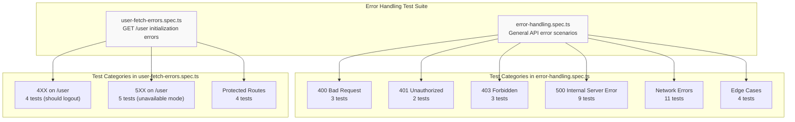

**Test Suite Totals:**

- `error-handling.spec.ts`: 32 tests covering general API error scenarios
- `user-fetch-errors.spec.ts`: 13 tests covering GET `/user` initialization errors
- **Total:** 45 comprehensive error handling tests

**Sources:** `e2e/error-handling.spec.ts:1-907`, `e2e/user-fetch-errors.spec.ts:1-305`

---

## Error Handling Test Architecture

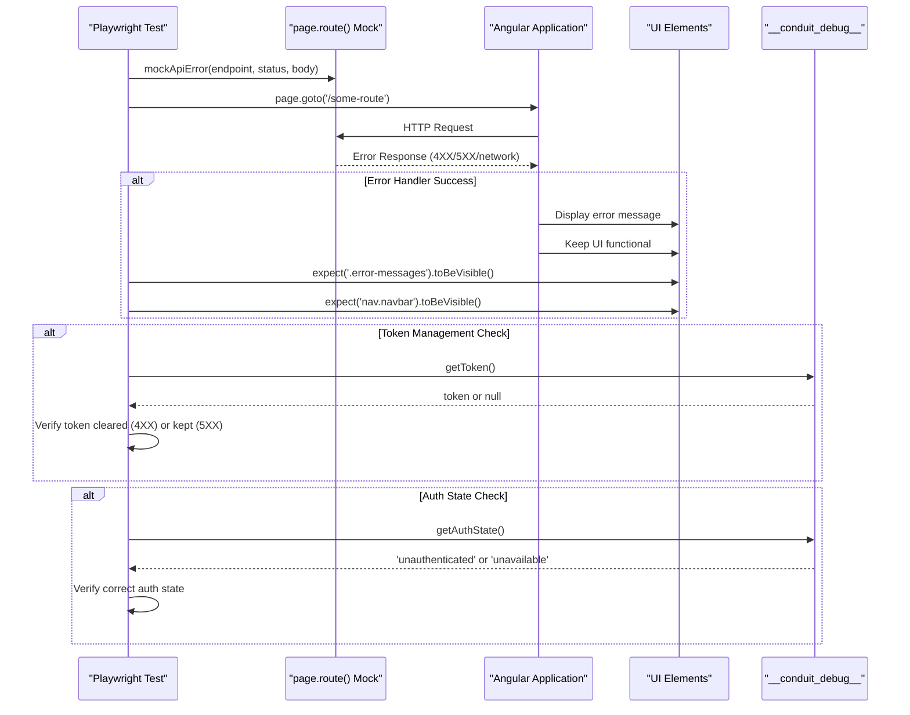

**Sources:** `e2e/error-handling.spec.ts:8-19`, `e2e/helpers/debug.ts:1-76`

---

## 400 Bad Request Tests

These tests validate that the application displays validation errors without crashing when the API returns 400 status codes.

### Test Coverage

| Test Name                               | Endpoint            | Scenario                | Expected Behavior                               |
| --------------------------------------- | ------------------- | ----------------------- | ----------------------------------------------- |
| `should handle 400 on login`            | `POST /users/login` | Invalid credentials     | Show `.error-messages`, stay on `/login`        |
| `should handle 400 on registration`     | `POST /users`       | Validation failures     | Show field-specific errors, stay on `/register` |
| `should handle 400 on article creation` | `POST /articles`    | Missing required fields | Show errors, form remains usable                |

### Example: Login Validation Error

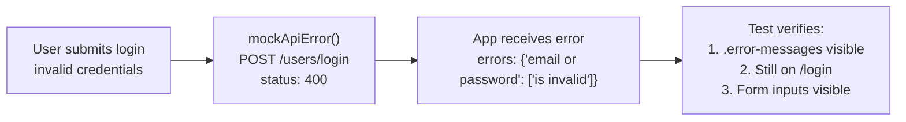

**Key Implementation Details:**

- Mock setup: `e2e/error-handling.spec.ts:32-34`
- Form submission: `e2e/error-handling.spec.ts:36-38`
- Assertions: `e2e/error-handling.spec.ts:40-42`

**Sources:** `e2e/error-handling.spec.ts:30-94`

---

## 401 Unauthorized Tests

401 errors have special handling depending on the endpoint. For non-`/user` endpoints, 401 indicates session expiry mid-operation.

### Test Coverage

| Test Name                                    | Endpoint                    | Scenario                    | Token Behavior               |
| -------------------------------------------- | --------------------------- | --------------------------- | ---------------------------- |
| `should handle 401 when submitting settings` | `PUT /user`                 | Session expired during edit | Token cleared, error shown   |
| `should handle 401 when posting a comment`   | `POST /articles/*/comments` | Unauthorized comment        | Token cleared, UI functional |

### Settings Form 401 Handling

The test mocks GET `/user` as successful (to load the page) but PUT `/user` returns 401 (session expired):

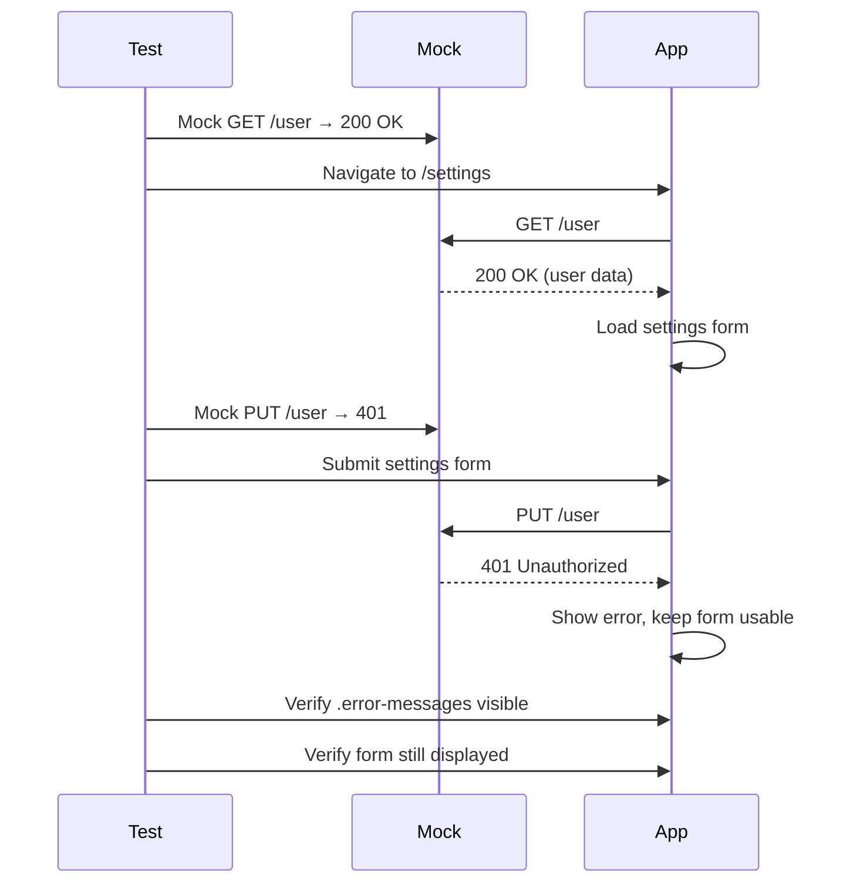

**Sources:** `e2e/error-handling.spec.ts:96-191`

---

## 403 Forbidden Tests

403 tests verify that authorization failures are handled gracefully without breaking the UI.

### Test Coverage

| Test Name                                 | Endpoint                              | Scenario                        |
| ----------------------------------------- | ------------------------------------- | ------------------------------- |
| `should handle 403 when updating article` | `PUT /articles/:slug`                 | Editing another user's article  |
| `should handle 403 when deleting comment` | `DELETE /articles/:slug/comments/:id` | Deleting another user's comment |
| `should handle 403 when following user`   | `POST /profiles/:username/follow`     | Following blocked user          |

### Comment Deletion 403 Flow

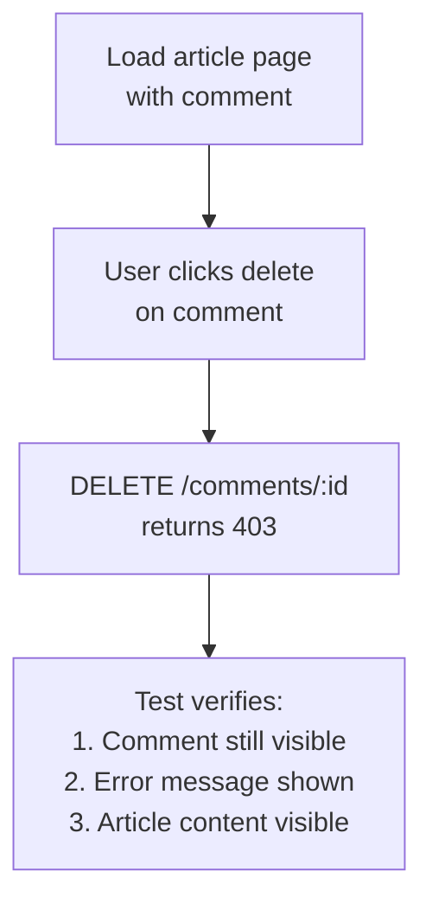

**Implementation:**

- Mock setup with successful GET but failing DELETE: `e2e/error-handling.spec.ts:285-302`
- Delete button click: `e2e/error-handling.spec.ts:310`
- Verification: `e2e/error-handling.spec.ts:312-316`

**Sources:** `e2e/error-handling.spec.ts:193-371`

---

## 500 Internal Server Error Tests

Server error tests verify that the application remains functional when the backend fails. These tests are critical for ensuring graceful degradation.

### Test Coverage Matrix

| Area                | Endpoint                  | Test Count | Key Assertion                    |
| ------------------- | ------------------------- | ---------- | -------------------------------- |
| Article Feed        | `GET /articles`           | 2          | Navbar and banner remain visible |
| Tags                | `GET /tags`               | 2          | Feed toggle functional, no crash |
| User Profile        | `GET /profiles/:username` | 2          | Profile container renders        |
| Article Detail      | `GET /articles/:slug`     | 2          | Article page container exists    |
| Settings Form       | `PUT /user`               | 1          | Form remains usable after error  |
| Intermittent Errors | `GET /articles`           | 1          | Recovers after temporary failure |

### Intermittent Error Recovery Test

This test simulates a server that fails once then succeeds:

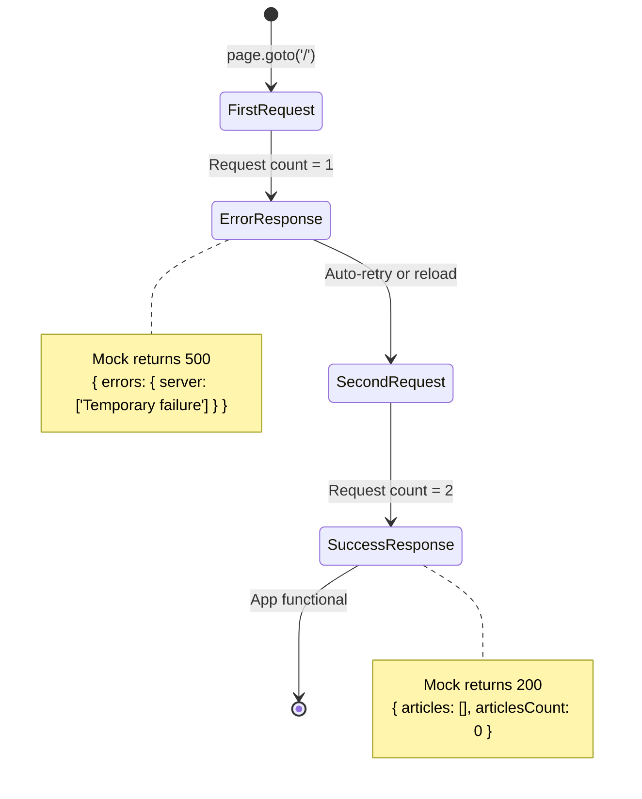

**Implementation:** `e2e/error-handling.spec.ts:500-524`

**Sources:** `e2e/error-handling.spec.ts:373-524`

---

## Network Error Tests

Network error tests simulate various network failure modes: timeouts, connection refused, and disconnected scenarios.

### Network Failure Types

| Error Type            | Playwright Method                     | HTTP Status | Token Behavior |
| --------------------- | ------------------------------------- | ----------- | -------------- |
| Timeout               | `route.abort('timedout')`             | 0           | Keep token     |
| Connection Refused    | `route.abort('connectionrefused')`    | 0           | Keep token     |
| Internet Disconnected | `route.abort('internetdisconnected')` | 0           | Keep token     |

### Network Error Test Coverage

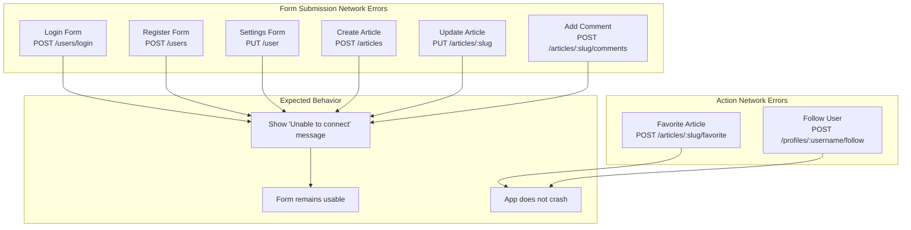

### Network Error Message Verification

All form submission tests verify the specific error message "Unable to connect":

```typescript
await expect(page.locator('.error-messages')).toContainText('Unable to connect');
```

**Example:** `e2e/error-handling.spec.ts:582-584`

**Sources:** `e2e/error-handling.spec.ts:526-854`

---

## GET /user Error Handling (Special Case)

The GET `/user` endpoint has special error handling because it runs during app initialization to check authentication state. Errors here determine whether the user is logged out or enters "unavailable" mode.

### Error Handling Logic

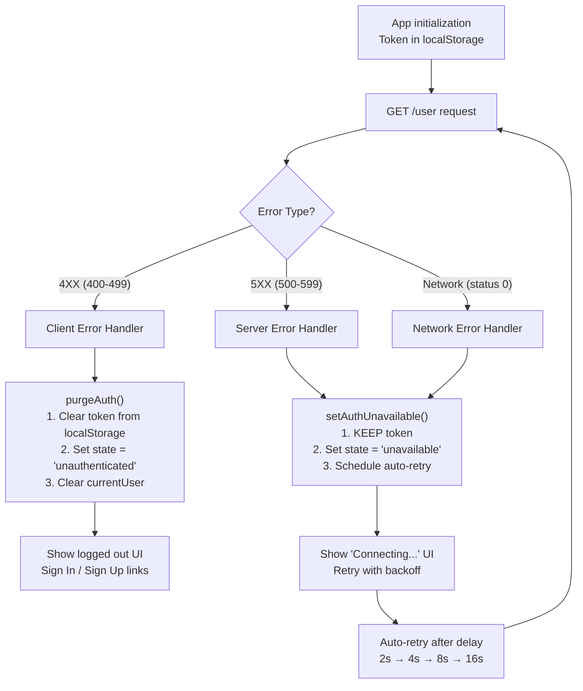

**Sources:** `src/app/core/auth/services/user.service.ts:100-115`, `e2e/user-fetch-errors.spec.ts:1-305`

---

## GET /user 4XX Tests (Should Logout)

These tests verify that client errors on GET `/user` clear the token and transition to unauthenticated state.

### Test Coverage

| Status Code | Scenario                     | Token After | Auth State After  |
| ----------- | ---------------------------- | ----------- | ----------------- |
| 400         | Bad Request (malformed)      | `null`      | `unauthenticated` |
| 401         | Unauthorized (invalid token) | `null`      | `unauthenticated` |
| 403         | Forbidden (access denied)    | `null`      | `unauthenticated` |
| 404         | Not Found (user deleted)     | `null`      | `unauthenticated` |

### Example: 401 on GET /user

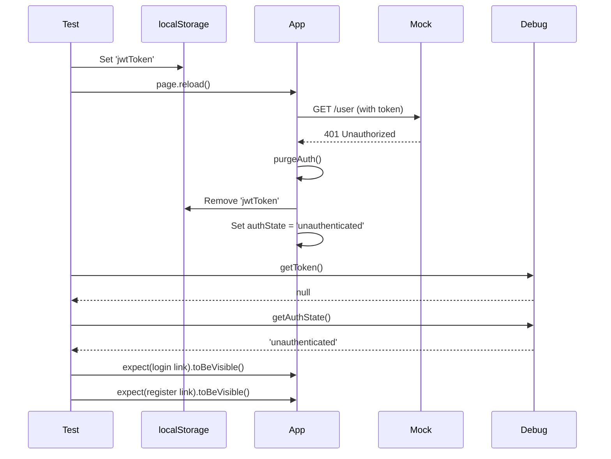

**Implementation:** `e2e/user-fetch-errors.spec.ts:40-64`

**Sources:** `e2e/user-fetch-errors.spec.ts:15-109`

---

## GET /user 5XX Tests (Unavailable Mode)

These tests verify that server errors and network failures keep the token and enter "unavailable" mode with auto-retry.

### Test Coverage

| Error Type                | Mock Method                        | Token After | Auth State After | Retry Behavior          |
| ------------------------- | ---------------------------------- | ----------- | ---------------- | ----------------------- |
| 500 Internal Server Error | `status: 500`                      | Kept        | `unavailable`    | Auto-retry with backoff |
| Network Timeout           | `route.abort('timedout')`          | Kept        | `unavailable`    | Auto-retry              |
| Network Failure           | `route.abort('connectionrefused')` | Kept        | `unavailable`    | Auto-retry              |
| Empty Response            | `body: ''`                         | Kept        | -                | May stay loading        |
| Malformed JSON            | `body: '{ invalid }'`              | Kept        | `unavailable`    | Auto-retry              |

### Unavailable Mode Persistence Test

A critical test verifies that the token persists across page reloads while in unavailable mode:

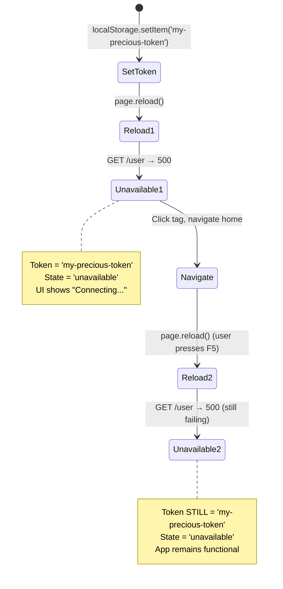

**Implementation:** `e2e/user-fetch-errors.spec.ts:133-172`

**Sources:** `e2e/user-fetch-errors.spec.ts:111-245`

---

## Protected Route Error Tests

These tests verify that authentication failures on protected routes (`/settings`, `/editor`) redirect appropriately.

### Test Scenarios

| Route       | Error Type       | Expected Behavior            |
| ----------- | ---------------- | ---------------------------- |
| `/settings` | 401 on GET /user | Redirect away from /settings |
| `/editor`   | 401 on GET /user | Redirect away from /editor   |
| `/settings` | 500 on GET /user | Navbar visible, no crash     |
| `/settings` | Network error    | Navbar visible, no crash     |

### Protected Route Redirect Flow

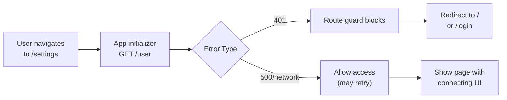

**Implementation:** `e2e/user-fetch-errors.spec.ts:247-304`

**Sources:** `e2e/user-fetch-errors.spec.ts:247-305`

---

## Edge Case Tests

Edge case tests verify robustness against malformed or unexpected responses.

### Test Coverage

| Test Name                           | Scenario            | Mock Response        | Expected Behavior           |
| ----------------------------------- | ------------------- | -------------------- | --------------------------- |
| `should handle malformed JSON`      | Invalid JSON syntax | `{ invalid json }}}` | No crash, navbar visible    |
| `should handle empty response body` | Empty HTTP body     | `body: ''`           | No crash, navbar visible    |
| `should handle 404 for article`     | Non-existent slug   | 404 status           | Show error state, not crash |
| `should handle 404 for profile`     | Non-existent user   | 404 status           | Show error state, not crash |

### Malformed Response Handling

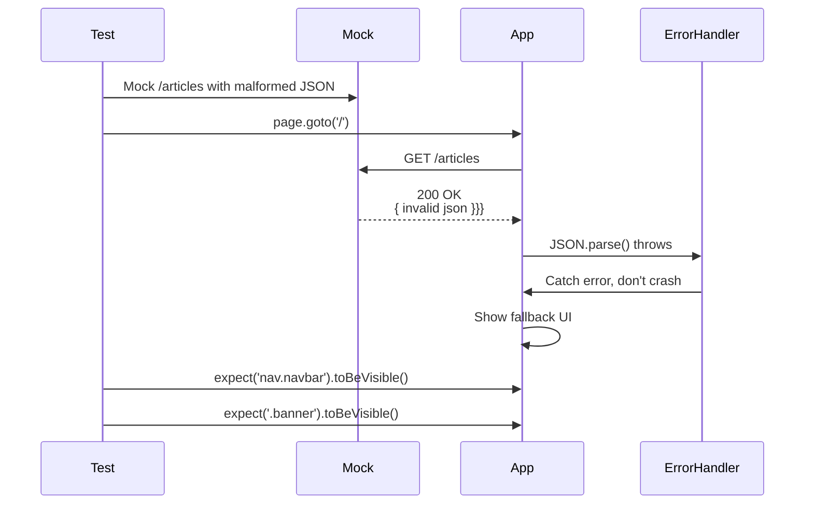

**Implementation:** `e2e/error-handling.spec.ts:857-869`

**Sources:** `e2e/error-handling.spec.ts:856-906`

---

## Helper Functions

### mockApiError()

Utility function to mock API endpoints with error responses:

```typescript
async function mockApiError(page: Page, endpoint: string, status: number, errorBody: object = {}, method?: string);
```

**Parameters:**

- `page`: Playwright Page object
- `endpoint`: API endpoint path (e.g., `/articles`)
- `status`: HTTP status code (400, 401, 500, etc.)
- `errorBody`: Response body object (default: `{}`)
- `method`: Optional HTTP method filter (e.g., `'POST'`)

**Usage Example:**

```typescript
await mockApiError(page, '/users/login', 400, {
  errors: { 'email or password': ['is invalid'] },
});
```

**Implementation:** `e2e/error-handling.spec.ts:8-19`

### setFakeAuthToken()

Sets a fake JWT token in localStorage to simulate authenticated state:

```typescript
async function setFakeAuthToken(page: Page);
```

**Implementation:** `e2e/error-handling.spec.ts:24-28`

**Sources:** `e2e/error-handling.spec.ts:1-29`

---

## Error Response Format

All error tests follow the RealWorld API error format:

```typescript
{
  errors: {
    [field: string]: string[] // Array of error messages per field
  }
}
```

**Examples:**

- Login validation: `{ errors: { 'email or password': ['is invalid'] } }`
- Article creation: `{ errors: { title: ["can't be blank"], body: ["can't be blank"] } }`
- Server error: `{ errors: { server: ['Internal server error'] } }`

**Sources:** `e2e/error-handling.spec.ts:32-34`, `e2e/error-handling.spec.ts:80-82`

---

## Debug Interface Usage

Error handling tests extensively use the `__conduit_debug__` interface to verify internal application state:

### Debug Methods Used

| Method             | Return Type      | Purpose                      |
| ------------------ | ---------------- | ---------------------------- |
| `getToken()`       | `string \| null` | Verify token cleared or kept |
| `getAuthState()`   | `AuthState`      | Verify auth state transition |
| `getCurrentUser()` | `User \| null`   | Verify user data cleared     |

### Example Usage in Tests

```typescript
// Verify token cleared on 401
const token = await getToken(page);
expect(token).toBeNull();

// Verify auth state on logout
const authState = await getAuthState(page);
expect(authState).toBe('unauthenticated');

// Verify token kept on 500
const token = await getToken(page);
expect(token).not.toBeNull();
```

**Sources:** `e2e/helpers/debug.ts:1-76`, `e2e/user-fetch-errors.spec.ts:36-37`, `e2e/user-fetch-errors.spec.ts:60-63`

---

## Test Execution Strategy

### Test Organization

All error handling tests use Playwright's `test.describe()` blocks to organize by error category:

```
error-handling.spec.ts
├── Error Handling - 400 Bad Request (3 tests)
├── Error Handling - 401 Unauthorized (2 tests)
├── Error Handling - 403 Forbidden (3 tests)
├── Error Handling - 500 Internal Server Error (9 tests)
├── Error Handling - Network Errors (11 tests)
└── Error Handling - Edge Cases (4 tests)

user-fetch-errors.spec.ts
├── User Fetch Errors - 4XX (4 tests)
├── User Fetch Errors - 5XX (5 tests)
└── User Fetch Errors - Protected Routes (4 tests)
```

### Common Assertion Pattern

Every error handling test follows this pattern:

1. **Setup:** Mock the API endpoint with error response
2. **Action:** Trigger the operation (navigate, submit form, click button)
3. **Assert Primary:** Verify app doesn't crash (`nav.navbar` visible)
4. **Assert Secondary:** Verify appropriate error handling (error message shown, token state correct)
5. **Assert Functionality:** Verify related features still work

**Sources:** `e2e/error-handling.spec.ts:30-94`, `e2e/user-fetch-errors.spec.ts:15-109`

---

---

[← Back to documentation index](README.md)
