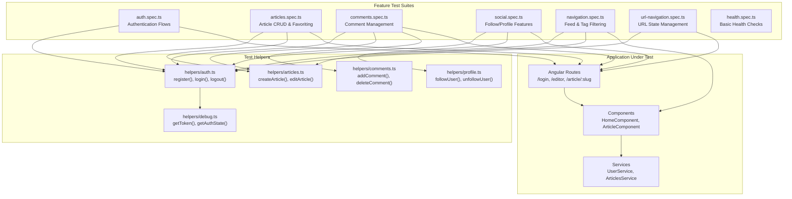
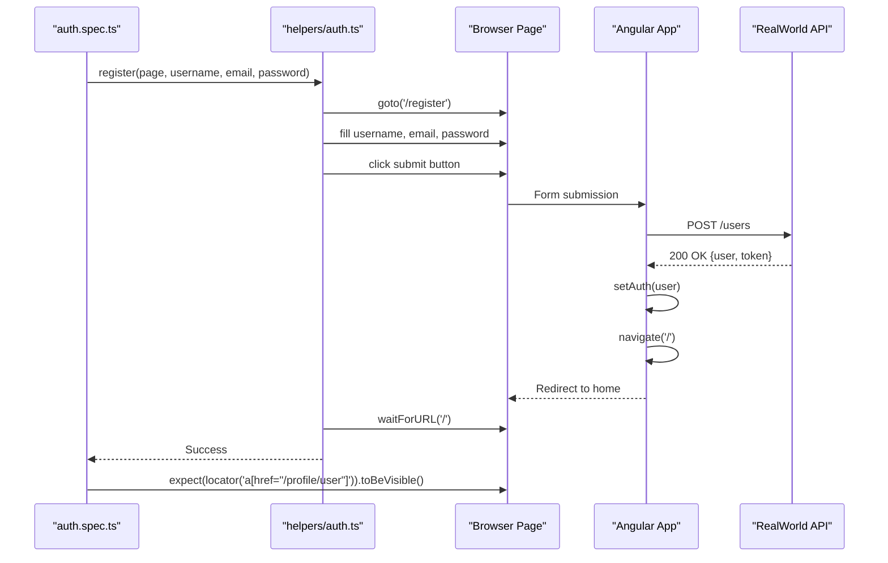
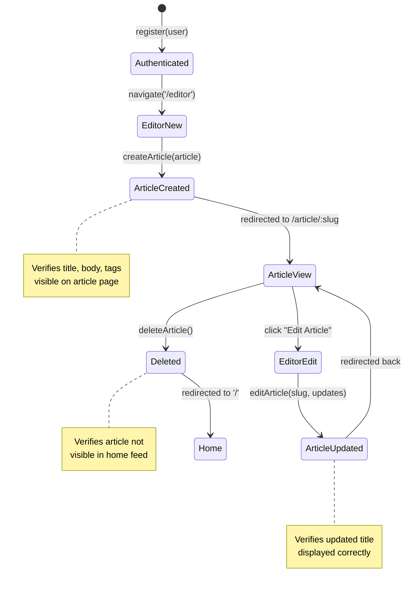
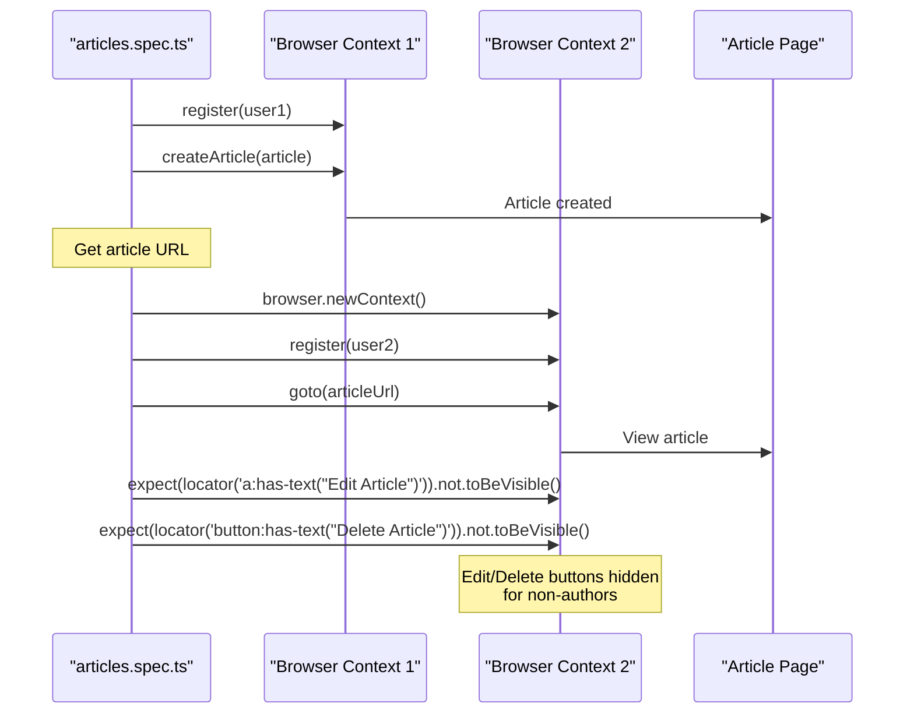
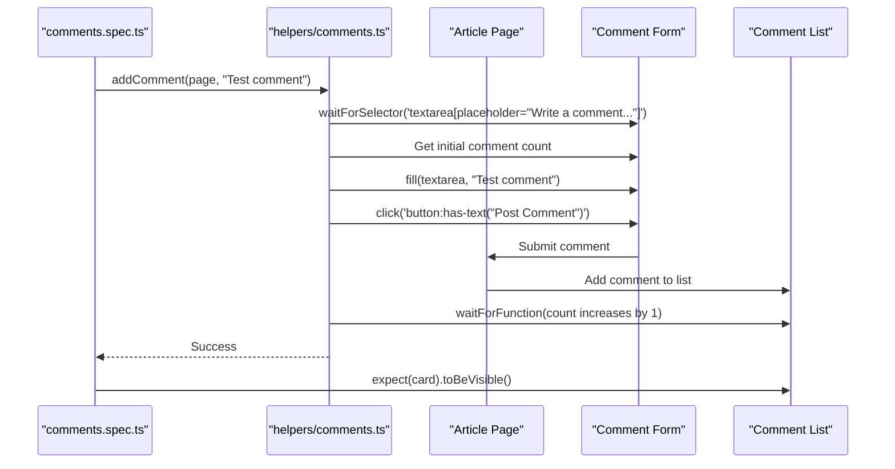
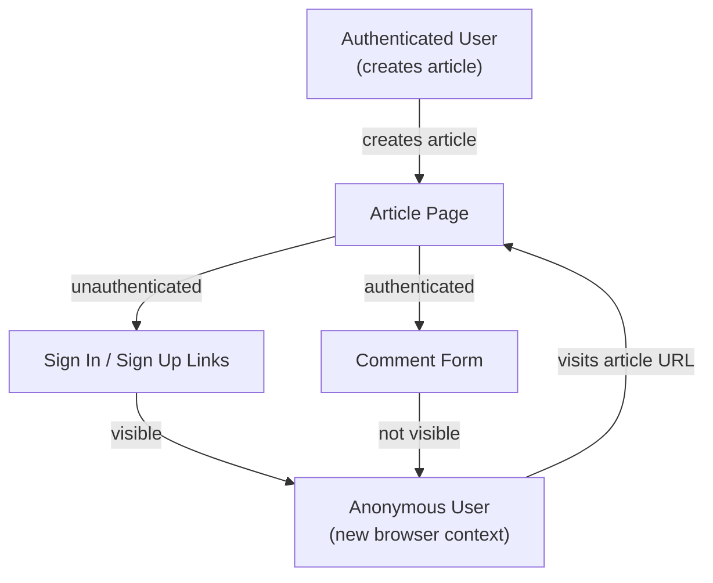
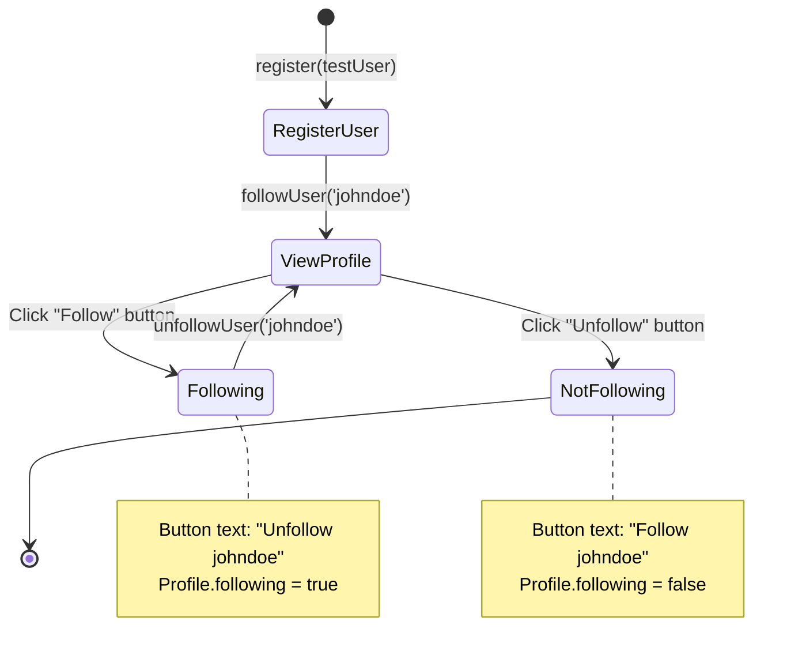
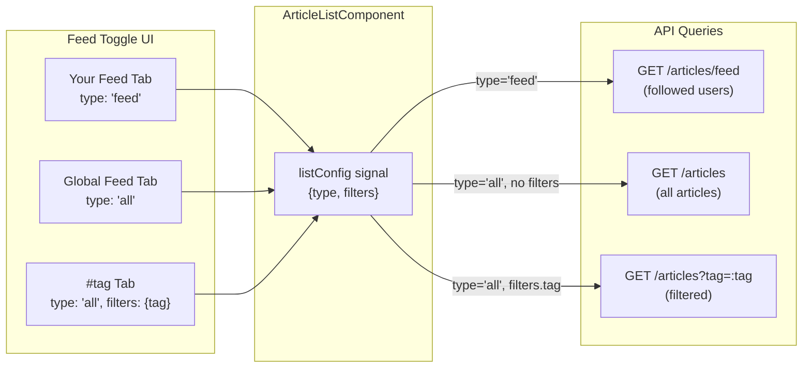

# Feature E2E Tests

<details>
<summary>Relevant source files</summary>

The following files were used as context for generating this wiki page:

- [e2e/articles.spec.ts](../e2e/articles.spec.ts)
- [e2e/auth.spec.ts](../e2e/auth.spec.ts)
- [e2e/comments.spec.ts](../e2e/comments.spec.ts)
- [e2e/error-handling.spec.ts](../e2e/error-handling.spec.ts)
- [e2e/health.spec.ts](../e2e/health.spec.ts)
- [e2e/helpers/comments.ts](../e2e/helpers/comments.ts)
- [e2e/helpers/debug.ts](../e2e/helpers/debug.ts)
- [e2e/navigation.spec.ts](../e2e/navigation.spec.ts)
- [e2e/social.spec.ts](../e2e/social.spec.ts)
- [e2e/url-navigation.spec.ts](../e2e/url-navigation.spec.ts)
- [e2e/user-fetch-errors.spec.ts](../e2e/user-fetch-errors.spec.ts)
- [playwright.config.ts](../playwright.config.ts)
- [src/app/features/article/pages/editor/editor.component.html](../src/app/features/article/pages/editor/editor.component.html)
- [src/app/features/article/pages/home/home.component.html](../src/app/features/article/pages/home/home.component.html)
- [src/app/features/article/pages/home/home.component.ts](../src/app/features/article/pages/home/home.component.ts)

</details>

This page documents the end-to-end tests that validate user-facing features and workflows. For information about the E2E testing infrastructure and configuration, see [E2E Testing Infrastructure](7.2-e2e-testing-infrastructure.md). For comprehensive error handling tests, see [Error Handling Tests](7.3-error-handling-tests.md).

**Scope**: This page covers feature-focused E2E tests organized by domain: authentication flows, article management, commenting, social interactions, navigation patterns, and URL-based routing. These tests validate complete user journeys from UI interaction through to backend state changes.

---

## Test Suite Organization

The feature E2E tests are organized into domain-specific test files, each focusing on a cohesive set of user capabilities.



**Sources**: `e2e/auth.spec.ts`, `e2e/articles.spec.ts`, `e2e/comments.spec.ts`, `e2e/social.spec.ts`, `e2e/navigation.spec.ts`, `e2e/url-navigation.spec.ts`, `e2e/health.spec.ts`

---

## Authentication Tests

The `auth.spec.ts` suite validates all authentication-related user flows, including registration, login, logout, and session persistence.

### Test Coverage

| Test Case                  | Route Tested       | Assertions                                                      |
| -------------------------- | ------------------ | --------------------------------------------------------------- |
| **User Registration**      | `/register`        | Redirects to `/`, username visible in header, editor accessible |
| **User Login**             | `/login`           | Successful authentication, profile link visible                 |
| **Invalid Login**          | `/login`           | Error messages displayed, remains on login page                 |
| **Wrong Password**         | `/login`           | Error messages, no redirect                                     |
| **Logout**                 | N/A (button click) | Profile link hidden, login link visible                         |
| **Protected Routes**       | `/editor`          | Redirects when unauthenticated                                  |
| **Session Persistence**    | N/A (page reload)  | User remains authenticated after reload                         |
| **Invalid Token Handling** | All routes         | Graceful degradation, token cleared, shows login UI             |

**Sources**: `e2e/auth.spec.ts:1-103`

### Registration Flow



The registration helper `e2e/helpers/auth.ts` provides a reusable function that navigates to `/register`, fills the form, submits it, and waits for the redirect to home. The test then verifies authentication state by checking for the presence of user-specific navigation links `e2e/auth.spec.ts:6-16`.

**Sources**: `e2e/auth.spec.ts:6-16`, `e2e/helpers/auth.ts`

### Invalid Token Handling

The suite includes a critical test for graceful degradation when an invalid token is present in `localStorage` `e2e/auth.spec.ts:86-102`. This test:

1. Sets an invalid JWT token in `localStorage`
2. Reloads the page, triggering `initAuth` application initializer
3. Verifies the app renders login/register links instead of showing a blank screen
4. Uses the `__conduit_debug__` interface to verify the token was cleared and `authState` is `'unauthenticated'`

This validates the behavior documented in [Authentication System](3.3-authentication-system.md) where 4xx errors on `GET /user` clear the token and show unauthenticated UI.

**Sources**: `e2e/auth.spec.ts:86-102`, `e2e/helpers/debug.ts:36-46`

---

## Article Management Tests

The `articles.spec.ts` suite covers the complete article lifecycle: creation, editing, deletion, favoriting, and viewing.

### Article CRUD Operations



**Sources**: `e2e/articles.spec.ts:31-83`

### Article Creation Test Flow

The article creation test `e2e/articles.spec.ts:31-47` follows this sequence:

1. **Setup**: User is already authenticated (via `beforeEach` hook)
2. **Action**: Call `createArticle(page, article)` helper
   - Navigates to `/editor`
   - Fills in title, description, body
   - Adds tags (if specified)
   - Clicks "Publish Article" button
3. **Verification**:
   - URL matches pattern `/article/.+`
   - Article title appears in `<h1>` tag
   - Article body is visible in `.article-content p`
   - All tags appear in `.tag-list .tag-default`

**Sources**: `e2e/articles.spec.ts:31-47`, `e2e/helpers/articles.ts`

### Favoriting/Unfavoriting Articles

The suite includes tests for the favorite feature `e2e/articles.spec.ts:121-178`:

| Test                   | Scenario                                            | Key Implementation Detail                                     |
| ---------------------- | --------------------------------------------------- | ------------------------------------------------------------- |
| **Favorite Article**   | User favorites an existing article from global feed | Cannot favorite own articles; test uses demo backend articles |
| **Unfavorite Article** | User unfavorites a previously favorited article     | Filters articles to find one not authored by current user     |

Both tests verify the button state changes between "Favorite Article" and "Unfavorite Article" text.

**Sources**: `e2e/articles.spec.ts:121-178`

### Author-Only Edit/Delete Permissions

The suite verifies authorization controls `e2e/articles.spec.ts:227-250`:



This test uses separate browser contexts to ensure complete session isolation between the two users `e2e/articles.spec.ts:237-249`.

**Sources**: `e2e/articles.spec.ts:227-250`

### HTTP Status Code Tolerance

Two tests verify the frontend handles alternative HTTP success codes gracefully:

- **Article Deletion with 200**: Tests that `DELETE /articles/:slug` works with 200 OK instead of the spec-compliant 204 No Content `e2e/articles.spec.ts:96-119`
- **Comment Deletion with 200**: Same tolerance for comment deletion `e2e/comments.spec.ts:59-82`

These tests use Playwright's route mocking to intercept DELETE requests and return 200 status codes, verifying the frontend accepts any 2xx status as success per RFC 9110.

**Sources**: `e2e/articles.spec.ts:85-119`, `e2e/comments.spec.ts:48-82`

---

## Comment Tests

The `comments.spec.ts` suite validates the commenting system, including adding, deleting, and viewing comments, plus authorization checks.

### Comment Operations

| Operation          | Helper Function             | Key Assertions                                          |
| ------------------ | --------------------------- | ------------------------------------------------------- |
| **Add Comment**    | `addComment(page, text)`    | Comment visible in `.card:not(.comment-form)`           |
| **Delete Comment** | `deleteComment(page, text)` | Comment no longer visible                               |
| **Count Comments** | `getCommentCount(page)`     | Returns count of `.card:not(.comment-form) .card-block` |

**Sources**: `e2e/helpers/comments.ts:1-33`

### Add Comment Flow



The helper function waits for the comment form to be ready, captures the initial comment count, submits the comment, and then waits for the count to increase, ensuring the comment was successfully added `e2e/helpers/comments.ts:3-19`.

**Sources**: `e2e/helpers/comments.ts:3-19`, `e2e/comments.spec.ts:30-35`

### Authorization: Author-Only Delete

The test for delete permissions `e2e/comments.spec.ts:114-137` validates that:

1. **Other users' comments**: Delete button (`.mod-options i.ion-trash-a`) is NOT visible
2. **Own comments**: Delete button IS visible

The test navigates to a demo backend article (e.g., johndoe's article), checks that existing comments don't show delete buttons, then adds a new comment and verifies the delete button appears only for that comment.

**Sources**: `e2e/comments.spec.ts:114-137`

### Anonymous User Restrictions

A test verifies unauthenticated users cannot post comments `e2e/comments.spec.ts:100-112`:



This test creates a new browser context (without authentication cookies) to simulate an anonymous user and verifies the comment form is replaced with login/register links.

**Sources**: `e2e/comments.spec.ts:100-112`

---

## Social Features Tests

The `social.spec.ts` suite validates user-to-user interactions: following/unfollowing users, viewing profiles, and displaying user-specific article feeds.

### Follow/Unfollow Flow



The tests use `johndoe` from the demo backend as a reliable target user `e2e/social.spec.ts:19-35`. The `followUser` and `unfollowUser` helpers `e2e/helpers/profile.ts` navigate to the profile and click the appropriate button.

**Sources**: `e2e/social.spec.ts:19-35`, `e2e/helpers/profile.ts`

### Profile Viewing: Own vs Other Users

| Profile Type    | URL Pattern                         | Edit Button Visible        | Follow Button Visible | Test                   |
| --------------- | ----------------------------------- | -------------------------- | --------------------- | ---------------------- |
| **Own Profile** | `/profile/:username` (current user) | ✅ "Edit Profile Settings" | ❌ Cannot follow self | `social.spec.ts:37-52` |
| **Other User**  | `/profile/johndoe`                  | ❌ Not authorized          | ✅ Can follow         | `social.spec.ts:54-78` |

The tests verify conditional rendering based on profile ownership `e2e/social.spec.ts:37-78`.

**Sources**: `e2e/social.spec.ts:37-78`

### Your Feed: Followed Users' Articles

The test for "Your Feed" `e2e/social.spec.ts:138-156` validates the feed system:

1. User follows `johndoe` (who has existing articles in demo backend)
2. Navigates to home page
3. Clicks "Your Feed" tab
4. Verifies articles from followed users appear

This tests the `ArticleListComponent` with config `{ type: 'feed' }` which queries `/articles/feed` endpoint.

**Sources**: `e2e/social.spec.ts:138-156`, `src/app/features/article/pages/home/home.component.ts:42-72`

### Profile Article Tabs

The suite tests both article tabs on profile pages `e2e/social.spec.ts:80-136`:

- **My Articles**: User's authored articles via `?author=:username` query
- **Favorited Articles**: User's favorited articles via `?favorited=:username` query

Both tabs use the same `ArticleListComponent` with different query configurations.

**Sources**: `e2e/social.spec.ts:80-136`

---

## Navigation Tests

The `navigation.spec.ts` suite validates UI navigation, feed switching, tag filtering, and pagination.

### Main Navigation Flows

The suite tests two navigation scenarios:

**Unauthenticated Navigation** `e2e/navigation.spec.ts:19-36`:

- Home page → Sign In → Sign Up → Home (via brand logo)
- Verifies all public routes are accessible

**Authenticated Navigation** `e2e/navigation.spec.ts:38-59`:

- Verifies presence of: Home, New Article, Settings, Profile links
- Tests navigation to each authenticated route

**Sources**: `e2e/navigation.spec.ts:19-59`

### Feed Switching: Global Feed vs Your Feed



The test `e2e/navigation.spec.ts:107-133` verifies:

1. Articles appear in Global Feed (including newly created article)
2. Clicking "Your Feed" switches to filtered view
3. Feed toggle UI updates active state

**Sources**: `e2e/navigation.spec.ts:107-133`, `src/app/features/article/pages/home/home.component.ts:42-72`

### Tag Filtering

The tag filtering test `e2e/navigation.spec.ts:61-105` validates:

1. User creates article with custom tags
2. Tags appear in "Popular Tags" sidebar
3. Clicking a tag filters articles
4. Tag becomes active in feed toggle
5. Articles with that tag are displayed

The test includes fallback logic: if custom tags don't appear immediately in Popular Tags (due to backend caching), it uses an existing tag from the demo backend.

**Sources**: `e2e/navigation.spec.ts:61-105`, `src/app/features/article/pages/home/home.component.html:50-65`

### Pagination

The pagination test `e2e/navigation.spec.ts:156-172` creates 12 articles via API (using the `createManyArticles` helper) to ensure pagination triggers:

1. Creates user and 12 articles with unique tag
2. Navigates to tag page (shows only those articles)
3. Verifies first page shows ≤10 articles
4. Verifies pagination controls are visible

The test uses a unique tag to isolate test articles from the global feed `e2e/navigation.spec.ts:158-171`.

**Sources**: `e2e/navigation.spec.ts:156-172`, `e2e/helpers/api.ts`

---

## URL-Based Navigation Tests

The `url-navigation.spec.ts` suite validates URL state management and deep linking, addressing RealWorld Issue #691.

### Feed Parameter Handling

| URL Pattern                 | Feed Type             | Authentication Required | Test                           |
| --------------------------- | --------------------- | ----------------------- | ------------------------------ |
| `/`                         | Global Feed           | No                      | `url-navigation.spec.ts:11-19` |
| `/?feed=following`          | Your Feed             | Yes                     | `url-navigation.spec.ts:21-29` |
| `/?feed=following` (unauth) | Redirects to `/login` | N/A                     | `url-navigation.spec.ts:31-35` |

The tests verify the `HomeComponent` correctly parses the `feed` query parameter and either shows the appropriate feed or redirects to login `src/app/features/article/pages/home/home.component.ts:42-72`.

**Sources**: `e2e/url-navigation.spec.ts:11-35`, `src/app/features/article/pages/home/home.component.ts:42-72`

### Tab Link Attributes

The suite verifies that feed tabs have correct `href` attributes for proper navigation `e2e/url-navigation.spec.ts:50-61`:

```typescript
// Your Feed tab
await expect(page.locator('.nav-link:has-text("Your Feed")')).toHaveAttribute('href', '/?feed=following');

// Global Feed tab
await expect(page.locator('.nav-link:has-text("Global Feed")')).toHaveAttribute('href', '/');
```

This validates that the tabs use `routerLink` with `queryParams` correctly `src/app/features/article/pages/home/home.component.html:14-33`.

**Sources**: `e2e/url-navigation.spec.ts:50-61`, `src/app/features/article/pages/home/home.component.html:14-33`

### Pagination URL State

The pagination tests `e2e/url-navigation.spec.ts:103-245` validate that:

1. **Page parameter in URL**: Clicking page 2 updates URL to `?page=2`
2. **Direct navigation**: Navigating directly to `?page=2` loads the correct page
3. **Parameter preservation**: Switching pages preserves other params (e.g., `?feed=following&page=2`)
4. **Tag pagination**: Pagination works with tag filters (`/tag/:tag?page=2`)
5. **Page reset**: Switching feeds resets to page 1

The tests create 15 articles with a unique tag to ensure pagination is triggered (15 articles = 2 pages with limit 10).

**Sources**: `e2e/url-navigation.spec.ts:103-245`

### Page Change Handler

The `HomeComponent.onPageChange()` method manages URL updates `src/app/features/article/pages/home/home.component.ts:75-93`:

```typescript
onPageChange(page: number): void {
  const queryParams: { page?: number; feed?: string } = {};

  // Preserve feed param if present
  const currentFeed = this.route.snapshot.queryParams['feed'];
  if (currentFeed) {
    queryParams.feed = currentFeed;
  }

  // Only add page param if not page 1
  if (page > 1) {
    queryParams.page = page;
  }

  void this.router.navigate([], {
    relativeTo: this.route,
    queryParams,
  });
}
```

This method preserves the `feed` parameter and only adds `page` when > 1, keeping URLs clean.

**Sources**: `src/app/features/article/pages/home/home.component.ts:75-93`

### Empty Feed Message with Deep Link

The test for empty "Your Feed" `e2e/url-navigation.spec.ts:88-100` verifies:

1. User with no followed users sees empty feed
2. Helpful message displays: "Your feed is empty"
3. Message includes a link to Global Feed (`<a href="/">`)

This tests the `ArticleListComponent`'s empty state handling when `isFollowingFeed` is true.

**Sources**: `e2e/url-navigation.spec.ts:88-100`

---

## Test Helpers and Patterns

The E2E tests use a library of helper functions to maintain readability and reduce duplication.

### Test Helper Organization

```mermaid
graph TB
    subgraph "Authentication Helpers"
        AUTH_REG["register(page, username, email, password)"]
        AUTH_LOGIN["login(page, email, password)"]
        AUTH_LOGOUT["logout(page)"]
        AUTH_GEN["generateUniqueUser()"]
    end

    subgraph "Article Helpers"
        ART_CREATE["createArticle(page, article)"]
        ART_EDIT["editArticle(page, slug, updates)"]
        ART_DELETE["deleteArticle(page)"]
        ART_FAV["favoriteArticle(page)"]
        ART_UNFAV["unfavoriteArticle(page)"]
        ART_GEN["generateUniqueArticle()"]
    end

    subgraph "Comment Helpers"
        COM_ADD["addComment(page, text)"]
        COM_DEL["deleteComment(page, text)"]
        COM_COUNT["getCommentCount(page)"]
    end

    subgraph "Profile Helpers"
        PROF_FOLLOW["followUser(page, username)"]
        PROF_UNFOLLOW["unfollowUser(page, username)"]
    end

    subgraph "API Helpers"
        API_REG["registerUserViaAPI(request, user)"]
        API_ARTICLES["createManyArticles(request, token, count, tag)"]
    end

    subgraph "Debug Helpers"
        DEBUG_TOKEN["getToken(page)"]
        DEBUG_STATE["getAuthState(page)"]
        DEBUG_USER["getCurrentUser(page)"]
        DEBUG_WAIT["waitForAuthState(page, state)"]
    end
```



**Sources**: `e2e/helpers/auth.ts`, `e2e/helpers/articles.ts`, `e2e/helpers/comments.ts`, `e2e/helpers/profile.ts`, `e2e/helpers/api.ts`, `e2e/helpers/debug.ts`

### Test Isolation Pattern

Most test suites include cleanup hooks to ensure complete test isolation:

```typescript
test.afterEach(async ({ context }) => {
  // Close the browser context to ensure complete isolation between tests.
  // This releases browser instances, network connections, and other resources.
  await context.close();

  // Wait 500ms to allow async cleanup operations to complete.
  // Without this delay, running 6+ tests in sequence causes flaky failures
  // due to resource exhaustion (network connections, file descriptors, etc).
  await new Promise(resolve => setTimeout(resolve, 500));
});
```

This pattern is used in:

- `e2e/articles.spec.ts:19-29`
- `e2e/comments.spec.ts:18-28`
- `e2e/social.spec.ts:7-17`
- `e2e/navigation.spec.ts:7-17`

The 500ms delay allows async cleanup operations to complete and prevents resource exhaustion when running many tests sequentially.

**Sources**: `e2e/articles.spec.ts:19-29`, `e2e/comments.spec.ts:18-28`, `e2e/social.spec.ts:7-17`

### Debug Interface Usage

The `__conduit_debug__` interface enables tests to inspect internal application state:

```typescript
// Check authentication state
const authState = await getAuthState(page);
expect(authState).toBe('unauthenticated');

// Verify token was cleared
const token = await getToken(page);
expect(token).toBeNull();

// Get current user
const user = await getCurrentUser(page);
expect(user?.username).toBe('testuser');
```

This is particularly useful for verifying authentication state changes that may not be immediately visible in the UI `e2e/auth.spec.ts:98-101`, `e2e/user-fetch-errors.spec.ts:36-63`.

**Sources**: `e2e/helpers/debug.ts:1-76`, `e2e/auth.spec.ts:86-102`, `e2e/user-fetch-errors.spec.ts`

### Unique ID Generation

Helper functions generate unique identifiers to prevent test collisions on the shared demo backend:

**User Generation** `e2e/helpers/auth.ts`:

```typescript
export function generateUniqueUser() {
  const timestamp = Date.now();
  const random = Math.random().toString(36).substring(7);
  return {
    username: `user_${timestamp}_${random}`,
    email: `user_${timestamp}_${random}@example.com`,
    password: 'password123',
  };
}
```

**Article Generation** `e2e/helpers/articles.ts`:

```typescript
export function generateUniqueArticle() {
  const timestamp = Date.now();
  const random = Math.random().toString(36).substring(7);
  return {
    title: `Test Article ${timestamp}`,
    description: `Description ${random}`,
    body: `Body content ${timestamp}`,
    tags: ['test', `tag_${random}`],
  };
}
```

These generators ensure test data doesn't collide even when tests run in parallel or in quick succession.

**Sources**: `e2e/helpers/auth.ts`, `e2e/helpers/articles.ts`

### API Helpers for Performance

For tests that need many articles (e.g., pagination tests), the suite includes API helpers that create data directly via HTTP requests instead of clicking through the UI:

```typescript
// Create 15 articles via API (much faster than UI)
const uniqueTag = `pag${Date.now()}`;
const token = await registerUserViaAPI(request, user);
await createManyArticles(request, token, 15, uniqueTag);
```

This pattern is used in pagination tests `e2e/navigation.spec.ts:156-171` and `e2e/url-navigation.spec.ts:109-128` to avoid the overhead of 15 UI interactions while still testing the pagination UI itself.

**Sources**: `e2e/navigation.spec.ts:156-171`, `e2e/url-navigation.spec.ts:109-128`, `e2e/helpers/api.ts`

---

## Configuration and Execution

The Playwright configuration `playwright.config.ts:1-54` defines key test execution parameters:

| Setting             | Value                 | Rationale                                                  |
| ------------------- | --------------------- | ---------------------------------------------------------- |
| `fullyParallel`     | `false`               | Prevents race conditions on shared backend                 |
| `workers`           | `1`                   | Ensures serial execution to avoid state conflicts          |
| `timeout`           | `15000` (15s)         | Fast timeout for fast app; failures indicate real problems |
| `actionTimeout`     | `5000` (5s)           | Clicks, fills should complete quickly                      |
| `navigationTimeout` | `10000` (10s)         | Page loads should be fast with Vite                        |
| `retries`           | `1` (local), `2` (CI) | Retries flaky tests automatically                          |

The configuration runs only Chromium by default for speed, with Firefox and WebKit commented out but available for cross-browser testing.

**Sources**: `playwright.config.ts:1-54`

---

---

[← Back to documentation index](README.md)
