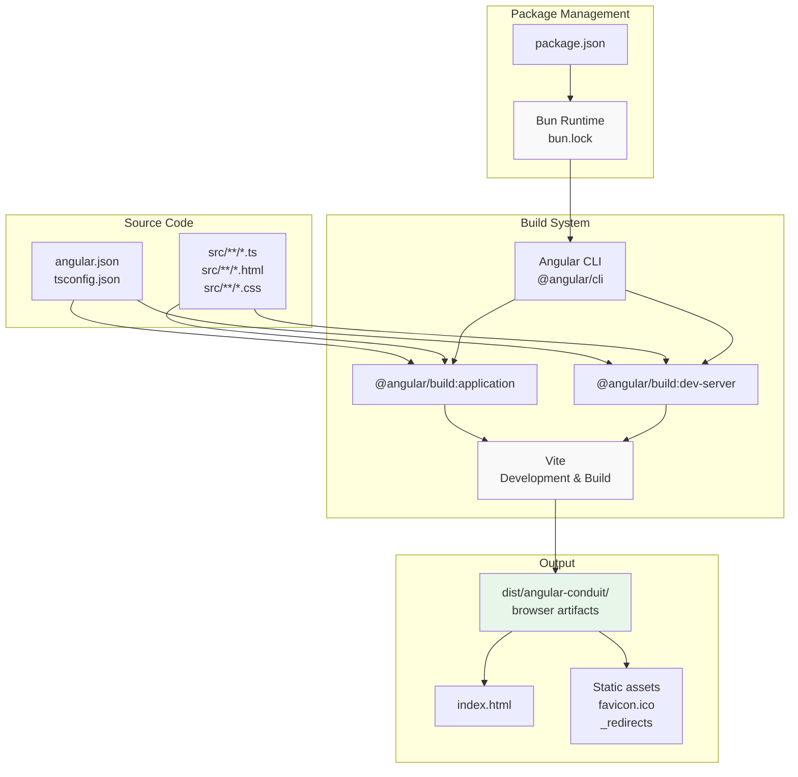
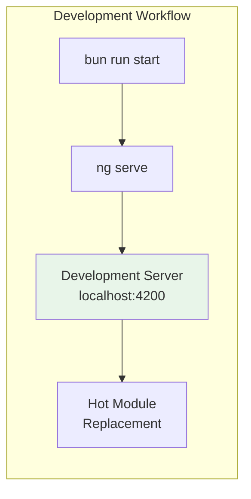
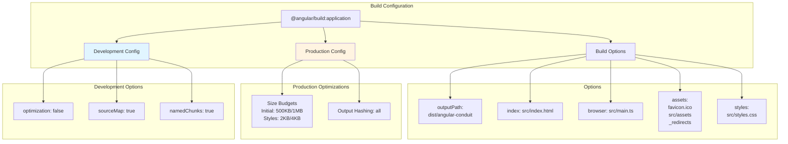
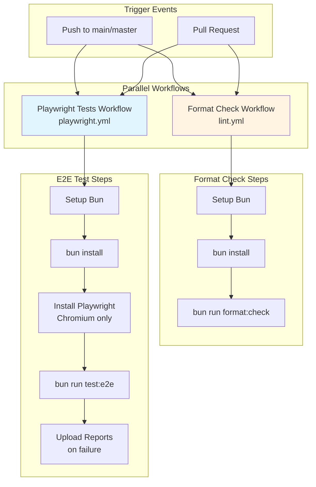

# Build & Deployment

<details>
<summary>Relevant source files</summary>

The following files were used as context for generating this wiki page:

- [.github/workflows/lint.yml](../.github/workflows/lint.yml)
- [.github/workflows/playwright.yml](../.github/workflows/playwright.yml)
- [angular.json](../angular.json)
- [bun.lock](../bun.lock)
- [package.json](../package.json)
- [src/\_redirects](../src/_redirects)

</details>

This document provides an overview of the build system, deployment process, and continuous integration pipeline for the Angular RealWorld application. It covers the build toolchain, available npm scripts, CI/CD workflows, and deployment configuration.

For detailed information about specific build configurations, see [Build Configuration](8.1-build-configuration.md). For CI/CD pipeline details, see [CI/CD Pipeline](8.2-ci-cd-pipeline.md). For dependency management and package choices, see [Dependencies & Package Management](8.3-dependencies-and-package-management.md).

---

## Build System Overview

The application uses **Angular CLI** with **Vite** as the underlying build tool and **Bun** as the package manager. This modern toolchain provides fast development server startup, efficient hot module replacement (HMR), and optimized production builds.

### Build Toolchain Architecture



**Sources:** `package.json:1-61`, `angular.json:1-84`, `bun.lock:1-40`

---

## Package Manager: Bun

The project uses **Bun** as its package manager and runtime, specified by the presence of `bun.lock` instead of `package-lock.json` or `yarn.lock`. Bun provides faster installation and execution compared to npm or yarn.

| Feature                  | Configuration      |
| ------------------------ | ------------------ |
| Package Manager          | Bun                |
| Lock File                | `bun.lock`         |
| Node Version Requirement | `>=20.11.1`        |
| Installation Command     | `bun install`      |
| Script Execution         | `bun run <script>` |

**Sources:** `package.json:23-25`, `bun.lock:1-6`

---

## Available Build Scripts

The application provides comprehensive npm scripts for development, testing, building, and deployment tasks defined in `package.json`.

### Development Scripts



| Script  | Command    | Purpose                            |
| ------- | ---------- | ---------------------------------- |
| `start` | `ng serve` | Start development server with HMR  |
| `build` | `ng build` | Production build with optimization |
| `ng`    | `ng`       | Direct access to Angular CLI       |

**Sources:** `package.json:6-8`

### Testing Scripts

| Script              | Command                                   | Purpose                                   |
| ------------------- | ----------------------------------------- | ----------------------------------------- |
| `test`              | `vitest`                                  | Run unit tests in watch mode              |
| `test:ui`           | `vitest --ui`                             | Run unit tests with UI interface          |
| `test:coverage`     | `vitest --coverage`                       | Generate test coverage report             |
| `test:e2e`          | `playwright test --grep-invert @security` | Run E2E tests (excluding security tests)  |
| `test:e2e:security` | `playwright test --grep @security`        | Run security-tagged E2E tests             |
| `test:e2e:ui`       | `playwright test --ui`                    | Run E2E tests with Playwright UI          |
| `test:e2e:headed`   | `playwright test --headed`                | Run E2E tests in headed browser mode      |
| `test:e2e:debug`    | `playwright test --debug`                 | Debug E2E tests with Playwright inspector |
| `test:e2e:report`   | `playwright show-report`                  | Display Playwright HTML report            |
| `test:e2e:disabled` | `cat e2e/DISABLED_TESTS.md`               | View disabled test documentation          |

**Sources:** `package.json:9-18`

### Code Quality Scripts

| Script         | Command                                         | Purpose                                  |
| -------------- | ----------------------------------------------- | ---------------------------------------- |
| `format`       | `prettier --write "**/*.{ts,html,css,json,md}"` | Format all code files                    |
| `format:check` | `prettier --check "**/*.{ts,html,css,json,md}"` | Check formatting without modifying files |
| `prepare`      | `husky install`                                 | Setup Git hooks with Husky               |

The project uses **Husky** for Git hooks and **lint-staged** to automatically format staged files before commit.

**Sources:** `package.json:19-21`, `package.json:58-60`

---

## Build Configuration

The Angular CLI configuration in `angular.json` defines two primary builders:

### Application Builder



The builder configuration includes:

- **Entry Point**: `src/main.ts` (`angular.json:33`)
- **Output Path**: `dist/angular-conduit` (`angular.json:16-18`)
- **Assets**: Includes `favicon.ico`, `src/assets`, and `_redirects` for SPA routing (`angular.json:22-30`)
- **Budget Limits**: 500KB warning / 1MB error for initial bundle, 2KB warning / 4KB error for component styles (`angular.json:37-47`)

**Sources:** `angular.json:13-59`

### Development Server Builder

The development server uses `@angular/build:dev-server` with two configurations:

- **Production**: Serves optimized production build (`angular.json:64`)
- **Development** (default): Serves with sourcemaps and unoptimized code (`angular.json:66-68`)

**Sources:** `angular.json:60-71`

---

## Continuous Integration Pipeline

The project implements CI/CD using **GitHub Actions** with two workflows that run on every push and pull request to `main` or `master` branches.

### CI/CD Workflow Architecture



### Format Check Workflow

The `lint.yml` workflow ensures code formatting consistency:

1. **Checkout**: Uses `actions/checkout@v4` (`.github/workflows/lint.yml:14`)
2. **Setup Bun**: Uses `oven-sh/setup-bun@v2` (`.github/workflows/lint.yml:16-17`)
3. **Install Dependencies**: Runs `bun install` (`.github/workflows/lint.yml:19-20`)
4. **Check Formatting**: Runs `bun run format:check` using Prettier (`.github/workflows/lint.yml:22-23`)

**Sources:** `.github/workflows/lint.yml:1-24`

### Playwright Tests Workflow

The `playwright.yml` workflow validates E2E functionality:

1. **Checkout**: Uses `actions/checkout@v4` (`.github/workflows/playwright.yml:15`)
2. **Setup Bun**: Uses `oven-sh/setup-bun@v2` (`.github/workflows/playwright.yml:17-18`)
3. **Install Dependencies**: Runs `bun install` (`.github/workflows/playwright.yml:20-21`)
4. **Install Playwright**: Installs Chromium browser with system dependencies (`.github/workflows/playwright.yml:23-24`)
5. **Run Tests**: Executes `bun run test:e2e` with `CI=true` environment variable (`.github/workflows/playwright.yml:26-29`)
6. **Upload Artifacts**: Uploads test reports and results on failure for debugging (`.github/workflows/playwright.yml:31-45`)

The workflow has a 60-minute timeout and runs on `ubuntu-latest` (`.github/workflows/playwright.yml:11-12`).

**Sources:** `.github/workflows/playwright.yml:1-46`

---

## Deployment Configuration

### SPA Routing Configuration

The application includes a `_redirects` file for deployment to static hosting platforms (e.g., Netlify, Cloudflare Pages) that need SPA routing configuration.

```
/*  /index.html 200
```

This configuration ensures all routes are handled by the Angular router by redirecting all paths to `index.html` with a 200 status code.

**Sources:** `src/_redirects:1`, `angular.json:25-29`

### Build Output Structure

The production build generates the following structure:

```
dist/angular-conduit/
├── browser/
│   ├── index.html          # Main HTML entry point
│   ├── main-<hash>.js      # Application bundle
│   ├── polyfills-<hash>.js # Polyfills bundle
│   ├── styles-<hash>.css   # Compiled styles
│   ├── assets/             # Static assets
│   ├── favicon.ico         # Application icon
│   └── _redirects          # SPA routing config
```

All JavaScript and CSS files are hashed for cache-busting in production builds (`angular.json:49`).

**Sources:** `angular.json:16-18`, `angular.json:49`

---

## Dependency Categories

The project dependencies are organized into runtime and development dependencies:

### Runtime Dependencies

| Dependency                  | Version | Purpose                             |
| --------------------------- | ------- | ----------------------------------- |
| `@angular/core`             | 21.1.1  | Core Angular framework              |
| `@angular/common`           | 21.1.1  | Common Angular directives and pipes |
| `@angular/forms`            | 21.1.1  | Form handling                       |
| `@angular/router`           | 21.1.1  | Client-side routing                 |
| `@angular/platform-browser` | 21.1.1  | Browser platform                    |
| `@rx-angular/cdk`           | 21.0.0  | RxAngular utilities                 |
| `@rx-angular/template`      | 21.0.0  | RxAngular template rendering        |
| `rxjs`                      | ^7.8.2  | Reactive programming library        |
| `marked`                    | ^17.0.1 | Markdown parser                     |
| `tslib`                     | ^2.8.1  | TypeScript runtime helpers          |

**Sources:** `package.json:27-40`

### Development Dependencies

| Category         | Dependencies                                                                               |
| ---------------- | ------------------------------------------------------------------------------------------ |
| **Build Tools**  | `@angular/cli`, `@angular/build`, `@angular/compiler-cli`, `@analogjs/vite-plugin-angular` |
| **Testing**      | `@playwright/test`, `playwright`, `@vitest/ui`, `vitest`, `jsdom`                          |
| **Code Quality** | `prettier`, `husky`, `lint-staged`                                                         |
| **TypeScript**   | `typescript`, `@types/marked`                                                              |

**Sources:** `package.json:42-57`

---

## Build Performance Considerations

### Production Build Optimizations

The production configuration applies several optimizations:

1. **Code Minification**: JavaScript and CSS are minified
2. **Tree Shaking**: Unused code is eliminated
3. **Output Hashing**: Files are hashed for optimal caching (`angular.json:49`)
4. **License Extraction**: Third-party licenses are extracted (`angular.json:53`)
5. **Budget Enforcement**: Bundle size limits prevent bloat (`angular.json:37-47`)

### Development Build Features

The development configuration prioritizes debugging:

1. **No Optimization**: Faster builds with readable code (`angular.json:52`)
2. **Source Maps**: Full source map generation (`angular.json:54`)
3. **Named Chunks**: Descriptive chunk names for debugging (`angular.json:55`)
4. **No License Extraction**: Speeds up development builds (`angular.json:53`)

**Sources:** `angular.json:35-57`

---

## Summary

The Angular RealWorld application uses a modern build pipeline centered around:

- **Angular CLI** with **Vite** for fast builds and development
- **Bun** for rapid package management and script execution
- **GitHub Actions** for automated testing and code quality checks
- **Playwright** and **Vitest** for comprehensive testing coverage
- **Prettier** and **Husky** for consistent code formatting

The build system is configured with strict size budgets (500KB initial, 2KB component styles) and provides separate optimized production and development configurations. CI/CD automation ensures code quality and functionality on every commit.

For detailed configuration, see [Build Configuration](8.1-build-configuration.md). For CI/CD pipeline implementation, see [CI/CD Pipeline](8.2-ci-cd-pipeline.md). For dependency rationale and management, see [Dependencies & Package Management](8.3-dependencies-and-package-management.md).

---

---

[← Back to documentation index](README.md)
