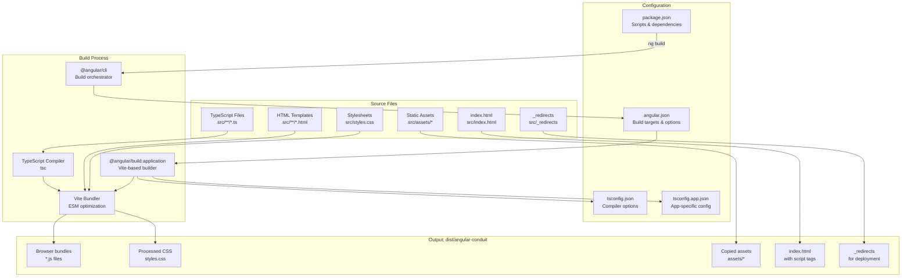
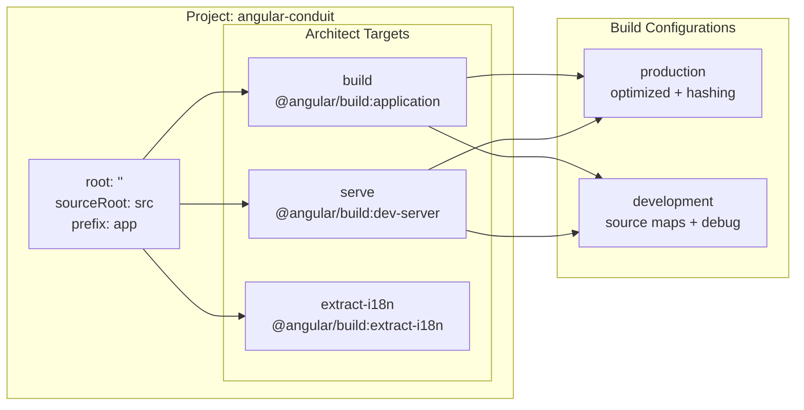
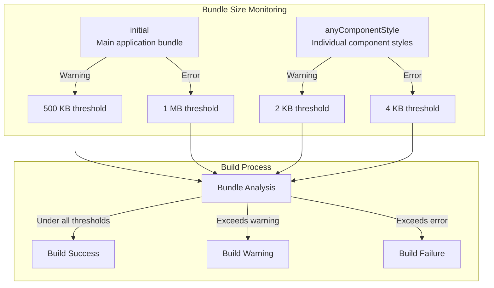
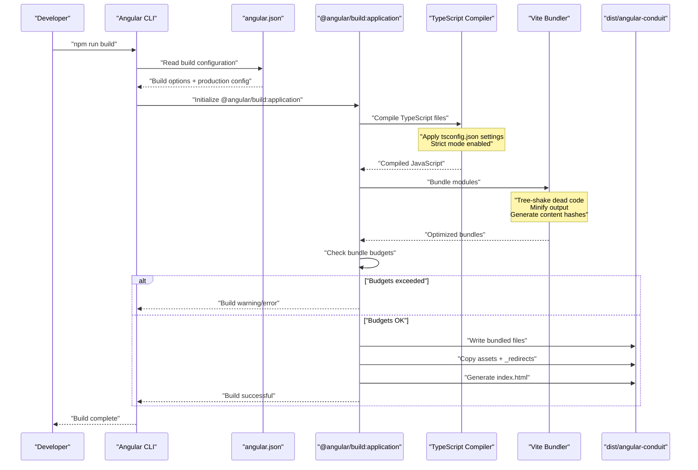

# Build Configuration

<details>
<summary>Relevant source files</summary>

The following files were used as context for generating this wiki page:

- [angular.json](../angular.json)
- [package.json](../package.json)
- [src/\_redirects](../src/_redirects)
- [tsconfig.json](../tsconfig.json)

</details>

## Purpose and Scope

This document details the build configuration for the Angular RealWorld application, including the Angular CLI build system, npm scripts, compiler options, and build optimizations. It covers how the application is compiled from TypeScript source code into production-ready JavaScript bundles.

For information about the CI/CD automation that executes these build commands, see [CI/CD Pipeline](8.2-ci-cd-pipeline.md). For details on the specific dependencies being bundled, see [Dependencies & Package Management](8.3-dependencies-and-package-management.md).

---

## Build System Overview

The application uses the Angular CLI with the `@angular/build:application` builder, which provides integration with Vite for fast development builds and optimized production bundles. The build system is configured through three primary configuration files:

| Configuration File | Purpose                                              |
| ------------------ | ---------------------------------------------------- |
| `angular.json`     | Angular CLI project structure and build targets      |
| `package.json`     | npm scripts, dependencies, and project metadata      |
| `tsconfig.json`    | TypeScript compiler options and strict mode settings |

The build process transforms TypeScript source files into JavaScript bundles, processes CSS, and copies static assets to the output directory.

**Sources:** `package.json:1-61`, `angular.json:1-84`, `tsconfig.json:1-30`

---

## Build Architecture



**Sources:** `angular.json:13-58`, `package.json:5-21`, `tsconfig.json:3-22`

---

## NPM Scripts

The `package.json` defines scripts for development, building, testing, and code formatting:

### Development Scripts

| Script  | Command    | Purpose                                  |
| ------- | ---------- | ---------------------------------------- |
| `start` | `ng serve` | Start development server with hot reload |
| `ng`    | `ng`       | Direct access to Angular CLI             |

### Build Scripts

| Script  | Command    | Purpose                             |
| ------- | ---------- | ----------------------------------- |
| `build` | `ng build` | Production build with optimizations |

### Testing Scripts

| Script              | Command                                   | Purpose                                   |
| ------------------- | ----------------------------------------- | ----------------------------------------- |
| `test`              | `vitest`                                  | Run unit tests in watch mode              |
| `test:ui`           | `vitest --ui`                             | Run unit tests with UI                    |
| `test:coverage`     | `vitest --coverage`                       | Generate test coverage report             |
| `test:e2e`          | `playwright test --grep-invert @security` | Run E2E tests (excluding security tests)  |
| `test:e2e:security` | `playwright test --grep @security`        | Run security-tagged E2E tests             |
| `test:e2e:ui`       | `playwright test --ui`                    | Run E2E tests in interactive UI mode      |
| `test:e2e:headed`   | `playwright test --headed`                | Run E2E tests with visible browser        |
| `test:e2e:debug`    | `playwright test --debug`                 | Debug E2E tests with Playwright Inspector |
| `test:e2e:report`   | `playwright show-report`                  | View E2E test report                      |
| `test:e2e:disabled` | `cat e2e/DISABLED_TESTS.md`               | Show list of disabled E2E tests           |

### Code Quality Scripts

| Script         | Command                                         | Purpose                                 |
| -------------- | ----------------------------------------------- | --------------------------------------- |
| `format`       | `prettier --write "**/*.{ts,html,css,json,md}"` | Format all code files                   |
| `format:check` | `prettier --check "**/*.{ts,html,css,json,md}"` | Check code formatting without modifying |
| `prepare`      | `husky install`                                 | Install git hooks for pre-commit checks |

The `lint-staged` configuration at `package.json:58-60` ensures that Prettier automatically formats staged files before commits.

**Sources:** `package.json:5-21`, `package.json:58-60`

---

## Angular CLI Configuration

The `angular.json` file defines the project structure and build targets for the `angular-conduit` project:

### Project Structure



**Sources:** `angular.json:5-79`

### Build Target Configuration

The `build` target at `angular.json:13-58` uses the `@angular/build:application` builder with the following key options:

| Option            | Value                  | Purpose                                        |
| ----------------- | ---------------------- | ---------------------------------------------- |
| `outputPath.base` | `dist/angular-conduit` | Base directory for build output                |
| `index`           | `src/index.html`       | HTML entry point                               |
| `browser`         | `src/main.ts`          | Application entry point                        |
| `tsConfig`        | `tsconfig.app.json`    | TypeScript configuration                       |
| `polyfills`       | `[]`                   | No additional polyfills (modern browsers only) |
| `styles`          | `["src/styles.css"]`   | Global stylesheets                             |
| `scripts`         | `[]`                   | No external JavaScript libraries               |

### Asset Configuration

The build system copies static assets to the output directory:

```typescript
"assets": [
  "src/favicon.ico",
  "src/assets",
  {
    "glob": "_redirects",
    "input": "src",
    "output": "/"
  }
]
```

The `_redirects` file at `src/_redirects:1-1` is specifically configured to support Single Page Application (SPA) routing on platforms like Netlify or Vercel, redirecting all routes to `index.html`.

**Sources:** `angular.json:15-33`, `src/_redirects:1-1`

---

## Build Configurations

### Production Configuration

The production configuration at `angular.json:36-49` applies the following optimizations:

| Optimization         | Configuration                     | Impact                              |
| -------------------- | --------------------------------- | ----------------------------------- |
| **Bundle Budgets**   | Initial: 500kb warning, 1mb error | Prevents bundle bloat               |
| **Component Styles** | Max 2kb warning, 4kb error        | Enforces style splitting            |
| **Output Hashing**   | `all`                             | Enables cache busting for all files |
| **Default Target**   | `production`                      | Production builds by default        |

#### Bundle Budget Configuration



The budget configuration at `angular.json:37-47` enforces two types of limits:

- **Initial bundle budget**: Ensures the main application bundle remains under 1MB (hard limit) and ideally under 500KB
- **Component style budget**: Prevents individual component styles from becoming too large (4KB hard limit, 2KB warning)

**Sources:** `angular.json:36-49`

### Development Configuration

The development configuration at `angular.json:51-56` prioritizes build speed and debugging:

| Option            | Value   | Purpose                                                  |
| ----------------- | ------- | -------------------------------------------------------- |
| `optimization`    | `false` | Disables minification and tree-shaking for faster builds |
| `extractLicenses` | `false` | Skips license extraction                                 |
| `sourceMap`       | `true`  | Generates source maps for debugging                      |
| `namedChunks`     | `true`  | Uses descriptive names for chunks instead of hashes      |

**Sources:** `angular.json:51-56`

---

## TypeScript Configuration

The `tsconfig.json` file at `tsconfig.json:1-30` defines strict TypeScript compiler options:

### Compiler Options

| Category          | Options                                                                             | Purpose                                    |
| ----------------- | ----------------------------------------------------------------------------------- | ------------------------------------------ |
| **Module System** | `module: "ES2022"`<br/>`moduleResolution: "bundler"`                                | Modern ESM with bundler-aware resolution   |
| **Target**        | `target: "ES2022"`<br/>`lib: ["ES2022", "dom"]`                                     | Modern JavaScript with DOM APIs            |
| **Strict Mode**   | `strict: true`<br/>`noImplicitReturns: true`<br/>`noFallthroughCasesInSwitch: true` | Maximum type safety                        |
| **Source Maps**   | `sourceMap: true`                                                                   | Debug support in development               |
| **Base URL**      | `baseUrl: "./"`                                                                     | Enables absolute imports from project root |

### Angular Compiler Options

The `angularCompilerOptions` section at `tsconfig.json:24-28` enables Angular-specific strict mode:

```typescript
"angularCompilerOptions": {
  "enableI18nLegacyMessageIdFormat": false,
  "strictInjectionParameters": true,
  "strictInputAccessModifiers": true,
  "strictTemplates": true
}
```

These options enforce:

- Strict dependency injection type checking
- Input property access modifiers validation
- Template type checking with full type inference

**Sources:** `tsconfig.json:4-28`

---

## Build Output Structure

When running `ng build`, the build system generates the following output structure in `dist/angular-conduit`:

```
dist/angular-conduit/
├── browser/
│   ├── index.html              # Entry HTML with injected script tags
│   ├── main-[hash].js          # Main application bundle
│   ├── polyfills-[hash].js     # Polyfills (if configured)
│   ├── styles-[hash].css       # Global styles
│   ├── assets/                 # Static assets
│   │   └── (copied from src/assets)
│   ├── favicon.ico             # Application icon
│   └── _redirects              # SPA routing configuration
└── (additional server files if SSR enabled)
```

The `[hash]` placeholder represents content-based hashes generated by the `outputHashing: "all"` configuration, ensuring proper cache invalidation when files change.

**Sources:** `angular.json:16-49`

---

## Development Server Configuration

The `serve` target at `angular.json:60-70` uses the `@angular/build:dev-server` builder, which provides:

- **Hot Module Replacement (HMR)**: Automatically reloads changed modules without full page refresh
- **Fast Compilation**: Vite-based development server with sub-second rebuild times
- **Configuration Inheritance**: Delegates to the `build` target's configuration
- **Default Port**: Typically serves on `http://localhost:4200`

The development server can run in either production or development mode by specifying the build target configuration:

```bash
# Development mode (default)
npm start
# Equivalent to: ng serve --configuration=development

# Production mode (for testing production build locally)
ng serve --configuration=production
```

**Sources:** `angular.json:60-70`, `package.json:7`

---

## Engine Requirements

The project specifies Node.js version requirements at `package.json:23-25`:

```json
"engines": {
  "node": ">=20.11.1"
}
```

This ensures compatibility with the Angular 21 build system and the `@angular/build:application` builder, which requires Node.js 20.11.1 or higher for optimal performance.

**Sources:** `package.json:23-25`

---

## Build Process Flow



**Sources:** `angular.json:13-58`, `package.json:8`, `tsconfig.json:1-30`

---

## Key Build Features

### 1. Vite Integration

The `@angular/build:application` builder uses Vite as the underlying bundler, providing:

- Sub-second development rebuild times
- Modern ESM-based module resolution
- Efficient tree-shaking and dead code elimination
- Advanced chunk splitting strategies

### 2. Content-Based Hashing

The `outputHashing: "all"` configuration at `angular.json:49` ensures all output files include content-based hashes in their filenames (e.g., `main-A3F8B2C9.js`). This enables:

- Aggressive browser caching with long cache lifetimes
- Automatic cache invalidation when file content changes
- Parallel loading of unchanged assets

### 3. Modern JavaScript Target

By targeting ES2022 at `tsconfig.json:19-20`, the build system:

- Avoids unnecessary polyfills for modern browsers
- Produces smaller bundle sizes
- Uses native browser features (async/await, optional chaining, nullish coalescing)

### 4. Strict Type Checking

The TypeScript configuration enables all strict mode options, catching potential errors at compile time rather than runtime. This includes:

- `strict: true` - Master switch for all strict checks
- `noImplicitReturns: true` - Ensures all code paths return values
- `noFallthroughCasesInSwitch: true` - Prevents accidental switch fallthrough
- `strictTemplates: true` - Full type checking in Angular templates

**Sources:** `angular.json:49`, `tsconfig.json:9-28`

---

## Summary

The build configuration implements a modern, Vite-powered build system with strict type checking and bundle size monitoring. Key characteristics include:

- **Builder**: `@angular/build:application` with Vite integration
- **Output**: `dist/angular-conduit` with content-hashed filenames
- **Optimization**: Automatic tree-shaking, minification, and code splitting
- **Type Safety**: Strict TypeScript and Angular template checking
- **Bundle Monitoring**: Enforced size budgets (500KB/1MB for main bundle)
- **Modern Target**: ES2022 with minimal polyfills for reduced bundle size

The configuration supports both optimized production builds and fast development iteration through separate build configurations.

---

---

[← Back to documentation index](README.md)
