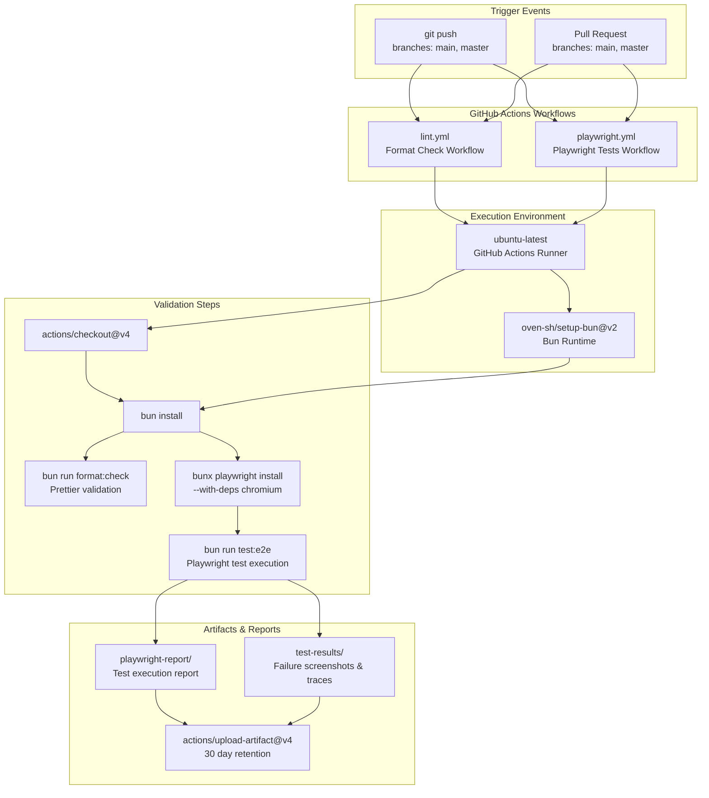
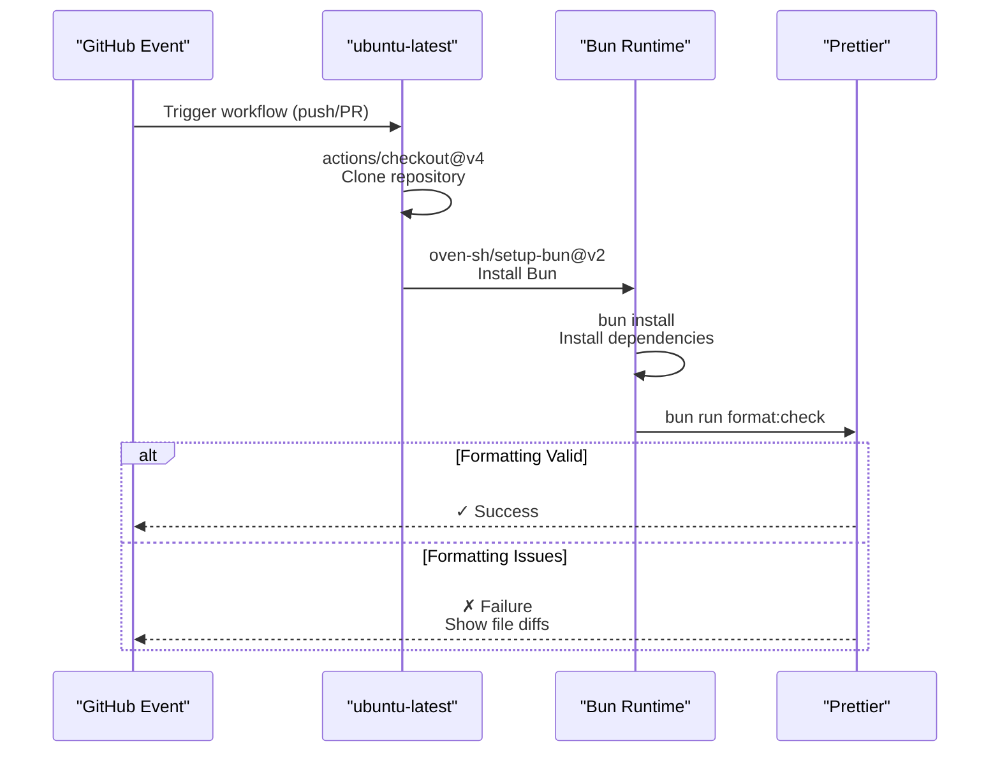
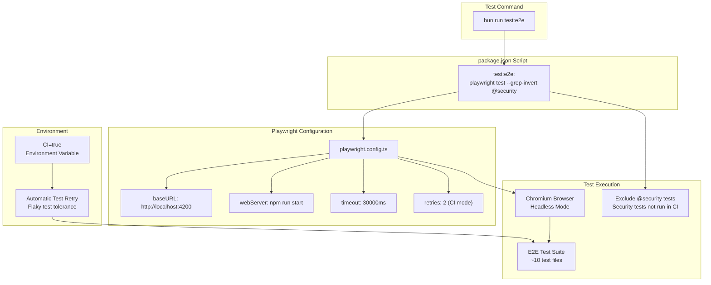
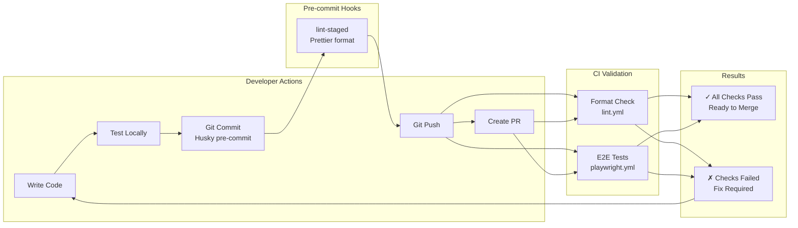

# CI/CD Pipeline

<details>
<summary>Relevant source files</summary>

The following files were used as context for generating this wiki page:

- [.github/workflows/lint.yml](../.github/workflows/lint.yml)
- [.github/workflows/playwright.yml](../.github/workflows/playwright.yml)
- [angular.json](../angular.json)
- [bun.lock](../bun.lock)
- [package.json](../package.json)
- [src/\_redirects](../src/_redirects)

</details>

## Purpose and Scope

This document describes the Continuous Integration and Continuous Deployment (CI/CD) infrastructure for the Angular RealWorld application. It covers the GitHub Actions workflows that automatically validate code quality and functionality on every push and pull request. For information about the build system configuration itself, see [Build Configuration](8.1-build-configuration.md). For details about the testing infrastructure that these workflows execute, see [E2E Testing Infrastructure](7.2-e2e-testing-infrastructure.md) and [Unit Testing with Vitest](7.1-unit-testing-with-vitest.md).

## Overview

The application implements a lightweight CI/CD pipeline using GitHub Actions with two primary workflows:

| Workflow         | File                               | Trigger                | Purpose                                 |
| ---------------- | ---------------------------------- | ---------------------- | --------------------------------------- |
| Format Check     | `.github/workflows/lint.yml`       | Push/PR to main/master | Validates code formatting with Prettier |
| Playwright Tests | `.github/workflows/playwright.yml` | Push/PR to main/master | Executes E2E test suite                 |

Both workflows run on `ubuntu-latest` and use Bun as the package manager and runtime.

**Sources:** `.github/workflows/lint.yml:1-24`, `.github/workflows/playwright.yml:1-46`

## CI/CD Workflow Architecture



**Sources:** `.github/workflows/lint.yml:1-24`, `.github/workflows/playwright.yml:1-46`

## Format Check Workflow

The `lint.yml` workflow enforces consistent code formatting across the codebase using Prettier. This workflow is intentionally lightweight and fast, providing quick feedback on formatting violations.

### Workflow Configuration



The workflow executes the `format:check` script defined in `package.json`:

```
"format:check": "prettier --check \"**/*.{ts,html,css,json,md}\""
```

This script checks all TypeScript, HTML, CSS, JSON, and Markdown files against Prettier rules without modifying them. Files that fail validation are reported in the workflow output with specific line and column information.

**Sources:** `.github/workflows/lint.yml:1-24`, `package.json:20`

### Prettier Configuration

The repository uses Prettier with its default configuration. Developers can manually format code locally using:

```
bun run format
```

The `lint-staged` configuration in `package.json` ensures that Prettier automatically formats files during Git commit operations via Husky pre-commit hooks:

```json
"lint-staged": {
  "*.{ts,html,css,json,md}": "prettier --write"
}
```

**Sources:** `package.json:58-60`, `package.json:19-21`

## Playwright Tests Workflow

The `playwright.yml` workflow executes the comprehensive E2E test suite using Playwright. This workflow is more complex than the format check and includes test execution, artifact collection, and failure reporting.

### Workflow Steps

| Step | Action                                         | Purpose                                             |
| ---- | ---------------------------------------------- | --------------------------------------------------- |
| 1    | `actions/checkout@v4`                          | Clone repository code                               |
| 2    | `oven-sh/setup-bun@v2`                         | Install Bun runtime                                 |
| 3    | `bun install`                                  | Install Node dependencies                           |
| 4    | `bunx playwright install --with-deps chromium` | Install Playwright browsers and system dependencies |
| 5    | `bun run test:e2e`                             | Execute E2E test suite                              |
| 6    | `actions/upload-artifact@v4`                   | Upload test reports (on any completion)             |
| 7    | `actions/upload-artifact@v4`                   | Upload test results (on failure only)               |

**Sources:** `.github/workflows/playwright.yml:14-46`

### Test Execution Configuration



The workflow sets `CI=true` as an environment variable, which Playwright uses to enable stricter failure modes and automatic retries for flaky tests. The `--grep-invert @security` flag excludes tests tagged with `@security` from the CI run, as these tests may require special setup or credentials.

**Sources:** `.github/workflows/playwright.yml:27-29`, `package.json:12`

### Browser Installation

The workflow explicitly installs only the Chromium browser with system dependencies:

```bash
bunx playwright install --with-deps chromium
```

This approach:

- Reduces installation time by avoiding Firefox and WebKit
- Installs required system libraries (libgstreamer, etc.) automatically
- Ensures consistent browser versions across CI runs

**Sources:** `.github/workflows/playwright.yml:24`

### Artifact Management

The workflow uploads two types of artifacts with conditional execution:

#### Playwright Report (Always)

```yaml
- name: Upload Playwright Report
  uses: actions/upload-artifact@v4
  if: always()
  with:
    name: playwright-report
    path: playwright-report/
    retention-days: 30
```

This HTML report contains:

- Test execution summary
- Per-test status and timing
- Traces and screenshots for failed tests
- Video recordings of test execution

The `if: always()` condition ensures the report uploads regardless of test outcomes, providing visibility into both passing and failing tests.

**Sources:** `.github/workflows/playwright.yml:31-37`

#### Test Results (On Failure)

```yaml
- name: Upload Test Results
  uses: actions/upload-artifact@v4
  if: failure()
  with:
    name: test-results
    path: test-results/
    retention-days: 30
```

This artifact contains detailed failure information:

- Screenshots at point of failure
- Playwright trace files for debugging
- Console logs and network activity
- Video recordings of failed tests

The `if: failure()` condition ensures this artifact only uploads when tests fail, reducing storage usage for successful runs.

**Sources:** `.github/workflows/playwright.yml:39-46`

## NPM Scripts for CI/CD

The `package.json` defines multiple test-related scripts that support both local development and CI execution:

| Script              | Command                                         | Usage Context                        |
| ------------------- | ----------------------------------------------- | ------------------------------------ |
| `test:e2e`          | `playwright test --grep-invert @security`       | CI workflow, excludes security tests |
| `test:e2e:security` | `playwright test --grep @security`              | Manual execution of security tests   |
| `test:e2e:ui`       | `playwright test --ui`                          | Local development with UI mode       |
| `test:e2e:headed`   | `playwright test --headed`                      | Local debugging with visible browser |
| `test:e2e:debug`    | `playwright test --debug`                       | Step-through debugging mode          |
| `test:e2e:report`   | `playwright show-report`                        | View generated HTML report           |
| `format:check`      | `prettier --check "**/*.{ts,html,css,json,md}"` | CI formatting validation             |
| `format`            | `prettier --write "**/*.{ts,html,css,json,md}"` | Local formatting fix                 |

**Sources:** `package.json:5-21`

### Script Composition

The CI workflow uses `test:e2e` rather than running Playwright directly, providing:

- **Consistency**: Same command works locally and in CI
- **Flexibility**: Script can be modified without changing workflow files
- **Maintainability**: Test configuration centralized in `package.json`

The separation of `test:e2e` and `test:e2e:security` allows security-sensitive tests (which may require API keys or special permissions) to be excluded from public CI runs while remaining available for manual execution or private CI environments.

**Sources:** `package.json:12-13`

## Workflow Execution Timeline

```mermaid
gantt
    title CI/CD Workflow Execution Timeline
    dateFormat mm:ss
    axisFormat %M:%S

    section Format Check
    actions/checkout@v4           :00:00, 10s
    setup-bun@v2                  :00:10, 15s
    bun install                   :00:25, 30s
    format:check                  :00:55, 10s

    section Playwright Tests
    actions/checkout@v4           :00:00, 10s
    setup-bun@v2                  :00:10, 15s
    bun install                   :00:25, 30s
    playwright install chromium   :00:55, 45s
    test:e2e execution            :01:40, 3m
    upload-artifact (report)      :04:40, 20s
    upload-artifact (results)     :05:00, 15s
```

**Typical Execution Times:**

- **Format Check**: ~1 minute (fast feedback on formatting issues)
- **Playwright Tests**: ~5 minutes (includes browser installation and full test suite)

The workflows run in parallel, so total CI time is determined by the longest workflow (Playwright Tests).

**Sources:** `.github/workflows/lint.yml:1-24`, `.github/workflows/playwright.yml:1-46`

## Timeout Configuration

The Playwright workflow specifies a 60-minute timeout:

```yaml
jobs:
  test:
    timeout-minutes: 60
```

This generous timeout accounts for:

- Browser installation time
- Application build and startup
- Full E2E test suite execution (~10 test files)
- Retry attempts for flaky tests
- Artifact upload time

In practice, successful runs complete in ~5 minutes. The timeout prevents workflows from hanging indefinitely if tests encounter deadlocks or infinite loops.

**Sources:** `.github/workflows/playwright.yml:11`

## Local vs CI Execution Differences

### Playwright Test Behavior

| Aspect           | Local Development           | CI Environment           |
| ---------------- | --------------------------- | ------------------------ |
| Browser Mode     | Headed (visible) by default | Headless always          |
| Retries          | 0 (fail fast)               | 2 (tolerate flakiness)   |
| Parallelization  | Based on CPU cores          | Based on runner cores    |
| Video Recording  | On failure only             | On failure only          |
| Trace Collection | On failure only             | On first retry + failure |
| Reporter         | HTML + List                 | GitHub Actions + HTML    |

Playwright automatically detects the CI environment via the `CI` environment variable and adjusts its behavior accordingly.

**Sources:** `.github/workflows/playwright.yml:27-29`

### Format Check Behavior

The `format:check` script behaves identically in local and CI environments:

- Both use `--check` flag (no modifications)
- Both check the same file patterns
- Both exit with non-zero status on formatting violations

Developers should use `bun run format` locally to fix issues before committing.

**Sources:** `package.json:19-20`

## Failure Modes and Debugging

### Format Check Failures

When formatting violations are detected:

1. Workflow fails with exit code 1
2. GitHub marks the check as failed
3. Workflow output shows files with violations
4. Developers must run `bun run format` locally and push again

Example failure output:

```
Checking formatting...
src/app/shared/list-errors.component.ts
src/app/core/services/user.service.ts
Code style issues found in the above file(s). Run Prettier to fix.
```

**Sources:** `.github/workflows/lint.yml:22-23`

### Playwright Test Failures

When E2E tests fail:

1. Workflow marks the step as failed
2. Test results uploaded to `test-results` artifact
3. Playwright report uploaded to `playwright-report` artifact
4. GitHub shows artifact download links in workflow summary

Developers can debug failures by:

1. Downloading artifacts from the failed workflow run
2. Viewing screenshots and traces in the Playwright report
3. Running `bun run test:e2e:debug` locally to reproduce
4. Using `__conduit_debug__` global in tests for state inspection

**Sources:** `.github/workflows/playwright.yml:31-46`

## Integration with Development Workflow



The CI pipeline enforces quality gates at multiple stages:

1. **Pre-commit**: Husky + lint-staged formats code before commit
2. **On push**: Both workflows validate code and tests
3. **On PR**: Same validation runs again, protecting main branch

Pull requests cannot be merged until both workflows pass, ensuring main branch stability.

**Sources:** `.github/workflows/lint.yml:4-7`, `.github/workflows/playwright.yml:4-7`, `package.json:58-60`

## Dependencies and Package Management

Both workflows use Bun for dependency installation:

```yaml
- name: Setup Bun
  uses: oven-sh/setup-bun@v2

- name: Install dependencies
  run: bun install
```

The `bun.lock` file ensures consistent dependency versions across local development and CI environments. Bun's lockfile is committed to the repository and should be updated whenever dependencies change.

**Sources:** `.github/workflows/lint.yml:16-20`, `.github/workflows/playwright.yml:17-21`, `bun.lock:1-10`

## Future Enhancements

The current CI/CD pipeline is intentionally minimal. Potential enhancements include:

1. **Unit Test Workflow**: Add separate workflow for `bun run test` (Vitest)
2. **Build Validation**: Add workflow to verify production build succeeds
3. **Deployment**: Automatic deployment to staging/production on main branch
4. **Code Coverage**: Upload coverage reports to Codecov or similar
5. **Performance Testing**: Lighthouse CI for performance regression detection
6. **Security Scanning**: Dependency vulnerability scanning with Dependabot
7. **Matrix Testing**: Test against multiple Node/Bun versions

These enhancements would increase CI time but provide additional quality assurance.

**Sources:** `package.json:9-11`

---

---

[← Back to documentation index](README.md)
