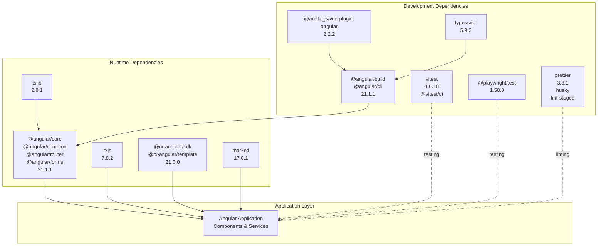
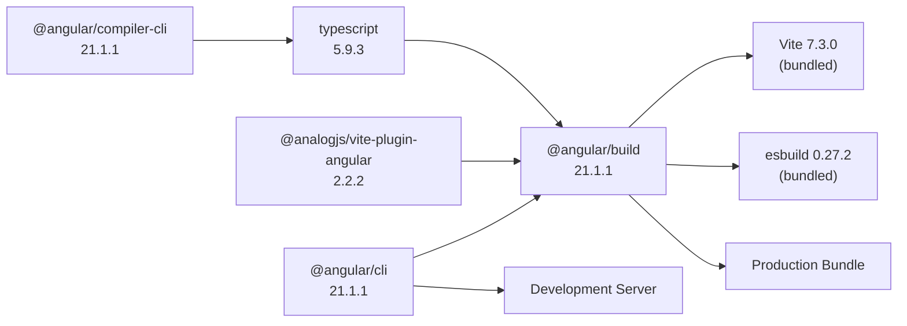
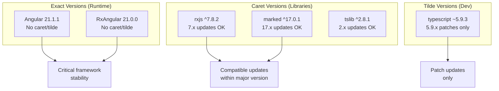
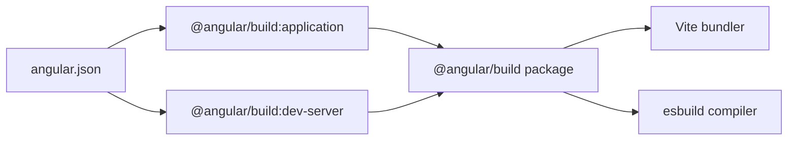
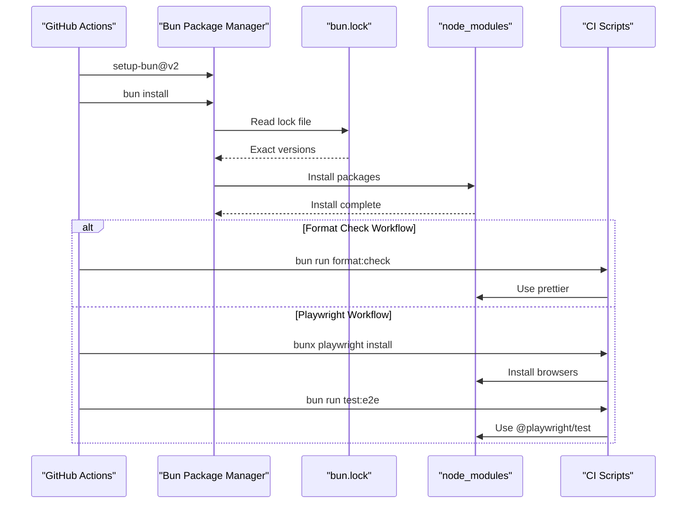

# Dependencies & Package Management

<details>
<summary>Relevant source files</summary>

The following files were used as context for generating this wiki page:

- [.github/workflows/lint.yml](../.github/workflows/lint.yml)
- [.github/workflows/playwright.yml](../.github/workflows/playwright.yml)
- [angular.json](../angular.json)
- [bun.lock](../bun.lock)
- [package.json](../package.json)
- [src/\_redirects](../src/_redirects)

</details>

This document details the dependency management strategy, package choices, and configuration for the Angular RealWorld application. It covers runtime dependencies, development tooling, package manager configuration, and the relationship between dependencies and the build system.

For information about the build system configuration and optimization, see [Build Configuration](8.1-build-configuration.md). For CI/CD pipeline details including how dependencies are installed in automated workflows, see [CI/CD Pipeline](8.2-ci-cd-pipeline.md).

---

## Package Manager: Bun

The project uses **Bun** as its package manager, configured with a minimum Node.js version requirement of `20.11.1`. Bun provides fast installation and execution compared to npm/yarn/pnpm.

**Key Configuration:**

- Lock file: `bun.lock:1-39`
- Engine requirement: `package.json:23-25`
- CI usage: `.github/workflows/lint.yml:16-20`, `.github/workflows/playwright.yml:17-21`

The lock file maintains exact dependency versions across all environments, ensuring reproducible builds. Both CI workflows use `oven-sh/setup-bun@v2` to configure Bun before installing dependencies.

**Sources:** `package.json:23-25`, `bun.lock:1-40`, `.github/workflows/lint.yml:16-20`, `.github/workflows/playwright.yml:17-21`

---

## Dependency Architecture



**Sources:** `package.json:27-40`, `package.json:42-56`

---

## Runtime Dependencies

### Core Framework Dependencies

The application depends on the Angular 21 framework with all necessary packages at version `21.1.1`:

| Package                             | Version | Purpose                      |
| ----------------------------------- | ------- | ---------------------------- |
| `@angular/core`                     | 21.1.1  | Core framework functionality |
| `@angular/common`                   | 21.1.1  | Common directives and pipes  |
| `@angular/router`                   | 21.1.1  | Client-side routing          |
| `@angular/forms`                    | 21.1.1  | Template and reactive forms  |
| `@angular/platform-browser`         | 21.1.1  | Browser platform support     |
| `@angular/platform-browser-dynamic` | 21.1.1  | JIT compilation support      |
| `@angular/animations`               | 21.1.1  | Animation framework          |
| `@angular/compiler`                 | 21.1.1  | Template compiler            |

**Sources:** `package.json:28-35`

### Reactive Programming: RxJS

**`rxjs@7.8.2`** provides the reactive programming foundation for Angular's change detection, HTTP requests, and application state management. All observables in the application (e.g., `UserService.currentUser`, HTTP interceptors) use RxJS operators.

**Sources:** `package.json:39`

### Performance Optimization: RxAngular

Two RxAngular packages enhance performance through optimized rendering strategies:

- **`@rx-angular/cdk@21.0.0`**: Core utilities for reactive programming patterns
- **`@rx-angular/template@21.0.0`**: Provides the `*rxLet` directive for optimized template rendering with fine-grained change detection control

These packages replace Angular's default change detection in performance-critical components, reducing unnecessary re-renders.

**Sources:** `package.json:36-37`

### Markdown Rendering: Marked

**`marked@17.0.1`** converts Markdown-formatted article content to HTML for display. The application sanitizes and renders article bodies using this library.

**Type definitions:** `@types/marked@6.0.0` provides TypeScript type safety for the Marked API.

**Sources:** `package.json:38`, `package.json:48`

### TypeScript Library: tslib

**`tslib@2.8.1`** contains TypeScript runtime helpers that reduce compiled bundle size by sharing common helper functions across modules rather than duplicating them.

**Sources:** `package.json:40`

---

## Development Dependencies

### Build System



**Key Build Dependencies:**

| Package                         | Version | Purpose                                        |
| ------------------------------- | ------- | ---------------------------------------------- |
| `@angular/cli`                  | 21.1.1  | Command-line interface and project scaffolding |
| `@angular/build`                | 21.1.1  | New Angular build system (Vite + esbuild)      |
| `@angular/compiler-cli`         | 21.1.1  | Ahead-of-time (AOT) template compiler          |
| `@analogjs/vite-plugin-angular` | 2.2.2   | Vite plugin for Angular integration            |
| `typescript`                    | 5.9.3   | TypeScript compiler                            |

The `@angular/build` package bundles Vite 7.3.0 and esbuild 0.27.2 internally, providing a modern build pipeline optimized for speed and tree-shaking.

**Sources:** `package.json:43-46`, `package.json:55`

### Testing Infrastructure

#### Unit Testing: Vitest

| Package      | Version | Purpose                   |
| ------------ | ------- | ------------------------- |
| `vitest`     | 4.0.18  | Test runner and framework |
| `@vitest/ui` | 4.0.18  | Interactive test UI       |
| `jsdom`      | 27.4.0  | DOM environment for tests |

Vitest replaces Jest/Karma for faster unit test execution with native ESM support. Configuration is in `vitest.config.ts` (referenced in other pages).

**Sources:** `package.json:49`, `package.json:51`, `package.json:56`

#### End-to-End Testing: Playwright

| Package            | Version | Purpose                       |
| ------------------ | ------- | ----------------------------- |
| `@playwright/test` | 1.58.0  | E2E test framework and runner |
| `playwright`       | 1.58.0  | Browser automation library    |

Playwright provides cross-browser E2E testing with automatic waiting, screenshot capture, and test retry capabilities. Configuration is in `playwright.config.ts` (referenced in page [7.2](7.2-e2e-testing-infrastructure.md)).

**Sources:** `package.json:47`, `package.json:53`

### Code Quality Tools

| Package       | Version | Purpose                     |
| ------------- | ------- | --------------------------- |
| `prettier`    | 3.8.1   | Code formatter              |
| `husky`       | 9.1.7   | Git hooks management        |
| `lint-staged` | 16.2.7  | Run linters on staged files |

**Prettier Configuration:**

- Formats TypeScript, HTML, CSS, JSON, and Markdown files
- Runs automatically on commit via `husky` + `lint-staged`
- CI validation: `.github/workflows/lint.yml:22-23`

**Pre-commit Hook:**

```json
"lint-staged": {
  "*.{ts,html,css,json,md}": "prettier --write"
}
```

**Sources:** `package.json:50`, `package.json:52`, `package.json:54`, `package.json:58-60`, `.github/workflows/lint.yml:22-23`

---

## NPM Scripts

### Script Dependency Graph

```mermaid
graph TB
    START["npm start"] --> NG_SERVE["ng serve"]
    BUILD["npm run build"] --> NG_BUILD["ng build"]

    TEST["npm test"] --> VITEST["vitest"]
    TEST_UI["npm run test:ui"] --> VITEST_UI["vitest --ui"]
    TEST_COV["npm run test:coverage"] --> VITEST_COV["vitest --coverage"]

    E2E["npm run test:e2e"] --> PW_TEST["playwright test --grep-invert @security"]
    E2E_SEC["npm run test:e2e:security"] --> PW_SEC["playwright test --grep @security"]
    E2E_UI["npm run test:e2e:ui"] --> PW_UI["playwright test --ui"]
    E2E_HEAD["npm run test:e2e:headed"] --> PW_HEAD["playwright test --headed"]
    E2E_DEBUG["npm run test:e2e:debug"] --> PW_DEBUG["playwright test --debug"]
    E2E_REPORT["npm run test:e2e:report"] --> PW_REPORT["playwright show-report"]

    FORMAT["npm run format"] --> PRETTIER_WRITE["prettier --write"]
    FORMAT_CHECK["npm run format:check"] --> PRETTIER_CHECK["prettier --check"]

    PREPARE["npm run prepare"] --> HUSKY["husky install"]
```



**Sources:** `package.json:5-21`

### Development Commands

| Script  | Command    | Purpose                     |
| ------- | ---------- | --------------------------- |
| `start` | `ng serve` | Start development server    |
| `build` | `ng build` | Build production bundle     |
| `ng`    | `ng`       | Access Angular CLI directly |

**Sources:** `package.json:6-8`

### Testing Commands

**Unit Tests:**
| Script | Command | Purpose |
|--------|---------|---------|
| `test` | `vitest` | Run unit tests in watch mode |
| `test:ui` | `vitest --ui` | Open interactive test UI |
| `test:coverage` | `vitest --coverage` | Generate coverage report |

**End-to-End Tests:**
| Script | Command | Purpose |
|--------|---------|---------|
| `test:e2e` | `playwright test --grep-invert @security` | Run all E2E tests except security tests |
| `test:e2e:security` | `playwright test --grep @security` | Run security-related E2E tests |
| `test:e2e:ui` | `playwright test --ui` | Open Playwright UI mode |
| `test:e2e:headed` | `playwright test --headed` | Run tests with visible browser |
| `test:e2e:debug` | `playwright test --debug` | Debug tests with step-through |
| `test:e2e:report` | `playwright show-report` | View last test report |
| `test:e2e:disabled` | `cat e2e/DISABLED_TESTS.md` | Show disabled tests list |

**Sources:** `package.json:9-18`

### Code Quality Commands

| Script         | Command                                         | Purpose                                |
| -------------- | ----------------------------------------------- | -------------------------------------- |
| `format`       | `prettier --write "**/*.{ts,html,css,json,md}"` | Format all files                       |
| `format:check` | `prettier --check "**/*.{ts,html,css,json,md}"` | Verify formatting without changes      |
| `prepare`      | `husky install`                                 | Initialize Git hooks (runs on install) |

**Sources:** `package.json:19-21`

---

## Version Management Strategy

### Lock File Management

The `bun.lock:1-40` file ensures deterministic installs by locking exact versions of all transitive dependencies. This prevents "works on my machine" issues.

**Lock File Structure:**

```
{
  "lockfileVersion": 1,
  "configVersion": 1,
  "workspaces": { ... },
  "packages": { ... }
}
```

**Sources:** `bun.lock:1-40`

### Version Pinning Strategy



**Version Prefix Meanings:**

- **No prefix**: Exact version required (Angular packages)
- **`^` (caret)**: Compatible with minor/patch updates (most libraries)
- **`~` (tilde)**: Compatible with patch updates only (TypeScript)

**Sources:** `package.json:27-56`

### Engine Requirements

The project enforces a minimum Node.js version for compatibility:

```json
"engines": {
  "node": ">=20.11.1"
}
```

This ensures features like top-level await and modern ESM support are available. CI workflows respect this requirement using Bun's Node.js compatibility layer.

**Sources:** `package.json:23-25`

---

## Integration with Build System

### Angular.json Configuration

The `angular.json:1-84` file references dependencies through builder specifications:



**Key Builder Configurations:**

- **Application builder**: `@angular/build:application` at `angular.json:14`
- **Dev server builder**: `@angular/build:dev-server` at `angular.json:61`
- **Build output**: `angular.json:16-18`
- **Asset handling**: `angular.json:22-30`

**Sources:** `angular.json:14`, `angular.json:61`, `angular.json:16-30`

### Build Budgets

Production build size limits ensure performance:

```json
"budgets": [
  {
    "type": "initial",
    "maximumWarning": "500kb",
    "maximumError": "1mb"
  },
  {
    "type": "anyComponentStyle",
    "maximumWarning": "2kb",
    "maximumError": "4kb"
  }
]
```

These budgets prevent dependency bloat by failing builds that exceed size thresholds.

**Sources:** `angular.json:37-47`

---

## CI/CD Dependency Installation

### Workflow Integration



**Format Check Workflow:**

- Setup: `.github/workflows/lint.yml:16-20`
- Execution: `.github/workflows/lint.yml:22-23`

**Playwright Workflow:**

- Setup: `.github/workflows/playwright.yml:17-21`
- Browser install: `.github/workflows/playwright.yml:23-24`
- Test execution: `.github/workflows/playwright.yml:26-29`

**Sources:** `.github/workflows/lint.yml:16-23`, `.github/workflows/playwright.yml:17-29`

---

## Dependency Update Strategy

### Automated Updates

While not configured in the repository, the following update strategies are recommended:

1. **Major version updates**: Manual review required for breaking changes
2. **Minor version updates**: Review release notes, test locally
3. **Patch version updates**: Generally safe, automated via Dependabot/Renovate
4. **Security updates**: Immediate priority regardless of version

### Testing After Updates

After updating dependencies, run the full test suite:

```bash
bun install                  # Update lock file
bun run test                 # Unit tests
bun run test:e2e            # E2E tests
bun run build               # Verify build succeeds
```

**Sources:** `package.json:9-12`

---

## Summary

The application uses a modern dependency stack centered on:

- **Angular 21** for the framework
- **RxJS 7** for reactive programming
- **RxAngular** for performance optimization
- **Vitest** and **Playwright** for comprehensive testing
- **Bun** for fast package management

All dependencies are locked via `bun.lock` to ensure reproducible builds across development, CI, and production environments. The build system integrates these dependencies through `angular.json` configuration and npm scripts defined in `package.json`.

**Sources:** `package.json:1-61`, `angular.json:1-84`, `bun.lock:1-40`

---

[← Back to documentation index](README.md)
